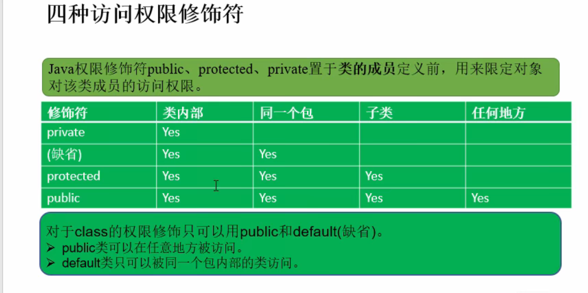
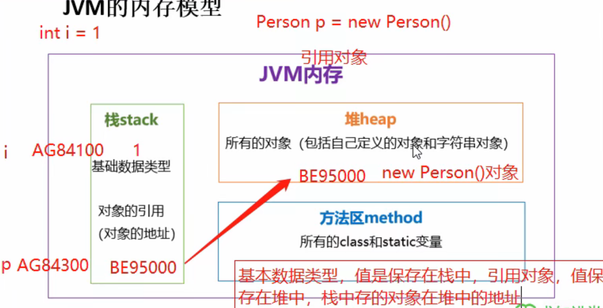
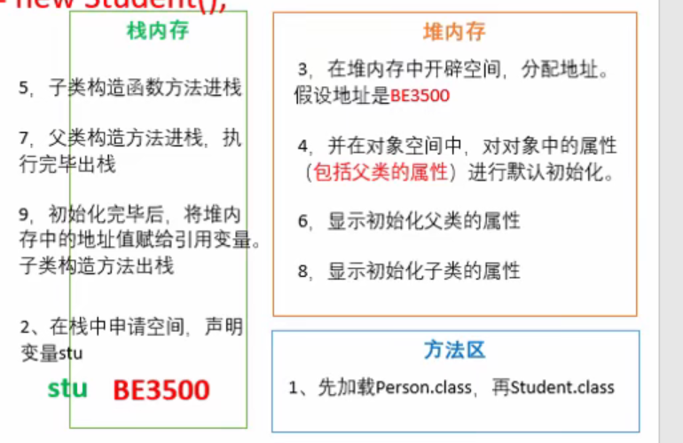
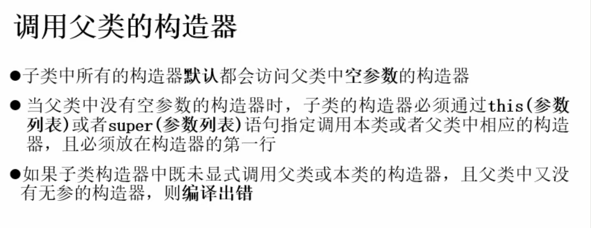
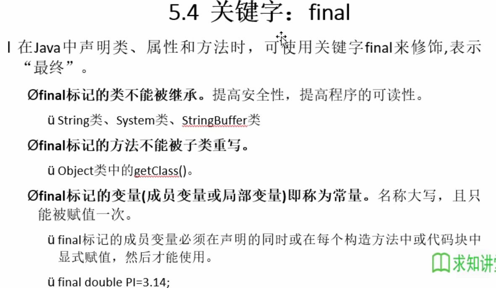

# Java基础

## 基础

> 权限修饰




> JVM






> 继承（只能单继承）



> equals和==的比较

```java
/**
  对于普通类，equals与==都是比较地址。
  对于String、File、Data类，equals被重写了，比较的是对象的内容，而==还是比较地址
*/
```


> final




> 包装类

```java
//包装类的主要功能是为了基本数据类型与字符串类型的相互转换
		int i=Integer.parseInt("123");
		float f=Float.parseFloat("0.3");
		boolean b=Boolean.parseBoolean("false");
		
		String s=String.valueOf(i);
```


> 可变参数

```java
public int max(String ss, int... arg) {
	int m=arg[0];
	for(int i = 0;i<arg.length;i++) {
		if(m<arg[i])
			m=arg[i];
	}
```


> 执行顺序

```java
public class Person1 {
	public Person1() {
		System.out.println("构造1");
	}
	
	String name;
	static int age;
	
	static{  // 静态代码块最先执行，在类加载的时候运行一次
		age=1;
		System.out.println("person1的age:"+age);
	}
	{
		System.out.println("代码块1");
	}
}

public class Person2 extends Person1{
	public Person2() {
		System.out.println("构造2");
	}
	{  // 普通代码块每次new对象都会执行，先于构造函数执行
		System.out.println("代码块2");
	}
}

public class Test {
	public static void main(String[] args) {
		Person2 p = new Person2(); // 会先去执行父类中的代码块和构造函数，再执行自己的代码块和构造函数
		
		System.out.println("=====================");
		
		Person2 pp=new Person2() {//匿名内部类，相当于继承了Persion2的子类
			{//这里的代码块可以代替构造函数，由于父类的构造函数等会先执行，所以这里代码块起到了匿名内部类的构造函数的作用
				age=100;
				System.out.println("这里的age为"+age);
				
			}
		};
	}
}

//执行结果
person1的age:1
代码块1
构造1
代码块2
构造2
=====================
代码块1
构造1
代码块2
构造2
这里的age为100

```


## 常用类

### Calendar

```java
public class CalendarClass {
    public static void main(String[] args) {
        Calendar calendar = Calendar.getInstance();
        int y = calendar.get(Calendar.YEAR);
        int m = calendar.get(Calendar.MONTH) + 1;
        int d = calendar.get(Calendar.DATE);
        int w = calendar.get(Calendar.DAY_OF_WEEK);
        System.out.println(y + "年" + m + "月" + d + "日 星期" + w);

        calendar.add(Calendar.YEAR,-10);
        calendar.add(Calendar.MONTH,5);
        y = calendar.get(Calendar.YEAR);
        m = calendar.get(Calendar.MONTH) + 1;
        d = calendar.get(Calendar.DATE);
        w = calendar.get(Calendar.DAY_OF_WEEK);
        System.out.println(y + "年" + m + "月" + d + "日 星期" + w);

        calendar.set(2099,1,20);
        y = calendar.get(Calendar.YEAR);
        m = calendar.get(Calendar.MONTH) + 1;
        d = calendar.get(Calendar.DATE);
        w = calendar.get(Calendar.DAY_OF_WEEK);
        System.out.println(y + "年" + m + "月" + d + "日 星期" + w);

    }
}
```


### SimpleDateFormat&&Date

```java
public class DateClass {
    public static void main(String[] args) {
        //格式化，从date到string
        Date date = new Date(); //获取当前时间
        SimpleDateFormat sdf = new SimpleDateFormat("yyyy-YY-dd HH:mm:ss");
        String dd = sdf.format(date);
        System.out.println(dd);

        String d = new SimpleDateFormat("yyyy-YY-dd HH:mm:ss").format(new Date());
        System.out.println(d);
        System.out.println("-------------------------");

        //从string到date
        Date date1 = null;
        String s = "2020年08月20日 10:20:30";
        try {
            date1 = new SimpleDateFormat("yyyy年MM月dd日 HH:mm:ss").parse(s);
        } catch (ParseException e) {
            e.printStackTrace();
        }
        System.out.println(date1);

    }
}
```


### Properties

```java
/**
 * 是集合的子类，可以与io配合
 */
public class PropertiesDemo {
    public static void main(String[] args) {
//        Properties properties = new Properties();//虽然是map，但不能写泛型

//        properties.put("1", "张三");//默认为object
//        properties.put("2", "李四");
//
//        Set<Object> objects = properties.keySet();
//        for (Object object : objects) {
//            System.out.println((String)object + (String )properties.get(object));
//        }

//        properties.setProperty("1", "张三");//参数只能是string类型
//        properties.setProperty("2", "李四");
//
//        Set<String> strings = properties.stringPropertyNames();//获取键的集合
//        for (String string : strings) {
//            System.out.println(string + properties.getProperty(string));
//        }


//        try {
//            mystore();
//        } catch (IOException e) {
//            e.printStackTrace();
//        }
        try {
            myload();
        } catch (IOException e) {
            e.printStackTrace();
        }

    }

    private static void myload() throws IOException {
        Properties properties = new Properties();
        properties.load(new FileReader("io_doc\\properties.txt"));
        System.out.println(properties);
    }

    private static void mystore() throws IOException {
        Properties properties = new Properties();
        properties.setProperty("1", "张三");//参数只能是string类型
        properties.setProperty("2", "李四");

        properties.store(new FileWriter("io_doc\\properties.txt"),null);
    }
}
```


## 注解

``` java
public class Annotation {
	@SuppressWarnings("unused") // 未使用的抑制警告
	public static void main(String[] args) {
		TestB t = new TestB();
		t.test();
		t.test1();//还是可以用的
		
		
		@SuppressWarnings("rawtypes") //泛型没有规定类型抑制警告
		List list = new ArrayList();
		
	}
}

class TestA{
	void test() {System.out.println("a");}
}

class TestB extends TestA{
	@Override //注解
	void test() {
		System.out.println("b");
	}
	
	@Deprecated//过时
	void test1() {
		System.out.println("c");
	}
	
	@TestAnn(id = 100,desc = "阿三") //自定义注解
	String name;
    
    @MyAnnotation1("hh")
    public void test2() {

    }
}

//自定义注解
@Target(ElementType.TYPE,ElementType.FIELD)//type给类做注解
@Retention(RetentionPolicy.RUNTIME)//生命周期，在程序运行时有效 
//@Documented    //注解是否生成JavaDoc
//@Inherited    //子类是否继承注解
@interface TestAnn{
	public int id() default 0;
	public String desc() default "无";
}

@Target({ElementType.TYPE,ElementType.METHOD})
@Retention(RetentionPolicy.RUNTIME)
@interface MyAnnotation1 {

    String value(); //如果只有一个参数，建议名称用value，使用时可以直接写值

}
```


## 泛型

### 定义泛型

```java
public class Generic {
	public static void main(String[] args) {
		Generic1<String> g1 = new Generic1<String>("zhangsan");
		System.out.println(g1.getName());
		
		Generic2 g2 = new Generic2();
		System.out.println(g2.test(""));
		g2.testWay("a","b","d","c");
		
		Generic3<String> g3 = new Generic3<String>();
		System.out.println(g3.test("test3"));
	}
}

class Generic1<T>{//定义泛型类
	T name;
	Generic1(T name){
		this.name = name;
	}
	
	public T getName() {
		return name;
	}
}

interface Interface<T>{//定义泛型接口
	T test(T t);
}
class Generic2 implements Interface<String>{

	@Override
	public String test(String t) {
		return "test";
	}
	
	public <T> void testWay(T... arg) {//方法的泛型定义
		for(T t : arg ) {
			System.out.println(t);
		}
	}
	
}
class Generic3<T> implements Interface<T>{

	@Override
	public T test(T t) {
		return t;
	}
	
}
```

### 问号通配符

```java
class Aa{
	public void test(List<?> list) {
		// 等同于public <T> void test(List<T> list
	}
	
	public void test1(List<? extends B1> list) {}//list内只能是B1及其子类
	public void test2(List<? super B1> list) {}//list内只能是B1及其父类
	public void test3(ArrayList<? extends In> arrayList) {}//list内只能是in接口的实现类
	
}
```


## 集合

### Collections工具类

```java
List<String> list = new ArrayList<String>();
		list.add("a");
		list.add("c");
		list.add("d");
		list.add("b");
		
		System.out.println(list);
		Collections.reverse(list);
		System.out.println(list);
		
		Collections.shuffle(list);//对list进行随机排序
		System.out.println(list);
		
		Collections.sort(list);//默认升序
		System.out.println(list);
		System.out.println(Collections.max(list));
		
		list.add("b");
		System.out.println(Collections.frequency(list, "b"));//频率
```


### 自然排序&比较器排序

> 比较器排序 实现Comparator接口

```java
class Student implements Comparator<Student>{
	int age;
	String name;
	Student(){
		
	}
	Student(int age,String name){
		this.age = age;
		this.name = name;
	}
	@Override
	public int compare(Student o1, Student o2) {
		if(o1.age>o2.age) {
			return 1;
		}else if(o1.age<o2.age){
			return -1;
		}else
			return 0; //可再细分
	}	
}

public static void main(String[] args) {
    List<Student> stus = new ArrayList<Student>() ;
    stus.add(new Student(1,"阿三"));
    stus.add(new Student(5,"阿四"));
    stus.add(new Student(3,"阿五"));
    stus.add(new Student(5,"阿六"));
    for(Student stu : stus) {
        System.out.println(stu.age + "   " + stu.name);
    }
    System.out.println("--------------------------");
    //Collections.sort(stus, new Student()); //参数传入比较器
    stus.sort(new Student()); //参数传入比较器
    for(Student stu : stus) {
        System.out.println(stu.age + "   " + stu.name);
    }
}
```


### ArrayList

```java
import java.util.ArrayList;
import java.util.List;

/**
 * 可重复，相当于动态数组
 * @author ct
 *
 */
public class CollectionArrayList {
	public static void main(String[] args) {
		List<String> list = new ArrayList<String>();
		list.add("a");
		list.add("c");
		list.add("d");
		list.add("b");
		list.add("c");
		System.out.println(list);
		System.out.println(list.get(2));
		System.out.println(list.indexOf("c"));
		System.out.println(list.lastIndexOf("c"));
		
		list.add(1, "xyz");
		list.remove(2);
		System.out.println(list);
		
		List<String> list1 = new ArrayList<String>();
		list1.add("456");
		list1.add("123");
		
		list.addAll(3,list1);
		System.out.println(list);
		
		list.set(1, "567");
		System.out.println(list);
		
		list1=list.subList(1, 3);
		System.out.println(list1);
		
	}	
}
```


### HashMap

```java
import java.util.HashMap;
import java.util.Map;
import java.util.Map.Entry;
import java.util.Set;

/**
 * key值不能重复，即equals两个key必须为false
 * 键值一一对应,像HashSet一样组织
 * @author ct
 *TreeMap同理，只不过key会像TreeMap一样进行排序
 *
 */
public class CollectionHashMap {
	
	public static void main(String[] args) {
		Map<String, Integer> map = new HashMap<String, Integer>();
		map.put("b",1);//其它几个是add,map是put
		map.put("c",2);
		map.put("a", 1);
		System.out.println(map);
		map.put("a",3);
		System.out.println(map);
		
		System.out.println(map.get("b"));
		
		map.remove("c");
		System.out.println(map);
		
		System.out.println(map.containsKey("a"));
		System.out.println(map.containsValue(1));
		
		Set<String> keys=map.keySet();//获取map集合的所有key的集合
		map.values();//获取map集合的所有values值
		
		//通过KeySet()来遍历map
		for(String s : keys) {
			System.out.println(s+"="+map.get(s));
		}
		
		//通过entrySet()遍历map
		Set<Entry<String, Integer>> entrys = map.entrySet();
		for(Entry<String, Integer> en : entrys) {
			System.out.println(en.getKey()+"="+en.getValue());
			
			
		}
	}
	
}
```


### HashSet

```java
import java.util.HashSet;
import java.util.Iterator;
import java.util.Set;
/**
 * 按哈希值排序，没有重复
 * HashSet判断两个元素相等的标准：equals返回值相等，并且hashcode返回值也相等
 * 如果equals相等，则hashcode也要设置为相等，原因如下（简单可以这么理解，具体要去看源码）：
 * equals相等代表了两个元素相等，set中不允许两个相等的元素，但是hashset底层源码的add()逻辑是
 * 先根据对象的hashcode值确定哈希表中存储位置，如果该位置没有对象则存入;
 * 有对象就和里面的所有对象比较hashcode,都不一样就直接存入了
 * 有一样的再比较两者的equals（），不同表示元素不一样，还是存入
 * 相同就丢弃
 * 所以！！！！！如果equals相等，则hashcode也要设置为相等；要保证唯一性，要重写对象的equals方法和hashcode方法
 * 
 * 用迭代器（适合顺序存储的集合）遍历时，不能增删集合中的内容，会有异常；for循环（适合随机）遍历就没问题
 * @author ct
 *
 */
public class CollectionHashSet {
	
	public static void main(String[] args) {
		Set set = new HashSet();
		//等同于Set<Object> set = new HashSet<Object>();
		//不用泛型可以添加任意类型的对象，使用泛型只能添加指定类型对象
		set.add("a");
		set.add("a");
		//HashSet判断两个元素相等的标准：equals返回值相等，并且hashcSode返回值也相等
		set.add(1);
		set.add(null);
		set.add(true);
		System.out.println(set);
		set.remove(1);
		System.out.println(set);
		System.out.println(set.contains("a"));//set是否包含a
		set.clear();
		
		set.add("a");
		set.add("b");
		set.add("c");
		set.add("d");
		
		//遍历方法1：使用迭代器
		Iterator it = set.iterator();
		while(it.hasNext()) {
			System.out.println(it.next());
		}
		
		//遍历方法2：for each方法
		for(Object obj : set) {
			System.out.println(obj);
		}
		
	}	
}
```


### TreeSet

```java
import java.util.Comparator;
import java.util.Set;
import java.util.TreeSet;
/**
 * TreeSet是会自动排序的
 * 默认是自然排序，不可重复
 * 如果泛型里是对象，则可以重写compare函数
 * @author ct
 *
 */
public class CollectionTreeSet {
	public static void main(String[] args) {
	
		Set<Person> set = new TreeSet<Person>(new Person());//必须加new Person()
                                                      //	用作比较器
		set.add(new Person(10,"张三"));
		set.add(new Person(10,"李四"));//TreeSet同样不能有重复值，且靠compare函数比较
		                             //因为有10岁的了，所有李四不会进入set
		set.add(new Person(5,"赵五"));
		set.add(new Person(20,"阿六"));
		
		
		for(Person p : set) {
			System.out.println(p.name+p.age+"岁");
		}
		System.out.println(set.size() );
	}
}

class Person implements Comparator<Person>{//实现这个接口，这个对象就可以比较了
	int age;
	String name;
	
	Person(){	}
	Person(int age,String name){
		this.age=age;
		this.name=name;
	}
	@Override
	public int compare(Person o1, Person o2) {
		if(o1.age>o2.age) {
			return 1;
		}else if(o1.age<o2.age) {
			return -1;
		}
		else
			return 0;
	}	
}
```


### 流式计算

在代理模式后面。


## 枚举

枚举也可以理解为单例模式。

```java
/**
 * 实现一个season的枚举类
 * 类似单例模式中的饿汉式
 * @author ct
 *
 */
public class Enum {
	public static void main(String[] args) {
		Season se = Season.SPRING;
		se.showInfo();
		
	}
}

enum Season {
	SPRING("春天","百花齐放"),//用逗号分隔；相当于static的，初始化一个season对象
	SUMMER("夏天","炎炎夏日"),
	AUTUMN("秋天","秋高气爽"),
	WINTER("冬天","寒风凛凛");//分号结尾
	
	private final String name;
	private final String dec;
	
	private Season(String name,String dec) {
		this.dec=dec;
		this.name=name;
	}
	
	public void showInfo() {
		System.out.println(name + "真是" + dec);
	}

}
```


## IO

### File

```java
/**
 * File只能新建、删除、重命名文件和目录，但不能访问文件内容
  * 通过listFiles方法可以递归遍历文件
 */
import java.io.File;
import java.io.IOException;

public class Test {
	public static void main(String[] args) {
		File f = new File("E:\\a_code\\hh.txt");
	//	File f1 = new File("E:\\a_code","hh.txt");
	//	File f2 = new File("E:/a_code/hh.txt");
	//	File f3 = new File("E:" + File.separator + "a_code\\hh.txt");
		File ff = new File("src\\io\\day12\\Test.java");//相对路径
		
		System.out.println(ff.getAbsolutePath());
		System.out.println(ff.getPath());
		
		f.renameTo(new File("E:\\a_code\\hh1.txt"));//改名
		
		
		//如何新建文件
		File f1 = new File("E:\\a_code\\hh2.txt");
		System.out.println(f1.exists());//说明new File（）是不能新建文件的
		if(!f1.exists()) {
			try {
				f1.createNewFile();//新建文件，需要捕获异常
			} catch (IOException e) {
				// TODO Auto-generated catch block
				e.printStackTrace();
			}
		}
		
		f1.delete();//删除文件
		
		//创建目录
		File f2 = new File("E:\\a_code\\hh");
		if(!f2.exists()) {
			f2.mkdir();//单层创建文件夹
		}
		
		File f3 = new File("E:\\a_code\\hh\\a\\b\\c");
		if(!f3.exists()) {
			f3.mkdirs();//多层创建文件夹
		}
		
		File f4 = new File("E:\\a_code");
		String[] name = f4.list();//返回f4目录下的文件及目录名称
		for(String s : name) {
			System.out.println(s);
		}
		
		File[] file = f4.listFiles();//返回f4目录下的文件及目录的File对象
		for(File fff : file) {
			System.out.println(fff);
		}
		
	}
}
```


### 文件字节流

```java
public class FileInputAndOutput {
	public static void main(String[] args) {
		try {
			//若文件不存在，会抛出异常
			FileInputStream in = new FileInputStream("E:\\a_code\\hh1.txt");
			byte[] b = new byte[5];
			byte[] c = new byte[5];
			in.read(b);
			in.read(c);      //说明read后读取的位置是会移动的,一次读取byte数组的长度
			System.out.println(new String(b));
			System.out.println(new String(c));
			in.close();//文件必须关闭
			
		} catch (Exception e) {
			// TODO Auto-generated catch block
			e.printStackTrace();
		}
//		FileInputAndOutput.testOutPutStream();
	}
	
	//若文件已存在，则重写文件中的内容；若文件不存在，则自动新建文件
	public static void testOutPutStream() {
		try {
			FileOutputStream out = new FileOutputStream("E:\\a_code\\hh2.txt");
			String str = "hhhhhhhhhhhh";
			out.write(str.getBytes());//把比特流数据写入内存
			out.flush();//把内存中的数据写入硬盘
			out.close();
			
		} catch (Exception e) {
			// TODO Auto-generated catch block
			e.printStackTrace();
		}
	}	
}
```


### 文件字符流

```java
/**
  * 文件字符输入输出流 FileReader FileWriter  
  * 与文件字节流非常相似
  * 不同:1.reader与inputstream名称不同 2.一个用byte数组一个用char数组
  * char是两个字节
 * @author ct
 *
 */
public class FileWriterAndReader {

}
```


### 转换流

```java
/**
 * 转换流
 * 把字节流转换成字符流
 * 当文件中的数据都是字符时， 用转换流效率更高
 * 中文的编码格式一般为GBK、UTF-8
 */
public class ZhuanHuanLiu {	
	/**
	 * 转换字节输入流
	 * 转换为字符流的时候，要保持设置的字符编码集与读取文件的字符编码集一致
	 * InputStreamReader  OutputStreamWriter
	 * 用法差不多，只写一个
	 * @throws Exception 
	 */
	
	public static void testInputStreamReader() throws Exception {
		FileInputStream fs = new FileInputStream("E:\\a_code\\Java" +
				"\\practice\\src\\io\\day12\\hh.txt");
		//先用文件字节流定位文件
		
		//把字节流转换为字符流
		InputStreamReader in = new InputStreamReader(fs,"GBK");
		
		//要用char数组接收
		char[] c = new char[5];
		int len = 0;
		
		while((len = in.read(c)) != -1) {
			System.out.print(new String(c,0,len));
		}
		
		in.close();
		fs.close();
		
	}
}
```


### 缓冲流

```java
/**
	 * 缓冲字节输入流 BufferedInputStream
	 * @throws Exception
	 */
public static void testBufferedInputStream() throws Exception {
    //先用文件字节输入流对象指向所要操作的文件
    FileInputStream in = new FileInputStream("E:\\a_code\\Java\\" +
                                             "practice\\src\\io\\day12\\hh.txt");
    //再把文件输入流对象放入缓冲字节输入流对象中
    BufferedInputStream br = new BufferedInputStream(in);

    byte[] b = new byte[5];
    int len = 0;

    while( (len = br.read(b)) != -1) {//与文件字节输入流一模一样的
        System.out.print(new String(b,0,len));
    }

    //关闭流时,最晚开的最早关,依次关下去
    br.close();
    in.close();	
}

/**
	 * 缓冲字节输出流 BufferedOutputStream 
	 * @throws Exception 
	 */
public static void testBufferedOutputStream() throws Exception {
    FileOutputStream out = new FileOutputStream("E:\\a_code\\Java\\" +
                                                "practice\\src\\io\\day12\\hh1.txt");
    BufferedOutputStream bo = new BufferedOutputStream(out);

    String s =  "Hello World";

    bo.write(s.getBytes());//与文件字节输出流一模一样的
    bo.flush();

    bo.close();
    out.close();
}
```


### 标准输入输出流(System.in System.out)

```java
public class BiaoZhun {
	public static void main(String[] args) {
		try {
			BiaoZhun.writeToFile();
		} catch (Exception e) {
			// TODO Auto-generated catch block
			e.printStackTrace();
		}
	}
	
	//把控制台的输入存到文件中，当输入over时结束
	public static void writeToFile() throws Exception {
		//创建一个转换流接收键盘输入流，System.in的地位相当于是文件字节输入流
		InputStreamReader is = new InputStreamReader(System.in);
		
		//把转换流再放到缓冲流中
		BufferedReader in = new BufferedReader(is);
		
		//用于输出到文件中
		BufferedWriter out = new BufferedWriter(new FileWriter("E:"+
				"\\a_code\\Java\\practice\\src\\io\\day12\\hh2.txt"));
		
		String line = "";
		while((line = in.readLine()) != null) {
			if(line.equals("over")) {
				break;
			}
			out.write(line ); 
			out.write("\n");
		}
		
		out.flush();
		
		out.close();
		in.close();
		is.close(); 
		
	}
	
}
```


### 对象流

```java
/**
 * 对象流
 * 一般用于将对象永久存入硬盘或者网络中的对象传输
 * @author ct
 *
 */
public class ObjectStream {
	public static void main(String[] args) {
		try {
			//ObjectStream.testSerialize();
			ObjectStream.testDeserialize();
		} catch (Exception e) {
			// TODO Auto-generated catch block
			e.printStackTrace();
		}
	}
	/**
	 * 对象序列化，相当于把对象转化为二进制，保存到文件中
	 * @throws Exception 
	 * @throws FileNotFoundException 
	 */
	public static void testSerialize() throws Exception {
		ObjectOutputStream out = new ObjectOutputStream(new FileOutputStream("E:"+
				"\\a_code\\Java\\practice\\src\\io\\day12\\hh3.txt"));
		
		Person p = new Person();
		p.age = 10;
		p.name = "zhangsan";
		
		out.writeObject(p);
		out.flush();
		
		out.close();
	}
	
	/**
	 * 反序列化
	 */
	public static void testDeserialize() throws Exception{
		ObjectInputStream in = new ObjectInputStream(new FileInputStream("E:"+
				"\\a_code\\Java\\practice\\src\\io\\day12\\hh3.txt"));
		
		Object obj = in.readObject();
		Person p = (Person)obj;
		
		System.out.println(p.age);
		System.out.println(p.name);
		
		in.close();
		
	}
	
}

/**
 * 用于对象流
 * 创建可以序列化和反序列化的对象,特别用于网络传输（如实体类）
 * @author ct
 *
 */
public class Person implements Serializable{

	/**
	 * 一个表示序列化版本标识符的静态变量
	 * 用来表示类的不同版本间的兼容性
	 */
	private static final long serialVersionUID = 1L;
	
	String name;
	int age;

}
```


### 随机存取流 (RandomAccessFile)

```java
/**
 * 程序可以跳转到文件的任意位置进行读写操作
 * 要用byte[]数组
*/
/**
	 * 随机读
	 * @throws Exception 
	 */
public static void testRandomAccessFileRead() throws Exception {

    //有两个参数，第一个是文件路径，第二个是访问方式
    //mod:r,rw,rwd,rws
    //最常用是r和rw
    RandomAccessFile ra = new RandomAccessFile("E:" +
                                               "\\a_code\\Java\\practice\\src\\io\\day12\\hh4.txt", "r");

    ra.seek(5);//指定访问文件的起始点

    byte[] b = new byte[100];
    int len = 0;

    while ((len = ra.read(b)) != -1) {
        System.out.println(new String(b,0,len));
    }

    ra.close();
}


/**
	 * 随机写
	 */
public static void testRandomAccessFileWrite() throws Exception{
    RandomAccessFile ra = new RandomAccessFile("E:" +
                                               "\\a_code\\Java\\practice\\src\\io\\day12\\hh4.txt", "rw");

    //ra.seek(0);//会覆盖文件中同样大小的内容
    ra.seek(ra.length());//在文件末尾追加

    ra.write("啦".getBytes());

    ra.close();
}
```


## 反射

### 获得Class类的三种方式

```java
Person p = new Person();

Class c0 = Person.class;
Class c1 = p.getClass();
Class c2 = Class.forName("reflect.Person");//最常用
```


### 对象关系映射(ORM)

```java
/**
 * 练习反射操作注解
 * ORM 对象关系映射
 * 理解什么叫动态，以及反射的重要性
 * 类中定义很多的注解，通过反射调用
 * 充分理解注解是给程序看的
 * 反射的动态性
 */

public class ReflectAnnocation { //通过反射获取类中的注解信息，将来就可以去生成数据库的表
    public static void main(String[] args) throws ClassNotFoundException {
//        Class studentClass = za.Student.class;
        Class clazz= Class.forName("za.Student");
        Annotation[] annotations = clazz.getAnnotations();//只能获得类的注解
        for (Annotation annotation : annotations) {
            System.out.println(annotation);
        }

        ClassToDb classToDb = (ClassToDb)clazz.getAnnotation(ClassToDb.class);//只能获得类的注解
        System.out.println(classToDb.value());

        Field[] fields = clazz.getDeclaredFields();
        for (Field field : fields) {
            FieldToDb fieldToDb = field.getAnnotation(FieldToDb.class);
            System.out.print(fieldToDb.columnName() + "   ");
            System.out.print(fieldToDb.length() + "   ");
            System.out.print(fieldToDb.type());
            System.out.println();
        }

    }
}

/**
 * Student类对应数据库中student表
 * 类中属性代表表中字段
 * 一个对象代表一条记录
 */

@ClassToDb("db_student")
class Student{
    @FieldToDb(columnName = "db_name", type = "varchar", length = 4)
    private String name;
    @FieldToDb(columnName = "db_age", type = "int", length = 3)
    private int age;
    @FieldToDb(columnName = "db_id", type = "int", length = 10)
    private int id;

    @Override
    public String toString() {
        return "za.Student{" +
                "name='" + name + '\'' +
                ", age=" + age +
                ", id=" + id +
                '}';
    }

    public Student() {
    }

    public Student(String name, int age, int id) {
        this.name = name;
        this.age = age;
        this.id = id;
    }

    public String getName() {
        return name;
    }

    public void setName(String name) {
        this.name = name;
    }

    public int getAge() {
        return age;
    }

    public void setAge(int age) {
        this.age = age;
    }

    public int getId() {
        return id;
    }

    public void setId(int id) {
        this.id = id;
    }
}

//类名的注解
@Target(ElementType.TYPE)
@Retention(RetentionPolicy.RUNTIME)
@interface ClassToDb {
    String value();
}


//属性的注解
@Target(ElementType.FIELD)
@Retention(RetentionPolicy.RUNTIME)
@interface FieldToDb{
    String columnName();

    String type();

    int length();
}
```


## 单例模式

### 饿汉式

```java
public class Single {
	//如果这个类很大，new一个对象要花费很大的内存空间以及运行时间，
	//像这种情况，就适合单例设计模式，只new一个对象
	
	//构造函数私有，则不能用new来创建对象
	private Single(){
		
	}
	
	//私有的Single类型类变量；由于在类内，构造函数可以运行
	//由于是静态的，事先会加载
	private static Single single = new Single();
	
	public static Single getInstance() {
		return single;
	}

}
```

### 懒汉式

```java
/**
 * 单例模式
 * 懒汉式
 * 有线程安全问题
 * @author ct
 *
 */
public class Singlelan {
	
	//私有化构造方法
	private Singlelan() {
		System.out.println("singlelan");
	}
	
	private static Singlelan singlelan = null;
	
	public static Singlelan  getInstance() {
		if(singlelan==null)
			singlelan=new Singlelan();
		
		return singlelan;
	}
}
```

### 加强版懒汉式

```java
/**
 * 懒汉式
 * //普通懒汉式有线程安全问题
 *
 * 最安全的单例：枚举
 */
public class LazyMan {

    private static boolean flag = false; // 为了防止反射 

    private LazyMan() {

        synchronized (LazyMan.class) {
//            if (lazyMan != null) {
//                throw new RuntimeException("不要用反射破坏单例模式");
//            }
            if (flag == false) {
                flag = true;
            }else{
                throw new RuntimeException("不要用反射破坏单例模式");
            }
        }
    }

    private volatile static LazyMan lazyMan; //防止指令重排

    public static LazyMan getInstance() {

        //DCL懒汉式，双重检测  直接锁方法效率太低了
        if (lazyMan == null) {
            synchronized (LazyMan.class){
                if (lazyMan == null) {
                    lazyMan = new LazyMan();//1.分配内存空间 2.构造函数，初始化 3.指向该区域
                }
            }
        }

        return lazyMan;
    }
}
```


## 多线程

### Thread(setPriority、join、yield)

```java
public class MethodTest {
	public static void main(String[] args) {
		TestRun run0 = new TestRun();
		TestRun run1 = new TestRun();
		
		Thread t0 = new Thread(run0);
		Thread t1 = new Thread(run1);
		
		/**
		 * 线程优先级，就是哪个线程有较大概率被执行
		 * 优先级由数字1-10表示，数字越大优先级越高，默认优先级为5
		 */
//		t0.setPriority(1);
//		t1.setPriority(10);
		
		t0.setName("t-0");
		t1.setName("t-1");
		
		t0.start();
		t1.start();
		
		System.out.println("t0优先级:" + t0.getPriority() + "  t1优先级:" + t1.getPriority());
		
		System.out.println("----------1");
		try {
			t0.join();//阻塞当前线程，先把t0线程执行完再继续执行当前线程(t0插队)
		} catch (InterruptedException e) {
			// TODO Auto-generated catch block
			e.printStackTrace();
		}
		System.out.println("----------2");
	}
}

class TestRun implements Runnable{
	int count=0;
	
	@Override
	public void run() {
		System.out.println(Thread.currentThread().getName() + "Runnable多线程运行的代码");
		for(int i = 0; i < 5; i++) {
			try {
				Thread.sleep(1000);//当前线程睡眠1000毫秒 
			} catch (InterruptedException e) {
				// TODO Auto-generated catch block
				e.printStackTrace();
			}
			
//			if(i % 2 == 0) {
//				Thread.yield();//静态方法，做线程让步
//			}
			
			count++;
			System.out.println(Thread.currentThread().getName() + "Runnable多线程代码逻辑" + count);
		}
	}
}
```


### 生产者消费者

> wait：会释放锁，必须被唤醒；被唤醒了代码从wait处开始执行(sleep不会释放锁)
>
> notify：唤醒线程

```java
public class Test2 {
	public static void main(String[] args) {
		Cleck c = new Cleck();
		
		//生产者
		new Thread(new Runnable() {

			@Override
			public void run() {
				synchronized (c) {
					while(true) {
						if(c.product == 0) {
							try {
								Thread.sleep(1000);
							} catch (InterruptedException e) {
								// TODO Auto-generated catch block
								e.printStackTrace();
							}
							System.out.println("生产者开始生产");
							while(c.product<5) {
								c.product++;
								System.out.println("生产产品数为：" + c.product);
							}
							System.out.println("生产完毕");
							c.notify();
						}else {
							try {
								c.wait();
							} catch (InterruptedException e) {
								// TODO Auto-generated catch block
								e.printStackTrace();
							}
						}
					}
				}
			}
			
		},"生产者").start();
		
		//消费者
				new Thread(new Runnable() {

					@Override
					public void run() {
						synchronized (c) {
							while(true) {
								if(c.product == 5) {
									System.out.println("消费者开始消费");
									while(c.product>0) {
										c.product--;
										System.out.println("消费，剩余产品数为：" + c.product);
									}
									System.out.println("消费完毕");
									c.notify();
								}else {
									try {
										c.wait();
									} catch (InterruptedException e) {
										// TODO Auto-generated catch block
										e.printStackTrace();
									}
								}
							}
						}
					}
					
				},"消费者").start();
		
	}
}

class Cleck{
	public static int product = 0;
}
```


### Callable接口与池化技术(详细见JUC)

```java
public class ThreadDown implements Callable<Boolean>{
    private String name;
    private String url;

    ThreadDown(String name, String url) {
        this.name = name;
        this.url = url;
    }


    @Override
    public Boolean call() throws Exception {

        WebDownLoader webDownLoader = new WebDownLoader();
        webDownLoader.down(name,url);
        System.out.println(name + "文件已下载");

        return true;

    }

    public static void main(String[] args) throws ExecutionException, InterruptedException {
        ThreadDown t1 = new ThreadDown("f1.m4a","https://m801.music.126.net"+
                "/20200818172420/cdcb8b794ed6772338cf340887c6ddb0/jdyyaac/0652/045c/5659/18391eb6c636244a5179a305116d7a35.m4a");

        ThreadDown t2 = new ThreadDown("f2.m4a","https://m801.music.126.net"+
                "/20200818172420/cdcb8b794ed6772338cf340887c6ddb0/jdyyaac/0652/045c/5659/18391eb6c636244a5179a305116d7a35.m4a");
        ThreadDown t3 = new ThreadDown("f3.m4a","https://m801.music.126.net"+
                "/20200818172420/cdcb8b794ed6772338cf340887c6ddb0/jdyyaac/0652/045c/5659/18391eb6c636244a5179a305116d7a35.m4a");

        //第一步，创建执行服务
        ExecutorService service = Executors.newFixedThreadPool(3);

        //第二部，提交执行
        Future<Boolean> submit1 = service.submit(t1);
        Future<Boolean> submit2 = service.submit(t2);
        Future<Boolean> submit3 = service.submit(t3);

        //第三步，获取结果
        Boolean r1 = submit1.get();
        Boolean r2 = submit2.get();
        Boolean r3 = submit3.get();

        //关闭服务
        service.shutdownNow();

    }

}

//写个下载类
class WebDownLoader{
    public void down(String name,String url) throws IOException {

        FileUtils.copyURLToFile(new URL(url),new File(name));//只要运行这行代码，就能把url的资源下载到文件name中

    }
}
```


## 代理模式

### 静态代理

```java
/**
 * 静态代理模式
 * 1.代理类和被代理类都要实现同一个接口
 * 2.代理对象要代理真实对象
 */
public class StaticProxy {
    public static void main(String[] args) {
        new ProxyPerson(new Person()).happyMarry();
    }
}

interface Marry{
    void happyMarry();
}

class Person implements Marry{//被代理类

    @Override
    public void happyMarry() {
        System.out.println("我结婚了");
    }
}

class ProxyPerson implements Marry{//代理类

    private Marry marry;//被代理对象

    ProxyPerson(Marry marry) {
        this.marry = marry;
    }

    @Override
    public void happyMarry() {
        before();
        marry.happyMarry();
        after();
    }

    private void after() {
        System.out.println("婚庆公司走了");
    }

    private void before() {
        System.out.println("婚庆公司来了");
    }
}
```


### 动态代理

```java
/**
*代理类需要实现InvocationHandler接口
*被代理类也要实现一个接口
*反射，方便处理大量的类
*/
public class DynamicProxy {
    public static void main(String[] args) {
        Boy boy = new Boy();
        InvocationHandler me = new ProxyBoy(boy);//进行代理


        /**
         * 第二步，用Proxy的静态方法 Proxy.newProxyInstance(loader, interfaces, h)
         * 第一个参数是代理对象的类加载器
         * 第二个参数是被代理对象的接口
         * 第三个参数是代理对象
         * 返回值是成功被代理后的被代理对象（是Object类型的）
         */
        Birthday birth = (Birthday) Proxy.newProxyInstance(me.getClass().getClassLoader(), boy.getClass().getInterfaces(), me);

        birth.happyBirthday();
    }
}

interface Birthday{
    void happyBirthday();
}

class Boy implements Birthday{//被代理类
    @Override
    public void happyBirthday() {
        System.out.println("我过生日，生日快乐");
    }
}

class ProxyBoy implements InvocationHandler{

    private Object obj;//被代理对象

    ProxyBoy(Object obj){
        this.obj = obj;
    }

    @Override
    public Object invoke(Object proxy, Method method, Object[] args) throws Throwable {

        before();
        Object result = method.invoke(this.obj, args);
        after();

        return result;

    }//代理类

    private void after() {
        System.out.println("结束生日");
    }

    private void before() {
        System.out.println("准备生日");
    }

}
```


## 流式编程

```java
public class StreamDemo {
    public static void main(String[] args) {
        //collection体系的集合可以直接使用默认方法stream（）生成流
        List<String> list = new ArrayList<String>();
        Stream<String> listStream = list.stream();

        HashSet<String> set = new HashSet<String>();
        Stream<String> setStream = set.stream();

        //map体系的集合间接生成流
        Map<String,Integer> map = new HashMap<String, Integer>();
        Stream<String> keyStream = map.keySet().stream();
        Stream<Integer> valueStream = map.values().stream();
        Stream<Map.Entry<String, Integer>> entryStream = map.entrySet().stream();

        //数组可以通过stream接口的静态方法of(T... values)方法生成流
        String[] strArrays = {"hello", "world", "java"};
        Stream<String> strArrayStream = Stream.of(strArrays);
        Stream<String> strArrayStream1 = Stream.of("hello", "world", "java");
        Stream<Integer> strArrayStream2 = Stream.of(1,2,3,4,5);


        list.add("张无忌");
        list.add("离无忌");
        list.add("张无");

        //filter的使用，lambda表达式实现predicate接口中Boolean test（T，t）方法
        list.stream().filter(s -> s.startsWith("张")).filter(s -> s.length()==3).forEach(System.out::println);

        System.out.println("---------------");

        //limit(int n)的使用，取前n个数据
        list.stream().limit(2).forEach(System.out::println);

        System.out.println("---------------");

        //skip的使用，跳过前n个数据
        list.stream().skip(2).forEach(System.out::println);

        System.out.println("---------------");

        //Stream.concat(Stream a,Stream b)用来连接两个流，distinct使流中没有重复值
        Stream<String> s1 = list.stream().limit(2);
        Stream<String> s2 = list.stream().skip(1);
//        Stream.concat(s1,s2).forEach(System.out::println);
        Stream.concat(s1,s2).distinct().forEach(System.out::println);

        System.out.println("---------------");

        //sorted()是自然排序，sorted（comparator）是按比较器排序
        list.stream().sorted().forEach(System.out::println);
        System.out.println("---------------");
        list.stream().sorted((ss1,ss2)-> ss1.length() - ss2.length()).forEach(System.out::println);

        System.out.println("---------------");

        //map()内是个function接口，转换数据类型
        list.clear();
        list.add("10");
        list.add("20");
        list.add("30");
        list.add("40");
        list.stream().map(s -> Integer.parseInt(s)).forEach(System.out::println);
        int sum = list.stream().mapToInt(Integer::parseInt).sum();//mapToInt返回的是IntStream,有sum()方法
        System.out.println(sum);

        System.out.println("---------------");

        //常见终结操作：forEach(),count()
        long count = list.stream().count();
        System.out.println(count);

        System.out.println("---------------");

        //collect()方法，将流收集进集合 ；内部参数用collectors工具类的方法
        String[] strArray = {"ct,10","bob,20","june,30"};
        Map<String,String> collect = Stream.of(strArray).collect(Collectors.toMap(s -> s.split(",")[1],s->s.split(",")[0]));
        Set<String> strings = collect.keySet();
        for (String string : strings) {
            System.out.println(string + "," + map.get(string));
        }
    }
}
```


## 网络编程

### TCP

> 客户端

```java
public class TcpClientDemo {
    public static void main(String[] args) {
        OutputStream os = null;
        Socket socket = null;
        try {
//            InetAddress ip = InetAddress.getByName("127.0.0.1");
            socket = new Socket("127.0.0.1", 9999);
            os = socket.getOutputStream();
            os.write("自己写的第一个tcp程序，太辛苦了".getBytes());

        } catch (Exception e) {
            e.printStackTrace();
        }finally {
            try{
                os.flush();
                os.close();
                socket.close();
            }catch (Exception e){
                e.printStackTrace();
            }

        }

    }
}
```

> 服务端

```java
public class TcpServerDemo {
    public static void main(String[] args) {

        ServerSocket serverSocket = null;
        Socket socket = null;
        ByteArrayOutputStream bao = null;
        InputStream in = null;

        try{
            serverSocket = new ServerSocket(9999);

            while (true) {

                socket = serverSocket.accept();

                in = socket.getInputStream();

                bao = new ByteArrayOutputStream();
                int len;
                byte[] buff = new byte[100];

                while ((len = in.read(buff)) != -1) {
                    bao.write(buff,0,len);
                }
                System.out.println(bao.toString());


            }
        }catch (Exception e){
            e.printStackTrace();
        }finally {
            try{
                if (bao != null) {
                    bao.close();
                }
                if (in != null) {
                    in.close();
                }
                if (socket != null) {
                    socket.close();
                }
                if (serverSocket != null) {
                    serverSocket.close();
                }

            }catch (Exception e){
                e.printStackTrace();
            }
        }
    }

}
```


### UDP

> 客户端

```java
public class UdpClientDemo {
    public static void main(String[] args) throws Exception {
        DatagramSocket socket = new DatagramSocket();

        InputStreamReader inputStreamReader = new InputStreamReader(System.in);
        BufferedReader in = new BufferedReader(inputStreamReader);

        while (true) {
            String s = in.readLine();
            byte[] buff = s.getBytes();

            DatagramPacket packet = new DatagramPacket(buff,0,buff.length,
                    new InetSocketAddress("localhost",8888));


            socket.send(packet);

            if (s.equals("bye")) {
                break;
            }
        }

        in.close();
        inputStreamReader.close();
        socket.close();

    }
}
```

> 服务端

```java
public class UdpServerDemo {
    public static void main(String[] args) throws Exception {
        DatagramSocket server = new DatagramSocket(8888);

        while (true) {
            byte[] b = new byte[1024];
            DatagramPacket packet = new DatagramPacket(b,0,b.length);

            server.receive(packet);//阻塞式接受包裹

            byte[] data = packet.getData();
            String reData = new String(data,0,data.length);
            System.out.println("客户: "+reData);
            if (reData.equals("bye")) {
                break;
            }
        }

        server.close();
    }

}
```


### UDP聊天

```java
public class ThreadSend implements Runnable{

    private DatagramSocket socket;
    private BufferedReader in;
    private String toIP;
    private int toPort;

    public ThreadSend(String toIP, int toPort) {
        try {
            this.socket = new DatagramSocket();
        } catch (SocketException e) {
            e.printStackTrace();
        }
        ;
        this.in = new BufferedReader(new InputStreamReader(System.in));
        this.toIP = toIP;
        this.toPort = toPort;
    }

    @Override
    public void run() {
      //  DatagramSocket socket = new DatagramSocket();

//        InputStreamReader inputStreamReader = new InputStreamReader(System.in);
//        BufferedReader in = new BufferedReader(inputStreamReader);

        try {
            while (true) {

                String s = in.readLine();
                byte[] buff = s.getBytes();

                DatagramPacket packet = new DatagramPacket(buff,0,buff.length,
                        new InetSocketAddress(toIP,toPort));


                socket.send(packet);

                if (s.equals("bye")) {
                    break;
                }
            }

            in.close();
//        inputStreamReader.close();
            socket.close();
        } catch (Exception e) {
            e.printStackTrace();
        }
    }
}
```

```java
public class ThreadReceive implements Runnable{
    private DatagramSocket server;
    private DatagramPacket packet;
    String nameFrom;

    public ThreadReceive(int reseivePort,String nameFrom) {
        try {
            this.server =  new DatagramSocket(reseivePort);
        } catch (SocketException e) {
            e.printStackTrace();
        }

        byte[] b = new byte[1024];
        packet = new DatagramPacket(b,0,b.length);

        this.nameFrom = nameFrom;
    }

    @Override
    public void run() {
        try {
            //DatagramSocket server = new DatagramSocket(8888);

            while (true) {
//                byte[] b = new byte[1024];
//                DatagramPacket packet = new DatagramPacket(b,0,b.length);

                server.receive(packet);//阻塞式接受包裹

                byte[] data = packet.getData();
                String reData = new String(data,0,data.length);
                System.out.println(nameFrom + ": "+reData);
                if (reData.equals("bye")) {
                    break;
                }
            }

            server.close();
        } catch (Exception e) {
            e.printStackTrace();
        }
    }
}
```

```java
public class UdpStudent {
    public static void main(String[] args) {
        new Thread(new ThreadReceive(9999,"老师")).start();
        new Thread(new ThreadSend("localhost",8888)).start();
    }
}
```

```java
public class UdpTeacher {
    public static void main(String[] args) {
        new Thread(new ThreadReceive(8888,"学生")).start();
        new Thread(new ThreadSend("localhost",9999)).start();
    }
}
```


### URL下载资源

```java
public class UrlDown {
    public static void main(String[] args) throws Exception {
        URL url = new URL("https://m10.music.126.net/"+
                "20200817233656/d401dd1e82919884bc1530"+
                "365cb7d144/yyaac/0253/545d/5153/59b17ae650c7cbf210c0f97c14c837f6.m4a");
        HttpURLConnection urlConnection = (HttpURLConnection) url.openConnection();

        InputStream in = urlConnection.getInputStream();
        FileOutputStream out = new FileOutputStream("f6.m4a");
        byte[] b = new byte[100];
        int len = 0;

        while ((len = in.read(b)) != -1) {
            out.write(b,0,len);
        }
        out.flush();

        out.close();
        in.close();
        urlConnection.disconnect();

    }
}
```


## 四大函数型接口

```java
public class Demo {
    public static void main(String[] args) {
        /**
         * Function 函数型接口
         */
        Function f = new Function(){
            @Override
            public Object apply(Object o) {
                return null;
            }
        };

        /**
         * 断定型接口
         */
        Predicate predicate = new Predicate<String>() {
            @Override
            public boolean test(String o) {
                return false;
            }
        };

        /**
         * 消费型接口
         */
        Consumer<String> stringConsumer = new Consumer<String>(){
            @Override
            public void accept(String o) {
                    //只用，没有返回值
            }
        };

        /**
         * 供给型接口
         */
        Supplier<String> stringSupplier = new Supplier<String>(){

            @Override
            public String get() {
                //没有参数，只有返回值
                return null;
            }
        };

    }
}
```


