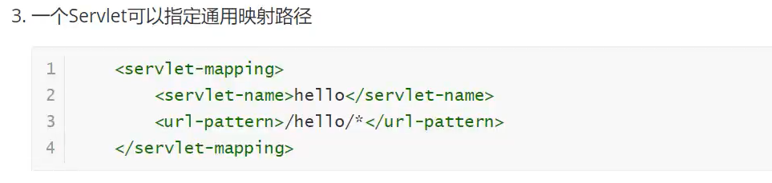

# 1. tomcat

## 文件夹作用


## 启动与关闭

启动：bin/startup.bat

​	测试访问：http://localhost:8080/

关闭：bin/shutdown.bat或直接点叉叉


## 配置


## 发布一个web网站


# 2. maven 【约定大于配置】

## 配置环境


## 阿里云镜像


## 本地仓库


## 在idea中使用maven


### idea中的maven设置

注意：idea项目创建成功后，看一眼maven的配置


## 创建一个普通的maven项目


这是web应用下的：


## 标记文件夹功能


## 在idea中配置tomcat


## pom文件（约定大于配置）

是maven项目的核心配置文件。

maven由于约定大于配置，有些配置文件可能无法导出或生效，解决方案：

```xml
    <build>
        <resources>
            <resource>
                <directory>src/main/resources</directory>
                <excludes>
                    <exclude>**/*.properties</exclude>
                    <exclude>**/*.xml</exclude>
                </excludes>
                <filtering>false</filtering>
            </resource>
            <resource>
                <directory>src/main/java</directory>
                <includes>
                    <include>**/*.properties</include>
                    <include>**/*.xml</include>
                </includes>
                <filtering>false</filtering>
            </resource>
        </resources>
    </build>
```

## web.xml文件

可以将这个文件中的内容配置为和tomcat中web.xml一样：

```xml
<?xml version="1.0" encoding="UTF-8"?>

<web-app xmlns="http://xmlns.jcp.org/xml/ns/javaee"
         xmlns:xsi="http://www.w3.org/2001/XMLSchema-instance"
         xsi:schemaLocation="http://xmlns.jcp.org/xml/ns/javaee
                      http://xmlns.jcp.org/xml/ns/javaee/web-app_4_0.xsd"
         version="4.0"
         metadata-complete="true">


</web-app>
```


# servlet

## 1. 简介


## 2. HelloServlet

### 新建一个空maven

去除src目录，在pom.xml文件中写入servlet和jsp的依赖。

### maven环境优化

- 修改web.xml文件为最新的
- 将maven的结构搭建完整


### 编写一个servlet

1. 编写一个普通类，实现servlet接口
2. Servlet->GenericServlet->HttpServlet，所以可以直接继承HttpServlet

```java
package com.ct.servlet;

import javax.servlet.ServletException;
import javax.servlet.http.HttpServlet;
import javax.servlet.http.HttpServletRequest;
import javax.servlet.http.HttpServletResponse;
import java.io.IOException;
import java.io.PrintWriter;

public class HelloServlet extends HttpServlet {
    //get和post只是前端请求实现的方式不同，业务逻辑一样的话，可以相互调用

    @Override
    protected void doGet(HttpServletRequest req, HttpServletResponse resp) throws ServletException, IOException {
        PrintWriter writer = resp.getWriter();
        writer.print("hello servlet");

    }

    @Override
    protected void doPost(HttpServletRequest req, HttpServletResponse resp) throws ServletException, IOException {
        doGet(req,resp);
    }
}
```


### 编写servlet 的映射

我们写的Java程序，要通过浏览器访问，而浏览器需要连接web服务器，所以我们需要在web服务器中注册servlet，还需有映射一个访问的路径。

```xml
<!--    注册servlet-->
    <servlet>
        <servlet-name>hello</servlet-name>
        <servlet-class>com.ct.servlet.HelloServlet</servlet-class>
    </servlet>
<!--    servlet的请求路径-->
    <servlet-mapping>
        <servlet-name>hello</servlet-name>
        <url-pattern>/hello</url-pattern>
    </servlet-mapping>
```


### 配置tomcat


### 启动测试


## 3. servlet原理


## mapping问题





## 4.ServletContent、Response、Request 笔记丢失


# cookie、Session

## cookie

```java
public class CookieDemo01 extends HttpServlet {
    @Override
    protected void doGet(HttpServletRequest req, HttpServletResponse resp) throws ServletException, IOException {
        //设置中文编码
        req.setCharacterEncoding("utf-8");
        resp.setCharacterEncoding("GBK");

        PrintWriter out = resp.getWriter();

        //服务端从客户端获取cookie
        Cookie[] cookies = req.getCookies();//说明cookie可能存在多个

        if (cookies != null) {
            out.write("您上一次访问的时间是：");

            for (Cookie cookie : cookies) {
                if ("LastLoginTime".equals(cookie.getName())) {
                    //获取cookie中的值
                    long lastTimeLogin = Long.parseLong(cookie.getValue());
                    Date data = new Date(lastTimeLogin);
                    out.write(data.toLocaleString());
                }
            }

        }else{
            out.write("这是您第一次访问本站");
        }

        //服务器给客户端一个cookie
        Cookie cookie = new Cookie("LastLoginTime", System.currentTimeMillis() + "");

        //设置cookie的有效时间为一天
        cookie.setMaxAge(60*60*24);
        
        resp.addCookie(cookie);


    }
```


## session (重点)


使用session：

```java
   @Override
    protected void doGet(HttpServletRequest req, HttpServletResponse resp) throws ServletException, IOException {
        /* 解决乱码问题 */
        req.setCharacterEncoding("utf-8");
        resp.setCharacterEncoding("GBK");
        resp.setContentType("text/html;charset=GBK");

        //得到session
        HttpSession session = req.getSession();

        //在session中存东西
        session.setAttribute("name","神雕大侠");

        //获取session的id
        String sessionId = session.getId();

        //判断session是不是新建的
        if (session.isNew()) {
            resp.getWriter().write("session创建成功，id为" + sessionId);
        }else {
            resp.getWriter().write("session已经存在，id为" + sessionId);
        }


    }
```

```java
    @Override
    protected void doGet(HttpServletRequest req, HttpServletResponse resp) throws ServletException, IOException {
        //解决乱码问题
        req.setCharacterEncoding("utf-8");
        resp.setCharacterEncoding("GBK");
        resp.setContentType("text/html;charset=GBK");

        //得到session
        HttpSession session = req.getSession();

        String name = (String)session.getAttribute("name");
        System.out.println(name);


    }

```

让session过期的方法：


# JSP

## JSP原理

**从源码中得出，JSP本质就是servlet**

源码中内置的一些对象：


所以以上的对象，可以在JSP页面中直接使用。


## jsp基本语法

> jsp表达式

```jsp
<%=  new java.util.Date()  %>
```

> jsp脚本片段
>
> ```jsp
>   <%
>     for (int i = 0; i < 10; i++) {
>       out.println("<p>"+i+"</p>");
>     }
>   %>
> ```
>
> 

> 脚本片段的再实现


> jsp声明


> 定制错误页面

```xml
方法一：web.xml进行配置
<error-page>
    <error-code>404</error-code>
    <location>/error/500.jsp</location>
</error-page>
```

```jsp
方法二：
<%@page errorPage="error/500.jsp" %>
```

## JSP指令


## 九大内置对象


## JSP标签、JSTL标签、EL表达式

```xml
<dependency>
    <groupId>javax.servlet.jsp.jstl</groupId>
    <artifactId>jstl-api</artifactId>
    <version>1.2</version>
</dependency>

<dependency>
    <groupId>taglibs</groupId>
    <artifactId>standard</artifactId>
    <version>1.1.2</version>
  <dependency>
```

### JSP标签


### JSTL表达式

要引用对应的taglib

- **核心标签**（掌握部分）

  

  

- **格式化标签**

- **SQL标签**

- **XML标签**


# JavaBean


# MVC三层架构


