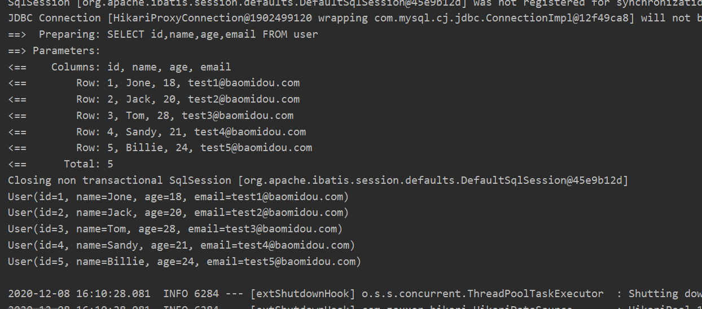
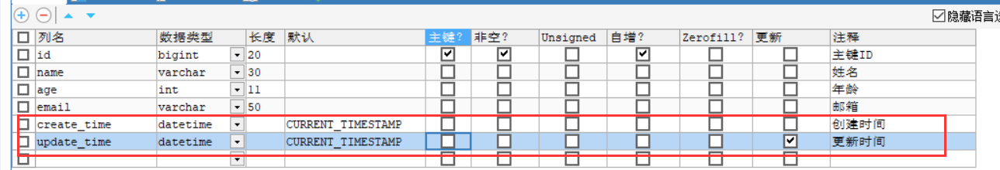
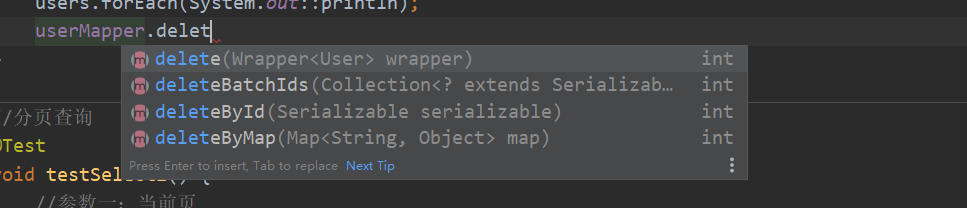
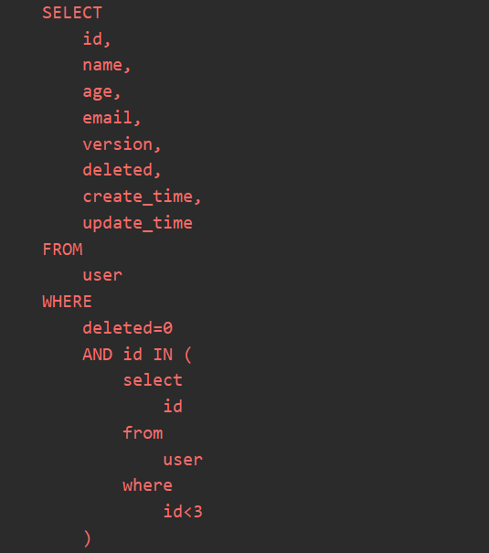

# MybatisPlus学习

官方地址：https://baomidou.com/guide/

## 1. 简介

MyBatis-Plus（简称 MP）是一个MyBatis的增强工具，在 MyBatis 的基础上只做增强不做改变，为简化开发、提高效率而生。


**JPA、tk-mapper、mybatis-plus**


**特性：**

- **无侵入**：只做增强不做改变，引入它不会对现有工程产生影响，如丝般顺滑
- **损耗小**：启动即会自动注入基本 CURD，性能基本无损耗，直接面向对象操作
- **强大的 CRUD 操作**：内置通用 Mapper、通用 Service，仅仅通过少量配置即可实现单表大部分 CRUD 操作，更有强大的条件构造器，满足各类使用需求
- **支持 Lambda 形式调用**：通过 Lambda 表达式，方便的编写各类查询条件，无需再担心字段写错
- **支持主键自动生成**：支持多达 4 种主键策略（内含分布式唯一 ID 生成器 - Sequence），可自由配置，完美解决主键问题
- **支持 ActiveRecord 模式**：支持 ActiveRecord 形式调用，实体类只需继承 Model 类即可进行强大的 CRUD 操作
- **支持自定义全局通用操作**：支持全局通用方法注入（ Write once, use anywhere ）
- **内置代码生成器**：采用代码或者 Maven 插件可快速生成 Mapper 、 Model 、 Service 、 Controller 层代码，支持模板引擎，更有超多自定义配置等您来使用
- **内置分页插件**：基于 MyBatis 物理分页，开发者无需关心具体操作，配置好插件之后，写分页等同于普通 List 查询
- **分页插件支持多种数据库**：支持 MySQL、MariaDB、Oracle、DB2、H2、HSQL、SQLite、Postgre、SQLServer 等多种数据库
- **内置性能分析插件**：可输出 Sql 语句以及其执行时间，建议开发测试时启用该功能，能快速揪出慢查询
- **内置全局拦截插件**：提供全表 delete 、 update 操作智能分析阻断，也可自定义拦截规则，预防误操作


## 2. 快速开始

> 步骤

1. 创建数据库·mybatis_plus`，创建user表

   ```sql
   DROP TABLE IF EXISTS user;
   
   CREATE TABLE user
   (
   	id BIGINT(20) NOT NULL COMMENT '主键ID',
   	name VARCHAR(30) NULL DEFAULT NULL COMMENT '姓名',
   	age INT(11) NULL DEFAULT NULL COMMENT '年龄',
   	email VARCHAR(50) NULL DEFAULT NULL COMMENT '邮箱',
   	PRIMARY KEY (id)
   );
   -- 真实开发中，version（乐观锁）、deleted（逻辑删除）、gmt_create、gmt_modified
   
   INSERT INTO user (id, name, age, email) VALUES
   (1, 'Jone', 18, 'test1@baomidou.com'),
   (2, 'Jack', 20, 'test2@baomidou.com'),
   (3, 'Tom', 28, 'test3@baomidou.com'),
   (4, 'Sandy', 21, 'test4@baomidou.com'),
   (5, 'Billie', 24, 'test5@baomidou.com');
   ```

2. 编写项目，初始化springboot项目，导入依赖

   ```xml
   <dependencies>
       <!--数据库驱动-->
       <dependency>
           <groupId>mysql</groupId>
           <artifactId>mysql-connector-java</artifactId>
       </dependency>
       <!--Lombok-->
       <dependency>
           <groupId>org.projectlombok</groupId>
           <artifactId>lombok</artifactId>
       </dependency>
       <!--mybatisplus-->
       <dependency>
           <groupId>com.baomidou</groupId>
           <artifactId>mybatis-plus-boot-starter</artifactId>
           <version>3.0.5</version>
       </dependency>
   
       <dependency>
           <groupId>org.springframework.boot</groupId>
           <artifactId>spring-boot-starter-web</artifactId>
       </dependency>
   
       <dependency>
           <groupId>org.springframework.boot</groupId>
           <artifactId>spring-boot-starter-test</artifactId>
           <scope>test</scope>
       </dependency>
   </dependencies>
   ```

   说明：使用mybatis-plus能节省大量的代码。尽量**不要同时**导入mybatis-plus和mybatis，会有版本差异。

3. 连接数据库

   ```properties
   spring.datasource.username=root
   spring.datasource.password=1234567
   spring.datasource.url=jdbc.mysql://localhost:3306/mybatis_plus?useSSL=true&useUnicode=true&characterEncoding=utf-8&serverTimezone=GMT%2B8
   spring.datasource.driver-class-name=com.mysql.cj.jdbc.Driver
   ```

4. 使用

   - pojo

     ```java
     @Data
     @AllArgsConstructor
     @NoArgsConstructor
     public class User {
         private Long id;
         private String name;
         private Integer age;
         private String email;
     }
     ```

   - mapper接口

     ```java
     //只要继承BaseMapper，所有简单的CRUD操作都已经自动编写完成了
     @Repository //代表持久层
     public interface UserMapper extends BaseMapper<User> {
     }
     ```

   - 启动类

     ```java
     //扫描mapper文件夹
     @MapperScan("com.ctstudy.mybatis_plus.mapper")
     @SpringBootApplication
     public class MybatisPlusApplication {
     
         public static void main(String[] args) {
             SpringApplication.run(MybatisPlusApplication.class, args);
         }
     
     }
     ```

   - 测试使用

     ```java
     @SpringBootTest
     class MybatisPlusApplicationTests {
     
         //继承了BaseMapper，所有方法都来自父类（后面也会编写自己的方法）
         @Autowired
         private UserMapper userMapper;
     
         @Test
         void contextLoads() {
             //查询所有用户，参数类型为Wrapper，条件构造器，这里先不用（null）
             List<User> users = userMapper.selectList(null);
             users.forEach(System.out::println);
         }
     
     }
     ```

     

   

   **方法和SQL语句，mybatis-plus都帮我们写好了！**

   

## 3. 配置日志

是为了查看sql是如何执行的。

在开发的时候使用日志，上线运行是不使用，因为耗时间。

```properties
# 数据库连接配置
spring.datasource.username=root
spring.datasource.password=1234567
spring.datasource.url=jdbc:mysql://localhost:3306/mybatis_plus?useSSL=true&useUnicode=true&characterEncoding=utf-8&serverTimezone=GMT%2B8
spring.datasource.driver-class-name=com.mysql.cj.jdbc.Driver

#配置日志
mybatis-plus.configuration.log-impl=org.apache.ibatis.logging.stdout.StdOutImpl
```

   

   

## 4. CRUD扩展

### 插入操作

   ```java
//测试插入
@Test
void testInsert() {
    User user = new User(null, "哈哈", 3, "1234567@qq.com");

    int result = userMapper.insert(user);//帮我们自动生成了id
    System.out.println(result);//受影响的行数
    System.out.println(user);//id会回填入user
}
   ```


- 这里id原本为null，id是主键，不能为空，所有自动生成了一个全局唯一的id。

- 当id有具体值时，就不会自己去生成id了


### 主键生成策略

分布式系统唯一id生成：https://www.cnblogs.com/haoxinyue/p/5208136.html

1. 自增

2. uuid

3. redis生成id

4. snowflake雪花算法

5. 利用zookeeper生成唯一ID

   

> 默认：ID_WORKER  全局唯一id，使用雪花算法

```java
@Data
@AllArgsConstructor
@NoArgsConstructor
public class User {
    //对应数据库中的主键（uuid、自增id 、雪花算法、redis、zookeeper）
    @TableId(type = IdType.ID_WORKER)
    private Long id;
    private String name;
    private Integer age;
    private String email;
}
```


**雪花算法：**

snowflake是Twitter开源的**分布式ID生成算法**，结果是一个long型的ID。其核心思想是：使用41bit作为毫秒数，10bit作为机器的ID（5个bit是数据中心，5个bit的机器ID），12bit作为毫秒内的流水号（意味着每个节点在每毫秒可以产生 4096 个 ID），最后还有一个符号位，永远是0。


> AUTO 主键自增

我们需要配置主键自增：

1. 实体类字段上**@TableId(type = IdType.AUTO)**
2. 数据库主键字段一定要自增


> 其余的源码解释

```java
public enum IdType {
    AUTO(0), //数据库id自增
    NONE(1),//未设置主键
    INPUT(2),//手动输入，如果主键为空，就报错
    ID_WORKER(3),//默认的全局唯一id
    UUID(4), //全局唯一id
    ID_WORKER_STR(5); //ID_WORKER的字符串表示法
}
```


### 更新操作

```java
@Test
void testUpdate() {
    User user = new User();
    user.setId(100L);
    user.setName("aaaaa");
    int i = userMapper.updateById(user);
    System.out.println(i);
}
```


```java
@Test
void testUpdate() {
    User user = new User();
    user.setId(100L);
    user.setName("aaaaa");
    user.setAge(100); //多设置一个age
    int i = userMapper.updateById(user);
    System.out.println(i);
}
```


- 从上面的SQL语句可以看出，mybatis-plus可以通过条件（属性是否为null）**自动拼接动态sql**！


### 自动填充

像创建时间、修改时间这种，我们希望是自动化设置的，而不是手动完成更新。

阿里巴巴开发手册：gmt_create、gmt_modified，几乎所有的表都要拥有，而且需要自动化。


> 方式一：数据库级别完成（工作中不建议）

1.在表中新增字段create_time、update_time



2.再次测试前，先把实体类User同步

```java
private Date createTime; //采用驼峰命名法
private Date updateTime;
```

3.再次查看更新结果


> 方式二：代码级别完成

1.删除数据库的默认值、更新操作


2.实体类的字段属性上加注解

```java
@Data
@AllArgsConstructor
@NoArgsConstructor
public class User {
    //对应数据库中的主键（uuid、自增id 、雪花算法、redis、zookeeper）
    @TableId(type = IdType.AUTO)
    private Long id;
    private String name;
    private Integer age;
    private String email;
    
    //字段添加填充内容
    @TableField(fill = FieldFill.INSERT)
    private Date createTime;
    @TableField(fill = FieldFill.INSERT_UPDATE)
    private Date updateTime;
}
```

3.编写处理器处理注解

```java
package com.ctstudy.mybatis_plus.handler;

import com.baomidou.mybatisplus.core.handlers.MetaObjectHandler;
import lombok.extern.slf4j.Slf4j;
import org.apache.ibatis.reflection.MetaObject;
import org.springframework.stereotype.Component;

import java.util.Date;

@Slf4j
@Component  //一定要注入到ioc容器中
public class MyMetaObjectHandler implements MetaObjectHandler {
    //插入时的填充策略
    @Override
    public void insertFill(MetaObject metaObject) {
        log.info("start insert");
        //setFieldValByName(String fieldName, Object fieldVal, MetaObject metaObject)
        this.setFieldValByName("createTime",new Date(),metaObject);
        this.setFieldValByName("updateTime",new Date(),metaObject);

    }

    //更新时的填充策略
    @Override
    public void updateFill(MetaObject metaObject) {
        log.info("start update");
        this.setFieldValByName("updateTime",new Date(),metaObject);

    }
}
```

4.测试插入


5.测试更新


### 乐观锁

- 乐观锁：十分乐观，无论干什么都不去上锁；如果出现问题，再次更新值测试（CAS）

- 悲观锁：十分悲观，无论干什么都去上锁，lock、synchronized

  

**乐观锁实现方式：**

- 取出记录时，获取当前的version
- 更新时，带上这个version
- 执行更新时，set version = newVersion where version = oldVersion
- 如果version不对，就更新失败


> 测试MP中的乐观锁插件

1.给数据库增加version字段


2.同步实体类

```java
@Version //乐观锁version注解
private Integer version;
```

3.注册组件

```java
//扫描mapper文件夹，原本在启动类上的，因为是MP的操作，所有移到了这里
@MapperScan("com.ctstudy.mybatis_plus.mapper")
@Configuration
@EnableTransactionManagement //开启事务管理（默认就是开启的）
public class MybatisPlusConfig {
    //注册乐观锁插件
    @Bean
    public OptimisticLockerInterceptor optimisticLockerInterceptor() {
        return new OptimisticLockerInterceptor();
    }
}
```

4.测试

> 成功的测试：

```java
//测试乐观锁成功
@Test
void testOptimisticLocker() {
    User user = userMapper.selectById(1L);
    System.out.println(user);//User(id=1, name=Jone, age=18, email=test1@baomidou.com, version=1,                                   //createTime=Tue Dec 08 21:36:57 CST 2020, updateTime=Tue Dec 08 21:36:57 CST 2020)
    user.setEmail("111@qq.com");
    user.setAge(1);
    userMapper.updateById(user);
}
//Preparing: UPDATE user SET name=?, age=?, email=?, version=?, create_time=?, update_time=? WHERE id=? AND version=?
//Parameters: Jone(String), 1(Integer), 111@qq.com(String), 2(Integer), 2020-12-08 21:36:57.0(Timestamp), 2020-12-08 22:49:51.138(Timestamp), 1(Long), 1(Integer)
```

> 失败的测试：

```java
//测试乐观锁失败 模拟多线程下
@Test
void testOptimisticLocker2() {
    User user = userMapper.selectById(1L);
    System.out.println(user);
    user.setEmail("222@qq.com");
    user.setAge(10);

    //模拟另一个线程执行了插队操作
    //---------------------------------
    User user2 = userMapper.selectById(1L);
    System.out.println(user2);
    user2.setEmail("333@qq.com");
    user2.setAge(20);
    userMapper.updateById(user2);
    //---------------------------------

    userMapper.updateById(user);//如果没有乐观锁就会覆盖
}
```


可以看出，```UPDATE user SET name=?, age=?, email=?, version=?1, create_time=?, update_time=? WHERE id=? AND version=?2```中，**?2**表示的是传入的version值(旧值)，**?1**等于?2+1


### 查询操作

```java
//测试批量查询
@Test
void testSelect() {
    List<User> users = userMapper.selectBatchIds(Arrays.asList(1, 2, 3));
    users.forEach(System.out::println);
}
```


```java
//条件查询之一：map	
@Test
void testSelect1() {
    HashMap<String, Object> map = new HashMap<>();
    map.put("name", "哈哈"); //查询name='哈哈'的记录
    map.put("age",3); // age=3的记录
    List<User> users = userMapper.selectByMap(map);
    users.forEach(System.out::println);
}
```


### 分页查询

1.原始的limit

2.pageHelper等第三方插件

3.MP内置的分页插件


> 如何使用

1.配置拦截器组件

```java
//分页插件
@Bean
PaginationInterceptor paginationInterceptor() {
    return new PaginationInterceptor();
}
```

2.直接使用page对象即可

```java
//分页查询
@Test
void testSelect2() {
    //参数一：当前页
    //参数二：页面大小
    //Page<User> page = new Page<>(1,5);//查出了第1~5条记录
    Page<User> page = new Page<>(2,5);//查出了第6~10条记录
    userMapper.selectPage(page,null);
    page.getRecords().forEach(System.out::println);
}
```


page对象中还有很多的方法，比如getTotal()可以获得记录总数等。


### 删除操作



与上面的查询操作是一样的！


### 逻辑删除

- 物理删除：从数据库中直接移除
- 逻辑删除：数据库中不移除数据，而是通过一个变量使之失效。deleted=0 ------> deleted=1


> 测试以下

1.数据库中增加deleted字段


2.实体类

```java
@TableLogic //逻辑删除
private Integer deleted;
```

3.注册组件

```java
//逻辑删除组件
@Bean
public ISqlInjector sqlInjector() {
    return new LogicSqlInjector();
}
```

4.配置

```properties
#配置逻辑删除
mybatis-plus.global-config.db-config.logic-delete-value=1
mybatis-plus.global-config.db-config.logic-not-delete-value=0
```

5.测试

执行删除：

```java
@Test
void delete() {
    userMapper.deleteById(1L);
}
```


虽然用了删除操作，实质执行的是更新操作。说明进行了逻辑删除！


执行查询：

```java
@Test
void select() {
    User user = userMapper.selectById(1L);
    System.out.println(user);
}
```


查询的时候会过滤掉已经被逻辑删除了的。


## 5.性能分析插件

我们平时的开发中，会遇到一些慢sql。需要测试分析！


1.导入插件

```java
//sql执行效率分析插件
@Bean
@Profile({"dev", "test"}) //只在测试、开发环境中开启
public PerformanceInterceptor performanceInterceptor() {
    PerformanceInterceptor performanceInterceptor = new PerformanceInterceptor();
    performanceInterceptor.setMaxTime(100);//ms   设置sql执行的最大时间，如果超过，就不执行了
    performanceInterceptor.setFormat(true);//方便查看
    return performanceInterceptor;
}
```

要在springboot中配置环境为测试环境或开发环境：

```properties
#设置开发环境
spring.profiles.active=dev
```

2.测试使用

```java
@Test
void contextLoads() {
    //查询所有用户，参数类型为Wrapper，条件构造器，这里先不用（null）
    List<User> users = userMapper.selectList(null);
    users.forEach(System.out::println);
}
```


## 6.条件构造器 Wrapper

相当于用Java代码来代替了sql语句。


> 测试一

```java
@Test
void contextLoads() {
    //查询name不为空的、并且邮箱不为空的、年龄大于等于20的用户
    QueryWrapper<User> wrapper = new QueryWrapper<>();
    wrapper.isNotNull("name")
        .isNotNull("email")
        .ge("age",20);//greater equal
    userMapper.selectList(wrapper).forEach(System.out::println);
}
```


> 测试二

```java
@Test
void contextLoads2() {
    //查询name=ct的用户
    QueryWrapper<User> wrapper = new QueryWrapper<>();
    wrapper.eq("name","ct");
    System.out.println(  userMapper.selectOne(wrapper)  );
}
```


> 测试三

```java
@Test
void contextLoads3() {
    //查询年龄在20-30之间的用户
    QueryWrapper<User> wrapper = new QueryWrapper<>();
    wrapper.between("age",20,30);
    Integer count = userMapper.selectCount(wrapper); //查询结果数
    System.out.println(count);
}
```


> 测试四

```java
@Test
void contextLoads4() {
    //模糊查询
    QueryWrapper<User> wrapper = new QueryWrapper<>();
    //左和右    t%  表示%在左边还是在右边
    wrapper.notLike("name","c")  //名字里不含有c的
    .likeRight("email","t");  //email是以t开头的 t%

    List<Map<String, Object>> maps = userMapper.selectMaps(wrapper);
    maps.forEach(System.out::println);
}
```


> 测试五

```java
@Test
void contextLoads5() {
    //内查询
    QueryWrapper<User> wrapper = new QueryWrapper<>();
    //id在子查询中查出来
    wrapper.inSql("id","select id from user where id<3");
    List<Object> objects = userMapper.selectObjs(wrapper);
    objects.forEach(System.out::println);
}
```




> 测试六

```java
@Test
void contextLoads6() {
    //通过id进行排序
    QueryWrapper<User> wrapper = new QueryWrapper<>();
    wrapper.orderByDesc("id");
    List<User> users = userMapper.selectList(wrapper);
    users.forEach(System.out::println);
}
```


## 7.代码自动生成器


```java
//代码自动生成器
public class AutoCode {
    public static void main(String[] args) {
        //需要构建一个代码自动生成器对象
        AutoGenerator mpg = new AutoGenerator();

        //配置策略
        //1.全局配置
        GlobalConfig gc = new GlobalConfig();
        String projectPath = System.getProperty("user.dir");
        gc.setOutputDir(projectPath + "/src/main/java");
        gc.setAuthor("ct");
        gc.setOpen(false); //是否打开资源管理器
        gc.setFileOverride(false);//是否覆盖
        gc.setServiceName("%sService");//去Service的I前缀
        gc.setIdType(IdType.ID_WORKER);
        gc.setDateType(DateType.ONLY_DATE); //设置日期类型
        gc.setSwagger2(true);
        mpg.setGlobalConfig(gc);

        //2.设置数据源
        DataSourceConfig dsc = new DataSourceConfig();
        dsc.setUrl("jdbc:mysql://localhost:3306/mybatis_plus?useSSL=true&useUnicode=true&characterEncoding=utf-8&serverTimezone=GMT%2B8");
        dsc.setDriverName("com.mysql.cj.jdbc.Driver");
        dsc.setUsername("root");
        dsc.setPassword("1234567");
        dsc.setDbType(DbType.MYSQL);
        mpg.setDataSource(dsc);

        //3.包的配置
        PackageConfig pc = new PackageConfig();
        pc.setModuleName("blog");
        pc.setParent("com.ct");
        pc.setEntity("entity");
        pc.setMapper("mapper");
        pc.setService("service");
        pc.setController("controller");
        mpg.setPackageInfo(pc);

        //4.策略配置
        StrategyConfig strategy = new StrategyConfig();
        strategy.setInclude("user"); //设置要映射的表名,可写多个
        strategy.setNaming(NamingStrategy.underline_to_camel);
        strategy.setColumnNaming(NamingStrategy.underline_to_camel);
        strategy.setEntityLombokModel(true); //自动Lombok
        strategy.setLogicDeleteFieldName("deleted"); //逻辑删除
        //自动填充配置
        TableFill gmtCreate = new TableFill("gmt_create", FieldFill.INSERT);
        TableFill gmtModified = new TableFill("gmt_modified", FieldFill.INSERT_UPDATE);
        ArrayList<TableFill> tableFills = new ArrayList<>();
        tableFills.add(gmtCreate);
        tableFills.add(gmtModified);
        strategy.setTableFillList(tableFills);
        //乐观锁
        strategy.setVersionFieldName("version");

        strategy.setRestControllerStyle(true);
        strategy.setControllerMappingHyphenStyle(true); //localhost:8080?hello_id_2
        mpg.setStrategy(strategy);

        mpg.execute();//执行

    }
}
```

执行后，一键生成代码！


之后，只需修改**strategy.setInclude("user")**，就可以生成其它表的代码。参数可以传入多个。


