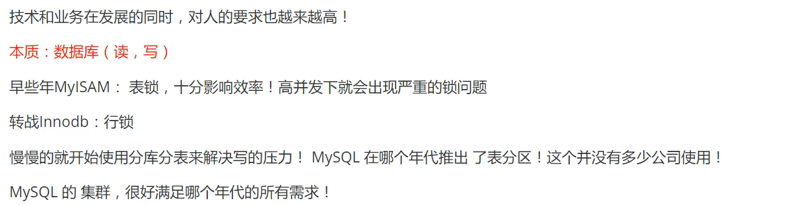
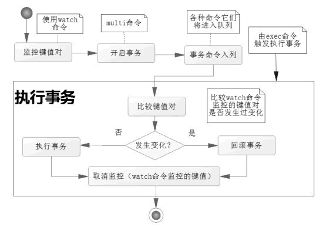

# 1.Nosql概述

## 为什么要用Nosql

> 1.单机Mysql的时代


> 2.Memcached(缓存)+Mysql+垂直拆分（读写分离）------------主要解决读


> 3.分库分表 + 水平拆分 + MySQL集群------------主要解决写




> 4.最近的年代


> 目前一个基本的互联网项目


> 为什么要用Nosql


## 什么是Nosql

> Nosql

- NoSql = Not     Only Sql（不仅仅是Sql）
- 泛指非关系型数据库，随着web2.0互联网诞生！传统的关系型数据库很难对付web2.0时代！尤其是超大规模的高并发社区！暴露出来很多难以克服的问题，NoSql在当今大数据环境下发展十分迅速，Redis是发展最快的，而且是我们当下必须掌握的一个技术！


> Nosql特点

- 方便扩展（数据之间没有关系，很好扩展！）
- 大数据量高性能（Redis一秒可以写8万次，读11万次，NoSql的缓存是记录级的，是一种细粒度的缓存，性能会比较高！）
- 数据类型是多样的！（不需要事先设计数据库！随取随用！）


> 传统 RDBMS 和 NoSQL：

**传统的 RDBMS**

- 结构化组织

- SQL
- 数据和关系都存在单独的表中 row col
- 操作操作，数据定义语言
- 严格的一致性
- 基础的事务
- .....

**Nosql**

- 不仅仅是数据

- 没有固定的查询语言
-  键值对存储，列存储，文档存储，图形数据库（社交关系）
- 最终一致性，
- CAP定理和BASE （异地多活）
-  高性能，高可用，高可扩
- ....


> 大数据时代的3V + 3高

大数据时代的3V：主要是描述问题的

1. 海量Volume
2. 多样Variety
3. 实时Velocity

大数据时代的3高：主要是对程序的要求

1. 高并发
2. 高可扩
3. 高性能


## Nosql的四大分类

- **K:V键值对**：

  - 新浪：**Redis**

  - 美团：Redis + Tair
  - bilibili：狂神说Java
  - 阿里、百度：Redis + memecache


- **文档型数据库**（bson格式----------和json一样）：

  - **MongoDB**（需要掌握）

    ​    1.MongoDB是一个基于分布式文件存储的数据库，主要用来处理大量的文档

  ​           2.MongoDB是一个介于关系型数据库和非关系型数据库中间的产品

  ​           3.MongoDB是非关系型数据库中功能最丰富的，最想关系型数据库的


- **列存储数据库**：

  - **Hbase**

  - 分布式文件系统


- **图形关系数据库**：不是存图片的，存的是关系，比如朋友圈社交网络，广告推荐！
  - **Neo4j**
  - InfoGrid


# 2. Redis入门

## 概述

> redis是什么

- Redis（Remote Dictionary Server）：远程字典服务。

  
- 是一个开源的ANSI，C语言编写、支持网络、可基于内存亦可持久化的日字型，Key-Value数据库，并提供多种语言的API。
- 免费、开源！是当下最热门NoSQL数据库之一！也被人们称为结构化数据库！


> Redis能干什么

- 内存存储、持久化，内存中是断电即失，所以持久化很重要（rdb、aof）
- 效率高，可用于高速缓存
- 发布订阅系统
- 地图信息分析
- 计时器、计数器（浏览量）
- ……


> 特性

- 多样的数据类型
- 持久化
- 集群
- 事务
- ……


> 学习中需要用到的东西

redis中文网：https://www.redis.net.cn/


**Redis推荐在Linux上搭建！**


## Windows安装


1. 解压即可。


2.双击**redis-server.exe**开启服务


3.双击**redis-cli.exe**打开客户端


## Linux安装

1. 下载安装包**redis-6.0.9.tar.gz**至Linux服务器

2. 解压安装包到 **/opt/** 目录下 tar -zxvf

   

   

3. 在`redis-6.0.9`文件夹中，安装，命令如下：

   ```bash
   yum install gcc-c++
   
   make # 失败可能是gcc版本太低 
        #https://blog.csdn.net/qq_38224607/article/details/107108283
   
   make install
   ```

4. redis的默认安装路径：```/usr/local/bin```

   

5. 配置文件

   从安装目录中复制一份redis.config文件，我们之后就使用复制的配置文件进行启动。

   

6. redis默认不是后台启动的，所以要修改配置文件```vim redis.config```

   

   把no改为yes。

7. 启动redis服务```redis-server ctconfig/redis.conf```

   

8. 启动客户端redis-cli，测试是否启动成功

   

   

9. 如何关闭redis服务：shutdown

   

   


## 性能测试

**redis-benchmark**是一个压力测试工具！


**如何使用：**

```redis-benchmark 命令参数```

| 序号 | 选项      | 描述                                       | 默认值    |
| :--- | :-------- | :----------------------------------------- | :-------- |
| 1    | **-h**    | 指定服务器主机名                           | 127.0.0.1 |
| 2    | **-p**    | 指定服务器端口                             | 6379      |
| 3    | **-s**    | 指定服务器 socket                          |           |
| 4    | **-c**    | 指定并发连接数                             | 50        |
| 5    | **-n**    | 指定请求数                                 | 10000     |
| 6    | **-d**    | 以字节的形式指定 SET/GET 值的数据大小      | 2         |
| 7    | **-k**    | 1=keep alive 0=reconnect                   | 1         |
| 8    | **-r**    | SET/GET/INCR 使用随机 key, SADD 使用随机值 |           |
| 9    | **-P**    | 通过管道传输 <numreq> 请求                 | 1         |
| 10   | **-q**    | 强制退出 redis。仅显示 query/sec 值        |           |
| 11   | **--csv** | 以 CSV 格式输出                            |           |
| 12   | **-l**    | 生成循环，永久执行测试                     |           |
| 13   | **-t**    | 仅运行以逗号分隔的测试命令列表。           |           |
| 14   | **-I**    | Idle 模式。仅打开 N 个 idle 连接并等待。   |           |

### 实例

测试 redis 性能：

```bash
#测试100个并发，100000（10万）个请求
redis-benchmark -h localhost -p 6379 -c 100 -n 100000
```


 

## 基础知识

redis默认有16个数据库，在配置文件中可以看出：


默认使用的是第0个。


- **select**：切换数据库
- **dbsize**：查看数据库中的数据数量
- **keys ***：查看所有的key
- **flushdb**：清空当前数据库的数据
- **flushall**：清除所有数据库的数据

```bash
127.0.0.1:6379> select 15 # 切换数据库
OK
127.0.0.1:6379[15]> select 16 # 有16的数据库，0~15
(error) ERR DB index is out of range
127.0.0.1:6379[15]> dbsize
(integer) 0
127.0.0.1:6379[15]> set name ct
OK
127.0.0.1:6379[15]> dbsize
(integer) 1
127.0.0.1:6379[15]> SELECT 5
OK
127.0.0.1:6379[5]> dbsize
(integer) 0
127.0.0.1:6379[5]> get name
(nil)
127.0.0.1:6379[5]> select 15
OK
127.0.0.1:6379[15]> get name #说明数据库之间不会共享数据
"ct"

127.0.0.1:6379[15]> keys * #查看所有的key
1) "name"
127.0.0.1:6379> EXISTS name #是否存在键name
(integer) 1
127.0.0.1:6379[15]> flushdb #清空当前数据库
OK
127.0.0.1:6379[15]> keys *
(empty array)

127.0.0.1:6379[15]> select 0
OK
127.0.0.1:6379> keys *
1) "counter:__rand_int__"
2) "mylist"
3) "name"
4) "key:__rand_int__"
5) "myhash"
127.0.0.1:6379> SELECT 3
OK
127.0.0.1:6379[3]> flushall #清除所有数据库的
OK
127.0.0.1:6379[3]> SELECT 0
OK
127.0.0.1:6379> keys *
(empty array)
```


> Redis是单线程的（6.0之后变成多线程了，多线程部分只是用来处理网络数据的读写（特别是大文件的io）和协议解析）

- Redis是很快的，Redis是基于内存操作，CPU不是Redis的性能瓶颈，Redis的性能瓶颈是根据机器的内存和网络带宽。
- Redis是C语言写的，官方提供的数据为 100000+的QPS，完全不比同样使用Key:value的Memecache差！


**Redis为什么单线程还这么快？**

- Redis是将**所有数据放在内存中**的，所以使用单线程去操作效率就是最高的
- 多线程CPU上下文会切换，这是耗时的操作
- 对于内存系统来说，没有下上下文切换效率就是最高的


# 3.五大数据类型

- Redis     是一个开源（BSD许可）的，内存中的数据结构存储系统，它可以用作数据库、缓存和消息中间件。 它支持多种类型的数据结构，如 [字符串（strings）](http://redis.cn/topics/data-types-intro.html#strings)， [散列（hashes）](http://redis.cn/topics/data-types-intro.html#hashes)， [列表（lists）](http://redis.cn/topics/data-types-intro.html#lists)， [集合（sets）](http://redis.cn/topics/data-types-intro.html#sets)， [有序集合（sorted sets）](http://redis.cn/topics/data-types-intro.html#sorted-sets) 与范围查询， [bitmaps](http://redis.cn/topics/data-types-intro.html#bitmaps)， [hyperloglogs](http://redis.cn/topics/data-types-intro.html#hyperloglogs) 和 [地理空间（geospatial）](http://redis.cn/commands/geoadd.html) 索引半径查询。 Redis     内置了 [复制（replication）](http://redis.cn/topics/replication.html)，[LUA脚本（Lua scripting）](http://redis.cn/commands/eval.html)， [LRU驱动事件（LRU eviction）](http://redis.cn/topics/lru-cache.html)，[事务（transactions）](http://redis.cn/topics/transactions.html) 和不同级别的 [磁盘持久化（persistence）](http://redis.cn/topics/persistence.html)， 并通过 [Redis哨兵（Sentinel）](http://redis.cn/topics/sentinel.html)和自动 [分区（Cluster）](http://redis.cn/topics/cluster-tutorial.html)提供高可用性（high     availability）。

## Redis-Key

- **EXISTS**：是否存在键
- **move**：移动key到另一个数据库，如：move name 1(把key为name的键值对移动到数据库1，当前数据库中就没该键值对了)
- **expire**：设置键值对的过期时间，如：expire name 10（key为name的键值对十秒后过期，单位是秒）
- **ttl**：查看键值对的过期时间，如：ttl name(显示name键值对的过期时间，单位是秒)
- **type**：查看key所存储值的类型
- **del**： 删除key

```bash
127.0.0.1:6379> flushall
OK
127.0.0.1:6379> set name ct
OK
127.0.0.1:6379> keys *
1) "name"
127.0.0.1:6379> set age 3
OK
127.0.0.1:6379> EXISTS name #判断当前key是否存在
(integer) 1
127.0.0.1:6379> keys *
1) "age"
2) "name"
127.0.0.1:6379> move name 1 #移动key到另一个数据库
(integer) 1
127.0.0.1:6379> keys *
1) "age"
127.0.0.1:6379> set name ct
OK
127.0.0.1:6379> keys *
1) "age"
2) "name"
127.0.0.1:6379> move name 0
(error) ERR source and destination objects are the same
127.0.0.1:6379> move name 2
(integer) 1
127.0.0.1:6379> keys *
1) "age"
127.0.0.1:6379> SELECT 1
OK
127.0.0.1:6379[1]> keys *
1) "name"
127.0.0.1:6379[1]> get name
"ct"
127.0.0.1:6379[1]> SELECT 2
OK
127.0.0.1:6379[2]> get name
"ct"
127.0.0.1:6379[2]> SELECT 3
OK
127.0.0.1:6379[3]> get name
(nil)
127.0.0.1:6379[3]> SELECT 0
OK
127.0.0.1:6379> set name ct
OK
127.0.0.1:6379> keys *
1) "age"
2) "name"
127.0.0.1:6379> clear
127.0.0.1:6379> keys *
1) "age"
2) "name"
127.0.0.1:6379> expire name 10 #设置name过期时间，10秒后过期
(integer) 1
127.0.0.1:6379> keys * # 没过10秒
1) "age"
2) "name"
127.0.0.1:6379> ttl name #查看键值对的过期时间
(integer) 4   #4秒后过期
127.0.0.1:6379> keys * #10秒后
1) "age"

127.0.0.1:6379> set name ct
OK
127.0.0.1:6379> type age # 查看key所存储值的类型
string
127.0.0.1:6379> type name
string

127.0.0.1:6379> del name #删除key
(integer) 1
127.0.0.1:6379> keys *
1) "age"
```


## String（字符串）

- **append**：后面追加字符串
- **strlen**：显示字符串长度
- **incr**：加1
- **decr**：减一
- **incrby**：加，可以设置步长
- **decrby**：减，可以设置步长
- **getrange**：截取字符串
- **setrange** ：替换指定位置开始的字符串
-  **setex**：set with expire，设置key的值并设置过期时间
- **setnx**：set if not exist，如果key不存在，就创建；如果存在，创建失败
- **mset**：同时设置多个值
- **mget**：同时获得多个值
- **msetnx**：如果不存在，同时设置多个值，是**原子性操作**
- **getset**：先get再set

```bash
127.0.0.1:6379> set key1 v1
OK
127.0.0.1:6379> get key1
"v1"
127.0.0.1:6379> append key1 "hello" #追加字符串
(integer) 7
127.0.0.1:6379> get key1
"v1hello"
127.0.0.1:6379> keys *
1) "key1"
127.0.0.1:6379> append name "ct" #如果当前key不存在，就相当于set了一个key
(integer) 2
127.0.0.1:6379> keys *
1) "key1"
2) "name"
127.0.0.1:6379> strlen key1 #获取字符串长度
(integer) 7
#########################################################################
127.0.0.1:6379> set views 1
OK
127.0.0.1:6379> get views
"1"
127.0.0.1:6379> incr views #加1
(integer) 2
127.0.0.1:6379> incr views
(integer) 3
127.0.0.1:6379> get views
"3"
127.0.0.1:6379> decr views # 减一
(integer) 2
127.0.0.1:6379> decr views
(integer) 1
127.0.0.1:6379> get views
"1"
127.0.0.1:6379> incrby views 10 # 设置步长，指定增量
(integer) 11
127.0.0.1:6379> decrby views 5
(integer) 6
#########################################################################
127.0.0.1:6379> set key1 "hello,ct"
OK
127.0.0.1:6379> getrange key1 0 4 #截取字符串
"hello"
127.0.0.1:6379> getrange key1 0 -1 #获取全部字符串
"hello,ct"

127.0.0.1:6379> set key2 abcdefg
OK
127.0.0.1:6379> setrange key2 1 xx #替换指定位置开始的字符串
(integer) 7
127.0.0.1:6379> get key2
"axxdefg"
#########################################################################
127.0.0.1:6379> setex key3 30 "hello"  # set with expire，设置key3的值为hello，30秒后过期
OK
127.0.0.1:6379> ttl key3
(integer) 22
127.0.0.1:6379> get key3
"hello"
127.0.0.1:6379> setnx key4 "redis" #set if not exist，如果key不存在，就创建
(integer) 1
127.0.0.1:6379> keys *
1) "key2"
2) "key1"
3) "key4"
127.0.0.1:6379> ttl key3
(integer) -2
127.0.0.1:6379> get key4
"redis"
127.0.0.1:6379> setnx key4 "java" #如果key存在，创建失败
(integer) 0
127.0.0.1:6379> get key4
"redis"
#########################################################################
#批量
127.0.0.1:6379> keys *
(empty array)
127.0.0.1:6379> mset k1 v1 k2 v2 k3 v3 #同时设置多个值
OK
127.0.0.1:6379> keys *
1) "k2"
2) "k1"
3) "k3"
127.0.0.1:6379> mget k1 k2 k3 #同时获得多个值
1) "v1"
2) "v2"
3) "v3"
127.0.0.1:6379> msetnx k4 v4 k5 v5 #如果不存在，同时设置多个值，是原子性操作
(integer) 1
127.0.0.1:6379> keys *
1) "k1"
2) "k4"
3) "k2"
4) "k5"
5) "k3"
127.0.0.1:6379> msetnx k6 v6 k1 v1 #说明原子性操作
(integer) 0
127.0.0.1:6379> keys *
1) "k1"
2) "k4"
3) "k2"
4) "k5"
5) "k3"
127.0.0.1:6379> get k6
(nil)

#对象
set user:1 {name:zhangsan,age:3} #设置一个user:1对象 值为json字符串

#这里的key是一个巧妙的设计： user:{id}:{field}
127.0.0.1:6379> mset user:1:name zhangsan user:1:age 3
OK
127.0.0.1:6379> mget user:1:name user:1:age
1) "zhangsan"
2) "3"
127.0.0.1:6379> keys *
1) "user:1:age"
2) "user:1:name"
#########################################################################
127.0.0.1:6379> getset db redis #先get再set
(nil)
127.0.0.1:6379> get db
"redis"
127.0.0.1:6379> getset db mongodb
"redis"
127.0.0.1:6379> get db
"mongodb"

```

value除了是字符串，还可以是数字（可用于计数器），都是String类型！


## List（列表）

在redis中，可以把list玩成栈、队列等。

**所有的list命令都是‘L’或‘R’开头的。**（可以看出，是链表操作）

- **lpush**：将一个值或多个值插入列表的头部（左）
- **rpush**：将一个值或多个值插入列表的尾部（右）
- **lrange**：获取list中的值
- **lpop**：移除列表第一个元素
- **rpop**：移除列表最后一个元素
- **lindex**：获取具体下标的值
- **llen**：返回列表的长度
- **lrem**：移除list中指定个数的value
- **ltrim**：通过下标截取list
- **rpoplpush**：移除列表最后一个元素，并将它移到其它列表中
- **lset**：将列表中指定下标的值替换为另外一个值。如果存在，更新；如果不存在，报错
- **linsert**：将某个具体的value插入列表中某个元素的前或后

```bash
127.0.0.1:6379> lpush list one #将一个值或多个值插入列表的头部（左）
(integer) 1
127.0.0.1:6379> lpush list two
(integer) 2
127.0.0.1:6379> lpush list three
(integer) 3
127.0.0.1:6379> lrange list 0 -1 #获取list中的值
1) "three"
2) "two"
3) "one"
127.0.0.1:6379> lrange list 0 1
1) "three"
2) "two"
127.0.0.1:6379> rpush list four #将一个值或多个值插入列表的尾部（右）
(integer) 4
127.0.0.1:6379> lrange list 0 -1
1) "three"
2) "two"
3) "one"
4) "four"
#########################################################################
127.0.0.1:6379> lrange list 0 -1
1) "three"
2) "two"
3) "one"
4) "four"
127.0.0.1:6379> lpop list #移除列表第一个元素
"three"
127.0.0.1:6379> rpop list #移除列表最后一个元素
"four"
127.0.0.1:6379> lrange list 0 -1
1) "two"
2) "one"
127.0.0.1:6379> lindex list 0 #获取具体下标的值
"two"
127.0.0.1:6379> lindex list 1
"one"
127.0.0.1:6379> llen list #返回列表的长度
(integer) 2
#########################################################################
127.0.0.1:6379> lrange list 0 -1
1) "two"
2) "three"
3) "two"
127.0.0.1:6379> lrem list 1 two #移除list中指定个数的value
(integer) 1
127.0.0.1:6379> lrange list 0 -1
1) "three"
2) "two"
127.0.0.1:6379> lpush list two
(integer) 3
127.0.0.1:6379> lrange list 0 -1
1) "two"
2) "three"
3) "two"
127.0.0.1:6379> lrem list 2 two
(integer) 2
127.0.0.1:6379> lrange list 0 -1
1) "three"
#########################################################################
127.0.0.1:6379> Lpush list hello1
(integer) 1
127.0.0.1:6379> Lpush list hello2
(integer) 2
127.0.0.1:6379> Lpush list hello3
(integer) 3
127.0.0.1:6379> Lpush list hello4
(integer) 4
127.0.0.1:6379> ltrim list 1 2 #通过下标截取list
OK
127.0.0.1:6379> lrange list 0 -1
1) "hello3"
2) "hello2"
127.0.0.1:6379> rpoplpush list mylist #移除列表最后一个元素，并将它移到其它列表中
"hello2"
127.0.0.1:6379> lrange mylist 0 -1
1) "hello2"
127.0.0.1:6379> lrange list 0 -1
1) "hello3"
#########################################################################
127.0.0.1:6379> exists list
(integer) 0
127.0.0.1:6379> keys *
(empty array)
127.0.0.1:6379> lset list o item #将列表中指定下标的值替换为另外一个值
(error) ERR no such key
127.0.0.1:6379> lpush list value1
(integer) 1
127.0.0.1:6379> lrange list 0 -1
1) "value1"
127.0.0.1:6379> lset list 0 item
OK
127.0.0.1:6379> lrange list 0 -1
1) "item"
127.0.0.1:6379> lset list 1 hh
(error) ERR index out of range
#########################################################################
127.0.0.1:6379> rpush list hello
(integer) 1
127.0.0.1:6379> rpush list world
(integer) 2
127.0.0.1:6379> lrange list 0 -1
1) "hello"
2) "world"
127.0.0.1:6379> linsert list before world hh #将某个具体的value插入列表中某个元素的前或后
(integer) 3
127.0.0.1:6379> lrange list 0 -1
1) "hello"
2) "hh"
3) "world"
127.0.0.1:6379> linsert list after hello aa
(integer) 4
127.0.0.1:6379> lrange list 0 -1
1) "hello"
2) "aa"
3) "hh"
4) "world"
```

小结：

实际上是一个链表，头、尾、中间都可以插入值。

插入值的时候：如果key不存在，创建新的链表；如果key存在，新增内容。

如果移除了key,整个链表都会被删除。

在两边插入或者改动值时效率最高。


## Set（集合）

set中的值是无序且不重复的。

| 命令                 | 解释                                                         |
| -------------------- | ------------------------------------------------------------ |
| sadd key v1 v2 v3 …… | 给指定的集合中添元素                                         |
| smembers key         | 查询指定集合中的所有值                                       |
| sismember key value  | 判断指定的值是不是在指定集合中（在返回1，不在返回0）         |
| scard key            | 获取指定集合中元素的个数                                     |
| srem key value       | 移除指定集合中的指定元素                                     |
| srandmember key      | 从指定集合中随机抽取指定个数的元素                           |
| spop key             | 随机删除指定集合中的一个元素                                 |
| smove k1 k2 value    | 将一个指定集合(k1)中的一个指定的值(value)移动到另外一个指定的集合(k2)中 |
| sdiff k1 k2          | 以k1为参照物获取k1、k2两个集合的差集                         |
| sinter k1 k2         | 获取k1、k2两个集合的交集                                     |
| sunion k1 k2         | 获取k1、k2两个集合的并集                                     |

```bash
127.0.0.1:6379> sadd myset hello #给指定的集合中添元素  
(integer) 1
127.0.0.1:6379> sadd myset hello #如果set中有了，添加失败 
(integer) 0
127.0.0.1:6379> sadd myset ct zhangsan #可添加多个
(integer) 2
127.0.0.1:6379> smembers myset #  查询指定集合中的所有值  
1) "zhangsan"
2) "ct"
3) "hello"
127.0.0.1:6379> sismember myset ct #判断指定的值是不是在指定集合中
(integer) 1
127.0.0.1:6379> sismember myset hh
(integer) 0
127.0.0.1:6379> scard myset #  获取指定集合中元素的个数  
(integer) 3
127.0.0.1:6379> srem myset ct hello #移除set中的指定元素
(integer) 2
127.0.0.1:6379> smembers myset
1) "zhangsan"

127.0.0.1:6379> smembers myset
1) "zhangsan"
2) "bob"
3) "jack"
127.0.0.1:6379> srandmember myset # 从指定集合中随机抽取指定个数的元素  
"jack"
127.0.0.1:6379> srandmember myset
"zhangsan"
127.0.0.1:6379> srandmember myset
"zhangsan"
127.0.0.1:6379> srandmember myset 2
1) "zhangsan"
2) "bob"

127.0.0.1:6379> SMEMBERS myset
1) "zhangsan"
2) "bob"
3) "jack"
127.0.0.1:6379> spop myset #  随机删除指定集合中的一个元素  
"zhangsan"
127.0.0.1:6379> spop myset 
"jack"

127.0.0.1:6379> SMEMBERS myset
1) "zhangssan"
2) "jack"
3) "bob"
127.0.0.1:6379> smove myset myset2 jack#将一个指定集合(k1)中的一个指定的值(value)移动到另外一个指定的集合(k2)中  
(integer) 1
127.0.0.1:6379> SMEMBERS myset
1) "zhangssan"
2) "bob"
127.0.0.1:6379> SMEMBERS myset2
1) "jack"

127.0.0.1:6379> SMEMBERS key1
1) "a"
2) "c"
3) "b"
127.0.0.1:6379> SMEMBERS key2
1) "d"
2) "e"
3) "c"
127.0.0.1:6379> sdiff key1 key2 # 以k1为参照物获取k1、k2两个集合的差集  
1) "a"
2) "b"
127.0.0.1:6379> sinter key1 key2 # 获取k1、k2两个集合的交集  
1) "c"
127.0.0.1:6379> sunion key1 key2 # 获取k1、k2两个集合的并集  
1) "b"
2) "c"
3) "a"
4) "d"
5) "e"
```


## Hash（哈希）

可以理解为Map数据类型，key-Map！

| 命令                           | 说明                                                         |
| ------------------------------ | ------------------------------------------------------------ |
| hset key field value           | 给指定的哈希集合中添加k:v元素                                |
| hget key field                 | 从指定的哈希集合中获取指定元素                               |
| hmset key field v1 field v2 …… | 给指定的哈希集合中添加多个k:v元素                            |
| hmset key k1 k2 ……             | 从指定的哈希集合中获取多个k:v元素                            |
| hgetall key                    | 获取指定哈希集合中的所有k:v元素                              |
| hdel key field                 | 删除指定哈希集合中指定的元素，对应的value也就没有了          |
| hlen key                       | 获取指定哈希集合的长度                                       |
| hexists key field              | 判断指定key中的指定字段是否存在                              |
| hkeys key                      | 获取指定哈希集合中的所有field                                |
| hvals key                      | 获取指定哈希集合中的所有value                                |
| hincrby key field num          | 将指定哈希集合中指定字段的值 + num(可以加任何数，如果是负数就是 - num) |
| hsetnx key field value         | 设置指定哈希集合中的字段，如果该字段不存在则创建并设置，如果存在则设置失败 |

```bash
127.0.0.1:6379> hset myhash field1 jack #给指定的哈希集合中添加k:v元素 
(integer) 1
127.0.0.1:6379> hget myhash field1 #  从指定的哈希集合中获取指定元素  
"jack"
127.0.0.1:6379> hmset myhash field1 hello field2 world #批量
OK
127.0.0.1:6379> hmget myhash field1 field2 #批量
1) "hello"
2) "world"
127.0.0.1:6379> hgetall myhash #获取指定哈希集合中的所有k:v元素  
1) "field1"
2) "hello"
3) "field2"
4) "world"
127.0.0.1:6379> hdel myhash field1 # 删除指定哈希集合中指定的字段
(integer) 1
127.0.0.1:6379> hgetall myhash
1) "field2"
2) "world"
127.0.0.1:6379> hlen myhash # 获取指定哈希集合的长度（字段数）  
(integer) 1
127.0.0.1:6379> hexists myhash field1 #判断指定key中的指定字段是否存在  
(integer) 0
127.0.0.1:6379> hexists myhash field2
(integer) 1

127.0.0.1:6379> hkeys myhash #获取所有字段
1) "field1"
2) "field2"
127.0.0.1:6379> hvals myhash#获取所有值
1) "hello"
2) "world"

127.0.0.1:6379> hset myhash field3 5
(integer) 1
127.0.0.1:6379> hincrby myhash field3 2 #将指定哈希集合中指定字段的值 + num
(integer) 7
127.0.0.1:6379> hincrby myhash field3 -3
(integer) 4

127.0.0.1:6379> hsetnx myhash field4 hh
(integer) 1
127.0.0.1:6379> hsetnx myhash field1 a
(integer) 0
```

小结：

Hash适合做变更数据，尤其是用户信息之类的、经常变动的信息！

Hash更适合对象的存储，String更适合字符串的存储！


## Zset（有序集合）

在set集合的基础上增加了一个值 ：zset key score value

| 命令                                      | 说明                                                         |
| ----------------------------------------- | ------------------------------------------------------------ |
| zadd key index value                      | 向指定有序集合中添加一个值(可以添加多个值)                   |
| zrange key 0 -1                           | 获取指定有序集合中的所有数据  (顺序)                         |
| zrevrange key 0 -1                        | 获取指定有序集合中的所有数据（逆序）                         |
| zrangebyscore key -inf +inf  withscores   | 将指定有序集合中的数据从小到大排序(-inf：最小值 +inf：最大值 withscores：附带值) |
| zrevrangebyscore key +inf -inf withscores | 将指定有序集合中的数据从大到小排序(-inf：最小值  +inf：最大值  withscores：附带值) |
| zrem key value                            | 移除指定有序集合里的指定元素                                 |
| zcard key                                 | 获取指定有序集合的长度                                       |
| zcount key min max                        | 获取指定有序集合指定区间的成员数量                           |

```bash
127.0.0.1:6379> zadd myset 1 one #向指定有序集合中添加一个值(可以添加多个值)  
(integer) 1
127.0.0.1:6379> zadd myset 2 two
(integer) 1
127.0.0.1:6379> zadd myset 3 three 4 four
(integer) 2
127.0.0.1:6379> zrange myset 0 -1 # 获取指定有序集合中的数据
1) "one"
2) "two"
3) "three"
4) "four"

127.0.0.1:6379> zadd salary 1000 xiaoming
(integer) 1
127.0.0.1:6379> zadd salary 2500 jack
(integer) 1
127.0.0.1:6379> zadd salary 500 bob
(integer) 1
127.0.0.1:6379> zrangebyscore salary -inf +inf # 将指定有序集合中的数据从小到大排序，inf表示无穷大
1) "bob"
2) "xiaoming"
3) "jack"
127.0.0.1:6379> zrangebyscore salary -inf +inf withscores #显示score
1) "bob"
2) "500"
3) "xiaoming"
4) "1000"
5) "jack"
6) "2500"
127.0.0.1:6379> zrangebyscore salary -inf 2000 #2000以内的
1) "bob"
2) "xiaoming"
127.0.0.1:6379> zrevrangebyscore salary +inf -inf #逆序
1) "jack"
2) "xiaoming"
3) "bob"

127.0.0.1:6379> zrange salary 0 -1
1) "bob"
2) "xiaoming"
3) "jack"
127.0.0.1:6379> zrem salary xiaoming #移除指定有序集合里的指定元素  
(integer) 1
127.0.0.1:6379> zrange salary 0 -1
1) "bob"
2) "jack"
127.0.0.1:6379> zcard salary #获取有序集合中的个数
(integer) 2

127.0.0.1:6379> zrange salary 0 -1 withscores
1) "bob"
2) "500"
3) "tom"
4) "1000"
5) "jack"
6) "2500"
127.0.0.1:6379> zcount salary 500 1000 #获取指定有序集合指定区间的成员数量  
(integer) 2
```

适用场景：

1、存储班级成绩排序表，工资排序表 

2、权重（如： 0：普通消息  1：重要消息  2：国家机密）

3、排行榜应用实现，取Top N测试

 

# 4. 三种特殊数据类型


## geospatial(地理空间)

底层的实现原理其实就是Zset！

| 命令                                       | 说明                                                         |
| ------------------------------------------ | ------------------------------------------------------------ |
| geoadd key 经度 纬度 名称                  | 将指定的地理空间位置（经度、纬度、名称）添加到指定的key中  （有效的经度从-180度到180度。有效的纬度从-85.05112878度到85.05112878度）      |
| geopos key 名称                            | 从key里返回所有给定位置元素的位置（经度和纬度）。   |
| geohash key 名称1 名称2                    | 该命令将返回11个字符的Geohash字符串，两个字符串越接近说明离得越近   |
| geodist key 名称1 名称2  单位              | 返回两个给定位置之间的距离。  如果两个位置之间的其中一个不存在，  那么命令返回空值。  指定单位的参数 unit 必须是以下单位的其中一个：  **m** 表示单位为米。（默认）  **km** 表示单位为千米。  **mi** 表示单位为英里。  **ft** 表示单位为英尺                |
| georadius key 纬度 经度 半径 单位 withdist | 返回以给定的经纬度为中心，返回该键包含的位置元素当中，与中心的距离不超过给定最大距离的所有位置元素。  在给定以下可选项时，  命令会返回额外的信息：  WITHDIST: 在返回位置元素的同时， 将位置元素与中心之间的距离也一并返回。 距离的单位和用户给定的范围单位保持一致。  WITHCOORD: 将位置元素的经度和维度也一并返回。  WITHHASH: 以 52 位有符号整数的形式， 返回位置元素经过原始 geohash 编码的有序集合分值。 这个选项主要用于底层应用或者调试， 实际中的作用并不大。  命令默认返回未排序的位置元素。  通过以下两个参数， 用户可以指定被返回位置元素的排序方式：  ASC: 根据中心的位置， 按照从近到远的方式返回位置元素。  DESC: 根据中心的位置， 按照从远到近的方式返回位置元素。  用户可以使用 coune n 选项去获取前 N 个匹配元素     |
| georadiusbymember key value 半径 单位      | 这个命令和 [GEORADIUS   ](http://www.redis.cn/commands/georadius.html)命令一样， 都可以找出位于指定范围内的元素， 但是 GEORADIUSBYMEMBER 的中心点是由给定的位置元素决定的， 而不是像 [GEORADIUS   ](http://www.redis.cn/commands/georadius.html)那样， 使用输入的经度和纬度来决定中心点  指定成员的位置被用作查询的中心。  其他参数参考上面：georadius   |

```bash
#geoadd：添加地理位置
# 我们一般会下载城市数据，直接通过Java程序一键导入	
#参数： key 经度 纬度 名称
127.0.0.1:6379> geoadd china:city 116.40 39.90 beijing 
(integer) 1
127.0.0.1:6379> geoadd china:city 121.47 31.23 shanghai
(integer) 1
127.0.0.1:6379> geoadd china:city 106.50 29.53 chongqing 114.05 22.52 shenzhen
(integer) 2
127.0.0.1:6379> geoadd china:city 120.16 30.24 hangzhou 108.96 34.26 xian
(integer) 2
###################################################################################
#goepos 获取指定key中指定名称的经度和纬度
#返回坐标值
127.0.0.1:6379> geopos china:city beijing
1) 1) "116.39999896287918091"
   2) "39.90000009167092543"
127.0.0.1:6379> geopos china:city beijing xian
1) 1) "116.39999896287918091"
   2) "39.90000009167092543"
2) 1) "108.96000176668167114"
   2) "34.25999964418929977"
###################################################################################
#geodist   返回两个给定位置之间的距离
#geodist key 名称1 名称2  单位  
# m 表示单位为米。（默认）  
# km 表示单位为千米。  
# mi 表示单位为英里。  
# ft 表示单位为英尺 
127.0.0.1:6379> geodist china:city beijing shanghai #上海到北京的直线距离
"1067378.7564"
127.0.0.1:6379> geodist china:city beijing shanghai km
"1067.3788"
###################################################################################
# georadius 以给定经纬度为中心，找出指定key某一半径内的元素
# georadius key 纬度 经度 半径 单位 
127.0.0.1:6379> georadius china:city 110 30 1000 km
1) "chongqing"
2) "xian"
3) "shenzhen"
4) "hangzhou"
127.0.0.1:6379> georadius china:city 110 30 500 km withdist #同时获得距离
1) 1) "chongqing"
   2) "341.9374"
2) 1) "xian"
   2) "483.8340"
127.0.0.1:6379> georadius china:city 110 30 1000 km count 3 #获取指定数量的位置
1) "chongqing"
2) "xian"
3) "shenzhen"
###################################################################################
# georadiusbymember  和georadius一样，只不过中心点是指定的位置元素
# georadiusbymember key member 半径 单位
127.0.0.1:6379> georadiusbymember china:city beijing 1000 km
1) "beijing"
2) "xian"
127.0.0.1:6379> georadiusbymember china:city shanghai 400 km
1) "hangzhou"
2) "shanghai"
###################################################################################
# geojash 该命令将返回11个字符的Geohash字符串，两个字符串越接近说明离得越近
# geohash key 名称1 名称2  
127.0.0.1:6379> geohash china:city beijing shanghai #将二维的经纬度转化为一维的字符串
1) "wx4fbxxfke0"
2) "wtw3sj5zbj0" #一模
127.0.0.1:6379> geohash china:city hangzhou shanghai
1) "wtmkn31bfb0"
2) "wtw3sj5zbj0" #一样
```


由于底层的实现原理就是Zset，我们可以用Zset来操作geospatial！

```bash
127.0.0.1:6379> zrange china:city 0 -1
1) "chongqing"
2) "xian"
3) "shenzhen"
4) "hangzhou"
5) "shanghai"
6) "beijing"
127.0.0.1:6379> zrem china:city beijing
(integer) 1
127.0.0.1:6379> zrange china:city 0 -1
1) "chongqing"
2) "xian"
3) "shenzhen"
4) "hangzhou"
5) "shanghai"

```


## hyperloglog(基数统计)

**什么是基数？**

集合中不重复元素的个数。


- Redis     Hyperloglog：基数统计算法！

- - 优点：

  - - 占用内存固定，2^64不同的元素，只要12KB内存！（目的是为了计数，所有不用保存具体值）
    - 如果要从内存角度来比较的话Hyperloglog是首选！
    - Hyperloglog有0.81%的错误率，是可以忽略不计的！

 

- | 命令                        | 说明                             |
  | --------------------------- | -------------------------------- |
  | pfadd key v1 v2 v3 v4 v5 …… | 创建一组元素                     |
  | pfcount key                 | 统计指定一组元素的基数数量       |
  | pfmerge key k1 k2           | 合并两组元素的交集到新的一种元素 |

   ```bash
  127.0.0.1:6379> pfadd mykey a b c d e f g h i j #添加一组元素
  (integer) 1
  127.0.0.1:6379> pfcount mykey # 统计基数
  (integer) 10
  127.0.0.1:6379> pfadd mykey2 i j z x  c v b n m
  (integer) 1
  127.0.0.1:6379> pfcount mykey2
  (integer) 9
  127.0.0.1:6379> pfadd mykey3 i j z x  c v b n m m # 重复的不会统计
  (integer) 1
  127.0.0.1:6379> pfcount mykey3
  (integer) 9
  127.0.0.1:6379> pfmerge mykey4 mykey mykey2 # 合并两组元素
  OK
  127.0.0.1:6379> pfcount mykey4
  (integer) 15
  
   ```

  

- 如果允许容错，那么一定可以使用Hyperloglog！

- 如果不允许容错，就使用 set 或者自己的数据类型即可！


## bitmaps（位存储）

- 适用场景：

- - 统计用户信息：活跃，不活跃！登录，未登录！
  - 打卡、签到！
  - 两个状态的，都可用用Bitmaps！

- 

> setbit
>
> getbit
>
> bitcount

- 使用bitmaps来记录周一到周日的打卡！
- ```bash
  127.0.0.1:6379> setbit sign 0 1 #第1位 赋值1 ， 表示周一打卡了
  (integer) 0
  127.0.0.1:6379> setbit sign 1 0 #第2位 赋值1 
  (integer) 0
  127.0.0.1:6379> setbit sign 2 1 #第3位 赋值1 
  (integer) 0
  127.0.0.1:6379> setbit sign 3 0
  (integer) 0
  127.0.0.1:6379> setbit sign 4 1
  (integer) 0
  127.0.0.1:6379> setbit sign 5 1
  (integer) 0
  127.0.0.1:6379> setbit sign 6 1
  (integer) 0
  ```

- 

- 查看某一天是否打卡：     

  ```bash
  127.0.0.1:6379> getbit sign 1
  (integer) 0
  127.0.0.1:6379> getbit sign 5
  (integer) 1
  127.0.0.1:6379> getbit sign 6
  (integer) 1
  ```

  

- 统计本周打卡的天数：
- ```bash
  127.0.0.1:6379> bitcount sign
  (integer) 5
  ```

- 

# 5. 事务

## Redis事务

**Redis事务的概念：**

　　Redis 事务的本质是**一组命令的集合**。事务支持一次执行多个命令，一个事务中所有命令都会被**序列化**。在事务执行过程，会**按照顺序**串行化执行队列中的命令，其他客户端提交的命令请求不会插入到事务执行命令序列中。

　　总结说：redis事务就是**一次性**、**顺序性**、**排他性**的执行一个队列中的一系列命令。　　

**Redis事务没有隔离级别的概念：**

　　批量操作在发送 EXEC 命令前被放入队列缓存，并不会被实际执行，也就不存在事务内的查询要看到事务里的更新，事务外查询不能看到。

**Redis不保证原子性：**

　　Redis中，**单条命令是原子性执行的**，但**事务不保证原子性**，且没有回滚。事务中任意命令执行失败，其余的命令**仍会被执行**。

**Redis事务的三个阶段：**

- 开始事务（ multi ）
- 命令入队（ ...... ）
- 执行事务（ exec ）


> 正常执行事务

```bash
127.0.0.1:6379> multi # 开启事务
OK
127.0.0.1:6379> set k1 v1 #命令入队，但不会执行
QUEUED
127.0.0.1:6379> set k2 v2
QUEUED
127.0.0.1:6379> get k2
QUEUED
127.0.0.1:6379> set k3 v3
QUEUED
127.0.0.1:6379> exec # 执行事务
1) OK
2) OK
3) "v2"
4) OK
```


> 放弃事务

```bash
127.0.0.1:6379> multi # 开启事务
OK
127.0.0.1:6379> set k1 1 # 命令入队，但不会执行
QUEUED
127.0.0.1:6379> set k2 2
QUEUED
127.0.0.1:6379> set k4 4
QUEUED
127.0.0.1:6379> discard # 放弃事务
OK
127.0.0.1:6379> get k1 # 事务队列中的命令都不会被执行
"v1"
127.0.0.1:6379> get k4 # 事务队列中的命令都不会被执行
(nil)
```


> 编译型异常（命令有错），事务中所有的命令都不会执行

```bash
127.0.0.1:6379> multi
OK
127.0.0.1:6379> set k1 v1
QUEUED
127.0.0.1:6379> set k2 v2
QUEUED
127.0.0.1:6379> set k3 v3
QUEUED
127.0.0.1:6379> getset k3 # 错误的命令，没有写set到哪儿去
(error) ERR wrong number of arguments for 'getset' command # 报错
127.0.0.1:6379> set k4 v4
QUEUED
127.0.0.1:6379> set k5 v5
QUEUED
127.0.0.1:6379> exec
(error) EXECABORT Transaction discarded because of previous errors. # 执行事务报错
127.0.0.1:6379> get v1 # 事务中所有的命令都没有被执行
(nil)
```


> 运行时异常，其它命令是可以正常运行的（所以**不保证原子性**）

```bash
127.0.0.1:6379> multi
OK
127.0.0.1:6379> set k1 v1
QUEUED
127.0.0.1:6379> incr k1 # v1不是数字，不能加1
QUEUED
127.0.0.1:6379> set k2 v2
QUEUED
127.0.0.1:6379> get k1
QUEUED
127.0.0.1:6379> get k2
QUEUED
127.0.0.1:6379> exec
1) OK #其它命令正常执行
2) (error) ERR value is not an integer or out of range # incr k1 执行错误
3) OK #其它命令正常执行
4) "v1" #其它命令正常执行
5) "v2" #其它命令正常执行
```


## Redis监控 watch（乐观锁）

- **悲观锁**：
- 很悲观，做什么都会加上锁

- **乐观锁**：
- 很乐观，认为什么时候都不会出现问题，所以不会上锁！更新数据的时候去判断一下version，在此期间是否有人修改过这个数据


> Redis监控测试

正常执行成功：

 ```bash
127.0.0.1:6379> set money 100
OK
127.0.0.1:6379> set out 0
OK
127.0.0.1:6379> watch money # 监视money对象 exec，discard，unwatch命令都会清除连接中的所有监视
OK
127.0.0.1:6379> multi # 开启事务
OK
127.0.0.1:6379> decrby money 20
QUEUED
127.0.0.1:6379> incrby out 20
QUEUED
127.0.0.1:6379> exec # 开启事务到执行期间，money值没有发生变动，事务就执行成功
1) (integer) 80
2) (integer) 20
 ```


使用watch，可以当作redis的乐观锁操作：

```bash 
# 终端1
127.0.0.1:6379> watch money # 监控，可以和事务看作一个整体，
				#因为exec，discard，unwatch命令都会清除连接中的所有监视，所以每次开启事务前都需要watch
OK
127.0.0.1:6379> multi # 开启事务
OK
127.0.0.1:6379> decrby money 10
QUEUED
127.0.0.1:6379> incrby out 10
QUEUED
```

```bash
# 终端2
127.0.0.1:6379> get money 
"80"
127.0.0.1:6379> set money 1000 # 改变money的值
OK
```

```bash
# 终端1
127.0.0.1:6379> watch money
OK
127.0.0.1:6379> multi
OK
127.0.0.1:6379> decrby money 10
QUEUED
127.0.0.1:6379> incrby out 10
QUEUED
127.0.0.1:6379> exec # 执行事务
(nil)  # 由于watch相当于乐观锁，money改变了，回滚事务
```


在 redis中使用 watch 命令可以决定事务是执行还是回滚。一般而言，可以在 multi 命令之前使用 watch 命令监控某些键值对，然后使用 multi 命令开启事务，执行各类对数据结构进行操作的命令，这个时候这些命令就会进入队列。

当 Redis 使用 exec 命令执行事务的时候，它首先会去比对被 watch 命令所监控的键值对，如果没有发生变化，那么它会执行事务队列中的命令，提交事务；如果发生变化，那么它不会执行任何事务中的命令，而让事务回滚。无论事务是否回滚，Redis 都会去取消执行事务前的 watch 命令：




Redis 参考了多线程中使用的 CAS（比较与交换，Compare And Swap）去执行的。在数据高并发环境的操作中，我们把这样的一个机制称为乐观锁。这句话还是比较抽象，也不好理解。

所以先简要论述其操作的过程，当一条线程去执行某些业务逻辑，但是这些业务逻辑操作的数据可能被其他线程共享了，这样会引发多线程中数据不一致的情况。

为了克服这个问题，首先，在线程开始时读取这些多线程共享的数据，并将其保存到当前进程的副本中，我们称为旧值（old value），watch 命令就是这样的一个功能。

然后，开启线程业务逻辑，由 multi 命令提供这一功能。在执行更新前，比较当前线程副本保存的旧值和当前线程共享的值是否一致，如果不一致，那么该数据已经被其他线程操作过，此次更新失败。

为了保持一致，线程就不去更新任何值，而将事务回滚；否则就认为它没有被其他线程操作过，执行对应的业务逻辑，exec 命令就是执行“类似”这样的一个功能。

从上面的分析可以看出，Redis 在执行事务的过程中，并不会阻塞其他连接的并发，而只是通过比较 watch 监控的键值对去保证数据的一致性，所以 Redis 多个事务完全可以在非阻塞的多线程环境中并发执行，而且 **Redis 的机制是不会产生 ABA 问题**的，这样就有利于在保证数据一致的基础上，提高高并发系统的数据读/写性能。

 **注意点**：

- 由于WATCH命令的作用只是当被监控的键值被修改后阻止之后一个事务的执行，而不能保证其他客户端不修改这一键值，所以在一般的情况下我们需要在EXEC执行失败后重新执行整个函数。

- 执行EXEC命令后会取消对所有键的监控，如果不想执行事务中的命令也可以使用UNWATCH命令来取消监控。


# 6. Jedis

> 什么是jedis？

是Redis官方推荐的Java连接开发工具！使用Java操作Redis中间件！如果要使用Java操作redis，那么一定要对Jedis十分熟悉！


> 测试

新建一个空项目，空项目中新建空maven模块。（项目结构中Java版本都选1.8，setting中搜javac，版本选1.8）

1. 导入maven依赖

   ```xml
   <dependencies>
       <!--导入jedis-->
       <dependency>
           <groupId>redis.clients</groupId>
           <artifactId>jedis</artifactId>
           <version>3.2.0</version>
       </dependency>
       <!--导入fastjson-->
       <dependency>
           <groupId>com.alibaba</groupId>
           <artifactId>fastjson</artifactId>
           <version>1.2.62</version>
       </dependency>
   </dependencies>
   ```

2. 编码测试

   - 连接数据库（已经打开Windows本地的redis-server.exe）
   - 操作命令
   - 断开连接

   

```java
public class TestPing {
    public static void main(String[] args) {
        Jedis jedis = new Jedis("127.0.0.1",6379);//连接服务器的redis
        //jedis的所有方法就是之前学的所有命令
        System.out.println(jedis.ping());
		jedis.close();
    }
}
```


## 常用API

### key

```java
public class TestKey {
    public static void main(String[] args) {

        Jedis jedis = new Jedis("127.0.0.1", 6379);

        System.out.println("清空数据：" + jedis.flushDB());
        System.out.println("判断某个键是否存在：" + jedis.exists("username"));
        System.out.println("新增 username : lu 键值对：" + jedis.set("username", "lu"));
        System.out.println("新增 password : 0424 键值对：" + jedis.set("password", "0424"));
        System.out.println("系统中所有键：" + jedis.keys("*"));
        System.out.println("删除键password：" + jedis.del("password"));
        System.out.println("判断键password是否存在：" + jedis.exists("password"));
        System.out.println("查看键username所存储的值的类型：" + jedis.type("username"));
        System.out.println("随机返回一个key：" + jedis.randomKey());
        System.out.println("设置键username的过期时间：" + jedis.expire("username", 60));
        System.out.println("查看键username的过期时间：" + jedis.ttl("username"));
        System.out.println("重命名key：" + jedis.rename("username", "name"));
        System.out.println("取出修改后的key：" + jedis.get("name"));
        System.out.println("按照索引查询：" + jedis.select(0));
        System.out.println("清空数据：" + jedis.flushDB());
        System.out.println("返回数据库中key的数目：" + jedis.dbSize());
        System.out.println("删除所有数据库中的所有key：" + jedis.flushAll());

        jedis.close();
    }
}
```

```bash
# 输出结果
清空数据：OK
判断某个键是否存在：false
新增 username : lu 键值对：OK
新增 password : 0424 键值对：OK
系统中所有键：[password, username]
删除键password：1
判断键password是否存在：false
查看键username所存储的值的类型：string
随机返回一个key：username
设置键username的过期时间：1
查看键username的过期时间：60
重命名key：OK
取出修改后的key：lu
按照索引查询：OK
清空数据：OK
返回数据库中key的数目：0
删除所有数据库中的所有key：OK

Process finished with exit code 0
```


### String

```java
public class TestString {
    public static void main(String[] args) {
        Jedis jedis = new Jedis("127.0.0.1", 6379);

        System.out.println("清空数据：" + jedis.flushDB());
        System.out.println("存储值 k1 : hello 键值对：" + jedis.set("k1", "hello"));
        System.out.println("存储值 k2 : word 键值对：" + jedis.set("k2", "world"));
        System.out.println("存储值 k3 : 0 键值对：" + jedis.set("k3", "0"));
        System.out.println("判断键k1是否存在：" + jedis.exists("k1"));
        System.out.println("获取键k1的value：" + jedis.get("k1"));
        System.out.println("获取键k2的value：" + jedis.get("k2"));
        System.out.println("获取键k3的value：" + jedis.get("k3"));
        System.out.println("为键k1的value后面追加字符串redis：" + jedis.append("k1", "redis"));
        System.out.println("获取键k1的value：" + jedis.get("k1"));
        System.out.println("获取键k1的长度：" + jedis.strlen("k1"));
        System.out.println("将指定键的value + 1：" + jedis.incr("k3"));
        System.out.println("获取键k3的value：" + jedis.get("k3"));
        System.out.println("将指定键的value - 1：" + jedis.decr("k3"));
        System.out.println("获取键k3的value：" + jedis.get("k3"));
        System.out.println("将指定键的value + 指定 的数：" + jedis.incrBy("k3", 10));
        System.out.println("获取键k3的value：" + jedis.get("k3"));
        System.out.println("将指定键的value - 指定 的数：" + jedis.decrBy("k3", 10));
        System.out.println("获取键k3的value：" + jedis.get("k3"));
        System.out.println("按自定义的范围截取输出字符串：" + jedis.getrange("k1", 2, 5));
        System.out.println("替换从指定索引开始的字符串：" + jedis.setrange("k1", 5, "java"));
        System.out.println("获取键k1的value：" + jedis.get("k1"));
        System.out.println("存储的时候设置键的过期时间：" + jedis.setex("k4", 60, "test"));
        System.out.println("如果当前key不存在就创建key，如果存在就创建失败：" + jedis.setnx("k5", "setnx"));
        System.out.println("如果当前key不存在就创建key，如果存在就创建失败：" + jedis.setnx("k5", "setnx"));
        System.out.println("一次性存储多个key，如果key重复则覆盖：" + jedis.mset("k6", "v6", "k7", "v7", "k8", "v8"));
        System.out.println("一次性存储多个key，如果key重复则失败：" + jedis.msetnx("k6", "v6", "k7", "v7", "k8", "v8"));
        System.out.println("一次性读取多个key：" + jedis.mget("k1", "k2", "k3", "k4", "k5"));
        System.out.println("设置组合key来实现key的复用：" + jedis.set("user:1:name", "Lu"));
        System.out.println("如果不存在值就返回none，如果存在值就返回原始值并设置新值：" + jedis.getSet("k1", "over"));
        System.out.println("清空数据：" + jedis.flushDB());

        jedis.close();
    }

}
```

```bash
清空数据：OK
存储值 k1 : hello 键值对：OK
存储值 k2 : word 键值对：OK
存储值 k3 : 0 键值对：OK
判断键k1是否存在：true
获取键k1的value：hello
获取键k2的value：world
获取键k3的value：0
为键k1的value后面追加字符串redis：10
获取键k1的value：helloredis
获取键k1的长度：10
将指定键的value + 1：1
获取键k3的value：1
将指定键的value - 1：0
获取键k3的value：0
将指定键的value + 指定 的数：10
获取键k3的value：10
将指定键的value - 指定 的数：0
获取键k3的value：0
按自定义的范围截取输出字符串：llor
替换从指定索引开始的字符串：10
获取键k1的value：hellojavas
存储的时候设置键的过期时间：OK
如果当前key不存在就创建key，如果存在就创建失败：1
如果当前key不存在就创建key，如果存在就创建失败：0
一次性存储多个key，如果key重复则覆盖：OK
一次性存储多个key，如果key重复则失败：0
一次性读取多个key：[hellojavas, world, 0, test, setnx]
设置组合key来实现key的复用：OK
如果不存在值就返回none，如果存在值就返回原始值并设置新值：hellojavas
清空数据：OK

Process finished with exit code 0
```


### List

```java
public class TestList {
    public static void main(String[] args) {
        Jedis jedis = new Jedis("127.0.0.1", 6379);

        System.out.println("清空数据：" + jedis.flushDB());
        System.out.println("向列表mylist的头部插入值 one：" + jedis.lpush("mylist", "one"));
        System.out.println("向列表mylist的头部插入值 tow：" + jedis.lpush("mylist", "tow"));
        System.out.println("向列表mylist的头部插入值 three：" + jedis.lpush("mylist", "three"));
        System.out.println("向列表mylist的尾部插入值 apple：" + jedis.rpush("mylist", "apple"));
        System.out.println("向列表mylist的尾部插入值 banana：" + jedis.rpush("mylist", "banana"));
        System.out.println("向列表mylist的尾部插入值 orange：" + jedis.rpush("mylist", "orange"));
        System.out.println("判断列表mylist是否存在：" + jedis.exists("mylist"));
        System.out.println("获取列表mylist中所有的值：" + jedis.lrange("mylist", 0, -1));
        System.out.println("移除列表mylist的头部的值：" + jedis.lpop("mylist"));
        System.out.println("移除列表mylist的尾部的值：" + jedis.rpop("mylist"));
        System.out.println("获取列表mylist中所有的值：" + jedis.lrange("mylist", 0, -1));
        System.out.println("获取列表mylist中下标为3的value：" + jedis.lindex("mylist", 3));
        System.out.println("获取列表mylist的长度：" + jedis.llen("mylist"));
        System.out.println("移除mylist列表中的指定个数的值：" + jedis.lrem("mylist", 1, "two"));
        System.out.println("通过下标截取指定长度的元素，其余元素被删除：" + jedis.ltrim("mylist", 0, 3));
        System.out.println("获取列表mylist中所有的值：" + jedis.lrange("mylist", 0, -1));
        System.out.println("将列表mylist的尾元素删除并添加到mylist2的列表头：" + jedis.rpoplpush("mylist", "mylist2"));
        System.out.println("获取列表mylist中所有的值：" + jedis.lrange("mylist", 0, -1));
        System.out.println("获取列表mylist2中所有的值：" + jedis.lrange("mylist2", 0, -1));
        System.out.println("将指定列表中指定位置的值替换成另一个值，如果列表不存在，就会报错：" + jedis.lset("mylist", 0, "test"));
        System.out.println("获取列表mylist中所有的值：" + jedis.lrange("mylist", 0, -1));
        System.out.println("往指定列表里指定值的前面（before）/后面（after）插入值：" + jedis.linsert("mylist", ListPosition.BEFORE, "one", "1314520"));
        System.out.println("获取列表mylist中所有的值：" + jedis.lrange("mylist", 0, -1));
        System.out.println("清空数据：" + jedis.flushDB());

        jedis.close();
    }
}
```

```bash
清空数据：OK
向列表mylist的头部插入值 one：1
向列表mylist的头部插入值 tow：2
向列表mylist的头部插入值 three：3
向列表mylist的尾部插入值 apple：4
向列表mylist的尾部插入值 banana：5
向列表mylist的尾部插入值 orange：6
判断列表mylist是否存在：true
获取列表mylist中所有的值：[three, tow, one, apple, banana, orange]
移除列表mylist的头部的值：three
移除列表mylist的尾部的值：orange
获取列表mylist中所有的值：[tow, one, apple, banana]
获取列表mylist中下标为3的value：banana
获取列表mylist的长度：4
移除mylist列表中的指定个数的值：0
通过下标截取指定长度的元素，其余元素被删除：OK
获取列表mylist中所有的值：[tow, one, apple, banana]
将列表mylist的尾元素删除并添加到mylist2的列表头：banana
获取列表mylist中所有的值：[tow, one, apple]
获取列表mylist2中所有的值：[banana]
将指定列表中指定位置的值替换成另一个值，如果列表不存在，就会报错：OK
获取列表mylist中所有的值：[test, one, apple]
往指定列表里指定值的前面（before）/后面（after）插入值：4
获取列表mylist中所有的值：[test, 1314520, one, apple]
清空数据：OK

Process finished with exit code 0
```


### Set

```java
public class TestSet {
    public static void main(String[] args) {
        Jedis jedis = new Jedis("127.0.0.1", 6379);
        System.out.println("清空数据：" + jedis.flushDB());
        System.out.println("给集合myset中添加值one、two、three：" + jedis.sadd("myset", "one", "two", "three"));
        System.out.println("查询集合myset中的所有元素：" + jedis.smembers("myset"));
        System.out.println("判断集合myset中是否有元素one：" + jedis.sismember("myset", "one"));
        System.out.println("获取集合myset中元素的个数：" + jedis.scard("myset"));
        System.out.println("移除集合myset集合中的值one：" + jedis.srem("myset", "one"));
        System.out.println("查询集合myset中的所有元素：" + jedis.smembers("myset"));
        System.out.println("从集合myset中随机抽取一个元素：" + jedis.srandmember("myset"));
        System.out.println("随机删除集合myset中的一个元素：" + jedis.spop("myset"));
        System.out.println("查询集合myset中的所有元素：" + jedis.smembers("myset"));
        System.out.println("将集合myset中的元素two移动到另外一个集合myset2中：" + jedis.smove("myset", "myset2", "two"));
        System.out.println("查询集合myset中的所有元素：" + jedis.smembers("myset"));
        System.out.println("查询集合myset中的所有元素：" + jedis.smembers("myset2"));
        System.out.println("清空数据：" + jedis.flushDB());
        System.out.println("给集合set1中添加值a、b、c、d、e、f：" + jedis.sadd("set1", "a", "b", "c", "d", "e", "f"));
        System.out.println("给集合set2中添加值d、e、f、h、i、j：" + jedis.sadd("set2", "d", "e", "f", "h", "i", "j"));
        System.out.println("以集合set1为参照物获取set1和set2两个集合的差集：" + jedis.sdiff("set1", "set2"));
        System.out.println("获取set1和set2两个集合的交集：" + jedis.sinter("set1", "set2"));
        System.out.println("获取set1和set2两个集合的并集：" + jedis.sunion("set1", "set2"));
        System.out.println("清空数据：" + jedis.flushDB());
        jedis.close;
    }
}
```

```bash
清空数据：OK
给集合myset中添加值one、two、three：3
查询集合myset中的所有元素：[three, two, one]
判断集合myset中是否有元素one：true
获取集合myset中元素的个数：3
移除集合myset集合中的值one：1
查询集合myset中的所有元素：[three, two]
从集合myset中随机抽取一个元素：three
随机删除集合myset中的一个元素：three
查询集合myset中的所有元素：[two]
将集合myset中的元素two移动到另外一个集合myset2中：1
查询集合myset中的所有元素：[]
查询集合myset中的所有元素：[two]
清空数据：OK
给集合set1中添加值a、b、c、d、e、f：6
给集合set2中添加值d、e、f、h、i、j：6
以集合set1为参照物获取set1和set2两个集合的差集：[a, b, c]
获取set1和set2两个集合的交集：[e, f, d]
获取set1和set2两个集合的并集：[c, f, e, i, d, h, b, a, j]
清空数据：OK

Process finished with exit code 0
```


### Hash

```java
public class TestHash {
    public static void main(String[] args) {
        Jedis jedis = new Jedis("127.0.0.1", 6379);
        System.out.println("清空数据：" + jedis.flushDB());
        System.out.println("给哈希集合myhash中添加值 - name:lu：" + jedis.hset("myhash", "name", "lu"));
        System.out.println("从哈希集合myhash中获取元素name的value：" + jedis.hget("myhash", "name"));
        Map<String, String> map = new HashMap<>();
        map.put("age", "18");
        map.put("gender", "女");
        System.out.println("给哈希集合myhash中添加多个值 - age:18、gender:女：" + jedis.hmset("myhash", map));
        System.out.println("获取哈希集合myhash中的所有元素：" + jedis.hgetAll("myhash"));
        System.out.println("获取哈希集合myhash的长度：" + jedis.hlen("myhash"));
        System.out.println("删除哈希集合myhash中的name字段：" + jedis.hdel("myhash", "name"));
        System.out.println("获取哈希集合myhash中的所有元素：" + jedis.hgetAll("myhash"));
        System.out.println("判断哈希集合myhash中字段age是否存在：" + jedis.hexists("myhash", "age"));
        System.out.println("获取哈希集合myhash中所有的fieid：" + jedis.hkeys("myhash"));
        System.out.println("获取哈希集合myhash中所有的value：" + jedis.hvals("myhash"));
        System.out.println("将哈希集合myhash中的字段age +n / -n ：" + jedis.hincrBy("myhash", "age", 10));
        System.out.println("获取哈希集合myhash中的所有元素：" + jedis.hgetAll("myhash"));
        System.out.println("将哈希集合myhash中的字段age +n / -n ：" + jedis.hincrBy("myhash", "age", -10));
        System.out.println("获取哈希集合myhash中的所有元素：" + jedis.hgetAll("myhash"));
        System.out.println("设置指定哈希集合中的字段，如果该字段不存在则创建并设置，如果存在则设置失败：" + jedis.hsetnx("myhash", "name", "lu"));
        System.out.println("清空数据：" + jedis.flushDB());
        jedis.close();
    }
}
```

```bash
清空数据：OK
给哈希集合myhash中添加值 - name:lu：1
从哈希集合myhash中获取元素name的value：lu
给哈希集合myhash中添加多个值 - age:18、gender:女：OK
获取哈希集合myhash中的所有元素：{name=lu, gender=女, age=18}
获取哈希集合myhash的长度：3
删除哈希集合myhash中的name字段：1
获取哈希集合myhash中的所有元素：{age=18, gender=女}
判断哈希集合myhash中字段age是否存在：true
获取哈希集合myhash中所有的fieid：[age, gender]
获取哈希集合myhash中所有的value：[18, 女]
将哈希集合myhash中的字段age +n / -n ：28
获取哈希集合myhash中的所有元素：{age=28, gender=女}
将哈希集合myhash中的字段age +n / -n ：18
获取哈希集合myhash中的所有元素：{age=18, gender=女}
设置指定哈希集合中的字段，如果该字段不存在则创建并设置，如果存在则设置失败：1
清空数据：OK

Process finished with exit code 0

```


### Zset

```java
public class TestZset {
    public static void main(String[] args) {
        Jedis jedis = new Jedis("127.0.0.1", 6379);
        System.out.println("清空数据：" + jedis.flushDB());
        System.out.println("向有序集合myzset中添加值one：" + jedis.zadd("myzset", 1, "one"));
        System.out.println("向有序集合myzset中添加值two：" + jedis.zadd("myzset", 2, "two"));
        System.out.println("向有序集合myzset中添加值three：" + jedis.zadd("myzset", 3, "three"));
        System.out.println("获取有序集合myzset中的所有数据：" + jedis.zrange("myzset", 0, -1));
        System.out.println("将有序集合myzset从大到小排序：" + jedis.zrangeByScore("myzset", Integer.MIN_VALUE, Integer.MAX_VALUE));
        System.out.println("将有序集合myzset从小到大排序：" + jedis.zrevrange("myzset", Integer.MIN_VALUE, Integer.MAX_VALUE));
        System.out.println("移除有序集合myzset中的two元素：" + jedis.zrem("myzset", "two"));
        System.out.println("获取有序集合myzset的长度：" + jedis.zcard("myzset"));
        System.out.println("获取有序集合myzset指定区间的成员数量：" + jedis.zcount("myzset", 1, 5));
        System.out.println("清空数据：" + jedis.flushDB());
    }

}
```

```bash
清空数据：OK
向有序集合myzset中添加值one：1
向有序集合myzset中添加值two：1
向有序集合myzset中添加值three：1
获取有序集合myzset中的所有数据：[one, two, three]
将有序集合myzset从大到小排序：[one, two, three]
将有序集合myzset从小到大排序：[three, two, one]
移除有序集合myzset中的two元素：1
获取有序集合myzset的长度：2
获取有序集合myzset指定区间的成员数量：2
清空数据：OK

Process finished with exit code 0
```


### 特殊数据类型

同理，jedis中有和命令同名的方法！


## 事务

> 成功的事务

```java
public class TestTrans {
    public static void main(String[] args) {
        Jedis jedis = new Jedis("127.0.0.1", 6379);

        System.out.println("清空数据：" + jedis.flushDB());
        JSONObject jsonObject = new JSONObject();
        jsonObject.put("hello", "world"); //可以理解为一个Map
        jsonObject.put("name", "ct");

        // 开启事务
        Transaction multi = jedis.multi();
        try {
            String jsonStr = jsonObject.toString();
            multi.set("user1", jsonStr);
            multi.set("user2", jsonStr);

            // 执行事务
            multi.exec();
        } catch (Exception e) {
            // 放弃事务
            multi.discard();
            e.printStackTrace();
        } finally {
            System.out.println(jedis.get("user1"));
            System.out.println(jedis.get("user2"));
            jedis.close(); //关闭连接
        }
        System.out.println("清空数据：" + jedis.flushDB());
    }

}
```

```bash
# 输出结果
清空数据：OK
{"name":"ct","hello":"world"}
{"name":"ct","hello":"world"}
清空数据：OK

Process finished with exit code 0
```


> 失败的事务

```java
public class TestTrans {
    public static void main(String[] args) {
        Jedis jedis = new Jedis("127.0.0.1", 6379);

        System.out.println("清空数据：" + jedis.flushDB());
        JSONObject jsonObject = new JSONObject();
        jsonObject.put("hello", "world");
        jsonObject.put("name", "ct");

        // 开启事务
        Transaction multi = jedis.multi();
        try {
            String jsonStr = jsonObject.toString();
            multi.set("user1", jsonStr);
            multi.set("user2", jsonStr);

            int i = 1 / 0; //代码抛出异常，执行失败

            // 执行事务
            multi.exec();
        } catch (Exception e) {
            // 放弃事务
            multi.discard();
            e.printStackTrace();
        } finally {
            System.out.println(jedis.get("user1"));
            System.out.println(jedis.get("user2"));
            jedis.close(); //关闭连接
        }
        System.out.println("清空数据：" + jedis.flushDB());
    }

}
```


# 7. SpringBoot整合

## springboot整合redis

- 在SpringBoot2.x之后，原来的jedis被替换为了lettuce!
- jedis：采用的是直连，多个线程操作的话是不安全的，如果想要避免不安全的，使用jedispool连接池！更像BIO模式
- lettuce：采用netfy，实例可以在多个线程中共享，不存在线程不安全的情况，可以减少线程数量！更像NIO模式


> 源码分析

```Java
// RedisAutoConfiguration 类

@Configuration(
    proxyBeanMethods = false
)
@ConditionalOnClass({RedisOperations.class})
@EnableConfigurationProperties({RedisProperties.class})
@Import({LettuceConnectionConfiguration.class, JedisConnectionConfiguration.class})
public class RedisAutoConfiguration {
    public RedisAutoConfiguration() {
    }

    @Bean
    @ConditionalOnMissingBean(name = {"redisTemplate"}) //说明可以自定义一个RedisTemplate代替这个默认的
    @ConditionalOnSingleCandidate(RedisConnectionFactory.class)
    public RedisTemplate<Object, Object> redisTemplate(RedisConnectionFactory redisConnectionFactory) {
        //默认的RedisTemplate没有过多的设置  对象需要序列化！
         // 两个泛型都是<Object，Object>的类型，我们后面使用需要强制转换<String, Object>
        RedisTemplate<Object, Object> template = new RedisTemplate();
        template.setConnectionFactory(redisConnectionFactory);
        return template;
    }

    @Bean
    @ConditionalOnMissingBean
    @ConditionalOnSingleCandidate(RedisConnectionFactory.class)
    public StringRedisTemplate stringRedisTemplate(RedisConnectionFactory redisConnectionFactory) {
        //由于string类型是最常使用的，所有有了这个bean
        StringRedisTemplate template = new StringRedisTemplate();
        template.setConnectionFactory(redisConnectionFactory);
        return template;
    }
}
```


> 测试使用

1. 新建一个springboot项目，导入依赖

   ```xml
   <dependency>
       <groupId>org.springframework.boot</groupId>
       <artifactId>spring-boot-starter-data-redis</artifactId>
   </dependency>
   ```

2. 配置连接

   ```xml
   # redis的自动装配类 RedisAutoConfiguration
   # RedisAutoConfiguration绑定的properties配置文件 RedisProperties
   spring.redis.host=127.0.0.1
   spring.redis.port=6379
   ```

3. 测试

   ```Java
   @SpringBootTest
   class Redis02SpringbootApplicationTests {
   
       @Autowired
       private RedisTemplate redisTemplate;
   
       @Test
       void contextLoads() {
           //操作不同的数据类型，redisTemplate.opsForXXX.api()，api和命令是一样的
           //opsForValue 操作字符串，String
           //opsForList 操作List
           //opsForSet
           //opsForHash
           //opsForZSet
           //opsForGeo
           //opsForHyperLogLog
           redisTemplate.opsForValue().set("mykey","hello");
           System.out.println(redisTemplate.opsForValue().get("mykey"));
   
           //除了基本的操作，常用的方法可以直接通过redisTemplate操作，如事务、基本的crud
   //        redisTemplate.delete("mykey");
   //        redisTemplate.multi();
   
           //获取redis的连接对象
   //        RedisConnection connection = redisTemplate.getConnectionFactory().getConnection();
   //        connection.flushDb();
   //        connection.close();
       }
   
   }
   ```


## 自定义RedisTemplate及序列化

>  实体类没有序列化时

```java
@Data
@AllArgsConstructor
@NoArgsConstructor
@Component
public class User {
    private String name;
    private int age;
}
```

```java
@Test
public void test1() throws JsonProcessingException {
   
    User user = new User("杰克", 3);
    //String jsonUser = new ObjectMapper().writeValueAsString(user);  //真实开发中一般用json传递对象（不会报错）
    redisTemplate.opsForValue().set("user",user);
    System.out.println(redisTemplate.opsForValue().get("user"));
}
```

测试报错：


> 实体类序列化后

```java
@Data
@AllArgsConstructor
@NoArgsConstructor
@Component
public class User implements Serializable {
    private String name;
    private int age;
}
```

测试成功：


**企业开发中，pojo实体类一般都需要序列化！**


### RedisTemplate中的Serializer策略

默认的RedisTemplate中的序列化配置：


>  **这边介绍一下serializer策略**


   spring-data-redis提供了多种serializer策略，这对使用jedis的开发者而言，实在是非常便捷。提供了4种内置的serializer：

1. **JdkSerializationRedisSerializer**：使用JDK的序列化手段(serializable接口，ObjectInputStrean，ObjectOutputStream)，数据以字节流存储

2. **StringRedisSerializer**：字符串编码，数据以string存储

3. **JacksonJsonRedisSerializer**：json格式存储

4. **OxmSerializer**：xml格式存储

   
   

其中JdkSerializationRedisSerializer和StringRedisSerializer是最基础的序列化策略，“JacksonJsonRedisSerializer”与“OxmSerializer”都是基于stirng存储，因此它们是较为“高级”的序列化(最终还是使用string解析以及构建java对象)。

RedisTemplate中需要声明4种serializer，默认都为“JdkSerializationRedisSerializer”：
1) keySerializer ：对于普通K-V操作时，key采取的序列化策略
2) valueSerializer：value采取的序列化策略
3) hashKeySerializer： 在hash数据结构中，hash-key的序列化策略
4) hashValueSerializer：hash-value的序列化策略

**无论如何，建议key/hashKey采用StringRedisSerializer。**


### 自定义RedisTemplate类

```java
@Configuration
public class RedisConfig {

    //编写自己的RedisTemplate类
    @Bean
    public RedisTemplate<String, Object> redisTemplate(RedisConnectionFactory redisConnectionFactory){

        //这是一个固定模板，可以拿去直接使用
        // 我们为了自己开发方便，一般直接使用 <String, Object>
        RedisTemplate<String, Object> template = new RedisTemplate<String, Object>();
        template.setConnectionFactory(redisConnectionFactory);

        // Json序列化配置
        Jackson2JsonRedisSerializer jackson2JsonRedisSerializer = new Jackson2JsonRedisSerializer(Object.class);
        ObjectMapper om = new ObjectMapper();
        om.setVisibility(PropertyAccessor.ALL, JsonAutoDetect.Visibility.ANY);
        om.enableDefaultTyping(ObjectMapper.DefaultTyping.NON_FINAL);
        jackson2JsonRedisSerializer.setObjectMapper(om);
        // String序列化配置
        StringRedisSerializer stringRedisSerializer = new StringRedisSerializer();

        // key采用String的序列化方式
        template.setKeySerializer(stringRedisSerializer);
        // hash的key也采用String的序列化方式
        template.setHashKeySerializer(stringRedisSerializer);
        // value序列化方式采用jackson
        template.setValueSerializer(jackson2JsonRedisSerializer);
        // hash的value序列化方式采用jackson
        template.setHashValueSerializer(jackson2JsonRedisSerializer);
        template.afterPropertiesSet();

        return template;
    }

}
```


### 自己写一个工具类

```java
import org.springframework.beans.factory.annotation.Autowired;
import org.springframework.data.redis.core.RedisTemplate;
import org.springframework.stereotype.Component;
import org.springframework.util.CollectionUtils;

import java.util.Collection;
import java.util.List;
import java.util.Map;
import java.util.Set;
import java.util.concurrent.TimeUnit;

/**
 * 在我们真实的分发中，或者在公司，一般都可以看到一个公司自己封装的RedisUtil
 */
@Component
public final class RedisUtil {

        @Autowired
        private RedisTemplate<String, Object> redisTemplate;

        // =============================common============================

        /**
         * 指定缓存失效时间
         *
         * @param key  键
         * @param time 时间(秒)
         */
        public boolean expire(String key, long time) {
                try {
                        if (time > 0) {
                                redisTemplate.expire(key, time, TimeUnit.SECONDS);
                        }
                        return true;
                } catch (Exception e) {
                        e.printStackTrace();
                        return false;
                }
        }

        /**
         * 根据key 获取过期时间
         *
         * @param key 键 不能为null
         * @return 时间(秒) 返回0代表为永久有效
         */
        public long getExpire(String key) {
                return redisTemplate.getExpire(key, TimeUnit.SECONDS);
        }


        /**
         * 判断key是否存在
         *
         * @param key 键
         * @return true 存在 false不存在
         */
        public boolean hasKey(String key) {
                try {
                        return redisTemplate.hasKey(key);
                } catch (Exception e) {
                        e.printStackTrace();
                        return false;
                }
        }


        /**
         * 删除缓存
         *
         * @param key 可以传一个值 或多个
         */
        @SuppressWarnings("unchecked")
        public void del(String... key) {
                if (key != null && key.length > 0) {
                        if (key.length == 1) {
                                redisTemplate.delete(key[0]);
                        } else {
                                redisTemplate.delete((Collection<String>) CollectionUtils.arrayToList(key));
                        }
                }
        }


        // ============================String=============================

        /**
         * 普通缓存获取
         *
         * @param key 键
         * @return 值
         */
        public Object get(String key) {
                return key == null ? null : redisTemplate.opsForValue().get(key);
        }

        /**
         * 普通缓存放入
         *
         * @param key   键
         * @param value 值
         * @return true成功 false失败
         */

        public boolean set(String key, Object value) {
                try {
                        redisTemplate.opsForValue().set(key, value);
                        return true;
                } catch (Exception e) {
                        e.printStackTrace();
                        return false;
                }
        }


        /**
         * 普通缓存放入并设置时间
         *
         * @param key   键
         * @param value 值
         * @param time  时间(秒) time要大于0 如果time小于等于0 将设置无限期
         * @return true成功 false 失败
         */

        public boolean set(String key, Object value, long time) {
                try {
                        if (time > 0) {
                                redisTemplate.opsForValue().set(key, value, time, TimeUnit.SECONDS);
                        } else {
                                set(key, value);
                        }
                        return true;
                } catch (Exception e) {
                        e.printStackTrace();
                        return false;
                }
        }


        /**
         * 递增
         *
         * @param key   键
         * @param delta 要增加几(大于0)
         */
        public long incr(String key, long delta) {
                if (delta < 0) {
                        throw new RuntimeException("递增因子必须大于0");
                }
                return redisTemplate.opsForValue().increment(key, delta);
        }


        /**
         * 递减
         *
         * @param key   键
         * @param delta 要减少几(小于0)
         */
        public long decr(String key, long delta) {
                if (delta < 0) {
                        throw new RuntimeException("递减因子必须大于0");
                }
                return redisTemplate.opsForValue().increment(key, -delta);
        }


        // ================================Map=================================

        /**
         * HashGet
         *
         * @param key  键 不能为null
         * @param item 项 不能为null
         */
        public Object hget(String key, String item) {
                return redisTemplate.opsForHash().get(key, item);
        }

        /**
         * 获取hashKey对应的所有键值
         *
         * @param key 键
         * @return 对应的多个键值
         */
        public Map<Object, Object> hmget(String key) {
                return redisTemplate.opsForHash().entries(key);
        }

        /**
         * HashSet
         *
         * @param key 键
         * @param map 对应多个键值
         */
        public boolean hmset(String key, Map<String, Object> map) {
                try {
                        redisTemplate.opsForHash().putAll(key, map);
                        return true;
                } catch (Exception e) {
                        e.printStackTrace();
                        return false;
                }
        }


        /**
         * HashSet 并设置时间
         *
         * @param key  键
         * @param map  对应多个键值
         * @param time 时间(秒)
         * @return true成功 false失败
         */
        public boolean hmset(String key, Map<String, Object> map, long time) {
                try {
                        redisTemplate.opsForHash().putAll(key, map);
                        if (time > 0) {
                                expire(key, time);
                        }
                        return true;
                } catch (Exception e) {
                        e.printStackTrace();
                        return false;
                }
        }


        /**
         * 向一张hash表中放入数据,如果不存在将创建
         *
         * @param key   键
         * @param item  项
         * @param value 值
         * @return true 成功 false失败
         */
        public boolean hset(String key, String item, Object value) {
                try {
                        redisTemplate.opsForHash().put(key, item, value);
                        return true;
                } catch (Exception e) {
                        e.printStackTrace();
                        return false;
                }
        }

        /**
         * 向一张hash表中放入数据,如果不存在将创建
         *
         * @param key   键
         * @param item  项
         * @param value 值
         * @param time  时间(秒) 注意:如果已存在的hash表有时间,这里将会替换原有的时间
         * @return true 成功 false失败
         */
        public boolean hset(String key, String item, Object value, long time) {
                try {
                        redisTemplate.opsForHash().put(key, item, value);
                        if (time > 0) {
                                expire(key, time);
                        }
                        return true;
                } catch (Exception e) {
                        e.printStackTrace();
                        return false;
                }
        }


        /**
         * 删除hash表中的值
         *
         * @param key  键 不能为null
         * @param item 项 可以使多个 不能为null
         */
        public void hdel(String key, Object... item) {
                redisTemplate.opsForHash().delete(key, item);
        }


        /**
         * 判断hash表中是否有该项的值
         *
         * @param key  键 不能为null
         * @param item 项 不能为null
         * @return true 存在 false不存在
         */
        public boolean hHasKey(String key, String item) {
                return redisTemplate.opsForHash().hasKey(key, item);
        }


        /**
         * hash递增 如果不存在,就会创建一个 并把新增后的值返回
         *
         * @param key  键
         * @param item 项
         * @param by   要增加几(大于0)
         */
        public double hincr(String key, String item, double by) {
                return redisTemplate.opsForHash().increment(key, item, by);
        }


        /**
         * hash递减
         *
         * @param key  键
         * @param item 项
         * @param by   要减少记(小于0)
         */
        public double hdecr(String key, String item, double by) {
                return redisTemplate.opsForHash().increment(key, item, -by);
        }


        // ============================set=============================

        /**
         * 根据key获取Set中的所有值
         *
         * @param key 键
         */
        public Set<Object> sGet(String key) {
                try {
                        return redisTemplate.opsForSet().members(key);
                } catch (Exception e) {
                        e.printStackTrace();
                        return null;
                }
        }


        /**
         * 根据value从一个set中查询,是否存在
         *
         * @param key   键
         * @param value 值
         * @return true 存在 false不存在
         */
        public boolean sHasKey(String key, Object value) {
                try {
                        return redisTemplate.opsForSet().isMember(key, value);
                } catch (Exception e) {
                        e.printStackTrace();
                        return false;
                }
        }


        /**
         * 将数据放入set缓存
         *
         * @param key    键
         * @param values 值 可以是多个
         * @return 成功个数
         */
        public long sSet(String key, Object... values) {
                try {
                        return redisTemplate.opsForSet().add(key, values);
                } catch (Exception e) {
                        e.printStackTrace();
                        return 0;
                }
        }


        /**
         * 将set数据放入缓存
         *
         * @param key    键
         * @param time   时间(秒)
         * @param values 值 可以是多个
         * @return 成功个数
         */
        public long sSetAndTime(String key, long time, Object... values) {
                try {
                        Long count = redisTemplate.opsForSet().add(key, values);
                        if (time > 0) {
                                expire(key, time);
                        }
                        return count;
                } catch (Exception e) {
                        e.printStackTrace();
                        return 0;
                }
        }


        /**
         * 获取set缓存的长度
         *
         * @param key 键
         */
        public long sGetSetSize(String key) {
                try {
                        return redisTemplate.opsForSet().size(key);
                } catch (Exception e) {
                        e.printStackTrace();
                        return 0;
                }
        }


        /**
         * 移除值为value的
         *
         * @param key    键
         * @param values 值 可以是多个
         * @return 移除的个数
         */

        public long setRemove(String key, Object... values) {
                try {
                        Long count = redisTemplate.opsForSet().remove(key, values);
                        return count;
                } catch (Exception e) {
                        e.printStackTrace();
                        return 0;
                }
        }

        // ===============================list=================================

        /**
         * 获取list缓存的内容
         *
         * @param key   键
         * @param start 开始
         * @param end   结束 0 到 -1代表所有值
         */
        public List<Object> lGet(String key, long start, long end) {
                try {
                        return redisTemplate.opsForList().range(key, start, end);
                } catch (Exception e) {
                        e.printStackTrace();
                        return null;
                }
        }


        /**
         * 获取list缓存的长度
         *
         * @param key 键
         */
        public long lGetListSize(String key) {
                try {
                        return redisTemplate.opsForList().size(key);
                } catch (Exception e) {
                        e.printStackTrace();
                        return 0;
                }
        }


        /**
         * 通过索引 获取list中的值
         *
         * @param key   键
         * @param index 索引 index>=0时， 0 表头，1 第二个元素，依次类推；index<0时，-1，表尾，-2倒数第二个元素，依次类推
         */
        public Object lGetIndex(String key, long index) {
                try {
                        return redisTemplate.opsForList().index(key, index);
                } catch (Exception e) {
                        e.printStackTrace();
                        return null;
                }
        }


        /**
         * 将list放入缓存
         *
         * @param key   键
         * @param value 值
         */
        public boolean lSet(String key, Object value) {
                try {
                        redisTemplate.opsForList().rightPush(key, value);
                        return true;
                } catch (Exception e) {
                        e.printStackTrace();
                        return false;
                }
        }


        /**
         * 将list放入缓存
         *
         * @param key   键
         * @param value 值
         * @param time  时间(秒)
         */
        public boolean lSet(String key, Object value, long time) {
                try {
                        redisTemplate.opsForList().rightPush(key, value);
                        if (time > 0) {
                                expire(key, time);
                        }
                        return true;
                } catch (Exception e) {
                        e.printStackTrace();
                        return false;
                }
        }

        /**
         * 将list放入缓存
         *
         * @param key   键
         * @param value 值
         * @return
         */
        public boolean lSet(String key, List<Object> value) {
                try {
                        redisTemplate.opsForList().rightPushAll(key, value);
                        return true;
                } catch (Exception e) {
                        e.printStackTrace();
                        return false;
                }
        }

        /**
         * 将list放入缓存
         *
         * @param key   键
         * @param value 值
         * @param time  时间(秒)
         * @return
         */
        public boolean lSet(String key, List<Object> value, long time) {
                try {
                        redisTemplate.opsForList().rightPushAll(key, value);
                        if (time > 0) {
                                expire(key, time);
                        }
                        return true;
                } catch (Exception e) {
                        e.printStackTrace();
                        return false;
                }
        }

        /**
         * 根据索引修改list中的某条数据
         *
         * @param key   键
         * @param index 索引
         * @param value 值
         * @return
         */
        public boolean lUpdateIndex(String key, long index, Object value) {
                try {
                        redisTemplate.opsForList().set(key, index, value);
                        return true;
                } catch (Exception e) {
                        e.printStackTrace();
                        return false;
                }
        }

        /**
         * 移除N个值为value
         *
         * @param key   键
         * @param count 移除多少个
         * @param value 值
         * @return 移除的个数
         */

        public long lRemove(String key, long count, Object value) {
                try {
                        Long remove = redisTemplate.opsForList().remove(key, count, value);
                        return remove;
                } catch (Exception e) {
                        e.printStackTrace();
                        return 0;
                }
        }
}
```


# 8. redis.conf详解

服务端启动的时候，就是通过配置文件来启动的。


> 单位

```bash
# Note on units: when memory size is needed, it is possible to specify
# it in the usual form of 1k 5GB 4M and so forth:
#
# 1k => 1000 bytes
# 1kb => 1024 bytes
# 1m => 1000000 bytes
# 1mb => 1024*1024 bytes
# 1g => 1000000000 bytes
# 1gb => 1024*1024*1024 bytes
#
# units are case insensitive so 1GB 1Gb 1gB are all the same.
```

> 包含

```bash
# If instead you are interested in using includes to override configuration
# options, it is better to use include as the last line.
#
# include /path/to/local.conf
# include /path/to/other.conf
```

> 网络

```bash
bind 127.0.0.1 # 绑定的ip
protected-mode yes # 是否开启保护模式
port 6379 # 端口连接
```

> 通用general

```bash
daemonize yes # 以守护进程的方式运行，默认是no
pidfile /var/run/redis_6379.pid # 如果以后台守护进程方式运行，我们就需要指定一个pid文件

#日志级别 debug  / verbose  / notice  / warning 
# Specify the server verbosity level.
# This can be one of:
# debug (a lot of information, useful for development/testing)
# verbose (many rarely useful info, but not a mess like the debug level)
# notice (moderately verbose, what you want in production probably)
# warning (only very important / critical messages are logged)
loglevel notice

logfile "" # 日志文件的存放位置名
databases 16 # 数据库的数量，默认是16个
always-show-logo yes # 是否总是显示logo
```

> 快照SNAPSHOTTING（持久化操作）

持久化：在规定时间内执行了多少次操作会持久化到文件 .rdb .aof

redis是内存数据库，如果没有持久化，那么数据断电即失去

```bash
# 持久化规则
save 900 1 # 如果900秒内，至少有一个key进行了修改，我们及时进行持久化操作
save 300 10 # 如果300秒内，至少10个key进行了修改，我们及时进行持久化操作
save 60 10000 # 如果60秒内，至少10000个key进行了修改，我们及时进行持久化操作
#之后学习持久化时，可以自己设置

stop-writes-on-bgsave-error yes # 如果持久化出错是否还要继续工作
rdbcompression yes # 是否压缩rdb文件，需要消耗一些CPU的资源
rdbchecksum yes # 保存RDB文件的时候是否进行错误的检查校验
dir ./ # rdb文件保存的目录
```


> 复制 REPLICATION，主从复制时会用到(后面会写)


> 安全

```bash
# IMPORTANT NOTE: starting with Redis 6 "requirepass" is just a compatibility
# layer on top of the new ACL system. The option effect will be just setting
# the password for the default user. Clients will still authenticate using
# AUTH <password> as usually, or more explicitly with AUTH default <password>
# if they follow the new protocol: both will work.
#
# requirepass foobared
```

```bash
127.0.0.1:6379> config get requirepass # 获取redis的密码
1) "requirepass"
2) ""
127.0.0.1:6379> config set requirepass 1234567 # 设置redis的密码
OK
127.0.0.1:6379> config get requirepass
1) "requirepass"
2) "1234567"
```

新开一个进程后：

```bash
127.0.0.1:6379> ping
(error) NOAUTH Authentication required. #没有权限
127.0.0.1:6379> auth 1234567  #密码认证
OK
127.0.0.1:6379> ping
PONG
```

> 限制

```bash
maxclients 10000 # 限制客户端的连接数量
maxmemory <bytes> #配置最大的内存容量
maxmemory-policy noeviction # 内存达到上限的处理方式
	 # volatile-lru：只对设置了过期时间的key进行LRU（默认值）
	 # allkeys-lru ： 删除lru算法的key 
	 # volatile-random：随机删除即将过期key 
	 # allkeys-random：随机删除 
	 #volatile-ttl：删除即将过期的
	 # noeviction ： 永不过期，返回错误
```

> aof配置 APPEND ONLY MODE

```bash
appendonly no # 是否开启AOF模式，默认是不开启的，默认使用rdb实现持久化。大部分情况下，rdb完全够用
appendfilename "appendonly.aof" # 持久化的文件的名字
# appendfsync always # 每次修改都会sync 消耗性能
appendfsync everysec #每秒执行一次sync, 可能会丢失这1秒的值
# appendfsync no # 不执行sync，这个时候操作系统自己同步数据，速度最快
```


# 9. Redis持久化

Redis是**内存数据库**，如果不将内存中的数据库状态保存到磁盘，那么一旦服务器进程退出，服务器中的数据库状态也会消失。所以 Redis 提供了持久化功能！


## RDB （Redis Database）

> 什么是RDB


- 在指定的时间间隔内将内存中的数据集快照写入磁盘，也就是行话讲的Snapshot快照，它恢复时是将快照文件直接读到内存里。
- Redis会单独创建（fork）一个子进程来进行持久化，会先将数据写入到一个临时文件中，待持久化过程都结束了，再用这个临时文件替换上次持久化好的文件。整个过程中，主进程是不进行任何IO操作的。这就确保了极高的性能。
- 如果需要进行大规模数据的恢复，且对于数据恢复的完整性不是非常敏感，那RDB方式要比AOF方式更加的高效。RDB的缺点是最后一次持久化后的数据可能丢失。我们默认的就是RDB，一般情况下不需要修改这个配置！


**rdb保存的文件是 *dump.rdb* ，是在配置文件的快照中进行配置的！**在生产环境中，可能会将这个文件备份。


> 默认的持久化规则:

```bash
save 900 1 # 如果900秒内，至少有一个key进行了修改，我们及时进行持久化操作
save 300 10 # 如果300秒内，至少10个key进行了修改，我们及时进行持久化操作
save 60 10000 # 如果60秒内，至少10000个key进行了修改，我们及时进行持久化操作
#可以自己定义规则，如：save 60 5   如果60秒内，修改了5个key，就会触发rdb操作
```


> 触发机制（生成 dump.rdb 文件）

- save规则满足的情况下，会自动触发rdb规则！
- 执行flusall命令，也会触发我们的rdb规则！
- 退出redis，也会产生rdb文件


> 如何恢复rdb文件中的数据

只需要将rdb文件放到redis的启动目录下（配置文件中 **dir ./**  ），redis启动的时候会自动检查dump.rdb文件，恢复其中的数据。


**rdb操作的优点**：

- - 适合大规模的数据恢复！

- - 对数据完整性要求不高！

**rdb操作的缺点**：

- - 需要一定的时间间隔进行操作！如果redis意外宕机了，这个最后一次修改的数据就没有了！

- - fork进程的时候会占用一定的内存空间！


## AOF（Append Only File）

> 什么是AOF

将我们的所有命令都记录下来，history，恢复的时候就把这个文件全部执行一遍！


- 以日志的形式来记录每个写操作，将Redis执行过的所有指令记录下来（读操作不记录），只许追加文件但不可以改写文件，redis启动之初会读取该文件重新构建数据，换言之，redis重启的话就根据日志文件的内容将写指令从前到后执行一次以完成数据的恢复工作。


**Aof保存的是appendonly.aof 文件！是在配置文件中配置的。**


> 使用步骤

- 修改redis.conf配置文件：

  默认是不开启的，我们需要手动进行配置！只需要将appendonly改为yes就开启了aof！

  ```bash
  appendonly yes
  ```
- 重启redis服务就可以生效了！

  ![计算机生成了可选文字: [root@GaoZhiHongbin]#1sapndon丨y．aof文件就自动生成出来了！ aen0n chardetect cloud-id cloud-init easy_install jsondiff 〕sonschema redis-benchmark redis-check-aof redis-check-rdb redis—cli redisConfig redis—sentinel cloud-init-pereasy_install-3.6jsonpatch dump.rdb easy_install-3.8jsonpointer](redis学习.assets/clip_image001-1608035695463.png)

- redis客户端写入数据

  ```bash
  127.0.0.1:6379> set k1 v1
  OK
  127.0.0.1:6379> set k2 v2
  OK
  127.0.0.1:6379> set k3 v3
  OK
  ```

  查看appendonly.aof 文件

  

  可以发现 命令都写进了这个文件中。


- 在appendonly.aof文件中随便加上一段字符，使这个aof文件有错误，这个时候redis是启动不起来的，我们需要修复这个aof文件：

  ![计算机生成了可选文字: [root@GaoZhiHongbin]#red主s一c1主一p6379如果appendonly．aof文件有错误是启动不起来的！ CouldnotconnecttoRedisat127．9．9．1：6379：Connectionrefused](redis学习.assets/clip_image002-1608035695463.png)


- Redis给我们提供了这样一个工具：redis-check-aof     --fix appendonly.aof

  ![计算机生成了可选文字: [root@GaoZhiHongbin]#red主s一check一aOf -fixappendonlv. 9c:Expected\r\n,got：6661 AOFanalyzed:s主ze：196，okupto=139，diff=57 Thiswi11shrinktheAOFfrom196bytes,with57bytes, Continue?[y/N]:y SuccessfullvtruncatedAOF aof 修复aof文件 to139bytes](redis学习.assets/clip_image003-1608035695463.png)


- 修复成功后重启Redis服务即可！


**AOF操作的优点：**

- 每一次修改都同步，文件的完整性就非常好！
- 每秒同步一次，可能会丢失一秒数据！
- 从不同步，效率是最高的！


**AOF操作的缺点：**

- 相对于数据库文件来说，aof远远大于rdb，修复的速度也比rdb慢！
- Aof运行效率也比rdb慢，所以我们redis默认的配置就是rdb持久化！


> 扩展

1、RDB     持久化方式能够在指定的时间间隔内对你的数据进行快照存储

2、AOF     持久化方式记录每次对服务器写的操作，当服务器重启的时候会重新执行这些命令来恢复原始的数据，AOF命令以Redis     协议追加保存每次写的操作到文件末尾，Redis还能对AOF文件进行后台重写，使得AOF文件的体积不至于过大。

3、只做缓存，如果你只希望你的数据在服务器运行的时候存在，你也可以不使用任何持久化

4、同时开启两种持久化方式

- 在这种情况下，当redis重启的时候会优先载入AOF文件来恢复原始的数据，因为在通常情况下AOF文件保存的数据集要比RDB文件保存的数据集要完整。

- RDB      的数据不实时，同时使用两者时服务器重启也只会找AOF文件，那要不要只使用AOF呢？作者建议不要，因为RDB更适合用于备份数据库（AOF在不断变化不好备份），快速重启，而且不会有AOF可能潜在的Bug，留着作为一个万一的手段。

5、性能建议：

- 因为RDB文件只用作后备用途，建议只在Slave上持久化RDB文件，而且只要15分钟备份一次就够了，只保留  `save 900 1` 这条规则。

- 如果Enable AOF ，好处是在最恶劣情况下也只会丢失不超过两秒数据，启动脚本较简单只load自己的AOF文件就可以了，代价一是带来了持续的IO，二是AOF      rewrite 的最后将 rewrite 过程中产生的新数据写到新文件造成的阻塞几乎是不可避免的。只要硬盘许可，应该尽量减少AOF      rewrite的频率，AOF重写的基础大小默认值64M太小了，可以设到5G以上，默认超过原大小100%大小重写可以改到适当的数值。

- 如果不Enable AOF ，仅靠      Master-Slave Repllcation      实现高可用性也可以，能省掉一大笔IO，也减少了rewrite时带来的系统波动。代价是如果Master/Slave      同时倒掉，会丢失十几分钟的数据，启动脚本也要比较两个 Master/Slave 中的 RDB文件，载入较新的那个，微博就是这种架构。


# 10. Redis订阅发布

Redis发布订阅（pub/sub）的一种**消息通信模式**：发送者（pub）发送消息，订阅者（sub）接收消息。微信、微博、关注系统！

Redis客户端可以订阅任意数量的频道。

**订阅 / 发布消息图（消息发布者 / 频道 / 消息订阅者）：**


> 命令

![计算机生成了可选文字: 号 2 3 4 5 5 命令及描述 PSIJ3SCRlBEpattern[pattern一] 订阅一个或多个符台走的顼 PUBSlJasubcommand[argument[argument一冂] 音订阅与发布系统状态。 PUBLISHchannelmessage 将信息发送到指走的颛@。 PUNSIJBSCRIBE加atrnfoattern...Il 汨订所有名定惮茬的颛@。 SUBSCRIBEchannel[channel...l 订阅走的一一个多、个苤的． UNSUBSCRIBE[channel[channel一冂] 指汜订鑰定的颛@．](redis学习.assets/clip_image001-1608039308007.png)


> 测试

订阅端：

```bash
127.0.0.1:6379> subscribe show # 订阅一个频道show
Reading messages... (press Ctrl-C to quit)
1) "subscribe"
2) "show"
3) (integer) 1
#等待读取推送的信息
1) "message" # 消息
2) "show" # 频道
3) "hello" # 具体内容

1) "message"
2) "show"
3) "hello,redis"
```

发送端：

```bash
127.0.0.1:6379> publish show hello # 发布者发布消息到频道
(integer) 1
127.0.0.1:6379> publish show hello,redis # 发布者发布消息到频道
(integer) 1
```


> 原理

- 通过 SUBSCRIBE 命令订阅某频道后，redis-server     里维护了一个字典，字典的键就是一个个 频道！而字典的值则是一个链表，链表中保存了所有订阅这个 channel 的客户端。SUBSCRIBE     命令的关键，就是将客户端添加到给定 channel 的订阅链表中。

  

- 通过 PUBLISH 命令向订阅者发送消息，redis-server 会使用给定的频道作为键，在它所维护的 channel字典中查找记录了订阅这个频道的所有客户端的链表，遍历这个链表，将消息发布给所有订阅者。

  

- Pub/Sub     从字面上理解就是发布（Publish）与订阅（Subscribe），在Redis中，你可以设定对某一个key值进行消息发布及消息订阅，当一个key值上进行了消息发布后，所有订阅它的客户端都会收到相应的消息。这一功能最明显的用法就是用作实时消息系统，比如普通的即时聊天，群聊等功能。


> 使用场景

1. 实时消息系统！
2. 实时聊天！（频道当做聊天室，将信息回显给所有人即可！）
3. 订阅，关注系统都是可以的！
4. 稍微复杂的场景我们就会使用消息中间件 MQ（rabbitMQ、Kafka等）


# 11. 主从复制

## 概念

- 主从复制，是指将一台Redis服务器的数据，复制到其他的Redis服务器。前者称为主节点(master/leader)，后者称为从节点(slave/follower)；**数据的复制是单向的，只能由主节点到从节点**。**Master以写为主，Slave以读为主**。
- 默认情况下，每台Redis服务器都是主节点。
- 一个主节点可以有多个从节点(或没有从节点)，但一个从节点只能有一个主节点。


## 主从复制的作用

- **数据冗余**：主从复制实现了数据的热备份，是持久化之外的一种数据冗余方式。
- **故障恢复**：当主节点出现问题时，可以由从节点提供服务，实现快速的故障恢复；实际上是一种服务冗余。
- **负载均衡**：在主从复制的基础上，配合读写分离。可以由主节点提供写服务，由从节点提供读服务（即写Redis数据时应用连接主节点，读Redis数据时应用连接从节点），分担服务器负载；尤其在写少读多的场景下，通过多个从节点分担读负载，可以大大提高Redis服务器的并发量。
- **高可用（集群）基石**：除了上述作用以外，主从复制还是哨兵和集群能够实施的基础，因此说主从复制是Redis高可用的基础。

 

**一般来说，要将Redis运用于工程项目中，只使用一台Redis是万万不能的（宕机），原因如下：**

- 从结构上，单个Redis服务器会发生单点故障，并且一台服务器需要处理所有的请求负载，压力较大！
- 从容量上，单个Redis服务器内存容量有限，就算一台Redis服务器内容容量为256G，也不能将所有内存用作Redis存储内存，一般来说，**单台Redis最大使用内存不应该超过20G**。


电商网站上的商品，一般都是一次上传，无数次浏览的，说专业点也就是“多读少写”。对于这种场景，我们可以使用如下这种架构：


- 主从复制，读写分离！ 80% 的情况下都是在进行读操作！减缓服务器的压力！架构中经常使用！ 一主二（多）从！
- 只要在公司中，主从复制就是必须要使用的，因为在真实的项目中不可能单机使用Redis！


## 环境配置

```bash
127.0.0.1:6379> info replication  # 查看Redis服务器的信息
# Replication
role:master  # 角色 master
connected_slaves:0 #没有从机
master_replid:f6a8f4599db9d639bfd4a5693e2fa67c3b2f87f8
master_replid2:0000000000000000000000000000000000000000
master_repl_offset:0
second_repl_offset:-1
repl_backlog_active:0
repl_backlog_size:1048576
repl_backlog_first_byte_offset:0
repl_backlog_histlen:0
```


> 1. 复制三个配置文件，然后修改对应的信息


编辑复制的三个配置文件，修改以下信息：

- 端口
- pid文件名字
- log文件名字
- dump.rdb名字

```bash
pport 6380  # redis80.conf中修改了的配置，redis79.conf和redis81.conf同理
idfile /var/run/redis_6380.pid
logfile "6380.log"
dbfilename dump6380.rdb
```


> 2.开启三个服务


环境搭建完毕！


## 配置一主（79）二从（80、81）

**默认情况下，每台Redis服务器都是主节点。**一般情况下，只用配置从机就好（认老大）。


```bash
# 端口号6380的Redis服务客户端进程
127.0.0.1:6380> slaveof 127.0.0.1 6379 # slaveof host port 认老大，当老大的从机
OK
127.0.0.1:6380> info replication # 查看信息
# Replication
role:slave  # 角色变成了 从机
master_host:127.0.0.1 # 主机ip
master_port:6379 # 主机port
master_link_status:up
master_last_io_seconds_ago:9
master_sync_in_progress:0
slave_repl_offset:14
slave_priority:100
slave_read_only:1
connected_slaves:0
master_replid:0d2caced406dfe8d2f1bed3c96698d7f45af15e9
master_replid2:0000000000000000000000000000000000000000
master_repl_offset:14
second_repl_offset:-1
repl_backlog_active:1
repl_backlog_size:1048576
repl_backlog_first_byte_offset:1
repl_backlog_histlen:14

# 在端口号6379的主机中查看
127.0.0.1:6379> info replication
# Replication
role:master # 主机
connected_slaves:1  # 连接的从机数
slave0:ip=127.0.0.1,port=6380,state=online,offset=616,lag=0 # 从机信息
master_replid:0d2caced406dfe8d2f1bed3c96698d7f45af15e9
master_replid2:0000000000000000000000000000000000000000
master_repl_offset:616
second_repl_offset:-1
repl_backlog_active:1
repl_backlog_size:1048576
repl_backlog_first_byte_offset:1
repl_backlog_histlen:616

#端口号6381的Redis服务客户端进程
127.0.0.1:6381> slaveof 127.0.0.1 6379
OK
127.0.0.1:6381> info replication
# Replication
role:slave
master_host:127.0.0.1
master_port:6379
master_link_status:up
master_last_io_seconds_ago:5
master_sync_in_progress:0
slave_repl_offset:742
slave_priority:100
slave_read_only:1
connected_slaves:0
master_replid:0d2caced406dfe8d2f1bed3c96698d7f45af15e9
master_replid2:0000000000000000000000000000000000000000
master_repl_offset:742
second_repl_offset:-1
repl_backlog_active:1
repl_backlog_size:1048576
repl_backlog_first_byte_offset:729
repl_backlog_histlen:14

# 在端口号6379的主机中查看
127.0.0.1:6379> info replication
# Replication
role:master
connected_slaves:2 # 两个从机
slave0:ip=127.0.0.1,port=6380,state=online,offset=756,lag=1
slave1:ip=127.0.0.1,port=6381,state=online,offset=756,lag=0
master_replid:0d2caced406dfe8d2f1bed3c96698d7f45af15e9
master_replid2:0000000000000000000000000000000000000000
master_repl_offset:756
second_repl_offset:-1
repl_backlog_active:1
repl_backlog_size:1048576
repl_backlog_first_byte_offset:1
repl_backlog_histlen:756
```

我们这里使用的是命令，是暂时的！

**真实的主从配置应该在配置文件中进行配置，这样的话就是永久的!**

```bash
replicaof masterip masterport # 认老大，配置上老大的IP和port
masterauth master-password # 如果老大要密码，就再配置上这个
```


> 细节

- 主机可以写可以读，从机不能写只能读！主机的所有信息和数据，都会被从机自动保存。

  主机：

  

  从机：

  

  

- 主机断开连接，从机依旧是连接到主机的，但是没有写操作了，这个时候，主机如果回来了，从机依旧可以直接获取主机写的消息！（哨兵模式：主机断开后，小弟们会自己选出一个主机来）

- 如果是使用命令行配置的主从复制，从机重启后就会变成主机！如果使用命令将主机变成从机，就会立即从主机中获取值！


> 复制原理

- Slave启动成功连接到master后会发送一个sync同步命令！
- Master接到命令，启动后台的存盘进程，同时收集所有接收到的用于修改数据集命令，在后台进程执行完毕之后，master将传送整个数据文件到slave，并完成一次完全同步。

- 全量复制：而slave服务在接收到数据库文件数据后，将其存盘并加载到内存中。
- 增量复制：Master继续将新的所有收集到的修改命令依次传给slave，完成同步.

- 但是只要重新连接master，一次性完全同步（全量复制）将被自动执行！我们的数据一定可以在从机中看到！


> 另一种主从策略（层层链路）


- 6380服务器认6379服务器为master（ **127.0.0.1:6380> slaveof 127.0.0.1 6379 **）

- 6381服务器认6380服务器为master（ **127.0.0.1:6381> slaveof 127.0.0.1 6380 **）

```bash
# 6381
127.0.0.1:6381> info replication
# Replication
role:slave # 从机
master_host:127.0.0.1 # 该服务器主机的IP
master_port:6380 # 该服务器主机的port
master_link_status:up
master_last_io_seconds_ago:5
master_sync_in_progress:0
slave_repl_offset:4694
slave_priority:100
slave_read_only:1
connected_slaves:0
master_replid:0d2caced406dfe8d2f1bed3c96698d7f45af15e9
master_replid2:0000000000000000000000000000000000000000
master_repl_offset:4694
second_repl_offset:-1
repl_backlog_active:1
repl_backlog_size:1048576
repl_backlog_first_byte_offset:729
repl_backlog_histlen:3966

# 6380
127.0.0.1:6380> info replication
# Replication
role:slave  # 依旧是从机
master_host:127.0.0.1 # 该服务器主机的IP
master_port:6379 # 该服务器主机的port
master_link_status:up
master_last_io_seconds_ago:7
master_sync_in_progress:0
slave_repl_offset:4834
slave_priority:100
slave_read_only:1
connected_slaves:1
slave0:ip=127.0.0.1,port=6381,state=online,offset=4834,lag=1 # 该服务器的从机
master_replid:0d2caced406dfe8d2f1bed3c96698d7f45af15e9
master_replid2:0000000000000000000000000000000000000000
master_repl_offset:4834
second_repl_offset:-1
repl_backlog_active:1
repl_backlog_size:1048576
repl_backlog_first_byte_offset:1
repl_backlog_histlen:4834

# 6379
127.0.0.1:6379> info replication
# Replication
role:master # 主机
connected_slaves:1 # 连接数为1
slave0:ip=127.0.0.1,port=6380,state=online,offset=4974,lag=1
master_replid:0d2caced406dfe8d2f1bed3c96698d7f45af15e9
master_replid2:0000000000000000000000000000000000000000
master_repl_offset:4974
second_repl_offset:-1
repl_backlog_active:1
repl_backlog_size:1048576
repl_backlog_first_byte_offset:1
repl_backlog_histlen:4974
```

这时候也能完成主从复制。只有6379端口的服务器能写数据，其它两个只能读 。


> 从机如何变回主机？

```slaveof no one```，从机使用该命令后，从机变为主机，并且：

- 该从机的主机无论是否宕机都会失去该从机
- 该从机的从机还是它的从机


##  哨兵模式（重点）

（自动选举老大的模式）

### 概述

主从切换技术的方法是：当主服务器宕机后，需要手动把一台从服务器切换为主服务器，这就需要人工干预，费事费力，还会造成一段时间内服务不可用。这不是一种推荐的方式，更多时候，我们优先考虑 哨兵模式。Redis从2.8开始正式提供了**Sentinel**（哨兵）架构来解决这个问题。


哨兵模式是谋朝篡位的自动版，能够后台监控主机是否故障，如果故障了根据投票数**自动将从库转换为主库**。

哨兵模式是一种特殊的模式，首先Redis提供了哨兵的命令，哨兵是一个独立的进程，作为进程，它会独立运行。其原理是**哨兵通过发送命令，等待Redis服务器响应，从而监控运行的多个Redis实例**。


这里哨兵有两个作用：

- 通过发送命令，让Redis服务器响应，监控其运行状态，包括主服务器和从服务器。

- 当哨兵监测到master宕机，会自动将slave切换成master，然后通过发布订阅模式通知其他的从服务器，修改配置文件，让它们切换主机。

  

然而一个哨兵进程对Redis服务器进行监控，可能会出现问题，为此，我们可以使用多个哨兵进行监控。各个哨兵之间还会进行监控，这样就形成了多哨兵模式：


假设主服务器宕机，哨兵1先检测到这个结果，系统并不会马上进行failover过程，仅仅是哨兵1主观的认为主服务器不可用，这个现象成为**主观下线**。当后面的哨兵也检测到主服务器不可用，并且数量达到一定值时，那么哨兵之间就会进行一次投票，投票的结果由一个哨兵发起，进行failover[故障转移]操作。切换成功后，就会通过发布订阅模式，让各个哨兵把自己监控的从服务器实现切换主机，这个过程称为**客观下线**。

 

### 测试

目前的状态是一主二从，6379是master，6380和6381都是master的slaver。


1.配置(vim新建一个)哨兵配置文件: sentinel.conf

```bash
# sentinel monitor 被监控的名称 master-host master-port 1 （1代表主机宕机了，slave由投票决定谁是主机）
#这只是哨兵模式最最基础也是核心的配置，其它的配置自己百度好了
sentinel monitor myredis 127.0.0.1 6379 1
```


2.启动哨兵

```bash
redis-sentinel ctconfig/sentinel.conf
```


> 如果关闭6379服务器，master节点断开了，会从从机中选取一个作为master（有投票算法）！


可以看出6381当选了master，6380成了6381的从机。


> 这时的哨兵日志：


> 再次开启6379后：


6379只能归并到新的master下，当作从机。


### 优缺点

- 哨兵模式的优点：

- - 哨兵集群，基于主从复制模式，所有主从复制有点它全有！
  - 主从可以切换，故障可以转移，系统的可用性就会更好！
  - 哨兵模式就是主从模式的升级，手动到自动，更加健壮！

 

- 哨兵模式的缺点：

- - Redis不好在线扩容了，集群容量一旦达到上限，在线扩容就十分麻烦！
  - 实现哨兵模式的配置其实是很麻烦的，里面有很多选择！

 

### 详细配置文件

```bash
# Example sentinel.conf
# 哨兵sentinel实例运行的端口 默认26379 ,如果有哨兵集群，需要配置每个哨兵端口
port 26379
# 哨兵sentinel的工作目录
dir /tmp
# 哨兵sentinel监控的redis主节点的 ip port
# master-name 可以自己命名的主节点名字 只能由字母A-z、数字0-9 、这三个字符".-_"组成。
# quorum 配置多少个sentinel哨兵统一认为master主节点失联 那么这时客观上认为主节点失联了
# sentinel monitor <master-name> <ip> <redis-port> <quorum>
sentinel monitor mymaster 127.0.0.1 6379 2
# 当在Redis实例中开启了requirepass foobared 授权密码 这样所有连接Redis实例的客户端都要提供密码
# 设置哨兵sentinel 连接主从的密码 注意必须为主从设置一样的验证密码
# sentinel auth-pass <master-name> <password>
sentinel auth-pass mymaster MySUPER--secret-0123passw0rd
# 指定多少毫秒之后 主节点没有应答哨兵sentinel 此时 哨兵主观上认为主节点下线 默认30秒
# sentinel down-after-milliseconds <master-name> <milliseconds>
sentinel down-after-milliseconds mymaster 30000
# 这个配置项指定了在发生failover主备切换时最多可以有多少个slave同时对新的master进行 同步，这个数字越小，完成failover所需的时间就越长，但是如果这个数字越大，就意味着越 多的slave因为replication而不可用。可以通过将这个值设为 1 来保证每次只有一个slave 处于不能处理命令请求的状态。
# sentinel parallel-syncs <master-name> <numslaves>
sentinel parallel-syncs mymaster 1
# 故障转移的超时时间 failover-timeout 可以用在以下这些方面：
#1. 同一个sentinel对同一个master两次failover之间的间隔时间。
#2. 当一个slave从一个错误的master那里同步数据开始计算时间。直到slave被纠正为向正确的master那里同步数据时。
#3.当想要取消一个正在进行的failover所需要的时间。 
#4.当进行failover时，配置所有slaves指向新的master所需的最大时间。不过，即使过了这个超时，slaves依然会被正确配置为指向master，但是就不按parallel-syncs所配置的规则来了
# 默认三分钟
# sentinel failover-timeout <master-name> <milliseconds>
sentinel failover-timeout mymaster 180000
# SCRIPTS EXECUTION
#配置当某一事件发生时所需要执行的脚本，可以通过脚本来通知管理员，例如当系统运行不正常时发邮件通知相关人员。
#对于脚本的运行结果有以下规则：
#若脚本执行后返回1，那么该脚本稍后将会被再次执行，重复次数目前默认为10
#若脚本执行后返回2，或者比2更高的一个返回值，脚本将不会重复执行。
#如果脚本在执行过程中由于收到系统中断信号被终止了，则同返回值为1时的行为相同。
#一个脚本的最大执行时间为60s，如果超过这个时间，脚本将会被一个SIGKILL信号终止，之后重新执行。#通知型脚本:当sentinel有任何警告级别的事件发生时（比如说redis实例的主观失效和客观失效等等），会去调用这个脚本，这时这个脚本应该通过邮件，SMS等方式去通知系统管理员关于系统不正常运行的信息。调用该脚本时，将传给脚本两个参数，一个是事件的类型，一个是事件的描述。如果sentinel.conf配置文件中配置了这个脚本路径，那么必须保证这个脚本存在于这个路径，并且是可执行的，否则sentinel无法正常启动成功。
#通知脚本
# shell编程
# sentinel notification-script <master-name> <script-path>
sentinel notification-script mymaster /var/redis/notify.sh
# 客户端重新配置主节点参数脚本
# 当一个master由于failover而发生改变时，这个脚本将会被调用，通知相关的客户端关于master地址已经发生改变的信息。
# 以下参数将会在调用脚本时传给脚本:
# <master-name> <role> <state> <from-ip> <from-port> <to-ip> <to-port>
# 目前<state>总是“failover”,
# <role>是“leader”或者“observer”中的一个。
# 参数 from-ip, from-port, to-ip, to-port是用来和旧的master和新的master(即旧的slave)通信的
# 这个脚本应该是通用的，能被多次调用，不是针对性的。   
# sentinel client-reconfig-script <master-name> <script-path>
sentinel client-reconfig-script mymaster /var/redis/reconfig.sh # 一般都是由运维来配置！
```


# 12. 缓存穿透和雪崩

Redis缓存的使用，极大的提升了应用程序的性能和效率，特别是数据查询方面。但同时，它也带来了一些问题。其中，最要害的问题，就是数据的一致性问题，从严格意义上讲，这个问题无解。如果对数据的一致性要求很高，那么就不能使用缓存。

另外的一些典型问题就是，缓存穿透、缓存雪崩和缓存击穿。目前，业界也都有比较流行的解决方案。


## 缓存穿透（查不到）

> 概念

缓存穿透的概念很简单，用户想要查询一个数据，发现redis内存数据库没有，也就是缓存没有命中，于是向持久层数据库查询。发现也没有，于是本次查询失败。当用户很多的时候，缓存都没有命中（比如秒杀！），于是都去请求了持久层数据库。这会给持久层数据库造成很大的压力，这时候就相当于出现了缓存穿透。


> 解决方法

**1、布隆过滤器**

布隆过滤器是一种数据结构，对所有可能查询的参数以hash形式存储，在控制层先进行校验，不符合则丢弃，从而避免了对底层存储系统的查询压力。


**2、缓存空对象**

当存储层不命中后，即使返回的空对象也将其缓存起来，同时会设置一个过期时间，之后再访问这个数据将会从缓存中获取，保护了后端数据源。


但是这个方法会存在两个问题：

- 如果空值能够被缓存起来，这就意味着缓存需要更多的空间存储更多的键，因为这当中可能会有很多的空值的键
- 即使对空值设置了过期时间，还是会存在缓存层和存储层的数据会有一段时间窗口的不一致（缓存里是空值，存储层里有数据了），这对于需要保持一致性的业务会有影响


## 缓存击穿（量太大，热key缓存过期）

> 概念

是指一个key非常热点，在不停的扛着大并发，大并发集中对这一个点进行访问，当这个key在失效的瞬间，持续的大并发就穿破缓存，直接请求数据库，就像在一个屏障上凿开了一个洞。

当某个key在过期的瞬间，有大量的请求并发访问，这类数据一般是热点数据，由于缓存过期，会同时访问数据库来查询最新数据，并且回写缓存，会导使数据库瞬间压力过大。


> 解决方案

**设置热点数据永不过期**：

- 从缓存层面来看，没有设置过期时间，所以不会出现热点     key 过期后产生的问题。

**加互斥锁**：

- 分布式锁：使用分布式锁，保证对于每个key同时只有一个线程去查询后端服务，其他线程没有获得分布式锁的权限，因此只需要等待即可。这种方式将高并发的压力转移到了分布式锁，因此对分布式锁的考验很大。

 


## 缓存雪崩（大量key同时过期）

> 概念

缓存雪崩，是指在某一个时间段，缓存集中过期失效。或者Redis 宕机！

产生雪崩的原因之一，比如在写本文的时候，马上就要到双十二零点，很快就会迎来一波抢购，这波商品时间比较集中的放入了缓存，假设缓存一个小时。那么到了凌晨一点钟的时候，这批商品的缓存就都过期了。而对这批商品的访问查询，都落到了数据库上，对于数据库而言，就会产生周期性的压力波峰。于是所有的请求都会达到存储层，存储层的调用量会暴增，造成存储层也会挂掉的情况。


其实集中过期，倒不是非常致命，比较致命的缓存雪崩，是缓存服务器某个节点宕机或断网。因为自然形成的雪崩，一定是在某个时间段集中创建缓存，数据库也是可以顶住压力的，就是对数据库产生周期性的压力而已。而缓存服务器节点的宕机，对数据库服务器造成的压力是不可预知的，可能瞬间就把数据库压垮。


> 解决方案

**redis高可用**

- 这个思想的含义是，既然redis有可能挂掉，那我多增设几台redis，这样一台挂掉之后其他的还可以继续工作，其实就是搭建的集群。（异地多活！）

**限流降级**（在SpringCloud讲解过！）

- 这个解决方案的思想是，在缓存失效后，通过加锁或者队列来控制读数据库写缓存的线程数量。比如对某个key只允许一个线程查询数据和写缓存，其他线程等待。

**数据预热**

- 数据加热的含义就是在正式部署之前，我先把可能的数据先预先访问一遍，这样部分可能大量访问的数据就会加载到缓存中。在即将发生大并发访问前手动触发加载缓存不同的key，设置不同的过期时间，让缓存失效的时间点尽量均匀。


# 13. springboot集成redis

## 环境搭建

1. 导入依赖

   ```xml
   <dependency>
       <groupId>org.springframework.boot</groupId>
       <artifactId>spring-boot-starter-data-redis</artifactId>
   </dependency>
   ```

2. 配置文件

   ```properties
   spring.redis.host=42.192.162.206
   spring.redis.port=6379
   spring.redis.password=1234567 # 如果没有配置密码。就不用
   ```

   **注意远程redis服务器需要配置redis.conf：**

   ```bash
   #bind 127.0.0.1   #注释掉bin 127.0.0.1 (原因：bind 127.0.0.1生效，只能本机访问redis)
   
   requirepass 1234567 #设置访问redis的密码,可不设
   
   # 然后重启即可
   ```

   **还需要配置防火墙与安全组：**

   在linux中执行：``` /sbin/iptables -I INPUT -p tcp --dport 6379 -j ACCEPT```
   redis默认端口号6379是不允许进行远程连接的，所以在防火墙中设置6379开启远程服务。

   

3. 注入RedisTemplate，就可以使用了

   ```java
   @SpringBootTest
   class RedisSpringbootStudyApplicationTests {
   
       @Autowired
       private RedisTemplate redisTemplate;
   
       @Test
       void contextLoads() {
           Object allStudents = redisTemplate.opsForValue().get("allStudents");//先去缓存中找数据
           if(allStudents == null){ //如果缓存中没有，就去数据库中查
               //去查数据库
               System.out.println("查数据库");
               redisTemplate.opsForValue().set("allStudents","数据库中查到的值"); //将查到的放入redis缓存
           }
           System.out.println("返回从redis或数据库中查到的值");
       }
   
   }
   ```


## 数据库测试

> 首先连接本地数据库

1. 导入依赖

   ```xml
   <dependency>
       <groupId>org.mybatis.spring.boot</groupId>
       <artifactId>mybatis-spring-boot-starter</artifactId>
       <version>2.1.4</version>
   </dependency>
   <dependency>
       <groupId>mysql</groupId>
       <artifactId>mysql-connector-java</artifactId>
   </dependency>
   ```

2. 配置文件

   ```properties
   spring.redis.host=42.192.162.206
   spring.redis.port=6379
   spring.redis.password=1234567 
   
   mybatis.type-aliases-package=com.ct.pojo
   mybatis.mapper-locations=classpath:mybatis/mapper/*.xml
   
   spring.datasource.username=root
   spring.datasource.password=1234567
   spring.datasource.url=jdbc:mysql://127.0.0.1:3306/mybatis?useUnicode=true&useSSL=true&characterEncoding=utf-8
   spring.datasource.driver-class-name=com.mysql.cj.jdbc.Driver
   ```

3. 实体类

   ```java
   @Data
   @AllArgsConstructor
   @NoArgsConstructor
   public class Student {
       private int id;
       private String name;
       private int tid;
   }
   ```

4. dao接口

   ```java
   @Repository
   @Mapper
   public interface StudentMapper {
       List<Student> selectAll();
   }
   ```

5. StudentMapper.xml文件

   ```xml
   <?xml version="1.0" encoding="UTF-8" ?>
   <!DOCTYPE mapper
           PUBLIC "-//mybatis.org//DTD Mapper 3.0//EN"
           "http://mybatis.org/dtd/mybatis-3-mapper.dtd">
   <!--namespace=绑定一个对应的Dao/Mapper接口-->
   <mapper namespace="com.ct.mapper.StudentMapper">
       <select id="selectAll" resultType="Student">
           select * from mybatis.student
       </select>
   </mapper>
   ```


> 用redis进行测试

```java
    @Test
    void contextLoads() {
        List<Student> allStudent = (List<Student>) redisTemplate.opsForValue().get("allStudent");

        if(allStudent == null){
            //去查数据库
            allStudent = studentMapper.selectAll();
            //把数据库查询出来的数据放入redis中
            redisTemplate.opsForValue().set("allStudent",allStudent);
        }
        allStudent.forEach(System.out::println);
    }
```


**与前面报错的原因相同：实体类没有序列化！**

```java
@Data
@AllArgsConstructor
@NoArgsConstructor
public class Student implements Serializable {
    private int id;
    private String name;
    private int tid;
}
```

序列化后，成功！


但是查看redis服务器上的key可以发现：


key是序列化形式的，可读性差；value可读性差一点是没有关系的，所有修改代码：

```java
@Test
void contextLoads() {
    //字符串序列化器
    StringRedisSerializer stringRedisSerializer = new StringRedisSerializer();
    redisTemplate.setKeySerializer(stringRedisSerializer);

    //查询缓存
    List<Student> allStudent = (List<Student>) redisTemplate.opsForValue().get("allStudent");

    if(allStudent == null){
        //去查数据库
        allStudent = studentMapper.selectAll();
        //把数据库查询出来的数据放入redis中
        redisTemplate.opsForValue().set("allStudent",allStudent);
    }
    allStudent.forEach(System.out::println);
}
```

如果要统一配置RestTemplate，见（7）springboot整合。


## 同步锁解决高并发下缓存击穿问题

```java
@Service
public class StudentServiceImpl implements StudentService {
    @Autowired
    RedisTemplate redisTemplate;

    @Autowired
    private StudentMapper studentMapper;

    @Override
    public List<Student> getAllStudent() {
        //字符串序列化器
        StringRedisSerializer stringRedisSerializer = new StringRedisSerializer();
        redisTemplate.setKeySerializer(stringRedisSerializer);

        //查询缓存
        List<Student> allStudent = (List<Student>) redisTemplate.opsForValue().get("allStudent");

        //双重检测，保证一次只有一个线程能进数据库查询数据
        if (allStudent == null) {
            synchronized (this){
                allStudent = (List<Student>) redisTemplate.opsForValue().get("allStudent");
                if(allStudent == null){
                    System.out.println("查询的是数据库");
                    //去查数据库
                    allStudent = studentMapper.selectAll();
                    //把数据库查询出来的数据放入redis中
                    redisTemplate.opsForValue().set("allStudent",allStudent);
                }else {
                    System.out.println("查询的是缓存");
                }
            }
        }else {
            System.out.println("查询的是缓存");
        }
        return allStudent;
    }
}
```

之前学的多线程知识可以开始复习了！


> 测试

```java
@RestController
public class StudentController {
    @Autowired
    StudentService studentService;

    @RequestMapping("/students")
    List<Student> getStudent() {
        //线程调用底层，查询所有学生
        Runnable runnable = new Runnable() {
            @Override
            public void run() {
                studentService.getAllStudent();
            }
        };

        //多线程模拟测试
        ExecutorService executorService = Executors.newFixedThreadPool(25);
        for (int i = 0; i < 10000; i++) {
            executorService.submit(runnable);
        }

        return studentService.getAllStudent();
    }

}
```


>  对比没有加锁

```java
//没有加锁
@Override
public List<Student> getAllStudent() {
    //字符串序列化器
    StringRedisSerializer stringRedisSerializer = new StringRedisSerializer();
    redisTemplate.setKeySerializer(stringRedisSerializer);

    //查询缓存
    List<Student> allStudent = (List<Student>) redisTemplate.opsForValue().get("allStudent");

    if (allStudent == null) {
        System.out.println("查询的是数据库");
        //去查数据库
        allStudent = studentMapper.selectAll();
        //把数据库查询出来的数据放入redis中
        redisTemplate.opsForValue().set("allStudent",allStudent);

    }else {
        System.out.println("查询的是缓存");
    }
    return allStudent;
}
```


可以看出，数据量很大的时候，可能造成缓存击穿。


## 哨兵模式

Java项目中，只需修改配置文件：

```properties
#spring.redis.host=42.192.162.206
#spring.redis.port=6379
#spring.redis.password=1234567

# redis使用了哨兵模式的配置(集群)
spring.redis.password=1234567   #master的密码
spring.redis.sentinel.master=myredis  #sentinel配置配置中配置的名字
spring.redis.sentinel.nodes=42.192.162.206:26380   #哨兵的IP和端口，若哨兵有多个，用逗号分隔即可
```


