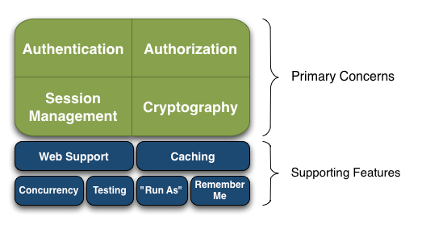

# 1.权限管理

##  什么是权限管理

- 基本上涉及到用户的系统都需要权限管理。

- 权限管理属于系统安全的范畴。

- 权限管理实现**对用户访问系统的控制**，按照安全规则或者安全策略控制用户可以访问而且只能访问自己被授权的资源。

  

权限管理包括**身份认证**和**授权**，简称**认证授权**。对于需要访问控制资源的用户，首先经过身份认证，认证通过后，用户拥有资源的访问权限（授权）方可访问。


## 什么是身份认证

**身份认证，就是判断一个用户是否是合法用户的处理过程。**

最常用的简单身份认证方式：系统通过用户输入的用户名和口令，看是否与系统中存储的一致，来判断身份是否合法。对于采取指纹的系统，就出示指纹；对于硬件key等刷卡系统，则需要刷卡。


## 什么是授权

**授权，即访问控制，控制谁能访问哪些资源。**

主体进行身份认证后，需要分配权限方可访问系统的资源，对于某些资源没有权限是无法访问的。


# 2. shiro简介

## shiro是什么

- Apache Shiro 是 Java 的一个安全（权限）框架。

- Shiro 可以非常容易的开发出足够好的应用，其不仅可以用在 JavaSE 环境，也可以用在 JavaEE 环境。

- Shiro 可以完成：认证、授权、加密、会话管理、与Web 集成、缓存等。


## shiro有哪些功能



- Authentication:身份认证/登录，验证用户是不是拥有相应的身份

- Authorization:授权，即权限验证，验证某个已认证的用户是否拥有某个权限；即判断用户是否能进行什么操作，如：验证某个用户是否拥有某个角色。或者细粒度的验证某个用户对某个资源是否具有某个权限

- Session Management:会话管理，即用户登录后就是一次会话，在没有退出之前，它的所有信息都在会话中；会话可以是普通JavaSE环境，也可以是Web 环境的

- Cryptography:加密，保护数据的安全性，如密码加密存储到数据库，而不是明文存储

- Web Support:Web 支持，可以非常容易的集成到Web 环境

- Caching:缓存，比如用户登录后，其用户信息、拥有的角色/权限不必每次去查，这样可以提高效率

- Concurrency:Shiro支持多线程应用的并发验证，即如在一个线程中开启另一个线程，能把权限自动传播过去

- Testing:提供测试支持

- "Run As":允许一个用户假装为另一个用户（如果他们允许）的身份进行访问

- Remember Me:记住我，这个是非常常见的功能，即一次登录后，下次再来的话不用登录了


## shiro核心架构


- Subject：任何可以与应用交互的“用户”；
- SecurityManager：相当于SpringMVC中的DispatcherServlet；是Shiro的心脏；所有具体的交互都通过SecurityManager进行控制；它管理着所有Subject、且负责进行认证、授权、会话及缓存的管理。
- Authenticator：负责Subject 认证，是一个扩展点，可以自定义实现；可以使用认证策略（Authentication Strategy），即什么情况下算用户认证通过了；
- Authorizer：授权器、即访问控制器，用来决定主体是否有权限进行相应的操作；即控制着用户能访问应用中的哪些功能；
- Realm：可以有1 个或多个Realm，可以认为是安全实体数据源，即用于获取安全实体的；可以是JDBC 实现，也可以是内存实现等等；由用户提供；所以一般在应用中都需要实现自己的Realm；通过它来具体实现认证和授权
- SessionManager：管理Session 生命周期的组件；而Shiro并不仅仅可以用在Web 环境，也可以用在如普通的JavaSE环境
- SessionDAO：操作Session的
- CacheManager：缓存控制器，来管理如用户、角色、权限等的缓存的；因为这些数据基本上很少改变，放到缓存中后可以提高访问的性能
- Cryptography：密码模块，Shiro提高了一些常见的加密组件用于如密码加密/解密。


## shiro架构（外部）

从外部来看Shiro，即从应用程序角度的来观察如何使用Shiro完成工作


- Subject：应用代码直接交互的对象是Subject，也就是说Shiro的对外API 核心就是Subject。Subject 代表了当前“用户”，这个用户不一定是一个具体的人，与当前应用交互的任何东西都是Subject，如网络爬虫，机器人等；与Subject 的所有交互都会委托给SecurityManager；Subject 其实是一个门面，SecurityManager才是实际的执行者

- SecurityManager：安全管理器；即所有与安全有关的操作都会与SecurityManager交互；且其管理着所有Subject；可以看出它是Shiro的核心，它负责与Shiro的其他组件进行交互，它相当于SpringMVC中DispatcherServlet的角色

- Realm：Shiro从Realm 获取安全数据（如用户、角色、权限），就是说SecurityManager要验证用户身份，那么它需要从Realm 获取相应的用户进行比较以确定用户身份是否合法；也需要从Realm 得到用户相应的角色/权限进行验证用户是否能进行操作；可以把Realm 看成DataSource


# 3. shiro中的认证

**身份认证，就是判断一个用户是否是合法用户的处理过程。**

最常用的简单身份认证方式：系统通过用户输入的用户名和口令，看是否与系统中存储的一致，来判断身份是否合法。对于采取指纹的系统，就出示指纹；对于硬件key等刷卡系统，则需要刷卡。


## 关键对象

- **Subject**：主体

  访问系统的用户，主体可以是用户、程序等，进行认证的都称为主体。

- **Principal**：身份信息（相当于用户名）

  是主体用于身份认证的标识，标识必须具有**唯一性**，如用户名、邮箱、手机号等，一个主体可以有多个身份，但必须有一个主身份（Primary Principal）

- **credential**：凭证信息（相当于密码）

  是只有主体知道的安全信息，如密码、凭证等。


## 认证流程


## 认证的开发实现

1.引入配置文件

```xml
<!--shiro依赖-->
<dependency>
    <groupId>org.apache.shiro</groupId>
    <artifactId>shiro-core</artifactId>
    <version>1.5.3</version>
</dependency>
```

2.resources包下编写配置文件shiro.ini

```ini
[users]
xiaocheng=123
zhangsan=123456
lisi=789
```

这个配置文件在之后的学习中是不需要的，这里只是为了提供身份信息的数据，就不用连数据库了，方便学习。

3.测试

```java
public class TestAuthenticator {
    public static void main(String[] args) {

        //1.创建安全管理器
        DefaultSecurityManager securityManager = new DefaultSecurityManager();

        //2.给安全管理器设置realm，realm就是数据要去核对的地方，这里去配置文件核对
        //若要去数据库、nosql等核对数据，只需自己写一个realm
        securityManager.setRealm(new IniRealm("classpath:shiro.ini"));

        //3.给全局安全工具类设置安全管理器
        SecurityUtils.setSecurityManager(securityManager);

        //4. Subject 主体
        Subject subject = SecurityUtils.getSubject();

        //5.创建令牌
        UsernamePasswordToken token = new UsernamePasswordToken("xiaocheng", "123");

        try {
            System.out.println("认证状态：" + subject.isAuthenticated());
            subject.login(token);  //用户认证
            System.out.println("认证状态：" + subject.isAuthenticated());
        } catch (UnknownAccountException e) { //用户名不存在会抛出这个异常
            e.printStackTrace();
            System.out.println("用户名不存在");
        } catch (IncorrectCredentialsException e) {  //密码错误会抛这个异常
            e.printStackTrace();
            System.out.println("密码错误");
        }

    }
}
```


## 自定义realm

先读源码，可以发现SimpleAccountRealm这个类：


该类中的doGetAuthenticationInfo和doGetAuthorizationInfo实现了认证和授权，这两个方法都来自AuthorizingRealm类：


这里认证是从配置文件中读取数据的，如果想从数据库或者nosql中读取数据，只需要重写realm（继承AuthorizingRealm即可，AuthorizingRealm继承了AuthenticatingRealm）。


> 自定义realm

```java
public class CustomerRealm extends AuthorizingRealm {
    //授权
    @Override
    protected AuthorizationInfo doGetAuthorizationInfo(PrincipalCollection principalCollection) {
        return null;
    }

    //认证
    @Override
    protected AuthenticationInfo doGetAuthenticationInfo(AuthenticationToken token) throws AuthenticationException {
        //在token中获取用户名（身份信息）
        String principal = (String)token.getPrincipal();
        System.out.println(principal);
        //根据身份信息模拟查询数据库，获得相关数据（是否存在该用户）
        if ("xiaocheng".equals(principal)) { //如果存在
            //参数一：要传入的身份信息；参数二：数据库中获得的密码；参数三：当前realm的名字
            //密码的验证是自动进行的，会自动比较token中的密码和传入的密码是否相同
            SimpleAuthenticationInfo simpleAuthenticationInfo = new SimpleAuthenticationInfo(principal,"123",this.getName());
            return simpleAuthenticationInfo;
        }

        return null;
    }
}
```


测试：

```java
public class TestCustomerAuthenticator {
    public static void main(String[] args) {
        DefaultSecurityManager securityManager = new DefaultSecurityManager();
        securityManager.setRealm(new CustomerRealm());
        SecurityUtils.setSecurityManager(securityManager);
        Subject subject = SecurityUtils.getSubject();
        UsernamePasswordToken token = new UsernamePasswordToken("xiaocheng", "123");

        try {
            subject.login(token);
        } catch (UnknownAccountException e) {
            e.printStackTrace();
            System.out.println("用户名不存在");
        } catch (IncorrectCredentialsException e) {
            e.printStackTrace();
            System.out.println("密码错误");
        }
    }
}
```


## 使用MD5和Salt

### 流程


为了保证安全，密码一般不会明文存储。

- 注册时，密码会进行加密，再存入数据库
- 登陆时，就不能直接用明文去比较密码了，而是用注册时的加密算法加密后去数据库比较


### md5算法使用

```java
public class TestMD5 {
    public static void main(String[] args) {

        //使用md5加密
        Md5Hash md5Hash = new Md5Hash("123");
        String s = md5Hash.toHex();  //生成123通过md5加密后的密码
        System.out.println(s);

        //使用md5 + salt 加密
        //参数二就是salt，随机写入一些字符串，会自动加到“123”后面
        Md5Hash md5Hash1 = new Md5Hash("123", "X0*7ps");
        System.out.println(md5Hash1.toHex());

        //使用md5 + salt + hash散列 加密
        Md5Hash md5Hash2 = new Md5Hash("123", "X0*7ps", 1024);
        System.out.println(md5Hash2.toHex());

    }
}
```

### shiro中的使用

一句话来说明：**只需给Realm设置凭证匹配器即可。**

> md5

```java
/**
 * 自定义realm 加入md5 + salt + hash散列
 */
public class CustomerMD5Realm extends AuthorizingRealm {
    @Override
    protected AuthorizationInfo doGetAuthorizationInfo(PrincipalCollection principalCollection) {
        return null;
    }

    @Override
    protected AuthenticationInfo doGetAuthenticationInfo(AuthenticationToken token) throws AuthenticationException {
        //在token中获取用户名（身份信息）
        String principal = (String)token.getPrincipal();
        System.out.println(principal);
        
        //根据身份信息模拟查询数据库，获得相关数据（是否存在该用户）
        if ("xiaocheng".equals(principal)) { //如果存在
            
            //密码的验证是自动进行的，会自动比较token中的密码和数据库传入的密码是否相同
            //比较token中的密码和数据库传入的密码是否相同，是用凭证匹配器去比较的（credential凭证信息（相当于密码））
            //数据库中的密码用md5加密了 "123"用md5加密后：202cb962ac59075b964b07152d234b70
            //默认是用equals去比较，所以要设置凭证匹配器，这里用hash凭证（就可以用md5算法加密后去比较）
            HashedCredentialsMatcher credentialsMatcher = new HashedCredentialsMatcher();
            credentialsMatcher.setHashAlgorithmName("md5");//设置使用的算法名
            this.setCredentialsMatcher(credentialsMatcher); //设置凭证比较器
            
            return new SimpleAuthenticationInfo(
                    principal, //参数一：要传入的身份信息
                    "202cb962ac59075b964b07152d234b70", //参数二：数据库中获得的密码("123"用md5加密)
                    this.getName()); //参数三：当前realm的名字
        }
        return null;
    }
}
```

```java
/**
测试类
*/
public class TestCustomerMD5Authenticator {
    public static void main(String[] args) {
        DefaultSecurityManager securityManager = new DefaultSecurityManager();
        securityManager.setRealm(new CustomerMD5Realm());
        SecurityUtils.setSecurityManager(securityManager);
        
        Subject subject = SecurityUtils.getSubject();
        UsernamePasswordToken token = new UsernamePasswordToken("xiaocheng", "123");

        try {
            subject.login(token);
            System.out.println("登录成功！");
        } catch (UnknownAccountException e) {
            e.printStackTrace();
            System.out.println("用户名不存在");
        } catch (IncorrectCredentialsException e) {
            e.printStackTrace();
            System.out.println("密码错误");
        }
    }
}
```


> md5 + salt

```java
/**
 * 自定义realm 加入md5 + salt + hash散列
 */
public class CustomerMD5Realm extends AuthorizingRealm {
    @Override
    protected AuthorizationInfo doGetAuthorizationInfo(PrincipalCollection principalCollection) {
        return null;
    }

    @Override
    protected AuthenticationInfo doGetAuthenticationInfo(AuthenticationToken token) throws AuthenticationException {
        //在token中获取用户名（身份信息）
        String principal = (String)token.getPrincipal();
        System.out.println(principal);

        //根据身份信息模拟查询数据库，获得相关数据（是否存在该用户）
        if ("xiaocheng".equals(principal)) { //如果存在

            //密码的验证是自动进行的，会自动比较token中的密码和数据库传入的密码是否相同
            //比较token中的密码和数据库传入的密码是否相同，是用凭证匹配器去比较的（credential凭证信息（相当于密码））
            //数据库中的密码用md5加密了 "123"用md5+"X0*7ps"salt加密后：8a83592a02263bfe6752b2b5b03a4799
            //默认是用equals去比较，所以要设置凭证匹配器，这里用hash凭证（就可以用md5算法加密后去比较）
            HashedCredentialsMatcher credentialsMatcher = new HashedCredentialsMatcher();
            credentialsMatcher.setHashAlgorithmName("md5");//设置使用的算法名
            this.setCredentialsMatcher(credentialsMatcher); //设置凭证比较器

            return new SimpleAuthenticationInfo(
                    principal, //参数一：要传入的身份信息
                    "8a83592a02263bfe6752b2b5b03a4799", //参数二：数据库中获得的密码("123"用md5+"X0*7ps"salt加密)
                    ByteSource.Util.bytes("X0*7ps"), //参数三：注册时的随机盐
                    this.getName()); //参数四：当前realm的名字
        }
        return null;
    }
}
```

与上一个相比，只要在**SimpleAuthenticationInfo**中多一个参数就好！

测试类与上面相同。


> md5 + salt + 散列

```java
/**
 * 自定义realm 加入md5 + salt + hash散列
 */
public class CustomerMD5Realm extends AuthorizingRealm {
    @Override
    protected AuthorizationInfo doGetAuthorizationInfo(PrincipalCollection principalCollection) {
        return null;
    }

    @Override
    protected AuthenticationInfo doGetAuthenticationInfo(AuthenticationToken token) throws AuthenticationException {
        //在token中获取用户名（身份信息）
        String principal = (String)token.getPrincipal();
        System.out.println(principal);

        //根据身份信息模拟查询数据库，获得相关数据（是否存在该用户）
        if ("xiaocheng".equals(principal)) { //如果存在

            //密码的验证是自动进行的，会自动比较token中的密码和数据库传入的密码是否相同
            //比较token中的密码和数据库传入的密码是否相同，是用凭证匹配器去比较的（credential凭证信息（相当于密码））
            //数据库中的密码用md5加密了 "123"用md5+1024次散列+"X0*7ps"salt加密后：e4f9bf3e0c58f045e62c23c533fcf633
            //默认是用equals去比较，所以要设置凭证匹配器，这里用hash凭证（就可以用md5算法加密后去比较）
            HashedCredentialsMatcher credentialsMatcher = new HashedCredentialsMatcher();
            credentialsMatcher.setHashAlgorithmName("md5");//设置使用的算法
            credentialsMatcher.setHashIterations(1024); //设置散列的次数
            this.setCredentialsMatcher(credentialsMatcher); //设置凭证比较器

            return new SimpleAuthenticationInfo(
                    principal, //参数一：要传入的身份信息
                    "e4f9bf3e0c58f045e62c23c533fcf633", //参数二：数据库中获得的密码
                    ByteSource.Util.bytes("X0*7ps"), //参数三：注册时的随机盐
                    this.getName()); //参数四：当前realm的名字
        }
        return null;
    }
}
```

与上一个相比，只要在让**凭证匹配器多设置一个散列次数**（  **setHashIterations(1024)**  ）就好！

测试类与上面相同。


# 4. shiro中的授权

**授权，即访问控制，控制谁能访问哪些资源。**

主体进行身份认证后，需要分配权限方可访问系统的资源，对于某些资源没有权限是无法访问的。


## 关键对象

授权可以简单理解为who对what进行how操作。

- **who，即主体（Subject）：**主体需要访问系统中的资源。
- **what，即资源（Resource）：**如系统菜单、页面、按钮、类方法、系统商品信息等。资源包括**资源类型**和**资源实例**。商品信息是资源类型，类型为t01的商品为资源实例，编号为001的商品信息也是资源实例。
- **how，权限/许可（Permission）：**规定了主体对资源的操作许可，权限离开资源没有意义，如用户查询权限、用户添加权限、某个类方法的调用权限、编号为001用户的修改权限等，通过权限可以知道主体对哪些资源有哪些操作许可。


## 授权流程


## 授权方式

- **基于角色的访问控制**

  - RBAC基于角色的访问控制（Role-Based Access Control）是以角色为中心进行访问控制

    ```java
    if(subject.hasRole("admin")){
        //操作属于管理员的资源
        
    } else if(subject.hasRole("guest")){
        //操作属于游客的资源
    }
    ```

    

- **基于资源的访问控制**

  - RBAC基于资源的访问控制（Resource-Based Access Control）是以资源为中心进行访问控制

    ```java
    if(subject.isPermission("user:update:01")){ //资源实例
        //对01用户进行修改的权限
        
    } else if(subject.isPermission("user:update:*")){ //资源类型
        //对所有用户进行修改的权限
    }
    ```


## 权限字符串

权限字符串的规则：**资源标识符:操作:资源实例标识符**。意思是对哪类资源的那个实例具有什么操作，":"是分隔符，权限字符串可以使用"*"通配符。

例子：

- 创建用户权限：user:create，或user:create:*
- 修改实例001用户的权限：user:update:001
- 对001用户实例的所有权限：user:*:001


## 授权的开发实现


> shiro中授权编程的实现方式

- **编程式**

  ```java
  if(subject.hasRole("admin")){
      //有权限
  }else{
      //无权限
  }
  ```

- **注解式**

  ```java
  @RequiresRoles("admin")
  public void hello(){
      //有权限
  }
  ```

- **标签式**

  ```jsp
  <!- JSP页面通过标签完成 ->
  <shiro:hasRole name="admin">
  	<!- 有权限 ->
  </shiro:hasRole>
  
  Thymeleaf中使用shiro需要额外集成。
  ```


> 授权

```java
public class CustomerMD5Realm extends AuthorizingRealm {
    //授权
    @Override
    protected AuthorizationInfo doGetAuthorizationInfo(PrincipalCollection principalCollection) {

        //获得主身份信息，其实就是doGetAuthenticationInfo返回值中传入的身份信息
        String primaryPrincipal = (String) principalCollection.getPrimaryPrincipal();
        System.out.println(primaryPrincipal);

        SimpleAuthorizationInfo simpleAuthorizationInfo = new SimpleAuthorizationInfo();

        //根据身份信息，获取当前用户的角色信息  admin user  (通过查询数据库等实现)
        //将数据库中查询到的角色信息赋值给权限对象，可赋值多个
        simpleAuthorizationInfo.addRole("admin");
        simpleAuthorizationInfo.addRole("user");

        //根据身份信息，获取当前用户的权限信息 (通过查询数据库等实现)
        simpleAuthorizationInfo.addStringPermission("user:*:01");
        simpleAuthorizationInfo.addStringPermission("product:create");

        return simpleAuthorizationInfo;
    }

    @Override
    protected AuthenticationInfo doGetAuthenticationInfo(AuthenticationToken token) throws AuthenticationException {
        //在token中获取用户名（身份信息）
        String principal = (String)token.getPrincipal();

        //根据身份信息模拟查询数据库，获得相关数据（是否存在该用户）
        if ("xiaocheng".equals(principal)) { //如果存在

            //密码的验证是自动进行的，会自动比较token中的密码和数据库传入的密码是否相同
            //比较token中的密码和数据库传入的密码是否相同，是用凭证匹配器去比较的（credential凭证信息（相当于密码））
            //数据库中的密码用md5加密了 "123"用md5+"X0*7ps"salt加密后：8a83592a02263bfe6752b2b5b03a4799
            //默认是用equals去比较，所以要设置凭证匹配器，这里用hash凭证（就可以用md5算法加密后去比较）
            HashedCredentialsMatcher credentialsMatcher = new HashedCredentialsMatcher();
            credentialsMatcher.setHashAlgorithmName("md5");//设置使用的算法
            credentialsMatcher.setHashIterations(1024); //设置散列的次数
            this.setCredentialsMatcher(credentialsMatcher); //设置凭证比较器

            return new SimpleAuthenticationInfo(
                    principal, //参数一：要传入的身份信息
                    "e4f9bf3e0c58f045e62c23c533fcf633", //参数二：数据库中获得的密码("123"用md5+"X0*7ps"salt加密)
                    ByteSource.Util.bytes("X0*7ps"), //参数三：注册时的随机盐
                    this.getName()); //参数四：当前realm的名字
        }
        return null;
    }
}
```


```java
public class TestCustomerMD5Authenticator {
    public static void main(String[] args) {
        DefaultSecurityManager securityManager = new DefaultSecurityManager();
        securityManager.setRealm(new CustomerMD5Realm());
        SecurityUtils.setSecurityManager(securityManager);
        Subject subject = SecurityUtils.getSubject();
        UsernamePasswordToken token = new UsernamePasswordToken("xiaocheng", "123");

        try {
            subject.login(token);
            System.out.println("登录成功！");
        } catch (UnknownAccountException e) {
            e.printStackTrace();
            System.out.println("用户名不存在");
        } catch (IncorrectCredentialsException e) {
            e.printStackTrace();
            System.out.println("密码错误");
        }

        if (subject.isAuthenticated()) {

            //基于角色的权限控制
            boolean hasRole = subject.hasRole("admin"); //会进入doGetAuthorizationInfo方法去判断
            System.out.println(hasRole);  //true

            //基于多角色权限控制
            System.out.println(subject.hasAllRoles(Arrays.asList("admin", "user"))); //同时拥有两个权限,true

            //返回一个数组
            boolean[] booleans = subject.hasRoles(Arrays.asList("admin", "user", "guest"));
            for (boolean aBoolean : booleans) {
                System.out.println(aBoolean); //true,true,false
            }

            //================================================================
            System.out.println("=====================================");

            //基于资源的权限控制   权限字符串(资源标识符:操作:资源实例)
            boolean permitted = subject.isPermitted("user:update:01"); //同样会进入doGetAuthorizationInfo方法去判断
            System.out.println(permitted); //true

            System.out.println(subject.isPermitted("product:create:01"));//true
            System.out.println(subject.isPermitted("product:update"));//false

            //分别是否具有该权限
            boolean[] permitted1 = subject.isPermitted("user:*:01", "order:*:01");
            for (boolean b : permitted1) {
                System.out.println(b); //true false
            }

            //同时具有哪些权限
            System.out.println(subject.isPermittedAll("user:*:01", "product:create:*")); //true

        }
    }
}

```


## 总结

- 先认证，后授权
- 最开始**subject**需要拿到令牌（**token**），里面包含**principal**（用户名）和**credential**（密码）
- **subject.login(token)**，拿着令牌进入Realm的**doGetAuthenticationInfo**方法，根据令牌中的身份信息，进行用户认证
- 若密码进行了加密，让Realm设置一下**凭证匹配器**
- 若认证失败，退出系统；若成功，则可以去访问资源
- 若资源有访问权限限制，会让用户进行权限判断，看是否具有**身份权限**和**访问具体资源的权限**（hasRole（）以及isPermitted（））
- 执行**hasRole**或**isPermitted**时，会进入Realm的**doGetAuthorizationInfo**方法，授予用户数据库（或nosql等）中存储的权限，进行比较，看是否具有该权限
- 有权限可以去访问；没有就不能


# 5. SpringBoot整合Shiro

## 5.1整合思路


请求能否访问到SpringBoot项目，需要shiro进行认证和授权，这时候就需要一个过滤器，把认证失败或者没有权限的请求过滤掉。


## 5.2环境搭建---JSP

由于页面用的是jsp，所以搭建SpringBoot的jsp环境。

如何搭建呢？

1.创建一个springboot的web项目，在main目录下（java和resources的同级目录）新建webapp目录，在webapp目录下建立index.jsp页面：

```jsp
<%--    '!' + 'tab' 就可以生成下面的代码     --%>
<!doctype html>
<html lang="en">
<head>
    <meta charset="UTF-8">
    <meta name="viewport"
          content="width=device-width, user-scalable=no, initial-scale=1.0, maximum-scale=1.0, minimum-scale=1.0">
    <meta http-equiv="X-UA-Compatible" content="ie=edge">
    <title>Document</title>
</head>
<body>

    hello world

</body>
</html>
```

2.springboot项目默认使用的是thymeleaf，所以需要在配置文件中修改为jsp:

```properties
#项目运行的端口号
server.port=8080
#项目的访问路径
server.servlet.context-path=/shiro
#项目名称
spring.application.name=shiro

#指定前缀
spring.mvc.view.prefix=/
#指定后缀
spring.mvc.view.suffix=.jsp
```

3.引入jsp的依赖

```xml
<!--引入jsp解析依赖-->
<dependency>
    <groupId>org.apache.tomcat.embed</groupId>
    <artifactId>tomcat-embed-jasper</artifactId>
</dependency>

<dependency>
    <groupId>jstl</groupId>
    <artifactId>jstl</artifactId>
    <version>1.2</version>
</dependency>
```

4.启动项目


## 5.3 环境搭建---Shiro

1.引入shiro依赖

```xml
<!--引入shiro整合springboot依赖-->
<dependency>
    <groupId>org.apache.shiro</groupId>
    <artifactId>shiro-spring-boot-starter</artifactId>
    <version>1.5.3</version>
</dependency>
```

2.login.jsp，为公共页面，大家都可以访问

```jsp
<%@page contentType="text/html; utf-8" pageEncoding="utf-8" isELIgnored="false" %>  <%--解决乱码问题--%>
<!doctype html>
<html lang="en">
<head>
    <meta charset="UTF-8">
    <meta name="viewport"
          content="width=device-width, user-scalable=no, initial-scale=1.0, maximum-scale=1.0, minimum-scale=1.0">
    <meta http-equiv="X-UA-Compatible" content="ie=edge">
    <title>Document</title>
</head>
<body>
    <h1>用户登录页（公共资源）</h1>
</body>
</html>
```

3.index.jsp，为受限资源，认证后才能访问

```jsp
<%@page contentType="text/html; utf-8" pageEncoding="utf-8" isELIgnored="false" %> <%--解决乱码问题--%>
<!doctype html>
<html lang="en">
<head>
    <meta charset="UTF-8">
    <meta name="viewport"
          content="width=device-width, user-scalable=no, initial-scale=1.0, maximum-scale=1.0, minimum-scale=1.0">
    <meta http-equiv="X-UA-Compatible" content="ie=edge">
    <title>Document</title>
</head>
<body>

    <h1>系统主页v1.0（受限资源）</h1>

    <ul>
        <li><a href="">用户管理</a> </li>
        <li><a href="">商品管理</a> </li>
        <li><a href="">订单管理</a> </li>
        <li><a href="">物流管理</a> </li>
    </ul>

</body>
</html>
```

4.自定义Realm

```java
public class CustomerRealm extends AuthorizingRealm {
    @Override
    protected AuthorizationInfo doGetAuthorizationInfo(PrincipalCollection principalCollection) {
        return null;
    }

    @Override
    protected AuthenticationInfo doGetAuthenticationInfo(AuthenticationToken authenticationToken) throws AuthenticationException {
        return null;
    }
}
```

5.编写shiro的配置类

```java
@Configuration
public class ShiroConfig {
    
    //1.创建ShiroFilter，用于拦截所有请求
    @Bean
    public ShiroFilterFactoryBean getShiroFilterFactoryBean(DefaultWebSecurityManager defaultWebSecurityManager) {
        ShiroFilterFactoryBean shiroFilterFactoryBean = new ShiroFilterFactoryBean();
        shiroFilterFactoryBean.setSecurityManager(defaultWebSecurityManager); //设置安全管理器

        //配置系统的受限资源
        HashMap<String, String> map = new HashMap<>();
        map.put("/index.jsp","authc"); //必须认证才能访问这个路径
        shiroFilterFactoryBean.setFilterChainDefinitionMap(map);
        
        //默认 认证界面 路径 （默认就为/login.jsp，可修改，一般就改为登录页的网址）
        //如果没有认证，请求会自动跳到这个页面
        shiroFilterFactoryBean.setLoginUrl("/login.jsp");

        return shiroFilterFactoryBean;
    }

    //2.创建安全管理器
    @Bean
    public DefaultWebSecurityManager getDefaultWebSecurityManager(@Qualifier("getRealm") Realm realm) {
        DefaultWebSecurityManager securityManager = new DefaultWebSecurityManager();
        securityManager.setRealm(realm); //给安全管理器设置Realm
        return securityManager;
    }

    //3.创建自定义realm
    @Bean
    public Realm getRealm() {
        return new CustomerRealm();
    }

}
```

- setFilterChainDefinitionMap()：设置受限资源
- setLoginUrl()：设置认证界面的网址


## 5.4 常见过滤器

**shiro提供了多个默认的过滤器，我们可以用这些过滤器来配置指定url的权限。**

| 过滤器缩写        | 功能                                                         |
| ----------------- | ------------------------------------------------------------ |
| **anno**          | 不需要认证就可以访问，开放权限，可以理解为匿名用户或游客     |
| **authc**         | **需要认证授权才能访问**。需要form表单登录，默认会从请求中获取username、password、rememberMe等参数并尝试登录，如果登录不了就会跳转到setLoginUrl配置的路径。 |
| authcBasic        | Basic HTTP身份验证拦截器                                     |
| logout            | 注销，访问url后会注销认证信息；推荐自己去写登出逻辑（subject.logout()） |
| noSessionCreation | 不创建会话连接器                                             |
| **perms**         | 参数可写多个，表示需要某个或某些权限才能通过，单个参数如perms[user:add]，多个参数时如 perms[user, admin]，当有多个参数时必须每个参数都通过才算通过 |
| port              | 端口拦截器.eg:port[80]                                       |
| rest              | rest风格拦截器                                               |
| **roles**         | 参数可写多个，表示是某个或某些角色才能通过，单个参数如role[administrator]，多个参数时如 roles[admin，user]，当有多个参数时必须每个参数都通过才算通过 |
| ssl               | ssl拦截器。通过https协议才能通过                             |
| **user**          | 用户拦截器。eg：登录后（authc），第二次没登陆但是有记住我(remmbner)都可以访问。 |

**anno和authc最常用！**


## 5.5 shiro中的认证

### 实现认证和退出

> login.jsp页面

```jsp
<%@page contentType="text/html; utf-8" pageEncoding="utf-8" isELIgnored="false" %>  <%--解决乱码问题--%>
<!doctype html>
<html lang="en">
<head>
    <meta charset="UTF-8">
    <meta name="viewport"
          content="width=device-width, user-scalable=no, initial-scale=1.0, maximum-scale=1.0, minimum-scale=1.0">
    <meta http-equiv="X-UA-Compatible" content="ie=edge">
    <title>Document</title>
</head>
<body>
    <h1>用户登录页（公共资源）</h1>
    <form action="${pageContext.request.contextPath}/user/login" method="post">
        用户名：<input type="text" name="username"><br/>
        密码：<input type="text" name="password"><br/>
        <input type="submit" value="登录">
    </form>
</body>
</html>
```

- 表单用于提交身份信息和凭证信息，提交到/user/login
- 注意属性的名字：username、password


>  index.jsp页面

```jsp
<%@page contentType="text/html; utf-8" pageEncoding="utf-8" isELIgnored="false" %> <%--解决乱码问题--%>
<!doctype html>
<html lang="en">
<head>
    <meta charset="UTF-8">
    <meta name="viewport"
          content="width=device-width, user-scalable=no, initial-scale=1.0, maximum-scale=1.0, minimum-scale=1.0">
    <meta http-equiv="X-UA-Compatible" content="ie=edge">
    <title>Document</title>
</head>
<body>

    <h1>系统主页v1.0（受限资源）</h1>
    <a href="${pageContext.request.contextPath}/user/logout">退出应用</a>
    <ul>
        <li><a href="">用户管理</a> </li>
        <li><a href="">商品管理</a> </li>
        <li><a href="">订单管理</a> </li>
        <li><a href="">物流管理</a> </li>
    </ul>

</body>
</html>
```

- 点击退出应用，会访问/user/logout


> Realm

```java
public class CustomerRealm extends AuthorizingRealm {
    @Override
    protected AuthorizationInfo doGetAuthorizationInfo(PrincipalCollection principalCollection) {
        System.out.println("授权");
        return null;
    }

    @Override
    protected AuthenticationInfo doGetAuthenticationInfo(AuthenticationToken token) throws AuthenticationException {
        String principal = (String) token.getPrincipal();
        if ("xiaocheng".equals(principal)) { //模拟数据库中有这条数据
            //假设根据身份信息从数据库中查出它的密码为123，密码为自己去校验
            return new SimpleAuthenticationInfo(principal,"123",this.getName());
        }
        return null;
    }
}
```

- 控制台没有输出”授权“，说明不会去执行doGetAuthorizationInfo（因为没有去判断是否有权限）
- 用户名：xiaocheng   密码：123   就会认证成功


> shiro配置类

```java
@Configuration
public class ShiroConfig {
    //1.创建ShiroFilter，用于拦截所有请求
    @Bean
    public ShiroFilterFactoryBean getShiroFilterFactoryBean(DefaultWebSecurityManager defaultWebSecurityManager) {
        ShiroFilterFactoryBean shiroFilterFactoryBean = new ShiroFilterFactoryBean();
        shiroFilterFactoryBean.setSecurityManager(defaultWebSecurityManager); //设置安全管理器

        //配置系统的受限资源
        HashMap<String, String> map = new HashMap<>();
        map.put("/order/save", "perms[order:*:*]"); //有order:*:*权限才能访问/order/save
        map.put("/user/login","anon"); //anon，设置为无需认证资源，必须写在所有路径资源的上面
        map.put("/**","authc"); //authc 必须认证才能访问这个路径;/**表示所有路径的资源，除了setLoginUrl()
        shiroFilterFactoryBean.setFilterChainDefinitionMap(map);

        //默认 认证界面 路径 （默认就为/login.jsp，可修改，一般就改为登录页的网址）
        //如果没有认证，请求会自动跳到这个页面
        shiroFilterFactoryBean.setLoginUrl("/login.jsp");
        //在这个类中，因为没权限（授权）而被拦截，就会走setUnauthorizedUrl
        shiroFilterFactoryBean.setUnauthorizedUrl("/login.jsp");

        return shiroFilterFactoryBean;
    }

    //2.创建安全管理器
    @Bean
    public DefaultWebSecurityManager getDefaultWebSecurityManager(@Qualifier("getRealm") Realm realm) {
        DefaultWebSecurityManager securityManager = new DefaultWebSecurityManager();
        securityManager.setRealm(realm); //给安全管理器设置Realm
        return securityManager;
    }

    //3.创建自定义realm
    @Bean
    public Realm getRealm() {
        return new CustomerRealm();
    }

}
```

- anon，无需认证即可访问，必须写在 所有路径资源都要认证 的上面
- authc，必须认证才能访问这个路径


> Controller

```java
@RequestMapping("user")
@Controller
public class UserController {

    @RequestMapping("logout")
    public String logoout() {
        Subject subject = SecurityUtils.getSubject();
        subject.logout(); //退出用户
        return "redirect:/login.jsp";
    }

    @RequestMapping("login")
    public String login(String username, String password) {
        //获得主体对象
        Subject subject = SecurityUtils.getSubject(); //SecurityManagement自动注入了

        try {
            subject.login(new UsernamePasswordToken(username, password));
            return "redirect:/index.jsp";
        } catch (UnknownAccountException e) {
            e.printStackTrace();
            System.out.println("用户名不存在");
        } catch (IncorrectCredentialsException e) {
            e.printStackTrace();
            System.out.println("密码错误");
        }
        return "redirect:/login.jsp";
    }

}
```

- /user/logout 登出，subject.logout()即可。
- /usr/login认证登入， subject.login()


###  MD5+Salt注册实现

**注册时，密码不能明文存储，需要加密后，存入数据库。**

> 步骤

1.导入连接数据库的依赖

```xml
<!--mybatis-->
<dependency>
    <groupId>org.mybatis.spring.boot</groupId>
    <artifactId>mybatis-spring-boot-starter</artifactId>
    <version>2.1.4</version>
</dependency>
<!--mysql-->
<dependency>
    <groupId>mysql</groupId>
    <artifactId>mysql-connector-java</artifactId>
    <version>5.1.49</version>
</dependency>
<!--druid-->
<dependency>
    <groupId>com.alibaba</groupId>
    <artifactId>druid</artifactId>
    <version>1.1.19</version>
</dependency>
```

2.建数据库shiro，和表t_user


- 主键采取自增策略。

3.配置文件连接数据库

```properties
#项目运行的端口号
server.port=8080
#项目的访问路径
server.servlet.context-path=/shiro
#项目名称
spring.application.name=shiro

#指定前缀
spring.mvc.view.prefix=/
#指定后缀
spring.mvc.view.suffix=.jsp

#数据库
spring.datasource.username=root
spring.datasource.password=1234567
spring.datasource.url=jdbc:mysql://localhost:3306/shiro?characterEncoding=utf-8&useUnicode=true&useSSL=true
spring.datasource.driver-class-name=com.mysql.jdbc.Driver
spring.datasource.type=com.alibaba.druid.pool.DruidDataSource
#mybatis
mybatis.type-aliases-package=com.ctstudy.entity
mybatis.mapper-locations=classpath:mybatis/mapper/*.xml
```

4.实体类

```java
@Data
@Accessors(chain = true)
@AllArgsConstructor
@NoArgsConstructor
public class User {
    private int id;
    private String username;
    private String password;
    private String salt;
}
```

 5.UserDao

```java
@Mapper
@Repository
public interface UserDao {
    void save(User user);
}
```

- @Mapper如果不加，则需要在启动类加@MapperScan("Dao包路径")

6.UserDaoMapper

```xml
<?xml version="1.0" encoding="UTF-8" ?>
<!DOCTYPE mapper
        PUBLIC "-//mybatis.org//DTD Mapper 3.0//EN"
        "http://mybatis.org/dtd/mybatis-3-mapper.dtd">
<mapper namespace="com.ctstudy.Dao.UserDao">
    <insert id="save" parameterType="User" useGeneratedKeys="true" keyProperty="id">
        insert into t_user values(#{id},#{username},#{password},#{salt})
    </insert>
</mapper>
```

- Springboot中 Mybatis 配置文件 Mapper参数：`useGeneratedKeys=“true”  keyProperty=“id”`
- useGeneratedKeys设置为 true 时，表示如果插入的表id以自增列为主键，则允许 JDBC 支持自动生成主键，并可将自动生成的主键id返回。
- useGeneratedKeys参数**只针对 insert 语句生效**，默认为 false。


7.UserService

```java
public interface UserService {
    void register(User user);
}
```

8.生成随机盐的工具类

```java
public class SaltUtils {
    /**
     * 生成n长度随机盐的工具类
     * @param n
     * @return
     */
    public static String getSalt(int n) {
        char[] chars = "ABCDEFGHIJKLMNOPQRSTUVWXYZabcdefghijklmnopqrstuvwxyz0123456789!@#$%^&*()".toCharArray();
        StringBuilder sb = new StringBuilder();//StringBuilder 非线程安全
        for (int i = 0; i < n; i++) {
            char aChar = chars[new Random().nextInt(chars.length)];
            sb.append(aChar);
        }
        return sb.toString();
    }
    
}
```

- StringBuilder 非线程安全，速度快；StringBuffer线程安全，速度较慢

9.UserServiceImpl

```java
@Service
@Transactional  //事务
public class UserServiceImpl implements UserService {

    @Autowired
    private UserDao userDao;

    @Override
    public void register(User user) {

        //1.生成随机盐
        String salt = SaltUtils.getSalt(8);
        //2。保存salt
        user.setSalt(salt);
        //3.明文密码进行md5+salt+散列 加密
        Md5Hash md5Hash = new Md5Hash(user.getPassword(), salt, 1024);
        user.setPassword(md5Hash.toHex());

        userDao.save(user);

    }
}
```

- @Transactional，使类中的每个方法都支持事务，如果保存失败抛出异常，则会回滚
- 明文密码加密后存入数据库
- 同时存入salt，用于登录认证时的比较验证

10.UserController

```java
@RequestMapping("user")
@Controller
public class UserController {

    @Autowired
    private UserService userService;

    /**
     * 用户注册
     * @param user
     * @return
     */
    @RequestMapping("register")
    public String register(User user) {
        try {
            userService.register(user);
            return "redirect:/login.jsp";
        } catch (Exception e) {
            e.printStackTrace();
            return "redirect:/register.jsp";  //注册失败的情况
        }
    }

    /**
     * 退出系统
     * @return
     */
    @RequestMapping("logout")
    public String logoout() {
        Subject subject = SecurityUtils.getSubject();
        subject.logout(); //退出用户
        return "redirect:/login.jsp";
    }

    /**
     * 登录
     * @param username
     * @param password
     * @return
     */
    @RequestMapping("login")
    public String login(String username, String password) {
        //获得主体对象
        Subject subject = SecurityUtils.getSubject(); //SecurityManagement自动注入了

        try {
            subject.login(new UsernamePasswordToken(username, password));
            return "redirect:/index.jsp";
        } catch (UnknownAccountException e) {
            e.printStackTrace();
            System.out.println("用户名不存在");
        } catch (IncorrectCredentialsException e) {
            e.printStackTrace();
            System.out.println("密码错误");
        }
        return "redirect:/login.jsp";
    }

}
```

- 用户注册时，要捕获一下异常，注意注册失败的逻辑

11.register.jsp

```jsp
<%@page contentType="text/html; utf-8" pageEncoding="utf-8" isELIgnored="false" %>  <%--解决乱码问题--%>
<!doctype html>
<html lang="en">
<head>
    <meta charset="UTF-8">
    <meta name="viewport"
          content="width=device-width, user-scalable=no, initial-scale=1.0, maximum-scale=1.0, minimum-scale=1.0">
    <meta http-equiv="X-UA-Compatible" content="ie=edge">
    <title>Document</title>
</head>
<body>
<h1>用户注册</h1>
<form action="${pageContext.request.contextPath}/user/register" method="post">
    用户名：<input type="text" name="username"><br/>
    密码：<input type="text" name="password"><br/>
    <input type="submit" value="注册">
</form>
</body>
</html>
```

12.ShiroConfig

```java
@Configuration
public class ShiroConfig {
    //1.创建ShiroFilter，用于拦截所有请求
    @Bean
    public ShiroFilterFactoryBean getShiroFilterFactoryBean(DefaultWebSecurityManager defaultWebSecurityManager) {
        ShiroFilterFactoryBean shiroFilterFactoryBean = new ShiroFilterFactoryBean();
        shiroFilterFactoryBean.setSecurityManager(defaultWebSecurityManager); //设置安全管理器

        //配置系统的受限资源
        HashMap<String, String> map = new HashMap<>();
        map.put("/user/register","anon");
        map.put("/register.jsp","anon");
        map.put("/user/login","anon"); //anon，设置为无需认证资源，必须写在所有路径资源的上面
        map.put("/**","authc"); //authc 必须认证才能访问这个路径;/**表示所有路径的资源，除了setLoginUrl()
        shiroFilterFactoryBean.setFilterChainDefinitionMap(map);

        //默认 认证界面 路径 （默认就为/login.jsp，可修改，一般就改为登录页的网址）
        //如果没有认证，请求会自动跳到这个页面
        shiroFilterFactoryBean.setLoginUrl("/login.jsp");

        return shiroFilterFactoryBean;
    }

    //2.创建安全管理器
    @Bean
    public DefaultWebSecurityManager getDefaultWebSecurityManager(@Qualifier("getRealm") Realm realm) {
        DefaultWebSecurityManager securityManager = new DefaultWebSecurityManager();
        securityManager.setRealm(realm); //给安全管理器设置Realm
        return securityManager;
    }

    //3.创建自定义realm
    @Bean
    public Realm getRealm() {
        return new CustomerRealm();
    }

}
```

- map.put("/user/register","anon"); map.put("/register.jsp","anon");

13.测试


- xiaocheng:123 ; root:123456 ; ct:123456
- 可以发现密码已经加密存储了


###  MD5+Salt认证实现


现在Realm里的认证逻辑，是模拟数据库的情况，所有现在要修改Realm，同时增加查询数据库的方法。


1.UserDao增加查询方法

```java
@Mapper
@Repository
public interface UserDao {
    void save(User user);

    User findByUsername(String username);
}
```

2.UserDaoMapper.xml

```xml
<?xml version="1.0" encoding="UTF-8" ?>
<!DOCTYPE mapper
        PUBLIC "-//mybatis.org//DTD Mapper 3.0//EN"
        "http://mybatis.org/dtd/mybatis-3-mapper.dtd">
<mapper namespace="com.ctstudy.Dao.UserDao">
    <insert id="save" parameterType="User" useGeneratedKeys="true" keyProperty="id">
        insert into t_user values(#{id},#{username},#{password},#{salt})
    </insert>

    <select id="findByUsername" resultType="User" parameterType="String">
        select * from shiro.t_user where username=#{username}
    </select>
</mapper>
```

3.UserService

```java
public interface UserService {
    //注册用户
    void register(User user);

    //用户用户名查询用户
    User findByUserName(String username);
}
```

4.UserServiceImpl

```java
@Override
public User findByUserName(String username) {
    return userDao.findByUsername(username);
}
```

5.Realm要想获得数据库的数据，就得用到UserServiceImpl。但是，由于目前CustomerRealm并没有进入IOC容器，所有不能直接注入UserServiceImpl对象。从下图中可以看出，左边没有绿色的叶子。


所有要获取IOC容器（Spring的应用上下文），可以写个工具类：

```java
@Component
public class ApplicationContextUtils implements ApplicationContextAware {
    private static ApplicationContext context;

    //springboot项目启动时，会自动把ioc容器注入
    @Override
    public void setApplicationContext(ApplicationContext applicationContext) throws BeansException {
        this.context = applicationContext;
    }

    public static Object getBean(String beanName) {
        return context.getBean(beanName);
    }
}
```

- ApplicationContext对象在学习spring之初就用到了（通过配置文件获得bean对象）
- 这里自定义Realm其实是可以使用@Autowired的，因为在ShiroConfig配置类中已经注入ioc容器了

6.编写自定义Realm：

```java
public class CustomerRealm extends AuthorizingRealm {
//    @Autowired
//    UserServiceImpl userService;

    @Override
    protected AuthorizationInfo doGetAuthorizationInfo(PrincipalCollection principalCollection) {
        System.out.println("授权");
        return null;
    }

    @Override
    protected AuthenticationInfo doGetAuthenticationInfo(AuthenticationToken token) throws AuthenticationException {

        //在ioc容器中拿到service对象
        UserService userService = (UserService) ApplicationContextUtils.getBean("userServiceImpl");

        String principal = (String) token.getPrincipal(); //获得身份信息
        User user = userService.findByUserName(principal);

        if (! ObjectUtils.isEmpty(user)) { //user不为null
            return  new SimpleAuthenticationInfo(
                    principal,  //传入身份信息
                    user.getPassword(), //密码，会去和token中的密码（凭证信息）通过凭证匹配器比较
                    ByteSource.Util.bytes(user.getSalt()), //salt
                    this.getName() //自定义Realm的名字
            );
        }
        return null;
    }
}
```

7.ShiroConfig中设置凭证匹配器

```java
@Bean
public Realm getRealm() {
    CustomerRealm realm = new CustomerRealm();

    //修改凭证匹配器。默认是equals去比较
    //数据库中的密码是加密的，token中的密码还是明文，所以要修改
    HashedCredentialsMatcher credentialsMatcher = new HashedCredentialsMatcher();
    credentialsMatcher.setHashAlgorithmName("MD5"); //设置加密算法为MD5
    credentialsMatcher.setHashIterations(1024); // 散列次数为1024
    realm.setCredentialsMatcher(credentialsMatcher);

    return realm;
}
```


## 5.6 授权的基本使用

### 在jsp标签中实现权限控制

1.CustomerRealm的doGetAuthorizationInfo方法：

```java
    @Override
    protected AuthorizationInfo doGetAuthorizationInfo(PrincipalCollection principalCollection) {
        //获取主身份信息
        String primaryPrincipal = (String) principalCollection.getPrimaryPrincipal();
        System.out.println("调用授权验证：" + primaryPrincipal);

        //根据主身份信息获取角色和权限信息
        if ("xiaocheng".equals(primaryPrincipal)) { 
            SimpleAuthorizationInfo simpleAuthorizationInfo = new SimpleAuthorizationInfo();

            simpleAuthorizationInfo.addRole("user");
            simpleAuthorizationInfo.addStringPermission("user:select:*"); //对用户模块查询所有资源的权限
            simpleAuthorizationInfo.addStringPermission("user:update:*");


            return simpleAuthorizationInfo;
        }

        return null;
    }
```

由于系统中的所有资源都没有进行权限限制，该方法目前还不会被调用。

2.index.jsp，指定角色权限才能访问具体资源

```jsp
<%@page contentType="text/html; utf-8" pageEncoding="utf-8" isELIgnored="false" %> <%--解决乱码问题--%>
<%@taglib prefix="shiro" uri="http://shiro.apache.org/tags" %>
<!doctype html>
<html lang="en">
<head>
    <meta charset="UTF-8">
    <meta name="viewport"
          content="width=device-width, user-scalable=no, initial-scale=1.0, maximum-scale=1.0, minimum-scale=1.0">
    <meta http-equiv="X-UA-Compatible" content="ie=edge">
    <title>Document</title>
</head>
<body>

    <h1>系统主页v1.0（受限资源）</h1>
    <a href="${pageContext.request.contextPath}/user/logout">退出应用</a>
    <ul>
        <shiro:hasAnyRoles name="admin,user">
            <li><a href="">用户管理</a>
                <ul>
                    <shiro:hasPermission name="user:add:*">
                        <li><a href="">添加</a> </li>
                    </shiro:hasPermission>
                    <shiro:hasPermission name="user:update:*">
                        <li><a href="">修改</a> </li>
                    </shiro:hasPermission>
                    <shiro:hasPermission name="user:select:*">
                        <li><a href="">查询</a> </li>
                    </shiro:hasPermission>
                    <shiro:hasPermission name="user:delete:*">
                        <li><a href="">删除</a> </li>
                    </shiro:hasPermission>
                </ul>
            </li>
            <li><a href="">商品管理</a> </li>
        </shiro:hasAnyRoles>
        <shiro:hasRole name="admin">  <%--只有拥有admin角色的用户才能访问--%>
            <li><a href="">订单管理</a> </li>
            <li><a href="">物流管理</a> </li>
        </shiro:hasRole>

    </ul>

</body>
</html>
```

- <%@taglib prefix="shiro" uri="http://shiro.apache.org/tags" %>引入头文件
- <shiro:hasRole name=" ">  </ shiro:hasAnyRoles >拥有具体角色的权限才能访问
- <shiro:hasPermission name=" ">  </ shiro:hasPermission>拥有具体资源的权限才能访问

3.测试，用xiaocheng认证登录


### Java代码中实现权限控制

```java
@Controller
@RequestMapping("order")
public class OrderController {

    @RequestMapping("save")
    public String save() {

        Subject subject = SecurityUtils.getSubject();
        if(subject.hasRole("admin")){
            System.out.println("执行保存订单操作");
        }else{
            System.out.println("无权访问");
        }
        //=================================================
        if (subject.isPermitted("order:save:*")) {
            System.out.println("执行保存订单操作");
        }else {
            System.out.println("无权访问");
        }

        return "redirect:/index.jsp";
    }
}
```

- subject.hasRole()
- subject.isPermitted()


### 注解实现权限控制

```java
@Controller
@RequestMapping("order")
public class OrderController {

    @RequestMapping("save")
    @RequiresRoles("admin") //如果要传多个角色，用string数组
    @RequiresPermissions("order:save:*")
    public String save() {
        //有admin角色的用户才能进入该方法
        System.out.println("执行保存操作");

        return "redirect:/index.jsp";
    }
}
```

- @RequiresRoles
-  @RequiresPermissions


### 授权数据持久化

> 数据库的库表结构


创建其它四张表，共五张：

```sql
CREATE DATABASE /*!32312 IF NOT EXISTS*/`shiro` /*!40100 DEFAULT CHARACTER SET utf8 */;

USE `shiro`;

/*Table structure for table `t_perms` */

DROP TABLE IF EXISTS `t_perms`;

CREATE TABLE `t_perms` (                 
  `id` int(6) NOT NULL AUTO_INCREMENT,
  `name` varchar(80) DEFAULT NULL,
  `url` varchar(255) DEFAULT NULL,
  PRIMARY KEY (`id`)
) ENGINE=InnoDB DEFAULT CHARSET=utf8;

/*Table structure for table `t_role` */

DROP TABLE IF EXISTS `t_role`;

CREATE TABLE `t_role` (
  `id` int(6) NOT NULL AUTO_INCREMENT,
  `name` varchar(60) DEFAULT NULL,
  PRIMARY KEY (`id`)
) ENGINE=InnoDB DEFAULT CHARSET=utf8;

/*Table structure for table `t_role_perms` */

DROP TABLE IF EXISTS `t_role_perms`;

CREATE TABLE `t_role_perms` (
  `id` int(6) NOT NULL AUTO_INCREMENT,
  `roleid` int(6) DEFAULT NULL,
  `permsid` int(6) DEFAULT NULL,
  PRIMARY KEY (`id`)
) ENGINE=InnoDB DEFAULT CHARSET=utf8;

/*Table structure for table `t_user` */

DROP TABLE IF EXISTS `t_user`;

CREATE TABLE `t_user` (
  `id` int(6) NOT NULL AUTO_INCREMENT,
  `username` varchar(40) DEFAULT NULL,
  `password` varchar(40) DEFAULT NULL,
  `salt` varchar(255) DEFAULT NULL,
  PRIMARY KEY (`id`)
) ENGINE=InnoDB AUTO_INCREMENT=4 DEFAULT CHARSET=utf8;

/*Table structure for table `t_user_role` */

DROP TABLE IF EXISTS `t_user_role`;

CREATE TABLE `t_user_role` (
  `id` int(6) NOT NULL AUTO_INCREMENT,
  `userid` int(6) DEFAULT NULL,
  `roleid` int(6) DEFAULT NULL,
  PRIMARY KEY (`id`)
) ENGINE=InnoDB DEFAULT CHARSET=utf8;
```

- t_user表：id, username, password, salt
- t_role表：id, name    [name表示角色名]
- t_perms表：id, name, url    [name表示权限字符串，url表示资源地址]

> 实体类

User

```java
@Data
@Accessors(chain = true)
@AllArgsConstructor
@NoArgsConstructor
public class User {
    private int id;
    private String username;
    private String password;
    private String salt;

    //定义角色集合
    private List<Role> roles;
}
```

Role

```java
@Data
@Accessors(chain = true)
@AllArgsConstructor
@NoArgsConstructor
public class Role {
    private int id;
    private String name;
    
    //定义权限的集合
    private List<Perms> perms;
}
```

perms

```java
@Data
@Accessors(chain = true)
@AllArgsConstructor
@NoArgsConstructor
public class Perms {
    private int id;
    private String name;
    private String url;
}
```

- 只需给三个实体提供实体类


#### Role角色信息实现

> 用户表添加数据：


- xiaocheng密码为123

- ct密码为123456

> 角色表添加数据


> 用户角色表添加数据


- xiaocheng用户有admin角色权限
- ct用户有user和product角色权限


> Userdao

```java
//根据用户名查询所有角色
User findRolesByUserName(String name);
```

> UserDaoMapper

```xml
<select id="findRolesByUserName" resultMap="userMap">
    SELECT u.id uid, u.username, r.id, r.name rname
    FROM t_user u
    LEFT JOIN t_user_role ur
    ON u.id=ur.userid
    LEFT JOIN t_role r
    ON ur.roleid=r.id
    WHERE u.username=#{username}
</select>
<resultMap id="userMap" type="User">
    <id property="id" column="uid"/>
    <result property="username" column="username"/>
    <collection property="roles" javaType="list" ofType="Role">
        <id property="id" column="id"/>
        <result property="name" column="rname"/>
    </collection>
</resultMap>
```

> UserService

```java
//根据用户名查询所有角色
User findRolesByUserName(String name);
```

> UserServiceImpl

```java
@Override
public User findRolesByUserName(String name) {
    return userDao.findRolesByUserName(name);
}
```

> CustomerRealm

```java
@Override
protected AuthorizationInfo doGetAuthorizationInfo(PrincipalCollection principalCollection) {
    //获取主身份信息
    String primaryPrincipal = (String) principalCollection.getPrimaryPrincipal();

    //在ioc容器中拿到service对象
    UserService userService = (UserService) ApplicationContextUtils.getBean("userServiceImpl");
    User user = userService.findRolesByUserName(primaryPrincipal);
    List<Role> roles = user.getRoles();

    //授权
    if(! CollectionUtils.isEmpty(roles)){
        SimpleAuthorizationInfo simpleAuthorizationInfo = new SimpleAuthorizationInfo();

        roles.forEach(role -> {  //消费型接口
            simpleAuthorizationInfo.addRole(role.getName());
        });

        return simpleAuthorizationInfo;
    }

    return null;
}
```

> index.jsp

```jsp
<%@page contentType="text/html; utf-8" pageEncoding="utf-8" isELIgnored="false" %> <%--解决乱码问题--%>
<%@taglib prefix="shiro" uri="http://shiro.apache.org/tags" %>
<!doctype html>
<html lang="en">
<head>
    <meta charset="UTF-8">
    <meta name="viewport"
          content="width=device-width, user-scalable=no, initial-scale=1.0, maximum-scale=1.0, minimum-scale=1.0">
    <meta http-equiv="X-UA-Compatible" content="ie=edge">
    <title>Document</title>
</head>
<body>

    <h1>系统主页v1.0（受限资源）</h1>
    <a href="${pageContext.request.contextPath}/user/logout">退出应用</a>
    <ul>
        <shiro:hasAnyRoles name="admin,user">
            <li><a href="">用户管理</a>
                <ul>
                    <shiro:hasPermission name="user:add:*">
                        <li><a href="">添加</a> </li>
                    </shiro:hasPermission>
                    <shiro:hasPermission name="user:update:*">
                        <li><a href="">修改</a> </li>
                    </shiro:hasPermission>
                    <shiro:hasPermission name="user:select:*">
                        <li><a href="">查询</a> </li>
                    </shiro:hasPermission>
                    <shiro:hasPermission name="user:delete:*">
                        <li><a href="">删除</a> </li>
                    </shiro:hasPermission>
                </ul>
            </li>
            <li><a href="">商品管理</a> </li>
        </shiro:hasAnyRoles>
        <shiro:hasRole name="admin">  <%--只有拥有admin角色的用户才能访问--%>
            <li><a href="">订单管理</a> </li>
            <li><a href="">物流管理</a> </li>
        </shiro:hasRole>

    </ul>

</body>
</html>
```

- xiaocheng有admin角色权限，可以看到全部
- ct有user和product角色权限，看不到订单管理和物流管理


#### Perm权限信息实现

>perms表添加数据


> t_role_perms表添加数据


- xiaocheng用户拥有admin角色，所以三种权限都有
- ct用户拥有user和product角色，所以有前两种权限


> Userdao

```java
//根据角色id查询权限信息
public List<Perms> findPermsByRoleId(int id);
```

> UserDaoMapper

```xml
<select id="findPermsByRoleId" resultType="Perms">
    select p.* from t_perms p
    inner join t_role_perms trp
    on p.id=trp.permsid
    where trp.roleid=#{id}
</select>
```

> UserService

```java
//根据角色id查询权限信息
public List<Perms> findPermsByRoleId(int id);
```

> UserServiceImpl

```java
@Override
public List<Perms> findPermsByRoleId(int id) {
    return userDao.findPermsByRoleId(id);
}
```

> CustomerRealm

```java
@Override
protected AuthorizationInfo doGetAuthorizationInfo(PrincipalCollection principalCollection) {
    //获取主身份信息
    String primaryPrincipal = (String) principalCollection.getPrimaryPrincipal();
    System.out.println("调用授权验证：" + primaryPrincipal);

    //在ioc容器中拿到service对象
    UserService userService = (UserService) ApplicationContextUtils.getBean("userServiceImpl");
    User user = userService.findRolesByUserName(primaryPrincipal);
    List<Role> roles = user.getRoles(); //获取角色信息

    //授权
    if(! CollectionUtils.isEmpty(roles)){
        SimpleAuthorizationInfo simpleAuthorizationInfo = new SimpleAuthorizationInfo();

        roles.forEach(role -> {  //消费型接口
            simpleAuthorizationInfo.addRole(role.getName());

            List<Perms> perms = userService.findPermsByRoleId(role.getId()); //每个角色信息对应的资源权限
            if (!CollectionUtils.isEmpty(perms)) {
                perms.forEach(perm -> {
                    simpleAuthorizationInfo.addStringPermission(perm.getName());
                });
            }
        });

        return simpleAuthorizationInfo;
    }

    return null;
}
```


## 5.7 Shrio缓存

- 缓存是在内存中的，所以读写极快
- 缓存的数据应该是读多、增删改极少的数据，因为增删改时，既要考虑数据库的数据又要考虑缓存中的数据，得不偿失
- 由于是在内存中，数据量要控制好，哪些数据要缓存，哪些不要，应该考虑好


### Shiro使用缓存流程


shiro中有个缓存管理器（cacheManager），默认是不开启的。只需要开启缓存管理器即可启用缓存。


### Ehcache实现缓存

shiro中默认使用的缓存就是Ehcache。

1.引入依赖

```xml
<!--引入shiro的ehcache-->
<dependency>
    <groupId>org.apache.shiro</groupId>
    <artifactId>shiro-ehcache</artifactId>
    <version>1.5.3</version>
</dependency>
```

2.在ShiroConfig注入Realm时开启缓存

```java
//3.创建自定义realm
@Bean
public Realm getRealm() {
    CustomerRealm realm = new CustomerRealm();

    //修改凭证匹配器。默认是equals去比较
    //数据库中的密码是加密的，token中的密码还是明文，所以要修改
    HashedCredentialsMatcher credentialsMatcher = new HashedCredentialsMatcher();
    credentialsMatcher.setHashAlgorithmName("MD5"); //设置加密算法为MD5
    credentialsMatcher.setHashIterations(1024); // 散列次数为1024
    realm.setCredentialsMatcher(credentialsMatcher);

    //开启缓存管理
    realm.setCacheManager(new EhCacheManager());
    realm.setCachingEnabled(true);//开启全局缓存
    realm.setAuthenticationCachingEnabled(true);//开启认证缓存
    realm.setAuthenticationCacheName("authenticationCache"); //设置认证缓存的名字
    realm.setAuthorizationCachingEnabled(true); //开启授权缓存
    realm.setAuthorizationCacheName("authorizationCache"); //设置授权缓存的名字

    return realm;
}
```

- 缓存功能就已经实现了！cacheManager会自动帮我们完成缓存操作。
- ehcache是本地缓存，是项目本身的内存。
- 分布式的缓存就要用redis


### redis实现缓存

1.引入redis依赖

```xml
<!--redis-->
<dependency>
    <groupId>org.springframework.boot</groupId>
    <artifactId>spring-boot-starter-data-redis</artifactId>
</dependency>
```

2.配置文件

```properties
#项目运行的端口号
server.port=8080
#项目的访问路径
server.servlet.context-path=/shiro
#项目名称
spring.application.name=shiro

#指定前缀
spring.mvc.view.prefix=/
#指定后缀
spring.mvc.view.suffix=.jsp

#数据库
spring.datasource.username=root
spring.datasource.password=1234567
spring.datasource.url=jdbc:mysql://localhost:3306/shiro?characterEncoding=utf-8&useUnicode=true&useSSL=true
spring.datasource.driver-class-name=com.mysql.jdbc.Driver
spring.datasource.type=com.alibaba.druid.pool.DruidDataSource
#mybatis
mybatis.type-aliases-package=com.ctstudy.entity
mybatis.mapper-locations=classpath:mybatis/mapper/*.xml

#日志
logging.level.com.ctstudy.Dao=debug


#redis配置
spring.redis.port=6379
spring.redis.host=localhost
spring.redis.database=0
```

3.要实现redis的缓存，就得自己写一个redis的缓存管理器（上面用的是已经实现了的Ehcache缓存管理器）：

```java
//自定义缓存管理器
public class RedisCacheManager implements CacheManager {

    //参数cacheName：认证缓存或授权缓存的统一名称（在Realm中设置的名称）
    @Override
    public <K, V> Cache<K, V> getCache(String cacheName) throws CacheException {
        System.out.println(cacheName);
        return null;
    }
}
```

可以发现，真正去实现缓存的是Cache接口，所以要实现redis的Cache类。

4.自定义redis缓存实现Cache：

```java
public class RedisCache<K,V> implements Cache<K,V> {

    private String cacheName;

    public RedisCache(String cacheName) {
        this.cacheName = cacheName;
    }

    public RedisCache() {

    }

    @Override
    public V get(K k) throws CacheException {
        return (V) getRedisTemplate().opsForHash().get(cacheName,k.toString());
    }

    @Override
    public V put(K k, V v) throws CacheException {

        getRedisTemplate().opsForHash().put(cacheName,k.toString(),v);
        return null;
    }

    @Override
    public V remove(K k) throws CacheException {
        return (V) getRedisTemplate().opsForHash().delete(cacheName,k.toString());
    }

    @Override
    public void clear() throws CacheException {
        getRedisTemplate().delete(cacheName);
    }

    @Override
    public int size() {
        return getRedisTemplate().opsForHash().size(cacheName).intValue();
    }

    @Override
    public Set<K> keys() {
        return getRedisTemplate().opsForHash().keys(cacheName);
    }

    @Override
    public Collection<V> values() {
        return getRedisTemplate().opsForHash().values(cacheName);
    }

    private RedisTemplate getRedisTemplate() {
        RedisTemplate redisTemplate = (RedisTemplate) ApplicationContextUtils.getBean("redisTemplate");
        redisTemplate.setKeySerializer(new StringRedisSerializer());
        redisTemplate.setHashKeySerializer(new StringRedisSerializer());
        return redisTemplate;
    }
}	
```

5.实现缓存管理器

```java
//自定义缓存管理器
public class RedisCacheManager implements CacheManager {

    //参数cacheName：认证缓存或授权缓存的统一名称（在Realm中设置的名称）
    @Override
    public <K, V> Cache<K, V> getCache(String cacheName) throws CacheException {
        System.out.println(cacheName);
        return new RedisCache<K,V>(cacheName);
    }
}
```

6.将缓存管理器设置进Realm

```java
//3.创建自定义realm
@Bean
public Realm getRealm() {
    CustomerRealm realm = new CustomerRealm();

    //修改凭证匹配器。默认是equals去比较
    //数据库中的密码是加密的，token中的密码还是明文，所以要修改
    HashedCredentialsMatcher credentialsMatcher = new HashedCredentialsMatcher();
    credentialsMatcher.setHashAlgorithmName("MD5"); //设置加密算法为MD5
    credentialsMatcher.setHashIterations(1024); // 散列次数为1024
    realm.setCredentialsMatcher(credentialsMatcher);

    //开启缓存管理
    realm.setCacheManager(new RedisCacheManager()); //设置自定义的缓存管理器
    realm.setCachingEnabled(true);//开启全局缓存
    realm.setAuthenticationCachingEnabled(true);//开启认证缓存
    realm.setAuthenticationCacheName("authenticationCache"); //设置认证缓存的统一名称
    realm.setAuthorizationCachingEnabled(true); //开启授权缓存
    realm.setAuthorizationCacheName("authorizationCache"); //设置授权缓存的统一名称

    return realm;
}
```

7.由于Shiro官方提供的salt是SimpleByteSource没有序列化，启动还是会有报错，所以需要重写salt的类，实现序列化。只要进入SimpleByteSource类，把代码copy一下就好：

```java
//自定义salt实现，实现序列化接口
public class MyByteSource implements ByteSource,Serializable {
    private byte[] bytes;
    private String cachedHex;
    private String cachedBase64;

    public MyByteSource() {

    }

    public MyByteSource(byte[] bytes) {
        this.bytes = bytes;
    }

    public MyByteSource(char[] chars) {
        this.bytes = CodecSupport.toBytes(chars);
    }

    public MyByteSource(String string) {
        this.bytes = CodecSupport.toBytes(string);
    }

    public MyByteSource(ByteSource source) {
        this.bytes = source.getBytes();
    }

    public MyByteSource(File file) {
        this.bytes = (new MyByteSource.BytesHelper()).getBytes(file);
    }

    public MyByteSource(InputStream stream) {
        this.bytes = (new MyByteSource.BytesHelper()).getBytes(stream);
    }

    public static boolean isCompatible(Object o) {
        return o instanceof byte[] || o instanceof char[] || o instanceof String || o instanceof ByteSource || o instanceof File || o instanceof InputStream;
    }

    public byte[] getBytes() {
        return this.bytes;
    }

    public boolean isEmpty() {
        return this.bytes == null || this.bytes.length == 0;
    }

    public String toHex() {
        if (this.cachedHex == null) {
            this.cachedHex = Hex.encodeToString(this.getBytes());
        }

        return this.cachedHex;
    }

    public String toBase64() {
        if (this.cachedBase64 == null) {
            this.cachedBase64 = Base64.encodeToString(this.getBytes());
        }

        return this.cachedBase64;
    }

    public String toString() {
        return this.toBase64();
    }

    public int hashCode() {
        return this.bytes != null && this.bytes.length != 0 ? Arrays.hashCode(this.bytes) : 0;
    }

    public boolean equals(Object o) {
        if (o == this) {
            return true;
        } else if (o instanceof ByteSource) {
            ByteSource bs = (ByteSource)o;
            return Arrays.equals(this.getBytes(), bs.getBytes());
        } else {
            return false;
        }
    }

    private static final class BytesHelper extends CodecSupport {
        private BytesHelper() {
        }

        public byte[] getBytes(File file) {
            return this.toBytes(file);
        }

        public byte[] getBytes(InputStream stream) {
            return this.toBytes(stream);
        }
    }
}
```

8.在认证中，用自定义的salt类：

```java
    return  new SimpleAuthenticationInfo(
        principal,  //传入身份信息
        user.getPassword(), //密码，会去和token中的密码（凭证信息）通过凭证匹配器比较
        new MyByteSource(user.getSalt()), //salt
        this.getName() //自定义Realm的名字
    );
```

9.测试

xiaocheng和ct用户都登录后，redis中的数据：


用户退出后，redis会清除该用户的缓存（调用remove方法）。


### 图片验证码

1.开发登录页面login.jsp，加入验证码

```jsp
<body>
    <h1>用户登录页（公共资源）</h1>
    <form action="${pageContext.request.contextPath}/user/login" method="post">
        用户名：<input type="text" name="username"><br/>
        密码：<input type="text" name="password"><br/>
        请输入验证码：<input type="text" name="code"><br/>
        <input type="submit" value="登录">
    </form>
</body>
```

- /user/getImage请求会返回验证码的图片
- 用户输入的验证码会和用户名密码一起发到/user/login

2.controller中/user/getImage，返回验证码

```java
/**
     * 返回验证码的图片
     * @param session
     * @param response
     * @throws IOException
     */
@RequestMapping("getImage")
public void getImage(HttpSession session, HttpServletResponse response) throws IOException {
    //生成验证码
    String code = VerifyCodeUtils.generateVerifyCode(4);
    //验证码放入session中
    session.setAttribute("code",code);
    //验证码存入图片并将图片放入流中
    ServletOutputStream outputStream = response.getOutputStream();
    response.setContentType("image/png");
    VerifyCodeUtils.outputImage(220,60,outputStream,code);
}
```

- 验证码放入session中

- 验证码图片随着response流返回前端

- 验证码的工具类：

  ```java
  import javax.imageio.ImageIO;
  import java.awt.*;
  import java.awt.geom.AffineTransform;
  import java.awt.image.BufferedImage;
  import java.io.File;
  import java.io.FileOutputStream;
  import java.io.IOException;
  import java.io.OutputStream;
  import java.util.Arrays;
  import java.util.Random;
  
  public class VerifyCodeUtils{
  
      //使用到Algerian字体，系统里没有的话需要安装字体，字体只显示大写，去掉了1,0,i,o几个容易混淆的字符
      public static final String VERIFY_CODES = "23456789ABCDEFGHJKLMNPQRSTUVWXYZ";
      private static Random random = new Random();
  
      /**
       * 使用系统默认字符源生成验证码
       * @param verifySize    验证码长度
       * @return
       */
      public static String generateVerifyCode(int verifySize){
          return generateVerifyCode(verifySize, VERIFY_CODES);
      }
      /**
       * 使用指定源生成验证码
       * @param verifySize    验证码长度
       * @param sources   验证码字符源
       * @return
       */
      public static String generateVerifyCode(int verifySize, String sources){
          if(sources == null || sources.length() == 0){
              sources = VERIFY_CODES;
          }
          int codesLen = sources.length();
          Random rand = new Random(System.currentTimeMillis());
          StringBuilder verifyCode = new StringBuilder(verifySize);
          for(int i = 0; i < verifySize; i++){
              verifyCode.append(sources.charAt(rand.nextInt(codesLen)));
          }
          return verifyCode.toString();
      }
  
      /**
       * 生成随机验证码文件,并返回验证码值
       * @param w
       * @param h
       * @param outputFile
       * @param verifySize
       * @return
       * @throws IOException
       */
      public static String outputVerifyImage(int w, int h, File outputFile, int verifySize) throws IOException {
          String verifyCode = generateVerifyCode(verifySize);
          outputImage(w, h, outputFile, verifyCode);
          return verifyCode;
      }
  
      /**
       * 输出随机验证码图片流,并返回验证码值
       * @param w
       * @param h
       * @param os
       * @param verifySize
       * @return
       * @throws IOException
       */
      public static String outputVerifyImage(int w, int h, OutputStream os, int verifySize) throws IOException{
          String verifyCode = generateVerifyCode(verifySize);
          outputImage(w, h, os, verifyCode);
          return verifyCode;
      }
  
      /**
       * 生成指定验证码图像文件
       * @param w
       * @param h
       * @param outputFile
       * @param code
       * @throws IOException
       */
      public static void outputImage(int w, int h, File outputFile, String code) throws IOException{
          if(outputFile == null){
              return;
          }
          File dir = outputFile.getParentFile();
          if(!dir.exists()){
              dir.mkdirs();
          }
          try{
              outputFile.createNewFile();
              FileOutputStream fos = new FileOutputStream(outputFile);
              outputImage(w, h, fos, code);
              fos.close();
          } catch(IOException e){
              throw e;
          }
      }
  
      /**
       * 输出指定验证码图片流
       * @param w
       * @param h
       * @param os
       * @param code
       * @throws IOException
       */
      public static void outputImage(int w, int h, OutputStream os, String code) throws IOException{
          int verifySize = code.length();
          BufferedImage image = new BufferedImage(w, h, BufferedImage.TYPE_INT_RGB);
          Random rand = new Random();
          Graphics2D g2 = image.createGraphics();
          g2.setRenderingHint(RenderingHints.KEY_ANTIALIASING,RenderingHints.VALUE_ANTIALIAS_ON);
          Color[] colors = new Color[5];
          Color[] colorSpaces = new Color[] { Color.WHITE, Color.CYAN,
                  Color.GRAY, Color.LIGHT_GRAY, Color.MAGENTA, Color.ORANGE,
                  Color.PINK, Color.YELLOW };
          float[] fractions = new float[colors.length];
          for(int i = 0; i < colors.length; i++){
              colors[i] = colorSpaces[rand.nextInt(colorSpaces.length)];
              fractions[i] = rand.nextFloat();
          }
          Arrays.sort(fractions);
  
          g2.setColor(Color.GRAY);// 设置边框色
          g2.fillRect(0, 0, w, h);
  
          Color c = getRandColor(200, 250);
          g2.setColor(c);// 设置背景色
          g2.fillRect(0, 2, w, h-4);
  
          //绘制干扰线
          Random random = new Random();
          g2.setColor(getRandColor(160, 200));// 设置线条的颜色
          for (int i = 0; i < 20; i++) {
              int x = random.nextInt(w - 1);
              int y = random.nextInt(h - 1);
              int xl = random.nextInt(6) + 1;
              int yl = random.nextInt(12) + 1;
              g2.drawLine(x, y, x + xl + 40, y + yl + 20);
          }
  
          // 添加噪点
          float yawpRate = 0.05f;// 噪声率
          int area = (int) (yawpRate * w * h);
          for (int i = 0; i < area; i++) {
              int x = random.nextInt(w);
              int y = random.nextInt(h);
              int rgb = getRandomIntColor();
              image.setRGB(x, y, rgb);
          }
  
          shear(g2, w, h, c);// 使图片扭曲
  
          g2.setColor(getRandColor(100, 160));
          int fontSize = h-4;
          Font font = new Font("Algerian", Font.ITALIC, fontSize);
          g2.setFont(font);
          char[] chars = code.toCharArray();
          for(int i = 0; i < verifySize; i++){
              AffineTransform affine = new AffineTransform();
              affine.setToRotation(Math.PI / 4 * rand.nextDouble() * (rand.nextBoolean() ? 1 : -1), (w / verifySize) * i + fontSize/2, h/2);
              g2.setTransform(affine);
              g2.drawChars(chars, i, 1, ((w-10) / verifySize) * i + 5, h/2 + fontSize/2 - 10);
          }
  
          g2.dispose();
          ImageIO.write(image, "jpg", os);
      }
  
      private static Color getRandColor(int fc, int bc) {
          if (fc > 255)
              fc = 255;
          if (bc > 255)
              bc = 255;
          int r = fc + random.nextInt(bc - fc);
          int g = fc + random.nextInt(bc - fc);
          int b = fc + random.nextInt(bc - fc);
          return new Color(r, g, b);
      }
  
      private static int getRandomIntColor() {
          int[] rgb = getRandomRgb();
          int color = 0;
          for (int c : rgb) {
              color = color << 8;
              color = color | c;
          }
          return color;
      }
  
      private static int[] getRandomRgb() {
          int[] rgb = new int[3];
          for (int i = 0; i < 3; i++) {
              rgb[i] = random.nextInt(255);
          }
          return rgb;
      }
  
      private static void shear(Graphics g, int w1, int h1, Color color) {
          shearX(g, w1, h1, color);
          shearY(g, w1, h1, color);
      }
  
      private static void shearX(Graphics g, int w1, int h1, Color color) {
  
          int period = random.nextInt(2);
  
          boolean borderGap = true;
          int frames = 1;
          int phase = random.nextInt(2);
  
          for (int i = 0; i < h1; i++) {
              double d = (double) (period >> 1)
                      * Math.sin((double) i / (double) period
                      + (6.2831853071795862D * (double) phase)
                      / (double) frames);
              g.copyArea(0, i, w1, 1, (int) d, 0);
              if (borderGap) {
                  g.setColor(color);
                  g.drawLine((int) d, i, 0, i);
                  g.drawLine((int) d + w1, i, w1, i);
              }
          }
      }
  
      private static void shearY(Graphics g, int w1, int h1, Color color) {
  
          int period = random.nextInt(40) + 10; // 50;
  
          boolean borderGap = true;
          int frames = 20;
          int phase = 7;
          for (int i = 0; i < w1; i++) {
              double d = (double) (period >> 1)
                      * Math.sin((double) i / (double) period
                      + (6.2831853071795862D * (double) phase)
                      / (double) frames);
              g.copyArea(i, 0, 1, h1, 0, (int) d);
              if (borderGap) {
                  g.setColor(color);
                  g.drawLine(i, (int) d, i, 0);
                  g.drawLine(i, (int) d + h1, i, h1);
              }
          }
      }
  
      public static void main(String[] args) throws IOException{
          File dir = new File("C:\\Users\\ct\\Desktop/verifyCode");
          int w = 200, h = 80;
          for(int i = 0; i < 50; i++){
              String verifyCode = generateVerifyCode(4);
              File file = new File(dir, verifyCode + ".jpg");
              outputImage(w, h, file, verifyCode);
          }
      }
  }
  ```

- 放行/user/getImage请求

  

3.由于多了验证码，修改登录逻辑/user/login

```java
/**
     * 登录
     * @param username
     * @param password
     * @return
     */
@RequestMapping("login")
public String login(String username, String password, String code, HttpSession session) {

    //先进行验证码验证
    String code1 = (String) session.getAttribute("code");
    try {

        if (code1.equalsIgnoreCase(code)) { //不考虑大小写
            //验证码比较正确
            //获得主体对象
            Subject subject = SecurityUtils.getSubject(); //SecurityManagement自动注入了
            subject.login(new UsernamePasswordToken(username, password));
            return "redirect:/index.jsp";
        } else {
            throw new RuntimeException("验证码错误");
        }

    } catch (UnknownAccountException e) {
        e.printStackTrace();
        System.out.println("用户名不存在");
    } catch (IncorrectCredentialsException e) {
        e.printStackTrace();
        System.out.println("密码错误");
    } catch (Exception e) {
        e.printStackTrace();
        System.out.println(e.getMessage());
    }

    return "redirect:/login.jsp";
}
```

- 认证前先比较验证码是否正确

4.测试


## 6. shiro整合thymeleaf

1.导入依赖

```xml
<!--使用thymeleaf-->
<dependency>
    <groupId>org.springframework.boot</groupId>
    <artifactId>spring-boot-starter-thymeleaf</artifactId>
</dependency>

<!--shiro-thymeleaf整合-->
<dependency>
    <groupId>com.github.theborakompanioni</groupId>
    <artifactId>thymeleaf-extras-shiro</artifactId>
    <version>2.0.0</version>
</dependency>
```

2.配置文件

```properties
spring.thymeleaf.cache=false
```

3.页面中引入命名空间

```html
<html lang="en" xmlns:th="http://www.thymeleaf.org"
      xmlns:shiro="http://www.thymeleaf.org/thymeleaf-extras-shiro">
```

4.在ShiroConfig配置类中加入shiro方言处理

```java
// 注入ShiroDialect，用来整合 Shiro thymeleaf
@Bean
public ShiroDialect getShiroDialect() {
    return new ShiroDialect();
}
```

5.thymeleaf使用即可

```html
<body>
    <!--获取身份信息-->
    <span shiro:principal=""></span>
    
    <!--认证处理-->
    <span shiro:authenticated="">
        认证通过展示内容
    </span>
    
    <!--没有认证处理-->
    <span shiro:notAuthenticated="">
        没有认证通过展示内容
    </span>
    
    <!--授权角色-->
    <span shiro:hasRole="admin">
        this is admin
    </span>
    
    <!--资源授权-->
    <span shiro:hasPermission="order:*:01">
        具有用户模块权限
    </span>
</body>
```


