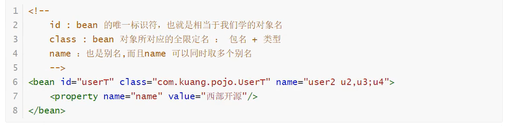
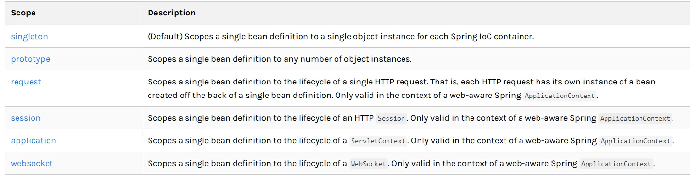
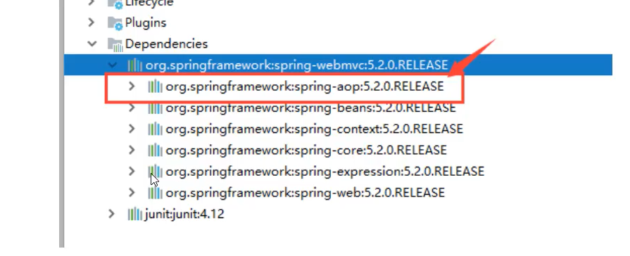
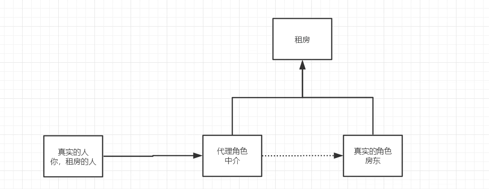
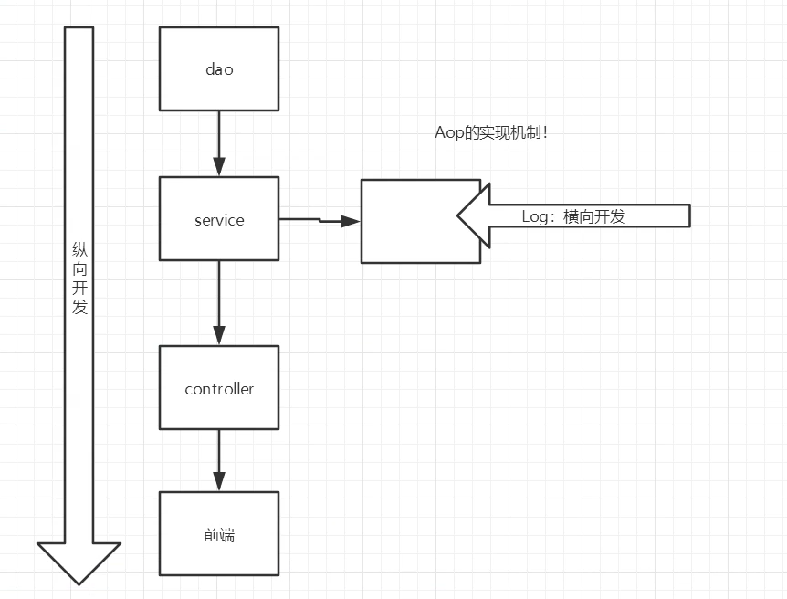

# Spring

## 1. IOC控制反转


## 2.HelloSpring

### 1.创建一个实体类（JavaBean）

```java
public class Hello {
    private String name;

    public Hello() {
    }

    public String getName() {
        return name;
    }

    public void setName(String name) {
        this.name = name;
    }

    @Override
    public String toString() {
        return "Hello{" +
                "name='" + name + '\'' +
                '}';
    }
}
```

### 2.配置文件进行配置

**相当于创建了一个Spring容器**

```xml
<?xml version="1.0" encoding="UTF-8"?>
<beans xmlns="http://www.springframework.org/schema/beans"
       xmlns:xsi="http://www.w3.org/2001/XMLSchema-instance"
       xsi:schemaLocation="http://www.springframework.org/schema/beans http://www.springframework.org/schema/beans/spring-beans.xsd">

    <!--
        spring中，bean就是一个对象
        id是对象名
        class是对象类型
        property是对象属性(用set方法)
        value是具体的值（基本数据类型和String）
        ref是spring中已经创建好的对象
    -->
    <bean id="hello" class="com.ct.dao.Hello">
        <property name="name" value="Spring"/>
    </bean>

</beans>
```

### 3.测试

```java
public class MyTest {
    public static void main(String[] args) {
        //获取spring的上下文对象,执行这行代码，xml中所有的bean都被实例化了
        ApplicationContext context = new ClassPathXmlApplicationContext("beans.xml");

        //我们的对象都在spring中管理了，要使用，就直接取出来
        Hello hello = (Hello) context.getBean("hello");
        System.out.println(hello.toString());

        Hello hello1 = (Hello) context.getBean("hello");
        System.out.println(hello == hello1); //true，默认单例
    }
}
```


## 3.创建对象的方式

1. 使用无参构造创建对象（默认）。

2. 用有参构造创建对象：

   - 下标赋值

     ```xml
     <bean id="user" class="com.ct.pojo.User">
             <constructor-arg index="0" value="ct"/>
     </bean>
     ```

   - 类型赋值 (几个参数有相同类型的话，会按照顺序进行赋值)

     ```xml
     <bean id="user" class="com.ct.pojo.User">
         <constructor-arg type="java.lang.String" value="ctt"/>
     </bean>
     ```

   - 直接通过参数名来设置

     ```xml
     <bean id="user" class="com.ct.pojo.User">
         <constructor-arg name="name" value="ct"/>
     </bean>
     ```

     

## 4.Spring配置

### 1.alias

```xml
<!-- 起了别名后，原来的名字也可以用 -->
<alias name="user" alias="u"/>
```

### 2. bean



### 3. import

import一般用于团队开发，可以将多个配置文件，合并为一个

```xml
<import resource="beans.xml"/>
<import resource="beans2.xml"/>
```


## 5. 依赖注入

对象中的属性注入（赋值）。


### 1. 构造器注入

前面已经用到了。


### 2. set方式注入【重点】

复杂类型：

```java
public class Address {
    private String address;

    public String getAddress() {
        return address;
    }

    public void setAddress(String address) {
        this.address = address;
    }
}
```

测试对象：

```java
public class Student {
    private String name;
    private Address address;
    private String[] books;
    private List<String> hobbies;
    private Map<String,String> card;
    private Set<String> games;
    private Properties info;
    private String wife;
    
    //还有get set方法，这里省略了
}
```

beans.xml:

```xml
<?xml version="1.0" encoding="UTF-8"?>
<beans xmlns="http://www.springframework.org/schema/beans"
       xmlns:xsi="http://www.w3.org/2001/XMLSchema-instance"
       xsi:schemaLocation="http://www.springframework.org/schema/beans http://www.springframework.org/schema/beans/spring-beans.xsd">

    <bean id="student" class="com.ct.pojo.Student">
        <!-- 1.普通值注入用value -->
        <property name="name" value="ct"/>

        <!--  2.bean注入，ref      -->
        <property name="address" ref="address"/>

        <!--  数组注入      -->
        <property name="books" >
            <array>
                <value>三国演义</value>
                <value>水浒传</value>
                <value>西游记</value>
                <value>红楼梦</value>
            </array>
        </property>

        <!--  list      -->
        <property name="hobbies">
            <list>
                <value>打游戏</value>
                <value>看电影</value>
                <value>吃饭</value>
            </list>
        </property>

        <!--   map     -->
        <property name="card">
            <map>
                <entry key="身份证" value="111111"></entry>
                <entry key="银行卡" value="1234567"></entry>
            </map>
        </property>

        <!--   set     -->
        <property name="games">
            <set>
                <value>lol</value>
                <value>bob</value>
                <value>coc</value>
            </set>
        </property>

        <!--    null    -->
        <property name="wife">
            <null/>
        </property>

        <!--   Properties     -->
        <property name="info">
            <props>
                <prop key="学号">18057788</prop>
                <prop key="性别">男</prop>
            </props>
        </property>

    </bean>

    <bean class="com.ct.pojo.Address" id="address">
        <property name="address" value="杭州"/>
    </bean>

</beans>
```

测试：

```java
public class MyTest {
    public static void main(String[] args) {
        ApplicationContext context = new ClassPathXmlApplicationContext("beans.xml");

        Student student = (Student) context.getBean("student");

        System.out.println(student.toString());
        /*
            Student{
                name='ct',
                address=Address{address='杭州'},
                books=[三国演义, 水浒传, 西游记, 红楼梦],
                hobbies=[打游戏, 看电影, 吃饭],
                card={身份证=111111, 银行卡=1234567},
                games=[lol, bob, coc],
                info={学号=18057788, 性别=男},
                wife='null'
            }
         */
    }
}
```


### 3. 扩展方式注入

- p命名空间
- c命名空间  

不能直接使用，需要导入xml约束：

```xml
xmlns:p="http://www.springframework.org/schema/p"
xmlns:c="http://www.springframework.org/schema/c"
```


```xml
<?xml version="1.0" encoding="UTF-8"?>
<beans xmlns="http://www.springframework.org/schema/beans"
       xmlns:xsi="http://www.w3.org/2001/XMLSchema-instance"
       xmlns:p="http://www.springframework.org/schema/p"
       xmlns:c="http://www.springframework.org/schema/c"
       xsi:schemaLocation="http://www.springframework.org/schema/beans http://www.springframework.org/schema/beans/spring-beans.xsd">

    <!--p命名空间注入，通过set方法注入，不用property标签-->
    <bean class="com.ct.pojo.User" id="user" p:age="10" p:name="ct"/>

    <!--c命名空间注入，通过构造器注入，不用constructor-args标签    -->
    <bean id="user2" class="com.ct.pojo.User" c:age="12" c:name="hh"/>

</beans>
```


## 6.bean的作用域



1. 单例模式（默认）：new ClassPathXmlApplicationContext("beans.xml")时，就创建好了一个，并且只有一个

   ```xml
   <bean id="user2" class="com.ct.pojo.User" c:age="12" c:name="hh" scope="singleton"/>
   ```

2. 原型模式：每次从容器中getbean的时候，都会产生一个新的对象

   ```xml
   <bean id="user2" class="com.ct.pojo.User" c:age="12" c:name="hh" scope="prototype"/>
   ```

3. 其余的在web中才能用


## 7.bean的自动装配

```java
public class People {
    private Cat cat;
    private Dog dog;
    private String name;
}
```

```xml
    <bean id="cat" class="com.ct.pojo.Cat"/>
    <bean id="dog" class="com.ct.pojo.Dog"/>

    <bean id="people" class="com.ct.pojo.People">
        <property name="name" value="kuang"/>
		<property name="cat" ref="cat"/>
        <property name="dog" ref="dog"/>
    </bean>
```


### ByName

```xml
<bean id="cat" class="com.ct.pojo.Cat"/>
<bean id="dog" class="com.ct.pojo.Dog"/>

<!--  byName：会自动在容器上下文中寻找，找到id与属性名(也可能是set方法的参数名)相同的bean，自动注入  -->
<bean id="people" class="com.ct.pojo.People" autowire="byType">
    <property name="name" value="kuang"/>
</bean>
```


### ByType

```xml
<bean  class="com.ct.pojo.Cat"/>
<bean id="dog" class="com.ct.pojo.Dog"/>

<!--  byType：会自动在容器上下文中寻找，找到和自己属性类型（也可能是set方法的参数类型）相同的bean，自动注入  -->
<bean id="people" class="com.ct.pojo.People" autowire="byType">
    <property name="name" value="kuang"/>
</bean>
```


## 8.注解实现自动装配

使用注解须知：

1. 导入约束：xmlns:context="http://www.springframework.org/schema/context"
2. 配置注解的支持：<context:annotation-config/ > 


**@Autowired**

- 直接在属性上使用！也可以在set方法上使用。

- 在属性上使用时，可以不用set方法，但是自动装配的属性需要在ioc（Spring）容器中存在，且符合byType或byName
- 先根据byType寻找，若有多个相同类型的bean，再根据byName寻找
- byName时，可以用注解 **@Qualifier("cat2")** 指定用来匹配的名字
- @resource()也可以实现相同功能，但是提示没有@Autowired厉害


```java
public class People {
    @Autowired
    @Qualifier("cat2")
    private Cat cat;

    @Resource(name="dog2")
    private Dog dog;
    
    private String name;
}
```

```xml
<?xml version="1.0" encoding="UTF-8"?>
<beans xmlns="http://www.springframework.org/schema/beans"
       xmlns:xsi="http://www.w3.org/2001/XMLSchema-instance"
       
       xmlns:context="http://www.springframework.org/schema/context"  //1
       
       xsi:schemaLocation="http://www.springframework.org/schema/beans
       http://www.springframework.org/schema/beans/spring-beans.xsd
                           
       http://www.springframework.org/schema/context                   //2
       http://www.springframework.org/schema/context/spring-context.xsd">

    <context:annotation-config/>                                     //3

    <bean id="cat2" class="com.ct.pojo.Cat"/>
    <bean id="cat1" class="com.ct.pojo.Cat"/>
    <bean id="dog2" class="com.ct.pojo.Dog"/>
    <bean id="dog1" class="com.ct.pojo.Dog"/>

    <bean id="people" class="com.ct.pojo.People"/>

</beans>
```


## 9.使用注解开发

- 在spring4之后，要使用注解开发，就必须保证aop的包导入了



- 使用注解需要导入context约束，增加注解的支持。

```xml
<?xml version="1.0" encoding="UTF-8"?>
<beans xmlns="http://www.springframework.org/schema/beans"
       xmlns:xsi="http://www.w3.org/2001/XMLSchema-instance"
       xmlns:context="http://www.springframework.org/schema/context"
       xsi:schemaLocation="http://www.springframework.org/schema/beans
       http://www.springframework.org/schema/beans/spring-beans.xsd
       http://www.springframework.org/schema/context
       http://www.springframework.org/schema/context/spring-context.xsd">

    <context:annotation-config/>
    <!-- 指定要扫描的包，该包下的注解就会生效-->
    <context:component-scan base-package="com.ct.pojo"/>

</beans>
```


1. **bean**

2. **属性如何注入**

   ```java
   // 等价于<bean id="user" class="com.ct.pojo.User"/>
   @Component
   public class User {
   
      //等价于<property name="name" value="ctt"/>
      @Value("ctt")
      public String name;
   
      //@Value("ctt") // 也可以在set方法上
      public void setName(String name) {
         this.name = name;
      }
   }
   ```

   

3. **衍生的注解**

   @Component有几个衍生的注解，它们功能一样，在web开发中，会按照mvc三层架构分层

   - dao  【@Repository】
   - service 【@Service】
   - controller 【@Controller】

4. **自动装配**

   - @Autowired  自动装配

     ​    如果名字对不上，加上 @Qualifier("XXX")

   - @Nullable   字段标注了这个注解，就可以为null

   - @Resource    自动装配

5. **作用域**

   - @Scope("singleton")
   - @Scope("prototype")
   
6. **小结**

   xml与注解：

   - xml更加万能，适用于任何场合，维护方便。适用与复杂装配
   - 注解维护相对复杂

   最佳实践：

   - xml负责管理bean
   - 注解负责完成属性的注入

   **记得开启注解的支持！**


## 10.使用Java的方式配置spring[重要]

完全不使用spring的xml配置文件，全权交给Java来做！

> 实体类

```java
public class User {
    private String name;

    @Override
    public String toString() {
        return "User{" +
                "name='" + name + '\'' +
                '}';
    }

    public String getName() {
        return name;
    }

    @Value("ct")
    public void setName(String name) {
        this.name = name;
    }
}
```


> 配置类（代替了applicationContext.xml）

```java
//这个配置类也会被spring容器托管，注册到容器中，因为它本身有@Component
//@Configuration表名这是一个配置类，相当于beans.xml
@Configuration
@ComponentScan("com.ct.pojo")  //可以将包中的组件（需要@Component）搜索进来，就不用@bean了
@Import(Config2.class)  //导入其它配置文件
public class KuangConfig {

    //注册了一个bean，相当于之前写的bean标签,id为方法名
    @Bean
    public User getUser() {
        return new User();
    }
}
```


> 测试类

```java
public class MyTest {
    public static void main(String[] args) {
        ApplicationContext context = new AnnotationConfigApplicationContext(KuangConfig.class);

        User user = context.getBean("getUser", User.class);

        System.out.println(user.getName());
    }
}
```


**这种纯Java的配置方式，在springboot中随处可见。**


## 11.代理模式




### 静态代理

1. 接口(需要去做的事情)

   ```java
   //租房
   public interface Rent {
       public void rent();
   }
   
   ```

2. 被代理的角色（实现了接口的任何对象）

   ```java
   //房东
   public class Host implements Rent{
   
       public void rent() {
           System.out.println("房东要出租房子");
       }
   }
   ```

3. 代理角色（同样实现了接口，帮助被代理对象去完成接口的事情以及额外的事情）

   ```java
   public class Proxy implements Rent{
       private Rent host;
   
       public Proxy(Host host) {
           this.host = host;
       }
   
       public void rent() {
           seeHouse();
           host.rent();
           fare();
       }
   
       public void seeHouse() {
           System.out.println("带你看房");
       }
       public void fare() {
           System.out.println("收费");
       }
   }
   
   ```

4. 客户（业务）

```java
public class Client {
    public static void main(String[] args) {
        Proxy proxy = new Proxy(new Host());
        proxy.rent();
    }
}
```


### 聊聊AOP




### 动态代理

```java
/**
*实现InvocationHandler接口的类，会用来自动生成代理类
*被代理类也要实现一个接口，用接口接收动态代理生成的类
*反射，方便处理大量的类
*/
public class DynamicProxy {
    public static void main(String[] args) {
        Boy boy = new Boy();
        InvocationHandler me = new ProxyBoy(boy);//进行代理


        /**
         * 第二步，用Proxy的静态方法 Proxy.newProxyInstance(loader, interfaces, h)
         * 第一个参数是实现InvocationHandler接口的类的类加载器
         * 第二个参数是被代理对象的接口
         * 第三个参数是实现InvocationHandler接口的类
         * 返回值是代理类
         */
        Birthday birth = (Birthday) Proxy.newProxyInstance(me.getClass().getClassLoader(), boy.getClass().getInterfaces(), me);

        birth.happyBirthday();
    }
}

interface Birthday{
    void happyBirthday();
}

class Boy implements Birthday{//被代理类
    @Override
    public void happyBirthday() {
        System.out.println("我过生日，生日快乐");
    }
}

class ProxyBoy implements InvocationHandler{

    private Object obj;//被代理对象

    ProxyBoy(Object obj){
        this.obj = obj;
    }

    @Override
    public Object invoke(Object proxy, Method method, Object[] args) throws Throwable {

        before();
        Object result = method.invoke(this.obj, args);
        after();

        return result;

    }//代理类

    private void after() {
        System.out.println("结束生日");
    }

    private void before() {
        System.out.println("准备生日");
    }

}
```


优点：

- 一个动态代理模板，可以给任意类使用
- 面向接口的，动态代理实现一个接口的功能扩充
- 代理类是动态生成的
- 无论接口中的方法有多少，都会自动帮你去完成，无需像静态代理一样，一个方法一个方法去扩充【动态】


## 12.AOP

使用AOP，需要导入依赖

```xml
<dependencies>
    <dependency>
        <groupId>org.aspectj</groupId>
        <artifactId>aspectjweaver</artifactId>
        <version>1.9.4</version>
    </dependency>
</dependencies>
```


准备：

```Java
//接口
public interface UserService {
    public void add();
    public void delete();
    public void update();
    public void query();
}
```

```java
//实现类
public class UserServiceImpl implements UserService {
    public void add() {
        System.out.println("增加");
    }

    public void delete() {
        System.out.println("删除");
    }

    public void update() {
        System.out.println("更新");
    }

    public void query() {
        System.out.println("查询");
    }
}
```


### 方式一：使用spring的api接口

```java
//方法执行前
public class Log implements MethodBeforeAdvice {

    /**
     *
     * @param method 被执行的目标对象的方法
     * @param args   方法参数
     * @param target  目标对象
     * @throws Throwable
     */
    public void before(Method method, Object[] args, Object target) throws Throwable {
        System.out.println(target.getClass().getName() + "的" + method.getName() + "执行了");
    }
}
```

```java
//方法执行后
public class AfterLog implements AfterReturningAdvice {
    public void afterReturning(Object returnValue, Method method, Object[] args, Object target) throws Throwable {
        System.out.println("执行了" + method.getName() + "方法，返回结果为" + returnValue);
    }
}
```

```xml
<?xml version="1.0" encoding="UTF-8"?>
<beans xmlns="http://www.springframework.org/schema/beans"
       xmlns:xsi="http://www.w3.org/2001/XMLSchema-instance"
       xmlns:aop="http://www.springframework.org/schema/aop"
       xsi:schemaLocation="http://www.springframework.org/schema/beans
       http://www.springframework.org/schema/beans/spring-beans.xsd
       http://www.springframework.org/schema/aop
       https://www.springframework.org/schema/aop/spring-aop.xsd">

    <bean id="userService" class="com.ct.service.UserServiceImpl"/>
    <bean id="log" class="com.ct.log.Log"/>
    <bean id="afterLog" class="com.ct.log.AfterLog"/>

    <!--方式一：使用原生的spring api接口    -->
    <!--配置aop，需要aop的约束   -->
    <aop:config>
        <!--切入点 expression:表达式 execution(里面格式一般就是这样)-->
        <aop:pointcut id="pointcut" expression="execution(* com.ct.service.UserServiceImpl.*(..))"/>

        <!--通知 advice-ref相当于要切入的东西，pointcut-ref相当于切入到哪-->
        <aop:advisor advice-ref="log" pointcut-ref="pointcut"/>
        <aop:advisor advice-ref="afterLog" pointcut-ref="pointcut"/>
    </aop:config>
    
</beans>
```

```java
//测试
public class MyTest {
    public static void main(String[] args) {
        ApplicationContext context = new ClassPathXmlApplicationContext("applicationContext.xml");

        //由于生成的动态代理类，所以只能用接口来接收
        UserService userService = context.getBean("userService", UserService.class);

        userService.add();
    }
}
```


### 方式二：自定义实现AOP（定义一个切面）

```java
//自定义一个切入面（类），里面的方法就是要添加的方法
public class DiyPointCut {
    public void before() {
        System.out.println("---------------------");
    }

    public void after() {
        System.out.println("=====================");
    }
}
```


```xml
<!--方式二：自定义类，没有方式一强大-->

<bean id="diy" class="com.ct.diy.DiyPointCut"/>

<aop:config>
    <!--自定义切面  ref要引用的类，类里是要加的方法-->
    <aop:aspect ref="diy">
        <!--切入点-->
        <aop:pointcut id="pointcut" expression="execution(* com.ct.service.UserServiceImpl.*(..))"/>
        <!--通知-->
        <aop:before method="before" pointcut-ref="pointcut"/>
        <aop:after method="after" pointcut-ref="pointcut"/>
    </aop:aspect>
</aop:config>
```


### 方式三：注解实现

```java
//同样需要定义一个切入面（类）
@Aspect
public class AnnotationPointCut {

    @Before("execution(* com.ct.service.UserServiceImpl.*(..))")
    public void before() {
        System.out.println("执行前");
    }

    @After("execution(* com.ct.service.UserServiceImpl.*(..))")
    public void after() {
        System.out.println("执行后");
    }

    //环绕，相当于invoke一样，方法执行前后都能添加
    @Around("execution(* com.ct.service.UserServiceImpl.*(..))")
    public void around(ProceedingJoinPoint proceedingJoinPoint) throws Throwable {
        System.out.println("环绕前");

        //执行方法
        Object proceed = proceedingJoinPoint.proceed();

        System.out.println("环绕后");
    }

}
```


```xml
<!--方式三-->
<bean id="annotationPointCut" class="com.ct.diy.AnnotationPointCut"/>
<!--开启注解支持-->
<aop:aspectj-autoproxy/>
```


## 13.整合Mybatis

步骤：

1. 导入相关依赖
   - junit
   - mybatis
   - mysql数据库
   - spring相关
   - aop织入
   - mybatis-spring
2. 编写配置文件
3. 测试


> 依赖

```xml
<dependencies>
    <dependency>
        <groupId>junit</groupId>
        <artifactId>junit</artifactId>
        <version>4.13</version>
    </dependency>
    <dependency>
        <groupId>mysql</groupId>
        <artifactId>mysql-connector-java</artifactId>
        <version>5.1.49</version>
    </dependency>
    <dependency>
        <groupId>org.mybatis</groupId>
        <artifactId>mybatis</artifactId>
        <version>3.5.3</version>
    </dependency>
    <dependency>
        <groupId>org.springframework</groupId>
        <artifactId>spring-webmvc</artifactId>
        <version>5.2.8.RELEASE</version>
    </dependency>
    <dependency>
        <groupId>org.springframework</groupId>
        <artifactId>spring-jdbc</artifactId>
        <version>5.2.8.RELEASE</version>
    </dependency>
    <dependency>
        <groupId>org.aspectj</groupId>
        <artifactId>aspectjweaver</artifactId>
        <version>1.9.4</version>
    </dependency>
    <dependency>
        <groupId>org.mybatis</groupId>
        <artifactId>mybatis-spring</artifactId>
        <version>2.0.2</version>
    </dependency>
    <dependency>
        <groupId>org.projectlombok</groupId>
        <artifactId>lombok</artifactId>
        <version>1.16.10</version>
    </dependency>
</dependencies>
```


mybatis必备：

```xml
<build>
    <resources>
        <resource>
            <directory>src/main/resources</directory>
            <includes>
                <include>**/*.properties</include>
                <include>**/*.xml</include>
            </includes>
            <filtering>true</filtering>
        </resource>
        <resource>
            <directory>src/main/java</directory>
            <includes>
                <include>**/*.properties</include>
                <include>**/*.xml</include>
            </includes>
            <filtering>true</filtering>
        </resource>
    </resources>
</build>
```


连接数据库可能需要解决时区问题：

```shell
set global time_zone = '+8:00'
```


xml中文报错问题：

```xml
<properties>
    <!-- 设置默认编码,在pom文件中设置 -->
    <project.build.sourceEncoding>UTF-8</project.build.sourceEncoding>
</properties>
```


### 回忆mybatis

1. 编写实体类
2. 编写核心配置文件
3. 编写接口
4. 编写mapper.xml
5. 测试


### mybatis-spring

1. 编写数据源
2. SqlSessionFactory
3. SqlSessionTemplate
4. 给接口加实现类
5. 将实现类注入spring中
6. 测试 


### 整合代码及顺序

> 1.编写实体类（对应是数据库的表）

```java
@Data
public class User {
    private int id;
    private String name;
    private String pwd;
}
```

> 2.mybatis的"核心"配置文件(可省略，很多的东西已经放在spring配置文件中了，它已经不核心了)

文件名：mybatis-config.xml

```xml
<?xml version="1.0" encoding="UTF-8" ?>
<!DOCTYPE configuration
        PUBLIC "-//mybatis.org//DTD Config 3.0//EN"
        "http://mybatis.org/dtd/mybatis-3-config.dtd">
<configuration>

    <typeAliases>
        <package name="com.ct.pojo"/>
    </typeAliases>

<!--    <settings>-->
<!--        <setting name="" value=""/>-->
<!--    </settings>-->

</configuration>
```

> 3. 接口

```java
public interface UserMapper {
    List<User> selectUser();
}
```

> 4.编写mapper.xml

文件名：UserMapper.xml

```xml
<?xml version="1.0" encoding="UTF-8" ?>
<!DOCTYPE mapper
        PUBLIC "-//mybatis.org//DTD Config 3.0//EN"
        "http://mybatis.org/dtd/mybatis-3-mapper.dtd">

<mapper namespace="com.ct.mapper.UserMapper">
    <select id="selectUser" resultType="user">
        select * from mybatis.user
    </select>

</mapper>
```

> 5.编写spring配置文件中的mybatis部分

1. 编写数据源
2. SqlSessionFactory
3. SqlSessionTemplate

文件名：mybaits-dao.xml

```xml
<?xml version="1.0" encoding="UTF-8"?>
<beans xmlns="http://www.springframework.org/schema/beans"
       xmlns:xsi="http://www.w3.org/2001/XMLSchema-instance"
       xsi:schemaLocation="http://www.springframework.org/schema/beans http://www.springframework.org/schema/beans/spring-beans.xsd">

    <!--使用spring的数据源替换mybatis配置中的环境设置  数据源有c3p0 dbcp  druid
    我们这里使用spring提供的
    -->
    <bean id="dataSource" class="org.springframework.jdbc.datasource.DriverManagerDataSource">
        <property name="driverClassName" value="com.mysql.jdbc.Driver"/>
        <property name="url" value="jdbc:mysql://localhost:3306/mybatis?useUnicode=true&amp;characterEncoding=utf-8&amp;useSSL=true"/>
        <property name="username" value="root"/>
        <property name="password" value="1234567"/>
    </bean>

    <!--用上面的数据源，创建SqlSessionFactory
    这里还可以加上原本mybatis配置文件中的其它设置，也可以直接绑定配置文件
    -->
    <bean id="sqlSessionFactory" class="org.mybatis.spring.SqlSessionFactoryBean">
        <property name="dataSource" ref="dataSource"/>
        <!--绑定mybatis的配置文件-->
        <property name="configLocation" value="classpath:mybatis-config.xml"/>
        <!--配置文件中的mapper可以在这里配置-->
        <property name="mapperLocations" value="classpath:com/ct/mapper/UserMapper.xml"/>
    </bean>

    <!--获取SqlSession
    SqlSessionTemplate:就是SqlSession，但是它线程安全
    -->
    <bean id="sqlSession" class="org.mybatis.spring.SqlSessionTemplate">
        <!--只能用构造器注入，因为它没有set方法-->
        <constructor-arg index="0" ref="sqlSessionFactory"/>
    </bean>

</beans>
```

> 6. 给接口加实现类，更符合spring风格

```java
public class UserMapperImpl implements UserMapper {
    private SqlSessionTemplate sqlSession;

    //注入
    public void setSqlSession(SqlSessionTemplate sqlSession) {
        this.sqlSession = sqlSession;
    }

    public List<User> selectUser() {
        //原本在测试中做的，现在封装到类中
        UserMapper mapper = sqlSession.getMapper(UserMapper.class);
        return mapper.selectUser();
    }
}
```

> 7. 完整的spring配置文件

文件名：applicationContext.xml

```xml
<?xml version="1.0" encoding="UTF-8"?>
<beans xmlns="http://www.springframework.org/schema/beans"
       xmlns:xsi="http://www.w3.org/2001/XMLSchema-instance"
       xsi:schemaLocation="http://www.springframework.org/schema/beans http://www.springframework.org/schema/beans/spring-beans.xsd">

    <import resource="mybaits-dao.xml"/>

    <bean id="userMapper" class="com.ct.mapper.UserMapperImpl">
        <property name="sqlSession" ref="sqlSession"/>
    </bean>

</beans>
```

> 8. 测试

```java
@Test
public void test() {
    ApplicationContext context = new ClassPathXmlApplicationContext("applicationContext.xml");
    UserMapperImpl userMapper = context.getBean("userMapper", UserMapperImpl.class);
    List<User> users = userMapper.selectUser();
    for (User user : users) {
        System.out.println(user);
    }
}
```


方式二

相比较于上述步骤，这个方式就是省略了spring容器中创建SqlSession的过程，直接在实现类中注入了SqlSessionFactory

```java
public class UserMapperImpl2 extends SqlSessionDaoSupport implements UserMapper {
    public List<User> selectUser() {
        //继承SqlSessionDaoSupport后，可以直接getSqlSession()
        //需要在spring中注入sqlSessionFactory
        return getSqlSession().getMapper(UserMapper.class).selectUser();
    }
}
```

```xml
<bean id="userMapper2" class="com.ct.mapper.UserMapperImpl2">
    <property name="sqlSessionFactory" ref="sqlSessionFactory"/>
</bean>
```


## 14.声明式事务

事务acid原则：

- 原子性
- 一致性
- 隔离性
- 持久性


- 声明式事务：AOP思想
- 编程式事务：在代码中，进行事务管理


核心就是xml的配置，注意导入tx和aop的依赖。

```xml
<!--配置声明式事务-->
<bean id="transactionManager" class="org.springframework.jdbc.datasource.DataSourceTransactionManager">
    <property name="dataSource" ref="dataSource"/> <!--上面有配置的数据源-->
</bean>

<!--结合aop实现事务的织入-->

<!--配置事务通入 advice  事务用tx-->
<tx:advice id="txAdvice" transaction-manager="transactionManager">
    <!--给指定的方法配置事务-->
    <!--事务的传播特性：propagation，默认是required，有七个参数-->
    <tx:attributes>
        <tx:method name="add" propagation="REQUIRED"/>
        <tx:method name="delete" propagation="REQUIRED"/>
        <tx:method name="update" propagation="REQUIRED"/>
        <tx:method name="query" propagation="REQUIRED"/>
        <tx:method name="*" propagation="REQUIRED"/>
    </tx:attributes>
</tx:advice>

<!--aop织入-->
<aop:config>
    <aop:pointcut id="txPointCut" expression="execution(* com.ct.mapper.*.*(..))"/>
    <aop:advisor pointcut-ref="txPointCut" advice-ref="txAdvice"/>
</aop:config>
```


