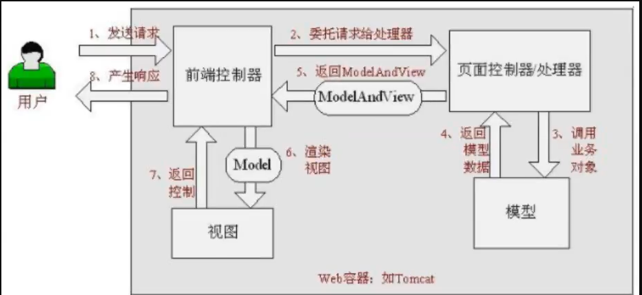
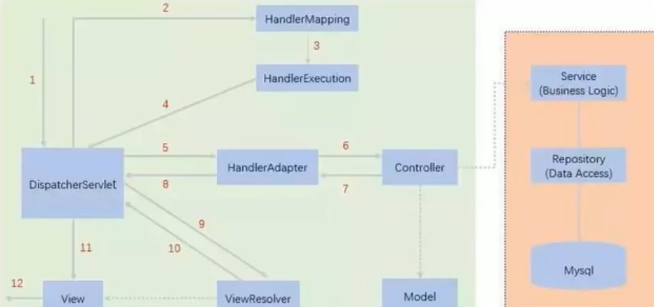
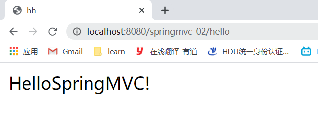
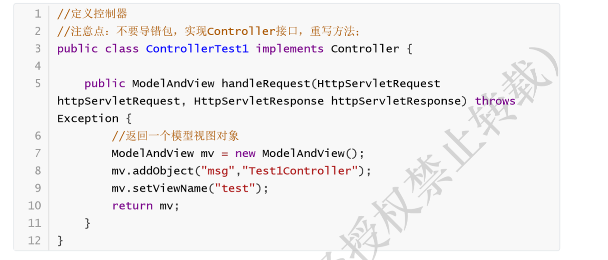
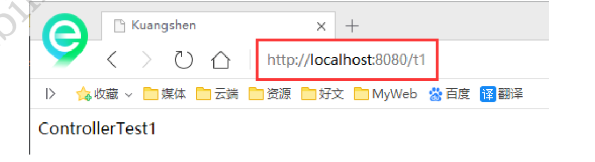
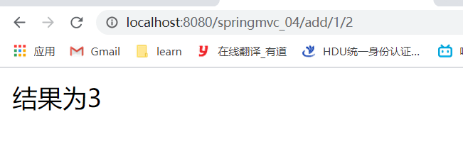
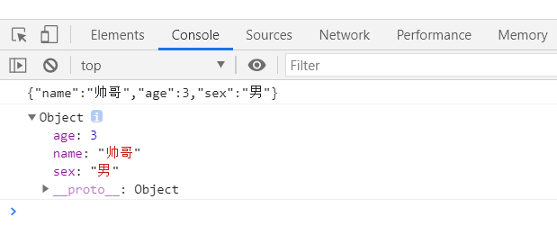
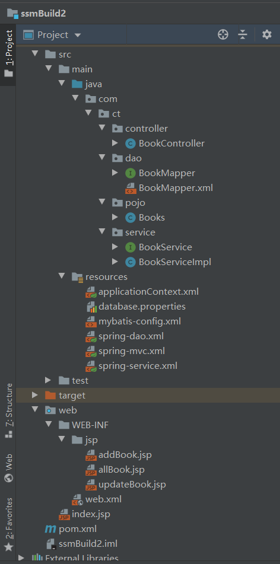

# springMVC

总pom文件的依赖：

```xml
<dependencies>
    <dependency>
        <groupId>junit</groupId>
        <artifactId>junit</artifactId>
        <version>4.13</version>
    </dependency>
    <dependency>
        <groupId>org.springframework</groupId>
        <artifactId>spring-webmvc</artifactId>
        <version>5.2.8.RELEASE</version>
    </dependency>
    <dependency>
        <groupId>javax.servlet</groupId>
        <artifactId>servlet-api</artifactId>
        <version>2.5</version>
    </dependency>
    <dependency>
        <groupId>javax.servlet.jsp</groupId>
        <artifactId>jsp-api</artifactId>
        <version>2.1</version>
    </dependency>
    <dependency>
        <groupId>javax.servlet</groupId>
        <artifactId>jstl</artifactId>
        <version>1.2</version>
    </dependency>
</dependencies>
```


## 1. 回顾MVC

### 什么是MVC

- MVC是视图、模型、控制器的简写，是一种软件设计规范。
- 通过业务逻辑、数据、显示分离的方法，组织代码。
- MVC降低了视图与业务逻辑间的双向耦合。
- MVC是一种架构模式。


**职责分析：**

**controller：控制器**

1. 取得表单的数据
2. 调用业务逻辑
3. 转向指定的页面

**model：模型**

1. 业务逻辑

2. 保存数据的状态

**view：视图**

​    显示页面。


### 回顾servlet

1. 用maven构建一个web项目

2. 导入依赖（前面总项目里已经有了）

3. 编写servlet类

   ```java
   public class HelloServlet extends HttpServlet {
       @Override
       protected void doGet(HttpServletRequest req, HttpServletResponse resp) throws ServletException, IOException {
           //1.获取前端参数
           String method = req.getParameter("method");
           if (method.equals("add")) {
               req.getSession().setAttribute("msg","执行了add方法");
           } else if (method.equals("delete")) {
               req.getSession().setAttribute("msg","执行了delete方法");
           }
           //2.调用业务层
           //3.请求转发或重定向
           req.getRequestDispatcher("/WEB-INF/jsp/test.jsp").forward(req,resp);
       }
   
       @Override
       protected void doPost(HttpServletRequest req, HttpServletResponse resp) throws ServletException, IOException {
           doGet(req,resp);
       }
   }
   ```

4. 在web.xml中注册servlet

   ```xml
   <?xml version="1.0" encoding="UTF-8"?>
   <web-app xmlns="http://xmlns.jcp.org/xml/ns/javaee"
            xmlns:xsi="http://www.w3.org/2001/XMLSchema-instance"
            xsi:schemaLocation="http://xmlns.jcp.org/xml/ns/javaee http://xmlns.jcp.org/xml/ns/javaee/web-app_4_0.xsd"
            version="4.0">
       
       <servlet>
           <servlet-name>hello</servlet-name>
           <servlet-class>com.ct.HelloServlet</servlet-class>
       </servlet>
       <servlet-mapping>
           <servlet-name>hello</servlet-name>
           <url-pattern>/hello</url-pattern>
       </servlet-mapping>
   
   <!--    <session-config>-->
   <!--        <session-timeout>15</session-timeout>-->
   <!--    </session-config>-->
   
   <!--    <welcome-file-list>-->
   <!--        <welcome-file>index.jsp</welcome-file>-->
   <!--    </welcome-file-list>-->
       
   </web-app>
   ```

5.  编写Hello.jsp，在WEB-INF目录下新建一个jsp的文件夹，新建hello.jsp

   ```jsp
   <%@ page contentType="text/html;charset=UTF-8" language="java" %>
   <html>
   <head>
       <title>Title</title>
   </head>
   <body>
   ${msg}
   </body>
   </html>
   ```

6. 启动tomcat，测试

   localhost:8080/user?method=add 

   localhost:8080/user?method=delete


## 2. 什么是springMVC

Spring MVC是Spring Framework的一部分，是基于Java实现MVC的轻量级Web框架。 

**Spring MVC的特点**：

1. 轻量级，简单易学 
2. 高效 , 基于请求响应的MVC框架 
3. 与Spring兼容性好，无缝结合 
4. 约定优于配置 
5. 功能强大：RESTful、数据验证、格式化、本地化、主题等 
6. 简洁灵活


**Spring的web框架围绕DispatcherServlet [ 调度Servlet ] 设计！**

**DispatcherServlet的作用是将请求分发到不同的处理器。从Spring 2.5开始，使用Java 5或者以上版本的 用户可以采用基于注解形式进行开发，十分简洁**

**Spring MVC框架像许多其他MVC框架一样, 以请求为驱动 , 围绕一个中心Servlet分派请求及提供其他功能，DispatcherServlet是一个实际的Servlet (它继承自HttpServlet 基类)。**


### SpringMVC执行原理


**简单解释：**

当发起请求时，被前置的控制器拦截到请求，根据请求参数生成代理请求，找到请求对应的实际控制器， 控制器处理请求，创建数据模型，访问数据库，将模型响应给中心控制器，控制器使用模型与视图渲染 视图结果，将结果返回给中心控制器，再将结果返回给请求者。




**SpringMVC的一个较完整的流程图，实线表示SpringMVC框架提供的技术，不需要开发者实现，虚线表示需要开发者实现：**



1. DispatcherServlet表示前置控制器，是整个SpringMVC的控制中心。用户发出请求， DispatcherServlet接收请求并拦截请求
2. HandlerMapping为处理器映射。DispatcherServlet调用HandlerMapping,HandlerMapping根据 请求url查找Handler。
3. HandlerExecution表示具体的Handler,其主要作用是根据url查找控制器，如上url被查找控制器 为：hello。
4. HandlerExecution将解析后的信息传递给DispatcherServlet,如解析控制器映射等。 
5. HandlerAdapter表示处理器适配器，其按照特定的规则去执行Handler。 
6. Handler让具体的Controller执行。 
7. Controller将具体的执行信息返回给HandlerAdapter,如ModelAndView。 
8. HandlerAdapter将视图逻辑名或模型传递给DispatcherServlet。 
9.  DispatcherServlet调用视图解析器(ViewResolver)来解析HandlerAdapter传递的逻辑视图名。 
10.  视图解析器将解析的逻辑视图名传给DispatcherServlet。 
11. DispatcherServlet根据视图解析器解析的视图结果，调用具体的视图。 
12.  最终视图呈现给用户


## 3.HelloSpring

### 3.1 配置文件版

**步骤：**

1.  新建一个Moudle ， springmvc-02-hello ， 添加web的支持！ 
2. 确定导入了依赖
3.  配置web.xml ， 注册DispatcherServlet
   - 为DispatcherServlet配置url，让所有的请求都经过DispatcherServlet进行分配
   - 关联一个SpringMVC的配置文件（ [servletname]-servlet.xml ），映射器、适配器、视图解析器等都在里面配置
4. 编写SpringMVC 的 配置文件（ [servletname]-servlet.xml ）
   -  添加 处理映射器
   - 添加 处理器适配器
   -  添加 视图解析器（用来寻找view，需要配置前缀后缀）
5. 编写要操作业务的Controller
   - 要么实现Controller接口，要么增加注解
   - 需要返回一个 ModelAndView，装数据，封视图
6.  将Controller交给SpringIOC容器，注册bean
   - id就是这个Controller的url
7.  写要跳转的jsp页面，显示ModelandView存放的数据，以及我们的正常页面
8. 配置Tomcat 启动测试


**可能遇到的问题（访问出现404）：**

1. 查看控制台输出，看一下是不是缺少了什么jar包
2. 如果jar包存在，显示无法输出，就在IDEA的项目发布中，添加lib依赖！ 
3. 重启Tomcat 即可解决！


> 配置web.xml ， 注册DispatcherServlet

```xml
<?xml version="1.0" encoding="UTF-8"?>
<web-app xmlns="http://xmlns.jcp.org/xml/ns/javaee"
         xmlns:xsi="http://www.w3.org/2001/XMLSchema-instance"
         xsi:schemaLocation="http://xmlns.jcp.org/xml/ns/javaee http://xmlns.jcp.org/xml/ns/javaee/web-app_4_0.xsd"
         version="4.0">

    <!--注册DispatcherServlet，请求分发器（前端控制器）-->
    <servlet>
        <servlet-name>springmvc</servlet-name>
        <servlet-class>org.springframework.web.servlet.DispatcherServlet</servlet-class>
        <!--绑定Spring的配置文件   [servlet-name]-servlet.xml（名字可以随意取）-->
        <init-param>
            <param-name>contextConfigLocation</param-name>
            <param-value>classpath:springmvc-servlet.xml</param-value>
        </init-param>
        <!--启动级别1：服务器已启动它就启动-->
        <load-on-startup>1</load-on-startup>
    </servlet>

    <!-- / 匹配所有的请求（不包括.jsp）  -->
    <!-- /* 匹配所有的请求（包括.jsp） -->
    <servlet-mapping>
        <servlet-name>springmvc</servlet-name>
        <url-pattern>/</url-pattern>
    </servlet-mapping>
    
</web-app>
```

> 编写SpringMVC 的 配置文件！名称：springmvc-servlet.xml : [servletname]-servlet.xml 
>
> 说明，这里的名称要求是按照官方来的

```xml
<?xml version="1.0" encoding="UTF-8"?> <beans xmlns="http://www.springframework.org/schema/beans"       xmlns:xsi="http://www.w3.org/2001/XMLSchema-instance"       xsi:schemaLocation="http://www.springframework.org/schema/beans        http://www.springframework.org/schema/beans/spring-beans.xsd">
    
</beans>
```

> 添加 处理映射器

```xml
<!--处理映射器 BeanNameUrlHandlerMapping(bean的name是它的url)-->
<bean class="org.springframework.web.servlet.handler.BeanNameUrlHandlerMapping"/>
```

> 添加 处理器适配器

```xml
<bean class="org.springframework.web.servlet.mvc.SimpleControllerHandlerAdapter"/>
```

> 添加 视图解析器

```xml
    <!--添加视图解析器：DispatchServlet会把ModelAndView给它，去找到视图（如.jsp）
		模板引擎：Thymeleaf FreeMarker
-->
    <bean class="org.springframework.web.servlet.view.InternalResourceViewResolver">
        <!--前缀-->
        <property name="prefix" value="/WEB-INF/jsp/"/>
        <!--后缀-->
        <property name="suffix" value=".jsp"/>
    </bean>
```

> 编写我们要操作业务Controller ，要么实现Controller接口，要么增加注解
>
> 需要返回一个 ModelAndView，装数据，封视图

```java
//先导入Controller接口，需要放回一个ModelAndView，装数据，封视图
public class HelloController implements Controller {
    public ModelAndView handleRequest(HttpServletRequest httpServletRequest,
                                      HttpServletResponse httpServletResponse) throws Exception {

        ModelAndView mv = new ModelAndView();

        //装数据
        mv.addObject("msg","HelloSpringMVC!");
        //封装要跳转的视图,在视图解析器中配置了路径
        mv.setViewName("hello"); //  /WEB-INF/jsp/hello.jsp

        return mv;

    }
}
```

> 将自己的类交给SpringIOC容器，注册bean

```xml
<bean id="/hello" class="com.ct.controller.HelloController"/>
```

>  写要跳转的jsp页面(hello.jsp)，显示ModelandView存放的数据，以及我们的正常页面

```jsp
<%@ page contentType="text/html;charset=UTF-8" language="java" %>
<html>
<head>
    <title>hh</title>
</head>
<body>
${msg}
</body>
</html>
```

> 启动tomcat测试



### 3.2 注解版

1. 新建一个Moudle，springmvc-03-hello-annotation 。添加web框架支持！ 建立包结构 com.kuang.controller

2. 由于Maven可能存在资源过滤的问题，我们将配置完善

   ```xml
   <build>
       <resources>
           <resource>
               <directory>src/main/resources</directory>
               <includes>
                   <include>**/*.properties</include>
                   <include>**/*.xml</include>
               </includes>
               <filtering>true</filtering>
           </resource>
           <resource>
               <directory>src/main/java</directory>
               <includes>
                   <include>**/*.properties</include>
                   <include>**/*.xml</include>
               </includes>
               <filtering>true</filtering>
           </resource>
       </resources>
   </build>
   ```

3. 在pom.xml文件引入相关的依赖：主要有Spring框架核心库、Spring MVC、servlet , JSTL等。我们 在父依赖中已经引入了

4. 配置web.xml

   - 注册DispatcherServlet 
   - 关联SpringMVC的配置文件 
   - 启动级别为1 
   - 映射路径为 / 【不要用/*，会404】

   ```xml
   <?xml version="1.0" encoding="UTF-8"?>
   <web-app xmlns="http://xmlns.jcp.org/xml/ns/javaee"
            xmlns:xsi="http://www.w3.org/2001/XMLSchema-instance"
            xsi:schemaLocation="http://xmlns.jcp.org/xml/ns/javaee http://xmlns.jcp.org/xml/ns/javaee/web-app_4_0.xsd"
            version="4.0">
   
       <!--注册DispatcherServlet，请求分发器（前端控制器）-->
       <servlet>
           <servlet-name>springmvc</servlet-name>
           <servlet-class>org.springframework.web.servlet.DispatcherServlet</servlet-class>
           <!--绑定Spring的配置文件   [servlet-name]-servlet.xml（名字可以随意取）-->
           <init-param>
               <param-name>contextConfigLocation</param-name>
               <param-value>classpath:springmvc-servlet.xml</param-value>
           </init-param>
           <!--启动级别1：服务器已启动它就启动-->
           <load-on-startup>1</load-on-startup>
       </servlet>
   
       <!-- / 匹配所有的请求（不包括.jsp）  -->
       <!-- /* 匹配所有的请求（包括.jsp） -->
       <servlet-mapping>
           <servlet-name>springmvc</servlet-name>
           <url-pattern>/</url-pattern>
       </servlet-mapping>
   
   </web-app>
   ```

5. 添加Spring MVC配置文件 

   - 让IOC的注解生效 
   - 静态资源过滤 ：HTML . JS . CSS . 图片 ， 视频 ..... 
   - MVC的注解驱动(<mvc:annotation-driven />)
   - 配置视图解析器

   在resource目录下添加springmvc-servlet.xml配置文件，配置的形式与Spring容器配置基本类似， 为了支持基于注解的IOC，设置了自动扫描包的功能，具体配置信息如下：

   ```xml
   <?xml version="1.0" encoding="UTF-8"?>
   <beans xmlns="http://www.springframework.org/schema/beans"
          xmlns:xsi="http://www.w3.org/2001/XMLSchema-instance"
          xmlns:context="http://www.springframework.org/schema/context"
          xmlns:mvc="http://www.springframework.org/schema/mvc"
          xsi:schemaLocation="http://www.springframework.org/schema/beans
          http://www.springframework.org/schema/beans/spring-beans.xsd
          http://www.springframework.org/schema/context
          https://www.springframework.org/schema/context/spring-context.xsd
          http://www.springframework.org/schema/mvc
          https://www.springframework.org/schema/mvc/spring-mvc.xsd">
   
       <!--自动扫描包，让指定包下的注解组件生效，由ioc容器统一管理-->
       <context:component-scan base-package="com.ct.controller"/>
       <!--让springMVC不处理静态资源，如.css .js .html .mp3-->
       <mvc:default-servlet-handler/>
       <!--支持mvc注解驱动        
           在spring中一般采用@RequestMapping注解来完成映射关系      
           要想使@RequestMapping注解生效        
           必须向上下文中注册DefaultAnnotationHandlerMapping        
           和一个AnnotationMethodHandlerAdapter实例        
           这两个实例分别在类级别和方法级别处理。        
           而annotation-driven配置帮助我们自动完成上述两个实例的注入。     -->
       <mvc:annotation-driven/>
   
       <!--视图解析器-->
       <bean class="org.springframework.web.servlet.view.InternalResourceViewResolver" id="internalResourceViewResolver">
           <property name="prefix" value="/WEB-INF/jsp/"/>
           <property name="suffix" value=".jsp"/>
       </bean>
   
   </beans>
   ```

   在视图解析器中我们把所有的视图都存放在/WEB-INF/目录下，这样可以保证视图安全，因为这个 目录下的文件，客户端不能直接访问。

6. 创建Controller

   编写一个Java控制类： com.kuang.controller.HelloController , 注意编码规范

   ```java
   @Controller
   @RequestMapping("/hello") // 通过项目名/hello访问这个controller，一般可以不写，直接在方法上写
   public class HelloController {
   
       @RequestMapping("/h1") // 项目名/hello/h1  如果类上没@RequestMapping，则 项目名/h1
       public String hello(Model model) {
           //封装数据
           model.addAttribute("msg","hello,springMVCAnnotation!");
   
           return "hello";//要跳转的页面（/web-inf/jsp/hello.jsp文件），会被视图解析器处理  
       }
   }
   ```

   - @Controller是为了让Spring IOC容器初始化时自动扫描到； 

   - @RequestMapping是为了映射请求路径，这里因为类与方法上都有映射所以访问时应该 是/HelloController/hello； 

   - 方法中声明Model类型的参数是为了把Action中的数据带到视图中； 

   - 方法返回的结果是视图的名称hello，加上配置文件中的前后缀变成WEB-INF/jsp/hello.jsp

7. 创建视图层 

   在WEB-INF/ jsp目录中创建hello.jsp ， 视图可以直接取出并展示从Controller带回的信息； 可以通过EL表示取出Model中存放的值，或者对象

   ```jsp
   <%@ page contentType="text/html;charset=UTF-8" language="java" %>
   <html>
   <head>
       <title>hh</title>
   </head>
   <body>
   ${msg}
   </body>
   </html>
   ```

8. 配置Tomcat运行 


### 3.3 小结

实现步骤其实非常的简单：

1. 新建一个web项目 
2. 导入相关jar包
3. 编写web.xml , 注册DispatcherServlet 
4. 编写springmvc配置文件
5. 接下来就是去创建对应的控制类 , controller 
6. 最后完善前端视图和controller之间的对应 
7. 测试运行调试


>  使用springMVC必须配置的三大件：

**处理器映射器**、**处理器适配器**、**视图解析器**
通常，我们只需要**手动配置视图解析器**，而处理器映射器和处理器适配器只需要开启注解驱动即可，而 省去了大段的xml配置 


## 4. Controller及Restful风格

### 4.1 控制器controller

- 控制器负责提供访问应用程序的行为，通常通过接口定义或注解定义两种方法实现。
- 控制器负责解析用户的请求并将其转换为一个模型
- 在Spring MVC中一个控制器类可以包含多个方法 （注解实现）
- 在Spring MVC中，对于Controller的配置方式有很多种


**有哪些实现？**

### 4.2 实现Controller接口

Controller是一个接口，在org.springframework.web.servlet.mvc包下，接口中只有一个方法

```java
//实现该接口的类获得控制器功能 
public interface Controller {    
    //处理请求且返回一个模型与视图对象    
    ModelAndView handleRequest(HttpServletRequest var1, HttpServletResponse var2) throws Exception; 
}
```

>  测试：

1.  新建一个Moudle，springmvc-04-controller 。 将刚才的03 拷贝一份, 我们进行操作！ 

   - 删掉HelloController 
   - mvc的配置文件只留下 视图解析器！(也可以成功)

2.  编写一个Controller类，ControllerTest1

   

3.  编写完毕后，去Spring配置文件中注册请求的bean；name对应请求路径，class对应处理请求的类

   ```xml
   <bean name="/t1" class="com.kuang.controller.ControllerTest1"/>
   ```

4.  编写前端test.jsp，注意在WEB-INF/jsp目录下编写，对应我们的视图解析器

   ```jsp
   <%@ page contentType="text/html;charset=UTF-8" language="java" %>
   <html>
   <head>
       <title>hh</title>
   </head>
   <body>
   ${msg}
   </body>
   </html>
   ```

5.  配置Tomcat运行测试，我这里没有项目发布名配置的就是一个 / ，所以请求不用加项目名



>  说明：

- 实现接口Controller定义控制器是较老的办法 
- 缺点是：
  - 一个控制器中只有一个方法，如果要多个方法则需要定义多个Controller
  - 定义的方式比较麻烦

### 4.3 使用注解@Controller

- @Controller注解类型用于声明Spring类的实例是一个控制器（在讲IOC时还提到了另外3个注解）

- Spring可以使用扫描机制来找到应用程序中所有基于注解的控制器类，为了保证Spring能找到你的 控制器，需要在配置文件中声明组件扫描

  ```xml
  <context:component-scan base-package="com.kuang.controller"/>
  <!--下面的不写也可以成功运行项目-->
  <!--<mvc:default-servlet-handler/>
      <mvc:annotation-driven/>  -->
  ```

- 增加一个ControllerTest2类，使用注解实现

  ```java
  //@Controller注解的类会自动添加到Spring容器中，类中所有返回string的方法，都可以返回视图位置（前提是视图存在）
  @Controller public class ControllerTest2{
      //映射访问路径    
      @RequestMapping("/t2")    
      public String index(Model model){        
          //Spring MVC会自动实例化一个Model对象用于向视图中传值        
          model.addAttribute("msg", "ControllerTest2");        
          //返回视图位置        
          return "test";    
      }
  }
  ```

- 运行tomcat测试

  

  **可以发现，我们的两个请求都可以指向一个视图，但是页面结果的结果是不一样的，从这里可以看 出视图是被复用的，而控制器与视图之间是弱偶合关系**。

  **注解方式是平时使用的最多的方式！**

  

### 4.4 RequestMapping

**@RequestMapping**

- @RequestMapping注解用于映射url到控制器类或一个特定的处理程序方法。可用于类或方法上。 用于类上，表示类中的所有响应请求的方法都是以该地址作为父路径。

- 只注解在方法上面

  ```java
  @Controller 
  public class TestController {    
      @RequestMapping("/h1")    
      public String test(){        
          return "test";    
      } 
  }
  ```

  访问路径：http://localhost:8080 / 项目名 / h1 

- 同时注解类与方法

  ```java
  @Controller 
  @RequestMapping("/admin") 
  public class TestController {    
      @RequestMapping("/h1")    
      public String test(){        
          return "test";   
      } 
  }
  ```

  访问路径：http://localhost:8080 / 项目名/ admin /h1 , 需要先指定类的路径再指定方法的路径


### 4.5 RestFul风格

**概念** 

Restful就是一个资源定位及资源操作的风格。不是标准也不是协议，只是一种风格。基于这个风格 设计的软件可以更简洁，更有层次，更易于实现缓存等机制

**功能** 

资源：互联网所有的事物都可以被抽象为资源 

资源操作：POST、DELETE、PUT、GET，使用不同方法对资源进行操作。 分别对应 添加、 删除、修改、查询

**使用RESTful操作资源**

可以通过不同的请求方式来实现不同的效果！如下：请求地址一样，但是功能 可以不同

http://127.0.0.1/item/1 查询,GET

http://127.0.0.1/item 新增,POST

http://127.0.0.1/item 更新,PUT

http://127.0.0.1/item/1 删除,DELETE 


**学习测试**

> 1. 在新建一个类 RestFulController

> 2. 在Spring MVC中可以使用 @PathVariable 注解，让方法参数的值对应绑定到一个URI模板变量上，使用method属性指定请求类型 

```java
@Controller
public class RestfulController{

    // 原来的风格：   http://localhost:8080/springmvc_04/add?a=1&b=2
    // restful风格：  http://localhost:8080/springmvc_04/add/1/2

    //method限定提交的方式，相当于servlet的doGet doPost等
    //下面等价于@GetMapping("/add/{a}/{b}")
    @RequestMapping(value = "/add/{a}/{b}",method = RequestMethod.GET)
    public String test1(@PathVariable int a, @PathVariable int b, Model model) {
        int res = a + b;
        //model会被springMVC自动实例化
        model.addAttribute("msg","结果为" + res);
        return "test";
    }
}
```

> 3. 测试结果

​	

**小结**

- Spring MVC 的 @RequestMapping 注解能够处理 HTTP 请求的方法, 比如 GET, PUT, POST, DELETE 以 及 PATCH。

- 所有的地址栏请求默认都会是 HTTP GET 类型的。 

- 方法级别的注解变体有如下几个： 

```java
@GetMapping 
@PostMapping 
@PutMapping 
@DeleteMapping 
@PatchMapping
```


## 5. 结果跳转方式

### 5.1 ModelAndView

**controller层继承Controller接口的方式实现（不推荐）**

设置ModelAndView对象 , 根据view的名称 , 和视图解析器跳到指定的页面 .

页面 : {视图解析器前缀} + viewName +{视图解析器后缀}

```xml
<!-- 视图解析器 --> 
<bean class="org.springframework.web.servlet.view.InternalResourceViewResolver" id="internalResourceViewResolver">    <!-- 前缀 -->    
    <property name="prefix" value="/WEB-INF/jsp/" />    
    <!-- 后缀 -->    
    <property name="suffix" value=".jsp" /> 
</bean>
```

对应的controller类:

```java
public class ControllerTest1 implements Controller {
    public ModelAndView handleRequest(HttpServletRequest httpServletRequest, HttpServletResponse httpServletResponse) throws Exception {       
        //返回一个模型视图对象        
        ModelAndView mv = new ModelAndView();        
        mv.addObject("msg","ControllerTest1");        
        mv.setViewName("test");        
        return mv;    
    } 
}
```


### 5.2 ServletAPI

**通过设置ServletAPI , 不需要视图解析器** 

1. 通过HttpServletResponse进行输出
2. 通过HttpServletResponse实现重定向 
3. 通过HttpServletResponse实现转发

```java
@Controller 
public class ResultGo {
    
    @RequestMapping("/result/t2")    
    public void test2(HttpServletRequest req, HttpServletResponse rsp) throws IOException {        
        rsp.sendRedirect("/index.jsp");    
    }
    
    @RequestMapping("/result/t3")   
    public void test3(HttpServletRequest req, HttpServletResponse rsp) throws Exception {        
        //转发        
        req.setAttribute("msg","hhhhhh");        
        req.getRequestDispatcher("/WEB-INF/jsp/test.jsp").forward(req,rsp);    
    }
}
```

### 5.3 SpringMVC

**无需视图解析器版**

```java
@Controller 
public class ResultSpringMVC {    
    
    @RequestMapping("/rsm/t1")    
    public String test1(){        
        //转发        
        return "/index.jsp";    //全路径
    }
    
    @RequestMapping("/rsm/t2")    
    public String test2(){        
        //转发二        
        return "forward:/index.jsp";    //全路径
    }
    
    @RequestMapping("/rsm/t3")
    public String test3(){        
        //重定向        
        return "redirect:/index.jsp";    //全路径
    } 
    
}
```

**视图解析器版**

重定向 , 不需要视图解析器 , 本质就是重新请求一个新地方嘛 , 所以注意路径问题

```java
@Controller 
public class ResultSpringMVC2 {    
    @RequestMapping("/rsm2/t1")    
    public String test1(){        
        //转发        
        return "test";    
    }
    
    @RequestMapping("/rsm2/t2")    
    public String test2(){        
        //重定向  重定向不走视图解析器，所以要写全路径      
        return "redirect:/index.jsp";          
    }
}
```


 ## 6. 数据处理

### 6.1 处理前端提交数据

1. 、提交的数据名称和处理方法的参数名一致

   提交数据 : http://localhost:8080/hello?name=ct

   处理方法：

   ```java
   @RequestMapping("/hello") 
   public String hello(String name){    
       System.out.println(name);    
       return "hello"; 
   }
   ```

   后台输出：ct

   

2. 提交的域名称和处理方法的参数名不一致 

   提交数据 : http://localhost:8080/hello?username=ct

   处理方法 :

   ```java
   //@RequestParam("username") : username前端提交的属性的名称 . 
   @RequestMapping("/hello") 
   public String hello(@RequestParam("username") String name)
   {    
       System.out.println(name);    
       return "hello"; 
   }
   ```

   后台输出：ct


3. 提交的是一个对象 

   要求提交的表单域和对象的属性名一致 , 参数使用对象即可

   1. 实体类

      ```java
      @Data
      @AllArgsConstructor
      @NoArgsConstructor
      public class User {
          private int id;
          private String name;
          private int age;
      }
      ```

   2. 提交数据 : http://localhost:8080/user?name=ct&id=11&age=1 

   3. 处理方法 :

      ```java
      @RequestMapping("/user") 
      // User的属性会自动完成注入
      public String user(User user){    
          System.out.println(user);    
          return "hello"; 
      }
      ```

   4. 后台输出：User(id=11, name=ct, age=1)

   **说明：如果使用对象的话，前端传递的参数名和对象属性名必须一致，否则就是null**


### 6.2 数据显示到前端

1.  通过ModelAndView 

   ```java
   public class ControllerTest1 implements Controller {
       public ModelAndView handleRequest(HttpServletRequest httpServletRequest, HttpServletResponse httpServletResponse) throws Exception {        
           //返回一个模型视图对象        
           ModelAndView mv = new ModelAndView();        
           mv.addObject("msg","ControllerTest1");        
           mv.setViewName("test");        
           return mv;    
       } 
   }
   ```

2. 通过ModelMap

   ```java
   @RequestMapping("/hello") 
   public String hello(@RequestParam("username") String name, ModelMap model){    
       //封装要显示到视图中的数据    
       //相当于req.setAttribute("name",name);    
       model.addAttribute("name",name);    
       System.out.println(name);    
       return "hello"; 
   }
   ```

3.  通过Model

   ```java
   @RequestMapping("/ct2/hello") 
   public String hello(@RequestParam("username") String name, Model model){    
       //封装要显示到视图中的数据    
       //相当于req.setAttribute("name",name);    
       model.addAttribute("msg",name);    
       System.out.println(name);    
       return "test"; 
   }
   ```


**对比：**

- Model 只有寥寥几个方法只适合用于储存数据，简化了新手对于Model对象的操作和理解（最常用）
- ModelMap 继承了 LinkedMap ，除了实现了自身的一些方法，同样的继承 LinkedMap 的方法和特性（更高级）
- ModelAndView 可以在储存数据的同时，可以进行设置返回的逻辑视图，进行控制展示层的跳转（不怎么用）


### 6.3 乱码问题 [json乱码见json部分]

**以前乱码问题通过过滤器解决 ：**

```java
public class EncodingFilter implements Filter {
    public void init(FilterConfig filterConfig) throws ServletException {

    }

    public void doFilter(ServletRequest servletRequest, ServletResponse servletResponse, FilterChain chain) throws IOException, ServletException {
        servletRequest.setCharacterEncoding("utf-8");
        servletResponse.setCharacterEncoding("utf-8");
        
        chain.doFilter(servletRequest,servletResponse);
    }

    public void destroy() {

    }
}
```

```xml
<filter>
    <filter-name>encoding</filter-name>
    <filter-class>com.ct.filter.EncodingFilter</filter-class>
</filter>
<filter-mapping>
    <filter-name>encoding</filter-name>
    <url-pattern>/*</url-pattern>
</filter-mapping>
```


**SpringMVC给我们提供了一个过滤器 , 可以在web.xml中配置** 

```xml
<!--配置springMVC乱码过滤-->
<filter>
    <filter-name>encoding</filter-name>
    <filter-class>org.springframework.web.filter.CharacterEncodingFilter</filter-class>
    <init-param>
        <param-name>encoding</param-name>
        <param-value>utf-8</param-value>
    </init-param>
</filter>
<filter-mapping>
    <filter-name>encoding</filter-name>
    <url-pattern>/*</url-pattern>
</filter-mapping>
```


**若还是不能处理乱码问题：**

1. 修改tomcat配置文件 ： 设置编码

   ```xml
   <Connector 
              URIEncoding="utf-8" 
              port="8080" protocol="HTTP/1.1"           
              connectionTimeout="20000"           
              redirectPort="8443" 
              />
   ```

2.  自定义过滤器


## 7. JSON

### 7.1 什么是json

- JSON(JavaScript Object Notation, JS 对象标记) 是一种轻量级的数据交换格式，目前使用特别广 泛

- 采用完全独立于编程语言的文本格式来存储和表示数据

- 简洁和清晰的层次结构使得 JSON 成为理想的数据交换语言

- 易于人阅读和编写，同时也易于机器解析和生成，并有效地提升网络传输效率

- JSON 是 JavaScript 对象的字符串表示法，它使用文本表示一个 JS 对象的信息，本质是一个字符串

  ```js
  var obj = {a: 'Hello', b: 'World'}; //这是一个对象，注意键名也是可以使用引号包裹 的
  var json = '{"a": "Hello", "b": "World"}'; //这是一个 JSON 字符串，本质是一个 字符串
  ```

  

在 JavaScript 语言中，一切都是对象。因此，任何JavaScript 支持的类型都可以通过 JSON 来表示，例 如字符串、数字、对象、数组等。看看他的要求和语法格式：

- 对象表示为键值对，数据由逗号分隔 
- 花括号保存对象 
- 方括号保存数组


**JSON 和 JavaScript 对象互转:**

- 要实现从JSON字符串转换为JavaScript 对象，使用 JSON.parse() 方法

  ```js
  var obj = JSON.parse('{"a": "Hello", "b": "World"}'); //结果是 {a: 'Hello', b: 'World'}
  ```

- 要实现从JavaScript 对象转换为JSON字符串，使用 JSON.stringify() 方法

  ```js
  var json = JSON.stringify({a: 'Hello', b: 'World'}); //结果是 '{"a": "Hello", "b": "World"}
  ```

**代码测试：**

```html
<!DOCTYPE html>
<html lang="en">
<head>
    <meta charset="UTF-8">
    <title>Title</title>

    <script type="text/javascript">

        var user ={
            name:"帅哥",
            age:3,
            sex:"男"
        };

        let json = JSON.stringify(user);
        console.log(json);

        let parse = JSON.parse(json);
        console.log(parse)

    </script>
</head>
<body>

</body>
</html>
```



### 7.2 Controller返回JSON数据

- Jackson、fastjson等是比较好的json解析工具

- 我们这里使用Jackson，使用它需要导入它的jar包

  ```xml
  <dependency>
      <groupId>com.fasterxml.jackson.core</groupId>
      <artifactId>jackson-databind</artifactId>
      <version>2.10.0</version>
  </dependency>
  ```

- 配置SpringMVC需要的配置 

  > web.xml

  ```xml
  <?xml version="1.0" encoding="UTF-8"?>
  <web-app xmlns="http://xmlns.jcp.org/xml/ns/javaee"
           xmlns:xsi="http://www.w3.org/2001/XMLSchema-instance"
           xsi:schemaLocation="http://xmlns.jcp.org/xml/ns/javaee http://xmlns.jcp.org/xml/ns/javaee/web-app_4_0.xsd"
           version="4.0">
  
      <servlet>
          <servlet-name>springmvc</servlet-name>
          <servlet-class>org.springframework.web.servlet.DispatcherServlet</servlet-class>
          <init-param>
              <param-name>contextConfigLocation</param-name>
              <param-value>classpath:springmvc-servlet.xml</param-value>
          </init-param>
          <load-on-startup>1</load-on-startup>
      </servlet>
      <servlet-mapping>
          <servlet-name>springmvc</servlet-name>
          <url-pattern>/</url-pattern>
      </servlet-mapping>
      
      <filter>
          <filter-name>encoding</filter-name>
          <filter-class>org.springframework.web.filter.CharacterEncodingFilter</filter-class>
          <init-param>
              <param-name>encoding</param-name>
              <param-value>utf-8</param-value>
          </init-param>
      </filter>
      <filter-mapping>
          <filter-name>encoding</filter-name>
          <url-pattern>/*</url-pattern>
      </filter-mapping>
  
  </web-app>
  ```

  > springmvc-servlet.xml

  ```xml
  <?xml version="1.0" encoding="UTF-8"?>
  <beans xmlns="http://www.springframework.org/schema/beans"
         xmlns:xsi="http://www.w3.org/2001/XMLSchema-instance"
         xmlns:context="http://www.springframework.org/schema/context"
         xmlns:mvc="http://www.springframework.org/schema/mvc"
         xsi:schemaLocation="http://www.springframework.org/schema/beans
         http://www.springframework.org/schema/beans/spring-beans.xsd
         http://www.springframework.org/schema/context
         https://www.springframework.org/schema/context/spring-context.xsd http://www.springframework.org/schema/mvc https://www.springframework.org/schema/mvc/spring-mvc.xsd">
  
       <!-- 自动扫描指定的包，下面所有注解类交给IOC容器管理 -->
      <context:component-scan base-package="com.ct.controller"/>
  
      <!-- 解决json乱码问题 -->
      <mvc:annotation-driven>
          <mvc:message-converters register-defaults="true">
              <bean class="org.springframework.http.converter.StringHttpMessageConverter">
                  <constructor-arg value="UTF-8"/>
              </bean>
              <bean class="org.springframework.http.converter.json.MappingJackson2HttpMessageConverter">
                  <property name="objectMapper">
                      <bean class="org.springframework.http.converter.json.Jackson2ObjectMapperFactoryBean">
                          <property name="failOnEmptyBeans" value="false"/>
                      </bean>
                  </property>
              </bean>
          </mvc:message-converters>
      </mvc:annotation-driven>
  
  	 <!-- 视图解析器 --> 
      <bean class="org.springframework.web.servlet.view.InternalResourceViewResolver" id="internalResourceViewResolver">
          <property name="prefix" value="/WEB-INF/jsp/"/>
          <property name="suffix" value=".jsp"/>
      </bean>
  
  </beans>
  ```

- 我们随便编写一个User的实体类，然后我们去编写我们的测试Controller

  ```java
  @Data
  @AllArgsConstructor
  @NoArgsConstructor
  public class User {
      private String name;
      private int age;
      private String sex;
  }
  ```

- 这里我们需要两个新东西，一个是@ResponseBody，一个是ObjectMapper对象，我们看下具体 的用法

  ```java
  @Controller 
  public class UserController {
      @RequestMapping("/json1")    
      @ResponseBody    
      public String json1() throws JsonProcessingException {                
          //创建一个对象        
          User user = new User("秦疆1号", 3, "男");
          
          //创建一个jackson的对象映射器，用来解析数据        
          ObjectMapper mapper = new ObjectMapper();
          //将我们的对象解析成为json格式        
          String str = mapper.writeValueAsString(user); 
          
          //由于@ResponseBody注解，这里会将str直接返回，不走视图解析器        
          return str;    
      }
  }
  ```

- 若出现乱码问题，通过@RequestMaping的produces属性解决

  ```java
  //produces:指定响应体返回类型和编码 
  @RequestMapping(value = "/json1",produces = "application/json;charset=utf-8")
  ```

**使用JSON注意乱码问题！**


### 7.3 代码优化【含json乱码解决】

>  统一乱码解决

**Jackson和FastJson的乱码问题都可以解决！**

```xml
<mvc:annotation-driven>
    <mvc:message-converters register-defaults="true">
        <bean class="org.springframework.http.converter.StringHttpMessageConverter">
            <constructor-arg value="UTF-8"/>
        </bean>
        <bean class="org.springframework.http.converter.json.MappingJackson2HttpMessageConverter">
            <property name="objectMapper">
                <bean class="org.springframework.http.converter.json.Jackson2ObjectMapperFactoryBean">
                    <property name="failOnEmptyBeans" value="false"/>
                </bean>
            </property>
        </bean>
    </mvc:message-converters>
</mvc:annotation-driven>
```


> 返回json字符串统一解决

在类上直接使用 @RestController ，这样子，里面所有的方法都只会返回 json 字符串了，不用再每一 个都添加@ResponseBody ！我们在前后端分离开发中，一般都使用 @RestController ，十分便捷

```java
@RestController
//@Controller
public class UserController {

    //@RequestMapping(value = "/j1", produces = "application/json;charset=utf-8") 可以解决json乱码问题
    @RequestMapping("/j1")
   // @ResponseBody  // 不会走视图解析器，直接返回一个字符串，在@Controller时使用
    public String json1() throws JsonProcessingException {
        User user = new User("帅哥", 3, "boy");

        ObjectMapper mapper = new ObjectMapper();  // jackson中的一个类
        String str = mapper.writeValueAsString(user); //将对象转化为json

        return str;
    }
}
```


### 7.4 测试集合

```java
@RequestMapping("/j3")
public String json3() throws JsonProcessingException {
    User user = new User("1号", 3, "男");
    User user1 = new User("2号", 3, "男");
    User user2 = new User("3号", 3, "男");
    User user3 = new User("4号", 3, "男");

    List<User> list = new ArrayList<User>();
    list.add(user);
    list.add(user2);
    list.add(user3);
    list.add(user1);

    ObjectMapper mapper = new ObjectMapper();
    return mapper.writeValueAsString(list);
}
```

返回结果：

```js
[{"name":"1号","age":3,"sex":"男"},{"name":"3号","age":3,"sex":"男"},{"name":"4号","age":3,"sex":"男"},{"name":"2号","age":3,"sex":"男"}]
```


### 7.5 输出时间对象


### 7.6 FastJson

fastjson.jar是阿里开发的一款专门用于Java开发的包，可以方便的实现json对象与JavaBean对象的转 换，实现JavaBean对象与json字符串的转换，实现json对象与json字符串的转换。实现json的转换方法 很多，最后的实现结果都是一样的。

> fastjson 的 pom依赖:

```xml
<dependency>
    <groupId>com.alibaba</groupId>
    <artifactId>fastjson</artifactId>
    <version>1.2.66</version>
</dependency>
```


**fastjson 三个主要的类:**

- 【JSONObject 代表 json 对象 】 
  - JSONObject实现了Map接口, 猜想 JSONObject底层操作是由Map实现的。 
  - JSONObject对应json对象，通过各种形式的get()方法可以获取json对象中的数据，也可利用 诸如size()，isEmpty()等方法获取"键：值"对的个数和判断是否为空。其本质是通过实现Map 接口并调用接口中的方法完成的。 
- 【JSONArray 代表 json 对象数组】
  - 内部是有List接口中的方法来完成操作的
- 【JSON 代表 JSONObject和JSONArray的转化】 
  - JSON类源码分析与使用 
  - 仔细观察这些方法，主要是实现json对象，json对象数组，javabean对象，json字符串之间的相互转化。


简单使用：

```java
@RequestMapping("/j2")
public String json2() {
    User user = new User("美女", 4, "girl");

    String str = JSON.toJSONString(user);
    return str;
}
```


具体使用：

```java
public class FastJsonDemo {    
    public static void main(String[] args) {        
        //创建一个对象        
        User user1 = new User("秦疆1号", 3, "男");        
        User user2 = new User("秦疆2号", 3, "男");        
        User user3 = new User("秦疆3号", 3, "男");        
        User user4 = new User("秦疆4号", 3, "男");        
        
        List<User> list = new ArrayList<User>();        
        list.add(user1);        
        list.add(user2);        
        list.add(user3);        
        list.add(user4);
        
        System.out.println("*******Java对象 转 JSON字符串*******");        
        String str1 = JSON.toJSONString(list);        
        System.out.println("JSON.toJSONString(list)==>"+str1);        
        String str2 = JSON.toJSONString(user1);
        System.out.println("JSON.toJSONString(user1)==>"+str2);
        
        System.out.println("\n****** JSON字符串 转 Java对象*******");        
        User jp_user1=JSON.parseObject(str2,User.class);        
        System.out.println("JSON.parseObject(str2,User.class)==>"+jp_user1);
        
        System.out.println("\n****** Java对象 转 JSON对象 ******");        
        JSONObject jsonObject1 = (JSONObject) JSON.toJSON(user2);        
        System.out.println("(JSONObject) JSON.toJSON(user2)==>"+jsonObject1.getString("name"));
        
        System.out.println("\n****** JSON对象 转 Java对象 ******");        
        User to_java_user = JSON.toJavaObject(jsonObject1, User.class);        
        System.out.println("JSON.toJavaObject(jsonObject1, User.class)==>"+to_java_user);    
    } 
}
```


## 8. SSM整合

### 8.1 数据库环境搭建

创建一个存放书籍数据的数据库表

```sql
CREATE DATABASE ssmbuild;
USE ssmbuild;
CREATE TABLE `books`(
`bookID` INT NOT NULL AUTO_INCREMENT COMMENT '书id',
`bookName` VARCHAR(100) NOT NULL COMMENT '书名',
`bookCounts` INT NOT NULL COMMENT '数量',
`detail` VARCHAR(200) NOT NULL COMMENT '描述',
KEY `bookID`(`bookID`)
)ENGINE=INNODB DEFAULT CHARSET=utf8

INSERT INTO `books`(`bookID`,`bookName`,`bookCounts`,`detail`)VALUES
(1,'Java',1,'从入门到放弃'),
(2,'MySQL',10,'从删库到跑路'),
(3,'Linux',5,'从进门到进牢') 
```


### 8.2 基本环境搭建

1. 新建一Maven项目！ ssmbuild ， 添加web的支持 

2.  导入相关的pom依赖

   ```xml
   <dependencies>
       <dependency>
           <groupId>junit</groupId>
           <artifactId>junit</artifactId>
           <version>4.13</version>
           <scope>test</scope>
       </dependency>
   
       <dependency>
           <groupId>mysql</groupId>
           <artifactId>mysql-connector-java</artifactId>
           <version>5.1.49</version>
       </dependency>
       <!--数据源c3p0-->
       <dependency>
           <groupId>com.mchange</groupId>
           <artifactId>c3p0</artifactId>
           <version>0.9.5.2</version>
       </dependency>
   
       <dependency>
           <groupId>javax.servlet</groupId>
           <artifactId>servlet-api</artifactId>
           <version>2.5</version>
       </dependency>
       <dependency>
           <groupId>javax.servlet.jsp</groupId>
           <artifactId>jsp-api</artifactId>
           <version>2.1</version>
       </dependency>
       <dependency>
           <groupId>javax.servlet</groupId>
           <artifactId>jstl</artifactId>
           <version>1.2</version>
       </dependency>
   
       <dependency>
           <groupId>org.mybatis</groupId>
           <artifactId>mybatis</artifactId>
           <version>3.5.3</version>
       </dependency>
       <dependency>
           <groupId>org.mybatis</groupId>
           <artifactId>mybatis-spring</artifactId>
           <version>2.0.2</version>
       </dependency>
   
       <dependency>
           <groupId>org.springframework</groupId>
           <artifactId>spring-webmvc</artifactId>
           <version>5.2.8.RELEASE</version>
       </dependency>
       <dependency>
           <groupId>org.springframework</groupId>
           <artifactId>spring-jdbc</artifactId>
           <version>5.1.9.RELEASE</version>
       </dependency>
   
       <!--后加-->
       <dependency>
           <groupId>org.projectlombok</groupId>
           <artifactId>lombok</artifactId>
           <version>1.16.10</version>
       </dependency>
   </dependencies>
   ```

3.  Maven资源过滤设置

   ```xml
   <build>
       <resources>
           <resource>
               <directory>src/main/resources</directory>
               <includes>
                   <include>**/*.properties</include>
                   <include>**/*.xml</include>
               </includes>
               <filtering>true</filtering>
           </resource>
           <resource>
               <directory>src/main/java</directory>
               <includes>
                   <include>**/*.properties</include>
                   <include>**/*.xml</include>
               </includes>
               <filtering>true</filtering>
           </resource>
       </resources>
   </build>
   ```

4.  建立基本结构和配置框架！ 

   - com.ct.pojo

   - com.ct.dao

   - com.ct.service

   - com.ct.controller

   - mybatis-config.xml

     ```xml
     <?xml version="1.0" encoding="UTF-8" ?>
     <!DOCTYPE configuration
             PUBLIC "-//mybatis.org//DTD Config 3.0//EN"
             "http://mybatis.org/dtd/mybatis-3-config.dtd">
     <configuration>
         
     </configuration>
     ```

   - applicationContext.xml

     ```xml
     <?xml version="1.0" encoding="UTF-8"?>
     <beans xmlns="http://www.springframework.org/schema/beans"
            xmlns:xsi="http://www.w3.org/2001/XMLSchema-instance"
            xsi:schemaLocation="http://www.springframework.org/schema/beans
            http://www.springframework.org/schema/beans/spring-beans.xsd">
     
     </beans>
     ```

     

### 8.3 Mybatis层

   1. 数据库配置文件 database.properties

      ```properties
      jdbc.driver=com.mysql.jdbc.Driver
      # 遇到时区问题：&serverTimezone=Asia/Shanghai
      jdbc.url=jdbc:mysql://localhost:3306/ssmbuild?useSSL=true&useUnicode=true&characterEncoding=utf8&serverTimezone=Asia/Shanghai
      jdbc.username=root
      jdbc.password=1234567
      ```

   2.  IDEA关联数据库 (方便自动提示和查看数据库)

   3.  编写MyBatis的核心配置文件(mybatis-config.xml)

      ```xml
      <?xml version="1.0" encoding="UTF-8" ?>
      <!DOCTYPE configuration
              PUBLIC "-//mybatis.org//DTD Config 3.0//EN"
              "http://mybatis.org/dtd/mybatis-3-config.dtd">
      <configuration>
          <typeAliases>
              <package name="com.ct.pojo"/>
          </typeAliases>
      
          <mappers>
              <mapper class="com.ct.dao.BookMapper"/>
          </mappers>
      
      </configuration>
      ```

   4. 编写数据库对应的实体类 com.kuang.pojo.Books 

      ```java
      @Data
      @AllArgsConstructor
      @NoArgsConstructor
      public class Books {
          private int bookID;
          private String bookName;
          private int bookCounts;
          private String detail;
      }
      ```

   5. 编写Dao层的 Mapper接口

      ```java
      public interface BookMapper {
          //增加一本书
          int addBook(Books books);
      
          //删除一本书
          @Delete("delete from ssmbuild where bookID=#{bookId}")
          int deleteBookById(@Param("bookId") int id);
      
          //更新一本书
          int updateBook(Books books);
      
          //查询一本书
          Books queryBookById(int id);
      
          //查询全部书
          List<Books> queryAllBook();
      }
      ```

   6.  编写接口对应的 Mapper.xml 文件。需要导入MyBatis的包(已导入)

      ```xml
      <?xml version="1.0" encoding="UTF-8" ?>
      <!DOCTYPE mapper
              PUBLIC "-//mybatis.org//DTD Config 3.0//EN"
              "http://mybatis.org/dtd/mybatis-3-mapper.dtd">
      <mapper namespace="com.ct.dao.BookMapper">
      
          <insert id="addBook" parameterType="books">
              insert into ssmbuild.books (bookName, bookCounts, detail)
              values(#{bookName},#{bookCounts},#{detail})
          </insert>
      
          <update id="updateBook" parameterType="books">
              update ssmbuild.books
              set bookName=#{bookName},bookCounts=#{bookCounts},detail=#{detail}
              where bookID=#{bookID}
          </update>
      
          <select id="queryBookById" resultType="books">
              select * from ssmbuild.books where bookID=#{id}
          </select>
      
          <select id="queryAllBook" resultType="books">
              select * from ssmbuild.books
          </select>
          
      </mapper>
      ```

   7. 编写Service层的接口和实现类 

      接口：

      ```jAVA
      public interface BookService {
          //增加一本书
          int addBook(Books books);
      
          //删除一本书
          int deleteBookById(int id);
      
          //更新一本书
          int updateBook(Books books);
      
          //查询一本书
          Books queryBookById(int id);
      
          //查询全部书
          List<Books> queryAllBook();
      }
      ```

      实现：

      ```java
      public class BookServiceImpl implements BookService {
      
          private BookMapper bookMapper;
          //方便spring的注入
          public void setBookMapper(BookMapper bookMapper) {
              this.bookMapper = bookMapper;
          }
      
          public int addBook(Books books) {
              return bookMapper.addBook(books);
          }
      
          public int deleteBookById(int id) {
              return bookMapper.deleteBookById(id);
          }
      
          public int updateBook(Books books) {
              return bookMapper.updateBook(books);
          }
      
          public Books queryBookById(int id) {
              return bookMapper.queryBookById(id);
          }
      
          public List<Books> queryAllBook() {
              return bookMapper.queryAllBook();
          }
      }
      ```

      

### 8.4 spring层

1. 配置Spring整合MyBatis，我们这里数据源使用c3p0连接池

2.  我们去编写Spring整合Mybatis的相关的配置文件； spring-dao.xml

   ```xml
   <?xml version="1.0" encoding="UTF-8"?>
   <beans xmlns="http://www.springframework.org/schema/beans"
          xmlns:xsi="http://www.w3.org/2001/XMLSchema-instance"
          xmlns:context="http://www.springframework.org/schema/context"
          xsi:schemaLocation="http://www.springframework.org/schema/beans
          http://www.springframework.org/schema/beans/spring-beans.xsd
          http://www.springframework.org/schema/context
          https://www.springframework.org/schema/context/spring-context.xsd">
   
      <!--关联数据库配置文件-->
       <context:property-placeholder location="classpath:database.properties"/>
   
       <!--2. 数据源（连接池）
           dbcp:半自动化操作，不能自动连接
           c3p0：自动化操作（自动化加载配置文件，并且自动加载到对象中）
           druid 、 hikari
       -->
       <bean id="dataSource" class="com.mchange.v2.c3p0.ComboPooledDataSource">
           <property name="driverClass" value="${jdbc.driver}"/>
           <property name="jdbcUrl" value="${jdbc.url}"/>
           <property name="user" value="${jdbc.user}"/>
           <property name="password" value="${jdbc.password}"/>
   
           <property name="maxPoolSize" value="30"/>
           <property name="minPoolSize" value="10"/>
           <!--关闭连接后不自动commit-->
           <property name="autoCommitOnClose" value="false"/>
           <!--连接超时时间-->
           <property name="checkoutTimeout" value="10000"/>
           <!--获取连接失败重启次数-->
           <property name="acquireRetryAttempts" value="2"/>
       </bean>
   
       <!--3.SqlSessionFactory-->
       <bean id="sqlSessionFactory" class="org.mybatis.spring.SqlSessionFactoryBean">
           <property name="dataSource" ref="dataSource"/>
           <property name="configLocation" value="classpath:mybatis-config.xml"/>
       </bean>
   
       <!--4.配置dao接口扫描包，动态实现dao接口实现类注入到spring中（不需要sqlSession了）-->
       <bean class="org.mybatis.spring.mapper.MapperScannerConfigurer">
           <!--注入sqlSessionFactory，String类型，所以用value-->
           <property name="sqlSessionFactoryBeanName" value="sqlSessionFactory"/>
           <!--要扫描的包-->
           <property name="basePackage" value="com.ct.dao"/>
       </bean>
   
   </beans>
   ```

3. Spring整合service层 spring-service.xml

   ```xml
   <?xml version="1.0" encoding="UTF-8"?>
   <beans xmlns="http://www.springframework.org/schema/beans"
          xmlns:xsi="http://www.w3.org/2001/XMLSchema-instance"
          xmlns:context="http://www.springframework.org/schema/context"
          xsi:schemaLocation="http://www.springframework.org/schema/beans http://www.springframework.org/schema/beans/spring-beans.xsd http://www.springframework.org/schema/context https://www.springframework.org/schema/context/spring-context.xsd">
   
       <context:component-scan base-package="com.ct.service"/>
   
       <!--将所有的业务类，注入到spring（可以用注解，也可以写bean）-->
       <bean id="bookServiceImpl" class="com.ct.service.BookServiceImpl">
           <property name="bookMapper" ref="bookMapper"/>
       </bean>
   
       <!--声明式事务配置-->
       <bean id="transactionManager" class="org.springframework.jdbc.datasource.DataSourceTransactionManager">
           <property name="dataSource" ref="dataSource"/>
       </bean>
   
   </beans>
   ```

   

### 8.5 springMVC层

1. web.xml

   ```xml
   <?xml version="1.0" encoding="UTF-8"?>
   <web-app xmlns="http://xmlns.jcp.org/xml/ns/javaee"
            xmlns:xsi="http://www.w3.org/2001/XMLSchema-instance"
            xsi:schemaLocation="http://xmlns.jcp.org/xml/ns/javaee http://xmlns.jcp.org/xml/ns/javaee/web-app_4_0.xsd"
            version="4.0">
       
       <servlet>
           <servlet-name>springmvc</servlet-name>
           <servlet-class>org.springframework.web.servlet.DispatcherServlet</servlet-class>
           <init-param>
               <param-name>contextConfigLocation</param-name>
               <param-value>classpath:applicationContext.xml</param-value>
           </init-param>
           <load-on-startup>1</load-on-startup>
       </servlet>
       <servlet-mapping>
           <servlet-name>springmvc</servlet-name>
           <url-pattern>/</url-pattern>
       </servlet-mapping>
   
       <filter>
           <filter-name>encodingFilter</filter-name>
           <filter-class>org.springframework.web.filter.CharacterEncodingFilter</filter-class>
           <init-param>
               <param-name>encoding</param-name>
               <param-value>utf-8</param-value>
           </init-param>
       </filter>
       <filter-mapping>
           <filter-name>encodingFilter</filter-name>
           <url-pattern>/*</url-pattern>
       </filter-mapping>
   
       <session-config>
           <session-timeout>15</session-timeout>
       </session-config>
       
   </web-app>
   ```

2. spring-mvc.xml

   ```xml
   <?xml version="1.0" encoding="UTF-8"?>
   <beans xmlns="http://www.springframework.org/schema/beans"
          xmlns:xsi="http://www.w3.org/2001/XMLSchema-instance" xmlns:mvc="http://www.springframework.org/schema/mvc"
          xmlns:context="http://www.springframework.org/schema/context"
          xsi:schemaLocation="http://www.springframework.org/schema/beans
          http://www.springframework.org/schema/beans/spring-beans.xsd
          http://www.springframework.org/schema/mvc
          http://www.springframework.org/schema/mvc/spring-mvc.xsd http://www.springframework.org/schema/context https://www.springframework.org/schema/context/spring-context.xsd">
   
       <mvc:annotation-driven/>
       <mvc:default-servlet-handler/>
       <context:component-scan base-package="com.ct.controller"/>
   
       <bean class="org.springframework.web.servlet.view.InternalResourceViewResolver" id="internalResourceViewResolver">
           <property name="viewClass" value="org.springframework.web.servlet.view.JstlView"/>
           <property name="prefix" value="/WEB-INF/jsp/"/>
           <property name="suffix" value=".jsp"/>
       </bean>
   
   </beans>
   ```

3. Spring配置整合文件，applicationContext.xml

   ```xml
   <?xml version="1.0" encoding="UTF-8"?>
   <beans xmlns="http://www.springframework.org/schema/beans"
          xmlns:xsi="http://www.w3.org/2001/XMLSchema-instance"
          xsi:schemaLocation="http://www.springframework.org/schema/beans http://www.springframework.org/schema/beans/spring-beans.xsd">
   
       <import resource="spring-dao.xml"/>
       <import resource="spring-mvc.xml"/>
       <import resource="spring-service.xml"/>
       
   </beans>
   ```

   

   ### Controller 和 视图层编写

   > BookController

```java
package com.ct.controller;

import com.ct.pojo.Books;
import com.ct.service.BookService;
import org.springframework.beans.factory.annotation.Autowired;
import org.springframework.beans.factory.annotation.Qualifier;
import org.springframework.stereotype.Controller;
import org.springframework.ui.Model;
import org.springframework.web.bind.annotation.RequestMapping;

import java.util.List;

@Controller
@RequestMapping("/book")
public class BookController {

    @Autowired
    @Qualifier("bookServiceImpl")
    private BookService bookService;

    //查询所有书籍，并且返回到一个书籍展示页面
    @RequestMapping("/allBook")
    public String list(Model model) {
        List<Books> list = bookService.queryAllBook();
        model.addAttribute("list",list);
        return "allBook";
    }

    //跳转到增加书籍页面
    @RequestMapping("/toAddBook")
    public String toAddPager() {
        return "addBook";
    }

    //增加书籍
    @RequestMapping("/addBook")
    public String addBook(Books books) {
        bookService.addBook(books);
        return "redirect:/book/allBook"; //重定向，不走视图解析器
    }

    //跳转到修改页面
    @RequestMapping("/toUpdate")
    public String toUpdatePaper(int id, Model model) {
        Books books = bookService.queryBookById(id);
        model.addAttribute("QBook",books);
        return "updateBook";
    }

    //修改书籍
    @RequestMapping("/updateBook")
    public String updateBook(Books books){
        bookService.updateBook(books);
        return "redirect:/book/allBook";
    }

    //删除书籍
    @RequestMapping("/deleteBook")
    public String deleteBook(int id) {
        bookService.deleteBookById(id);
        return "redirect:/book/allBook";
    }
}
```

> index.jsp

```jsp
<%@ page contentType="text/html;charset=UTF-8" language="java" %>
<html>
<head>
  <title>首页</title>

  <style>
    a{
      text-decoration: none;
      color: black;
      font-size: 18px;
    }
    h3{
      width: 180px;
      height: 38px;
      margin: 100px auto;
      text-align: center;
      line-height: 38px;
      background: deepskyblue;
      border-radius: 5px;
    }
  </style>

</head>
<body>
<h3>
  <a href="${pageContext.request.contextPath}/book/allBook">进入书籍展示页面</a>
</h3>

</body>
</html>
```

> allBook.jsp

```jsp
<%@ taglib prefix="c" uri="http://java.sun.com/jsp/jstl/core" %>

<%@ page contentType="text/html;charset=UTF-8" language="java" %>
<html>
<head>
    <title>书籍展示</title>

    <%--bootstrap美化界面--%>
    <link href="https://cdn.bootcss.com/bootstrap/3.3.7/css/bootstrap.min.css" rel="stylesheet">

</head>
<body>

<div class="container">

    <div class="row clearfix">
        <div class="col-md-12 column">
            <div class="page-header">
                <h1>
                    <small>书籍列表 ——————  显示所有书籍</small>
                </h1>
            </div>
        </div>
    </div>

    <div class="row">
        <div class="row-md-4 column">
            <a class="btn btn-primary" href="${pageContext.request.contextPath}/book/toAddBook">新增书籍</a>
        </div>
    </div>

    <div class="row clearfix">
        <div class="col-md-12 column">
            <table class="table table-hover table-striped">
                <thead>
                <tr>
                    <td>书籍编号</td>
                    <td>书籍名称</td>
                    <td>书籍数量</td>
                    <td>书籍详情</td>
                    <td>操作</td>
                </tr>
                </thead>

                <tbody>
                <c:forEach var="book" items="${list}">
                    <tr>
                        <td>${book.bookID}</td>
                        <td>${book.bookName}</td>
                        <td>${book.bookCounts}</td>
                        <td>${book.detail}</td>
                        <td>
                            <a href="${pageContext.request.contextPath}/book/toUpdate?id=${book.bookID}">修改</a>
                            &nbsp; | &nbsp;
                            <a href="${pageContext.request.contextPath}/book/deleteBook?id=${book.bookID}">删除</a>
                        </td>
                    </tr>
                </c:forEach>
                </tbody>
            </table>
        </div>
    </div>
    
</div>

</body>
</html>
```

> addBook.jsp

```jsp
<%@ page contentType="text/html;charset=UTF-8" language="java" %>
<html>
<head>
    <title>新增书籍</title>
    <%--bootstrap美化界面--%>
    <link href="https://cdn.bootcss.com/bootstrap/3.3.7/css/bootstrap.min.css" rel="stylesheet">
</head>
<body>
<div class="container">

    <div class="row clearfix">
        <div class="col-md-12 column">
            <div class="page-header">
                <h1>
                    <small>新增书籍</small>
                </h1>
            </div>
        </div>
    </div>

    <form action="${pageContext.request.contextPath}/book/addBook" method="post">

        <div class="form-group">
            <label>书籍名称：</label>
            <input type="text" name="bookName" class="form-control" required>
        </div>
        <div class="form-group">
            <label>书籍数量：</label>
            <input type="text" name="bookCounts" class="form-control" required>
        </div>
        <div class="form-group">
            <label>书籍描述：</label>
        <input type="text" name="detail" class="form-control" required>
        </div>
        <div class="form-group">
            <input type="submit" value="添加">
        </div>
    </form>

</div>
</body>
</html>
```

> updateBook.jsp

```jsp
<%@ page contentType="text/html;charset=UTF-8" language="java" %>
<html>
<head>
    <title>修改书籍</title>
    <%--bootstrap美化界面--%>
    <link href="https://cdn.bootcss.com/bootstrap/3.3.7/css/bootstrap.min.css" rel="stylesheet">
</head>
<body>
<div class="container">

    <div class="row clearfix">
        <div class="col-md-12 column">
            <div class="page-header">
                <h1>
                    <small>修改书籍</small>
                </h1>
            </div>
        </div>
    </div>

    <form action="${pageContext.request.contextPath}/book/updateBook" method="post">

        <%--sql查询时，需要用到id,用隐藏域传递--%>
        <input type="hidden" name="bookID" value="${QBook.bookID}">

        <div class="form-group">
            <label>书籍名称：</label>
            <input type="text" name="bookName" class="form-control" value="${QBook.bookName}" required>
        </div>
        <div class="form-group">
            <label>书籍数量：</label>
            <input type="text" name="bookCounts" class="form-control" value="${QBook.bookCounts}" required>
        </div>
        <div class="form-group">
            <label>书籍描述：</label>
            <input type="text" name="detail" class="form-control" value="${QBook.detail}" required>
        </div>
        <div class="form-group">
            <input type="submit" value="修改">
        </div>
    </form>

</div>
</body>
</html>
```


### 8.6 项目结构




### 8.7 查询书籍功能


## 9. Ajax

### 9.1 简介

- AJAX = Asynchronous JavaScript and XML（异步的 JavaScript 和 XML）
- AJAX 是一种在无需重新加载整个网页的情况下，能够更新部分网页的技术
- Ajax 不是一种新的编程语言，而是一种用于创建更好更快以及交互性更强的Web应用程序的技术
- 传统的网页(即不用ajax技术的网页)，想要更新内容或者提交一个表单，都需要重新加载整个网 页
- 使用ajax技术的网页，通过在后台服务器进行少量的数据交换，就可以实现异步局部更新


### 9.2 jQuery.ajax 

- Ajax的核心是**XMLHttpRequest**对象(XHR)。XHR为向服务器发送请求和解析服务器响应提供了接 口。能够以异步方式从服务器获取新数据。 
- 通过 jQuery AJAX 方法，您能够使用 HTTP Get 和 HTTP Post 从远程服务器上请求文本、HTML、 XML 或 JSON – 同时您能够把这些外部数据直接载入网页的被选元素中


### 9.3 代码

> controller

```java
@RestController
public class AjaxController {

    @RequestMapping("/t1")
    public String test() {
        return "hello";
    }

    @RequestMapping("/a1")
    public void a1(String name, HttpServletResponse response) throws IOException {
        if ("ct".equals(name)) {
            response.getWriter().print("true");
        }else
            response.getWriter().print("false");
    }

    @RequestMapping("/a2")
    public List<User> a2() {
        List<User> userList = new ArrayList<User>();

        userList.add(new User("ct1号", 3, "男"));
        userList.add(new User("ct2号", 4, "男"));
        userList.add(new User("ct3号", 5, "男"));

        return userList; // 有Jackson的包，可以自动转为json(或由于@RestController注解，将list转成json格式返回 )
    }

    @RequestMapping("/a3")
    public String a3(String name, String pwd) {
        String msg="";
        if (name != null) {
            if ("admin".equals(name)) {
                msg="ok";
            }else
                msg="用户名有误";
        }
        if (pwd != null) {
            if ("1234567".equals(pwd)) {
           msg = "ok";
            }else
                msg= "密码有误";
        }

        return msg;
    }

}
```


> 前端

```jsp
<%@ page contentType="text/html;charset=UTF-8" language="java" %>
<html>
  <head>
    <title>$Title$</title>

    <%--加载下载好的jQuery文件--%>
    <script src="${pageContext.request.contextPath}/statics/jquery-3.5.1.js"></script>

    <script>
      function a() {
        $.post({
          url:"${pageContext.request.contextPath}/a1",
          data:{"name":$("#username").val()},
          success:function (data,status) {  // data用来接收后台数据，status接收状态信息 200 400 300 500
            alert(data + "  " + status)
          }
        })
      }

    </script>

  </head>
  <body>
  <%--失去焦点时，发送一个请求（携带信息）到后台--%>
  用户名：<input type="text" id="username" onblur="a()">
  </body>
</html>
```

```jsp
<%@ page contentType="text/html;charset=UTF-8" language="java" %>
<html>
<head>
    <title>登录</title>
    <script src="${pageContext.request.contextPath}/statics/jquery-3.5.1.js"></script>
    <script>
        function a1() {
            $.post({
                url:"${pageContext.request.contextPath}/a3",
                data:{"name":$("#name").val()},
                success:function (data) {
                    $("#userInfo").html(data);
                    if ("ok" === data.toString()) {
                        $("#userInfo").css("color","green");
                    }else
                        $("#userInfo").css("color","red");
                }
            })
        }
        function a2() {
            $.post({
                url:"${pageContext.request.contextPath}/a3",
                data:{"pwd":$("#pwd").val()},
                success:function (data) {
                    $("#pwdInfo").html(data);
                    if ("ok" === data.toString()) {
                        $("#pwdInfo").css("color","green");
                    }else
                        $("#pwdInfo").css("color","red");
                }
            })
        }
    </script>
</head>
<body>
<p>
    用户名: <input type="text" id="name" onblur="a1()">
    <span id="userInfo"></span>
</p>
<p>
    密码: <input type="text" id="pwd" onblur="a2()">
    <span id="pwdInfo"></span>
</p>
</body>
</html>
```

```jsp
<%@ page contentType="text/html;charset=UTF-8" language="java" %>
<html>
<head>
    <title>Title</title>
    <script src="${pageContext.request.contextPath}/statics/jquery-3.5.1.js"></script>
    <script>
        $(function () {  

            $("#btn").click(function () {

                //简写： $.post(url, param(可省略), success)
                $.post("${pageContext.request.contextPath}/a2",function (data) {

                    var html="";
                    for (let i = 0; i < data.length; i++) {
                        html += "<tr>" +
                            "<td>" + data[i].name + "</td>" +
                            "<td>" + data[i].age + "</td>" +
                            "<td>" + data[i].sex + "</td>" +
                                "</tr>"
                    }
                    $("#content").html(html);

                })

            })

        })
    </script>
</head>
<body>

<input type="button" value="加载数据" id="btn">

<table>
    <tr>
        <td>姓名</td>
        <td>年龄</td>
        <td>性别</td>
    </tr>
    <tbody id="content">
    <%--来自后台的数据--%>
    </tbody>
</table>

</body>
</html>
```


## 10. 拦截器

SpringMVC的处理器拦截器类似于Servlet开发中的过滤器Filter,用于对处理器进行预处理和后处理。开 发者可以自己定义一些拦截器来实现特定的功能。

### 过滤器与拦截器的区别

- **拦截器**
  - 拦截器是AOP思想的具体应用
  - 拦截器是SpringMVC框架自己的，只有使用了SpringMVC框架的工程才能使用 
  - 拦截器只会拦截访问的控制器方法， 如果访问的是jsp/html/css/image/js（静态资源）是不会进行拦截的
- **过滤器**
  - servlet规范中的一部分，任何java web工程都可以使用 
  - 在url-pattern中配置了/*之后，可以对所有要访问的资源进行拦截


### 自定义拦截器

想要自定义拦截器，必须实现 HandlerInterceptor 接口。

1. 新建一个Moudule ， springmvc-07-Interceptor ， 添加web支持 

2.  配置web.xml 和 springmvc-servlet.xml 文件

3. 编写一个拦截器

   ```java
   public class MyInterceptor implements HandlerInterceptor {
   
       //return true表示执行下一个拦截，放行
       //return false表示不执行下一个拦截器
       public boolean preHandle(HttpServletRequest request, HttpServletResponse response, Object handler) throws Exception {
           System.out.println("========处理前=========");
           if (request.getSession().getAttribute("hh") != null) {
               return true;
           }
           response.sendRedirect("/t1");
           return false;
       }
   
       public void postHandle(HttpServletRequest request, HttpServletResponse response, Object handler, ModelAndView modelAndView) throws Exception {
           System.out.println("========处理后=========");
       }
   
       public void afterCompletion(HttpServletRequest request, HttpServletResponse response, Object handler, Exception ex) throws Exception {
           System.out.println("========清理=========");
       }
   }
   ```

4.  在springmvc的配置文件中配置拦截器

   ```xml
   <!--拦截器配置-->
   <mvc:interceptors>
       <mvc:interceptor>
           <!--过滤/请求下的所有请求-->
           <!--/** 包括路径及其子路径--> 
            <!--/admin/* 拦截的是/admin/add等等这种 , /admin/add/user不会被拦截-->
           <!--/admin/** 拦截的是/admin/下的所有--> 
           <mvc:mapping path="/**"/>
           <bean class="com.ct.config.MyInterceptor"/>
       </mvc:interceptor>
   </mvc:interceptors>
   ```

   

## 11. 文件上传和下载

无！！！！！！！！！！！


