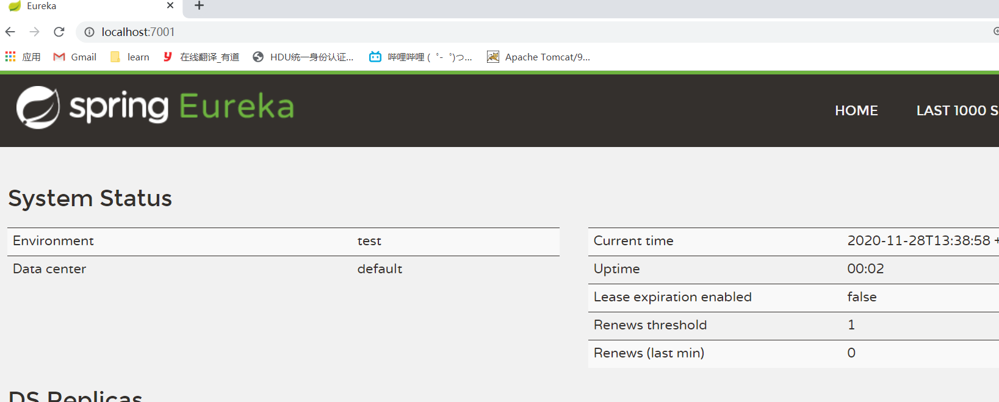
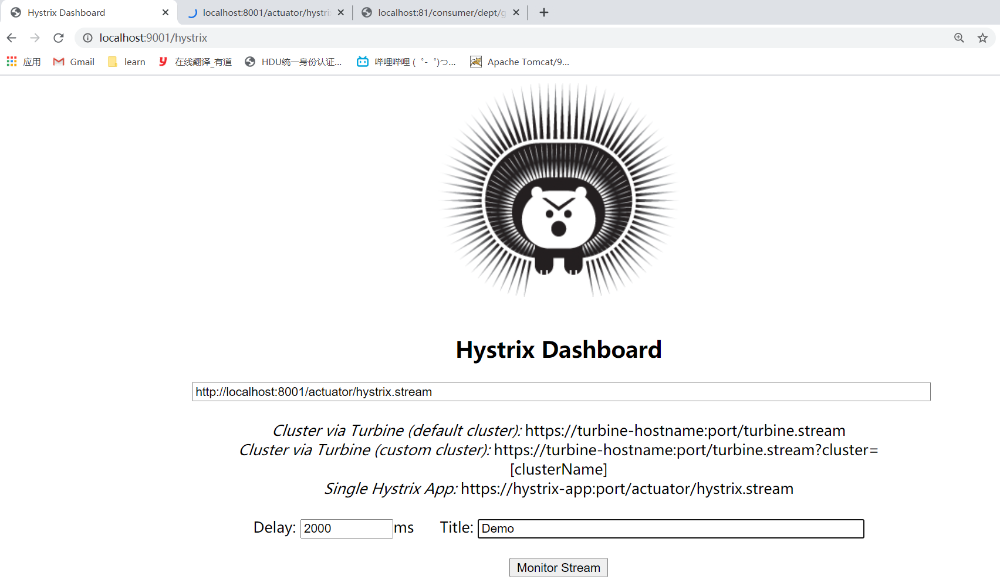
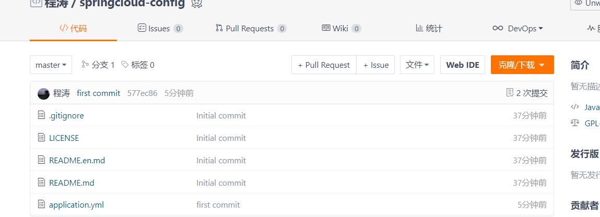

# springcloud学习

参考书：


## 1. 微服务架构

### 四个核心问题

1. 服务很多，客户端如何访问？（API网关）
2. 这么多服务，服务之间如何通信？（RPC或Http）
3. 这么多服务，服务之间如何治理？（注册与发现）
4. 服务挂了怎么办？（熔断机制）


 **解决方案：springcloud！这是一个生态。**

 1. **Springcloud Netflix**

    Api网关：zuul组件

    Feign------------HTTP通信方式，同步，阻塞

    服务注册发现：Eureka

    熔断机制：Hystrix


2. **Apache Dubbo+Zookeeper**

   Api：没有，找第三方组件，或自己写

   Dubbo-----------RPC通信方式，异步，非阻塞

   Zookeeper

   熔断机制：没有，借助Hystrix


3. **Springcloud Alibaba**  

   因为Springcloud Netflix已经停止维护了，Alibaba这套是新潮流。


### 什么是微服务


**微服务：**

强调的是服务的大小，关注的是某一个点，是**具体解决某一个问题**或**提供落地对应服务**的一个服务应用，狭义的看，可以看作IDEA中的一个个微服务工程，或者Moudule！


**微服务架构：**


所以说，微服务架构不只是适用Java，还有其它的任何语言。


### 优缺点

**优点：**


**缺点：**


### 微服务的技术栈


 	

## 2. SpringCloud入门概述

### 2.1 springcloud是什么


### 2.2 spirngcloud与springboot的关系

- springboot构建微服务，springcloud协调微服务
- springboot专注于快速开发单个个体微服务。   （打成jar包，就可以在服务器上运行）
- springcloud是关注全局的微服务协调整理治理框架（生态），它将springboot开发的一个个微服务整合并管理起来，为各个微服务之间提供：配置管理、服务发现、断路器、路由、微代理、事件总线、全局锁、决策竞选、分布式会话等等集合服务。
- springboot可以离开springcloud单独使用，开发项目；但是springcloud离不开springboot
- **springboot专注于快速、方便开发单个微服务，springcloud关注全局的服务治理。**


## 3. Dubbo和SpringCloud技术选型

### 1. 互联网架构

目前成熟的互联网架构：应用服务化拆分+消息中间件


### 2. Dubbo和SpringCloud对比


**总结：**

**解决的问题不一样，Dubbo的定位是一款RPC框架，SpringCloud的目标是微服务架构下的一站式解决方案。**


## 4. Rest学习环境搭建

**依赖包的版本问题一定要注意！！！**

1. 建一个maven项目，删掉src目录，在pom总文件总配置

   - 打包方式
   - 属性
   - 依赖管理（仅仅是管理，并没有导入）

   ```xml
   <?xml version="1.0" encoding="UTF-8"?>
   <project xmlns="http://maven.apache.org/POM/4.0.0"
            xmlns:xsi="http://www.w3.org/2001/XMLSchema-instance"
            xsi:schemaLocation="http://maven.apache.org/POM/4.0.0 http://maven.apache.org/xsd/maven-4.0.0.xsd">
       <modelVersion>4.0.0</modelVersion>
   
       <groupId>org.example</groupId>
       <artifactId>springcloud</artifactId>
       <version>1.0-SNAPSHOT</version>
       <modules>
           <module>springcloud-api</module>
           <module>springcloud-provider-dept-8001</module>
       </modules>
   
       <!--打包方式-->
       <packaging>pom</packaging>
   
       <properties>
           <project.build.sourceEncoding>UTF-8</project.build.sourceEncoding>
           <maven.compiler.source>1.8</maven.compiler.source>
           <maven.compiler.target>1.8</maven.compiler.target>
           <junit.version>4.12</junit.version>
           <log4j.version>1.2.17</log4j.version>
           <lombok.version>1.16.18</lombok.version>
       </properties>
   
       <dependencyManagement>
           <dependencies>
               <dependency>
                   <groupId>org.springframework.cloud</groupId>
                   <artifactId>spring-cloud-dependencies</artifactId>
                   <version>Hoxton.SR1</version>
                   <type>pom</type>
                   <scope>import</scope>
               </dependency>
               <!--SpringBoot-->
               <dependency>
                   <groupId>org.springframework.boot</groupId>
                   <artifactId>spring-boot-dependencies</artifactId>
                   <version>2.2.5.RELEASE</version>
                   <type>pom</type>
                   <scope>import</scope>
               </dependency>
               <!--数据库-->
               <dependency>
                   <groupId>mysql</groupId>
                   <artifactId>mysql-connector-java</artifactId>
                   <version>5.1.49</version>
               </dependency>
               <dependency>
                   <groupId>com.alibaba</groupId>
                   <artifactId>druid</artifactId>
                   <version>1.1.19</version>
               </dependency>
               <!--SpringBoot 启动器-->
               <dependency>
                   <groupId>org.mybatis.spring.boot</groupId>
                   <artifactId>mybatis-spring-boot-starter</artifactId>
                   <version>1.3.2</version>
               </dependency>
               <!--日志测试~-->
               <dependency>
                   <groupId>ch.qos.logback</groupId>
                   <artifactId>logback-core</artifactId>
                   <version>1.2.3</version>
               </dependency>
               <dependency>
                   <groupId>junit</groupId>
                   <artifactId>junit</artifactId>
                   <version>${junit.version}</version>
               </dependency>
               <dependency>
                   <groupId>log4j</groupId>
                   <artifactId>log4j</artifactId>
                   <version>${log4j.version}</version>
               </dependency>
               <dependency>
                   <groupId>org.projectlombok</groupId>
                   <artifactId>lombok</artifactId>
                   <version>${lombok.version}</version>
               </dependency>
           </dependencies>
       </dependencyManagement>
   
   
   </project>
   ```

   

2. 用maven新建一个模块springcloud-api

   - 导入依赖

     ```xml
     <?xml version="1.0" encoding="UTF-8"?>
     <project xmlns="http://maven.apache.org/POM/4.0.0"
              xmlns:xsi="http://www.w3.org/2001/XMLSchema-instance"
              xsi:schemaLocation="http://maven.apache.org/POM/4.0.0 http://maven.apache.org/xsd/maven-4.0.0.xsd">
         <parent>
             <artifactId>springcloud</artifactId>
             <groupId>org.example</groupId>
             <version>1.0-SNAPSHOT</version>
         </parent>
         <modelVersion>4.0.0</modelVersion>
     
         <artifactId>springcloud-api</artifactId>
     
         <!--当前Module自己需要的依赖，如果父依赖中配置了版本，这里就不用写版本号了-->
         <dependencies>
             <dependency>
                 <groupId>org.projectlombok</groupId>
                 <artifactId>lombok</artifactId>
             </dependency>
         </dependencies>
     
     </project>
     ```

     

   - 创建数据库db01和部门表dept

     

   - 实体类（注意要序列化）

     ```java
     @Data
     @NoArgsConstructor
     @Accessors(chain = true)  //支持链式写法
     public class Dept implements Serializable {
         private long deptno; //主键
         private String dname;
     
         //这个数据在哪个数据库中 （微服务，可能有多个数据库，同一个信息可能在不同数据库）
         private String db_source;
     
         public Dept(String dname) {
             this.dname = dname;
         }
     
         /*
         链式写法：
             Dept dept = new Dept();
             dept.setDname("hh").setDeptno(1).setDb_source('001');
          */
     }
     ```

3. 用maven新建一个模块springcloud-provider-dept-8001

   - 导入依赖

     通过依赖将springcloud-api模块导入：

     ```xml
      <dependency>
          <groupId>org.example</groupId>
          <artifactId>springcloud-api</artifactId>
          <version>1.0-SNAPSHOT</version>
     </dependency>
     ```

     再导入其它依赖(只要导入了springboot的包，它就是springboot项目)：

     ```xml
     <?xml version="1.0" encoding="UTF-8"?>
     <project xmlns="http://maven.apache.org/POM/4.0.0"
              xmlns:xsi="http://www.w3.org/2001/XMLSchema-instance"
              xsi:schemaLocation="http://maven.apache.org/POM/4.0.0 http://maven.apache.org/xsd/maven-4.0.0.xsd">
         <parent>
             <artifactId>springcloud</artifactId>
             <groupId>org.example</groupId>
             <version>1.0-SNAPSHOT</version>
         </parent>
         <modelVersion>4.0.0</modelVersion>
     
         <artifactId>springcloud-provider-dept-8001</artifactId>
     
         <dependencies>
             <!--需要拿到实体类，所以要配置api module-->
             <dependency>
                 <groupId>org.example</groupId>
                 <artifactId>springcloud-api</artifactId>
                 <version>1.0-SNAPSHOT</version>
             </dependency>
     
             <!--junit-->
             <dependency>
                 <groupId>junit</groupId>
                 <artifactId>junit</artifactId>
             </dependency>
             <dependency>
                 <groupId>mysql</groupId>
                 <artifactId>mysql-connector-java</artifactId>
             </dependency>
             <dependency>
                 <groupId>com.alibaba</groupId>
                 <artifactId>druid</artifactId>
             </dependency>
             <dependency>
                 <groupId>ch.qos.logback</groupId>
                 <artifactId>logback-core</artifactId>
             </dependency>
             <dependency>
                 <groupId>org.mybatis.spring.boot</groupId>
                 <artifactId>mybatis-spring-boot-starter</artifactId>
             </dependency>
             <!--test-->
             <dependency>
                 <groupId>org.springframework.boot</groupId>
                 <artifactId>spring-boot-test</artifactId>
             </dependency>
             <dependency>
                 <groupId>org.springframework.boot</groupId>
                 <artifactId>spring-boot-starter-web</artifactId>
             </dependency>
             <!--jetty-->
             <dependency>
                 <groupId>org.springframework.boot</groupId>
                 <artifactId>spring-boot-starter-jetty</artifactId>
             </dependency>
             <!--热部署工具-->
             <dependency>
                 <groupId>org.springframework.boot</groupId>
                 <artifactId>spring-boot-devtools</artifactId>
             </dependency>
     
         </dependencies>
     
     </project>
     ```

   - 新建application.yml，进行配置

     ```yml
     server:
       port: 8001
     
     # mybatis配置
     mybatis:
       type-aliases-package: com.ct.springcloud.pojo
       mapper-locations: classpath:mybatis/mapper/*.xml
       config-location: classpath:mybatis/mybatis-config.xml
     
     # spring配置
     spring:
       application:
         name: springcloud-provider-dept
       datasource:
         username: root
         password: 1234567
         url: jdbc:mysql://localhost:3306/db01?useUnicode=true&characterEncoding=utf8
         driver-class-name: com.mysql.jdbc.Driver
         type: com.alibaba.druid.pool.DruidDataSource
     ```

     

   - 编写Dao层

     建立com.ct.springcloud.dao.DeptDao接口

     ```java
     package com.ct.springcloud.dao;
     
     import com.ct.springcloud.pojo.Dept;
     import org.apache.ibatis.annotations.Mapper;
     import org.springframework.stereotype.Repository;
     
     import java.util.List;
     
     @Mapper
     @Repository
     public interface DeptDao {
         public boolean addDept(Dept dept);
     
         public Dept queryById(long id);
     
         public List<Dept> queryAll();
     }
     ```

     在mapper下建立DeptMapper.xml

     ```xml
     <?xml version="1.0" encoding="UTF-8" ?>
     <!DOCTYPE mapper
             PUBLIC "-//mybatis.org//DTD Config 3.0//EN"
             "http://mybatis.org/dtd/mybatis-3-mapper.dtd">
     <mapper namespace="com.ct.springcloud.dao.DeptDao">
         <insert id="addDept" parameterType="Dept">
             insert into dept (dname, db_source) VALUES
             (#{dname},DATABASE())
         </insert>
         
         <select id="queryById" resultType="Dept">
             select * from dept where deptno=#{id}
         </select>
     
         <select id="queryAll" resultType="Dept">
             select * from dept
         </select>
     </mapper>
     ```

   - 编写service层

     DeptService接口

     ```java
     public interface DeptService {
         public boolean addDept(Dept dept);
     
         public Dept queryById(long id);
     
         public List<Dept> queryAll();
     }
     ```

     DeptServiceImpl实现类

     ```java
     @Service
     public class DeptServiceImpl implements DeptService {
     
         @Autowired
         private DeptDao deptDao;
     
         @Override
         public boolean addDept(Dept dept) {
             return deptDao.addDept(dept);
         }
     
         @Override
         public Dept queryById(long id) {
             return deptDao.queryById(id);
         }
     
         @Override
         public List<Dept> queryAll() {
             return deptDao.queryAll();
         }
     }
     ```

   - controller层

     核心！提供RestFul服务，别人可以来调用

     ```java
     @RestController
     public class DeptController {
         @Autowired
         private DeptService deptService;
     
         @PostMapping("/dept/add")
         public boolean addDept(@RequestBody Dept dept) {
             return deptService.addDept(dept);
         }
     
         @GetMapping("/dept/get/{id}")
         public Dept get(@PathVariable("id") long id) {
             return deptService.queryById(id);
         }
     
         @GetMapping("/dept/list")
         public List<Dept> query() {
             return deptService.queryAll();
         }
     }
     ```

   - 写启动类DeptProvider_8001.class

     ```java
     package com.ct.springcloud;
     
     import org.springframework.boot.SpringApplication;
     import org.springframework.boot.autoconfigure.SpringBootApplication;
     
     @SpringBootApplication  //第一步
     public class DeptProvider_8001 {
         public static void main(String[] args) {  //第二步
             SpringApplication.run(DeptProvider_8001.class,args);  //第三步
         }
     }
     ```

   - 启动测试！

4. 新建一个模块springcloud-consumer-dept-80

   - 导入依赖

     ```xml
     <?xml version="1.0" encoding="UTF-8"?>
     <project xmlns="http://maven.apache.org/POM/4.0.0"
              xmlns:xsi="http://www.w3.org/2001/XMLSchema-instance"
              xsi:schemaLocation="http://maven.apache.org/POM/4.0.0 http://maven.apache.org/xsd/maven-4.0.0.xsd">
         <parent>
             <artifactId>springcloud</artifactId>
             <groupId>org.example</groupId>
             <version>1.0-SNAPSHOT</version>
         </parent>
         <modelVersion>4.0.0</modelVersion>
     
         <artifactId>springcloud-consumer-dept-80</artifactId>
     
         <dependencies>
             <dependency>
                 <groupId>org.example</groupId>
                 <artifactId>springcloud-api</artifactId>
                 <version>1.0-SNAPSHOT</version>
             </dependency>
             <dependency>
                 <groupId>org.springframework.boot</groupId>
                 <artifactId>spring-boot-starter-web</artifactId>
             </dependency>
             <!--热部署工具-->
             <dependency>
                 <groupId>org.springframework.boot</groupId>
                 <artifactId>spring-boot-devtools</artifactId>
             </dependency>
         </dependencies>
     
     </project>
     ```

   - 配置端口

     

     

     

   - **编写config配置类**

     消费者不应该有service层，它应该如何去调用provider服务呢？ 

      **RestTemplate！**需要把它注册到容器中！

     新建config包，编写ConfigBean.java类

     ```java
     @Configuration
     public class ConfigBean {
         @Bean
         public RestTemplate getRestTemplate() {
             return new RestTemplate();
         }
     }
     ```

     

     可以开始写controller了，通过RestTemplate调用远程服务！

     ```java
     @RestController
     public class DeptConsumerController {
         //理解：消费者不应该有service层
         //RestTemplate     先注册到spring中后直接使用就可以
         //(url,实体:Map(参数，类可以直接传的),responseType)
         @Autowired
         private RestTemplate restTemplate; //提供多种便捷访问远程Http的方法，简单的RestFul服务模板
     
         private static final String REST_URL_PREFIX = "http://localhost:8001";
     
         @RequestMapping("/consumer/dept/get/{id}")
         public Dept get(@PathVariable("id") long id) {
             return restTemplate.getForObject(REST_URL_PREFIX+"/dept/get/"+id,Dept.class);
         }
     
         @RequestMapping("/consumer/dept/add")
         public boolean add(Dept dept){
             return restTemplate.postForObject(REST_URL_PREFIX+"/dept/add/",dept,Boolean.class);
         }
     
         @RequestMapping("/consumer/dept/list")
         public List<Dept> list(){
             return restTemplate.getForObject(REST_URL_PREFIX+"/dept/list",List.class);
         }
     
     }
     ```

     

   最后，编写启动类！

     

## 5. Eureka服务注册与发现

### 什么是Eureka


### 原理讲解

- Eureka基本架构

   
   
   
   
- 三大角色

   - Eureka Server：提供服务的注册与发现。 
   - Service Provider：将自身服务注册到Eureka中，使消费者能够找到
   - Service Consumer：服务消费方从Eureka中获取注册服务列表，从而消费服务


### Eureka服务端

1. 新建一个模块springcloud-eureka-7001，导入依赖

   ```xml
   <?xml version="1.0" encoding="UTF-8"?>
   <project xmlns="http://maven.apache.org/POM/4.0.0"
            xmlns:xsi="http://www.w3.org/2001/XMLSchema-instance"
            xsi:schemaLocation="http://maven.apache.org/POM/4.0.0 http://maven.apache.org/xsd/maven-4.0.0.xsd">
       <parent>
           <artifactId>springcloud</artifactId>
           <groupId>org.example</groupId>
           <version>1.0-SNAPSHOT</version>
       </parent>
       <modelVersion>4.0.0</modelVersion>
   
       <artifactId>springcloud-eureka-7001</artifactId>
   
       <dependencies>
           <dependency>
               <groupId>org.springframework.cloud</groupId>
               <artifactId>spring-cloud-starter-eureka-server</artifactId>
               <version>1.4.6.RELEASE</version>
           </dependency>
   
           <!--热部署工具-->
           <dependency>
               <groupId>org.springframework.boot</groupId>
               <artifactId>spring-boot-devtools</artifactId>
           </dependency>
       </dependencies>
   
   </project>
   ```

2. 配置文件application.yml

   ```yml
   server:
     port: 7001
   
   #Eureka配置
   eureka:
     instance:
       hostname: localhost   # Eureka服务端的IP地址
     client:
       register-with-eureka: false  # 表示是否向eureka注册中心注册自己，因为自己是服务端，所以false
       fetch-registry: false  # 为false，表示自己是注册中心
       service-url:   
         defaultZone: http://${eureka.instance.hostname}:${server.port}/eureka/  # 这是注册地址
   ```

3. 编写启动类，注解**@EnableEurekaServer**开启Eureka服务端

   ```java
   @SpringBootApplication
   @EnableEurekaServer   //表示是服务端的启动类，可以接收别人注册进来
   public class EurekaServer_7001 {
       public static void main(String[] args) {
           SpringApplication.run(EurekaServer_7001.class,args);
       }
   }
   ```

   启动后就能访问了。

   


### 服务注册

1. 进入springcloud-provider-dept-8001模块，在pom中导入Eureka依赖

   ```xml
   <!--Eureka-->
   <dependency>
       <groupId>org.springframework.cloud</groupId>
       <artifactId>spring-cloud-starter-eureka</artifactId>
       <version>1.4.6.RELEASE</version>
   </dependency>
   ```

2. 配置文件配置eureka

   ```yml
   server:
     port: 8001
   
   # mybatis配置
   mybatis:
     type-aliases-package: com.ct.springcloud.pojo
     mapper-locations: classpath:mybatis/mapper/*.xml
     config-location: classpath:mybatis/mybatis-config.xml
   
   # spring配置
   spring:
     application:
       name: springcloud-provider-dept
     datasource:
       username: root
       password: 1234567
       url: jdbc:mysql://localhost:3306/db01?useUnicode=true&characterEncoding=utf8
       driver-class-name: com.mysql.jdbc.Driver
       type: com.alibaba.druid.pool.DruidDataSource
   
   #Eureka的配置，服务注册到哪儿
   eureka:
     client:
       service-url:
         defaultZone: http://localhost:7001/eureka
     instance:
       instance-id: springcloud-provider-dept8001  #修改eureka上的默认描述信息
   ```

3. 启动类，注解**@EnableEurekaClient**开启Eureka

   ```java
   @SpringBootApplication
   @EnableEurekaClient  // 在服务启动后，自动注册到Eureka中
   public class DeptProvider_8001 {
       public static void main(String[] args) {
           SpringApplication.run(DeptProvider_8001.class,args);
       }
   }
   ```

4. 启动服务端与客户端的启动类，访问监控中心

   


### 信息配置


这个链接点击后是404页面，因为没有进行配置。

**完善信息配置：**

1. 在springcloud-provider-dept-8001模块中导入依赖

   这个链接是该服务的监控信息，所以在客户端进行配置

   ```xml
   <!--完善监控信息-->
   <dependency>
       <groupId>org.springframework.boot</groupId>
       <artifactId>spring-boot-starter-actuator</artifactId>
   </dependency>
   ```

2. 配置文件配置info

   ```yml
   server:
     port: 8001
   
   # mybatis配置
   mybatis:
     type-aliases-package: com.ct.springcloud.pojo
     mapper-locations: classpath:mybatis/mapper/*.xml
     config-location: classpath:mybatis/mybatis-config.xml
   
   # spring配置
   spring:
     application:
       name: springcloud-provider-dept
     datasource:
       username: root
       password: 1234567
       url: jdbc:mysql://localhost:3306/db01?useUnicode=true&characterEncoding=utf8
       driver-class-name: com.mysql.jdbc.Driver
       type: com.alibaba.druid.pool.DruidDataSource
   
   #Eureka的配置，服务注册到哪儿
   eureka:
     client:
       service-url:
         defaultZone: http://localhost:7001/eureka
     instance:
       instance-id: springcloud-provider-dept8001  #修改eureka上的默认描述信息
   
   # 信息配置
   info:
     app.name: ct-springcloud
     company.name: blog.ct.com
   ```

3. 启动项目后，点击链接

   

   显示了info中的信息。


### 自我保护机制

把springcloud-provider-dept-8001模块关闭后，过了一段时间（默认90秒），监控页面出现以下红色信息：


原因：**自我保护机制！**

**解释：**


### Discovery服务发现

对于注册进eureka里的微服务，可以通过服务发现来获得微服务的信息。【对外暴露服务】，在团队开发中用到。

1. 在springcloud-provider-dept-8001模块的DeptController类中添加代码

   ```java
   @RestController
   public class DeptController {
       @Autowired
       private DeptService deptService;
   
       //获取注册中心微服务的信息
       @Autowired
       private DiscoveryClient client;
   
       @PostMapping("/dept/add")
       public boolean addDept(@RequestBody Dept dept) {
           return deptService.addDept(dept);
       }
   
       @GetMapping("/dept/get/{id}")
       public Dept get(@PathVariable("id") long id) {
           return deptService.queryById(id);
       }
   
       @GetMapping("/dept/list")
       public List<Dept> query() {
           return deptService.queryAll();
       }
   
       //获取注册中心微服务的信息
       @GetMapping("/dept/discovery")
       public Object discovery() {
           //获取微服务列表清单
           List<String> services = client.getServices();
           System.out.println("discovery=>services:" + services);
   
           //通过微服务的id得到一个具体的微服务信息，id是applicationName
           List<ServiceInstance> instances = client.getInstances("SPRINGCLOUD-PROVIDER-DEPT");
   
           for (ServiceInstance instance : instances) {
               System.out.println(
                       instance.getHost() + "\n"+
                       instance.getPort() + "\n"+
                       instance.getUri() + "\n"+
                       instance.getServiceId()
               );
           }
           return this.client;
       }
   
   }
   ```

2. 启动类注解开启

   ```java
   @SpringBootApplication
   @EnableEurekaClient  // 在服务启动后，自动注册到Eureka中
   @EnableDiscoveryClient //服务发现
   public class DeptProvider_8001 {
       public static void main(String[] args) {
           SpringApplication.run(DeptProvider_8001.class,args);
       }
   }
   ```

3. 启动测试


### Eureka集群

1. 再建两个模块springcloud-eureka-7002、springcloud-eureka-7003，导入和springcloud-eureka-7001一样的依赖

   ```xml
   <dependencies>
       <dependency>
           <groupId>org.springframework.cloud</groupId>
           <artifactId>spring-cloud-starter-eureka-server</artifactId>
           <version>1.4.6.RELEASE</version>
       </dependency>
   
       <!--热部署工具-->
       <dependency>
           <groupId>org.springframework.boot</groupId>
           <artifactId>spring-boot-devtools</artifactId>
       </dependency>
   </dependencies>
   ```

2. 将pringcloud-eureka-7001中的application.yml文件复制到另外两个模块中，只需改端口号

   ```yml
   server:
     port: 7003
   
   #Eureka配置
   eureka:
     instance:
       hostname: localhost   # Eureka服务端的IP地址
     client:
       register-with-eureka: false  # 表示是否向eureka注册中心注册自己，因为自己是服务端，所以false
       fetch-registry: false  # 为false，表示自己是注册中心
       service-url:   # 简单理解为注册地址
         defaultZone: http://${eureka.instance.hostname}:${server.port}/eureka/
   ```

3. 编写启动类（除了名字改一改，其它也一样）

   ```java
   @SpringBootApplication
   @EnableEurekaServer   //表示是服务端的启动类，可以接收别人注册进来
   public class EurekaServer_7003 {
       public static void main(String[] args) {
           SpringApplication.run(EurekaServer_7003.class,args);
       }
   }
   ```

4. 为了显的真实，在C:\Windows\System32\drivers\etc的hosts文件中添加记录

   ```yml
   # Copyright (c) 1993-2009 Microsoft Corp.
   #
   # This is a sample HOSTS file used by Microsoft TCP/IP for Windows.
   #
   # This file contains the mappings of IP addresses to host names. Each
   # entry should be kept on an individual line. The IP address should
   # be placed in the first column followed by the corresponding host name.
   # The IP address and the host name should be separated by at least one
   # space.
   #
   # Additionally, comments (such as these) may be inserted on individual
   # lines or following the machine name denoted by a '#' symbol.
   #
   # For example:
   #
   #      102.54.94.97     rhino.acme.com          # source server
   #       38.25.63.10     x.acme.com              # x client host
   
   # localhost name resolution is handled within DNS itself.
   #	127.0.0.1       localhost
   #	::1             localhost
   127.0.0.1		eureka7001.com
   127.0.0.1		eureka7002.com
   127.0.0.1		eureka7003.com
   ```

5. 进行集群关联

   > springcloud-eureka-7001模块的application.yml

     ```yml
   server:
     port: 7001
   
   #Eureka配置
   eureka:
     instance:
       hostname: eureka7001.com   # Eureka服务端的IP地址
     client:
       register-with-eureka: false  # 表示是否向eureka注册中心注册自己，因为自己是服务端，所以false
       fetch-registry: false  # 为false，表示自己是注册中心
       service-url:   # 简单理解为注册中心地址
         # 单机：defaultZone: http://eureka7001.com:7001/eureka/
         # 集群（关联）：
         defaultZone: http://eureka7002.com:7002/eureka/,http://eureka7003.com:7003/eureka/
     ```

   > springcloud-eureka-7002模块的application.yml

     ```yml
   server:
     port: 7002
   
   #Eureka配置
   eureka:
     instance:
       hostname: eureka7002.com   # Eureka服务端的IP地址
     client:
       register-with-eureka: false  # 表示是否向eureka注册中心注册自己，因为自己是服务端，所以false
       fetch-registry: false  # 为false，表示自己是注册中心
       service-url:   # 简单理解为注册地址
         defaultZone: http://eureka7001.com:7001/eureka/,http://eureka7003.com:7003/eureka/
     ```

   > springcloud-eureka-7003模块的application.yml

     ```yml
   server:
     port: 7003
   
   #Eureka配置
   eureka:
     instance:
       hostname: eureka7003.com   # Eureka服务端的IP地址
     client:
       register-with-eureka: false  # 表示是否向eureka注册中心注册自己，因为自己是服务端，所以false
       fetch-registry: false  # 为false，表示自己是注册中心
       service-url:   # 简单理解为注册地址
         defaultZone: http://eureka7001.com:7001/eureka/,http://eureka7002.com:7002/eureka/
     ```

6. 有了集群后，服务提供者应该如何注册呢？

   进入springcloud-provider-dept-8001模块，只需修改application.yml中的defaultZone

   ```yml
   server:
     port: 8001
   
   # mybatis配置
   mybatis:
     type-aliases-package: com.ct.springcloud.pojo
     mapper-locations: classpath:mybatis/mapper/*.xml
     config-location: classpath:mybatis/mybatis-config.xml
   
   # spring配置
   spring:
     application:
       name: springcloud-provider-dept
     datasource:
       username: root
       password: 1234567
       url: jdbc:mysql://localhost:3306/db01?useUnicode=true&characterEncoding=utf8
       driver-class-name: com.mysql.jdbc.Driver
       type: com.alibaba.druid.pool.DruidDataSource
   
   #Eureka的配置，服务注册到哪儿
   eureka:
     client:
       service-url:
         defaultZone: http://eureka7001.com:7001/eureka,http://eureka7002.com:7002/eureka,http://eureka7003.com:7003/eureka
     instance:
       instance-id: springcloud-provider-dept8001  #修改eureka上的默认描述信息
   
   # 信息配置
   info:
     app.name: ct-springcloud
     company.name: blog.ct.com
   ```

7. 启动三个模块

   


### 对比zookeeper

RDBMS（Mysql、Oracle、sqlServer）：ACID原则

NoSQl（redis、mongdb）：CAP原则


**CAP理论核心：**


#### zookeeper保证CP


#### Eureka保证AP


**因此，Eureka可以很好的应对因网络故障导致部分节点失去联系的情况，而不会像Zookeeper那样使整个注册中心服务瘫痪。**


## 6. Ribbon负载均衡

### 什么是Ribbon

 **Ribbon是什么？**


 **Ribbon能干嘛？**


### 消费方集成Ribbon

1. 在springcloud-consumer-dept-80模块中，添加Ribbon和Eureka依赖

   ```xml
   <?xml version="1.0" encoding="UTF-8"?>
   <project xmlns="http://maven.apache.org/POM/4.0.0"
            xmlns:xsi="http://www.w3.org/2001/XMLSchema-instance"
            xsi:schemaLocation="http://maven.apache.org/POM/4.0.0 http://maven.apache.org/xsd/maven-4.0.0.xsd">
       <parent>
           <artifactId>springcloud</artifactId>
           <groupId>org.example</groupId>
           <version>1.0-SNAPSHOT</version>
       </parent>
       <modelVersion>4.0.0</modelVersion>
   
       <artifactId>springcloud-consumer-dept-80</artifactId>
   
       <dependencies>
           <!--Ribbon-->
           <dependency>
               <groupId>org.springframework.cloud</groupId>
               <artifactId>spring-cloud-starter-ribbon</artifactId>
               <version>1.4.6.RELEASE</version>
           </dependency>
           <!--Eureka-->
           <dependency>
               <groupId>org.springframework.cloud</groupId>
               <artifactId>spring-cloud-starter-eureka</artifactId>
               <version>1.4.6.RELEASE</version>
           </dependency>
   
           <dependency>
               <groupId>org.example</groupId>
               <artifactId>springcloud-api</artifactId>
               <version>1.0-SNAPSHOT</version>
           </dependency>
           <dependency>
               <groupId>org.springframework.boot</groupId>
               <artifactId>spring-boot-starter-web</artifactId>
           </dependency>
           <!--热部署工具-->
           <dependency>
               <groupId>org.springframework.boot</groupId>
               <artifactId>spring-boot-devtools</artifactId>
           </dependency>
       </dependencies>
   
   </project>
   ```

2. 配置文件application.yml

   ```yml
   server:
     port: 81
   
   #Eureka配置
   eureka:
     client:
       register-with-eureka: false #消费者不向注册中心注册自己
       service-url:
         defaultZone: http://eureka7002.com:7002/eureka/,http://eureka7003.com:7003/eureka/,http://eureka7001.com:7001/eureka/
   ```

3. 启动类加注解

   ```java
   @SpringBootApplication
   @EnableEurekaClient
   public class DeptConsumer_80 {
       public static void main(String[] args) {
           SpringApplication.run(DeptConsumer_80.class,args);
       }
   }
   ```

4. 一个注解**@LoadBalanced**实现负载均衡

   在ConfigBean配置类中，在RestTemplate上加上注解

   ```java
   @Configuration
   public class ConfigBean {
   
       //配置负载均衡实现RestTemplate
       @LoadBalanced   //Ribbon
       @Bean
       public RestTemplate getRestTemplate() {
           return new RestTemplate();
       }
   }
   ```

5. 修改Controller中的代码，让RestTemplate基于服务名去访问，请求会自动根据默认的负载均衡算法分配到具体的地址

   ```java
   @RestController
   public class DeptConsumerController {
       //理解：消费者不应该有service层
       //RestTemplate     先注册到spring中后直接使用就可以
       //(url,实体:Map(参数，类可以直接传的),responseType)
       @Autowired
       private RestTemplate restTemplate; //提供多种便捷访问远程Http的方法，简单的RestFul服务模板
   
       //private static final String REST_URL_PREFIX = "http://localhost:8001";
       //Ribbon 我们这里的地址应该是一个变量，通过服务名来访问，请求在注册中心根据服务名自己寻找服务器地址
       private static final String REST_URL_PREFIX = "http://SPRINGCLOUD-PROVIDER-DEPT";
   
       @RequestMapping("/consumer/dept/get/{id}")
       public Dept get(@PathVariable("id") long id) {
           return restTemplate.getForObject(REST_URL_PREFIX+"/dept/get/"+id,Dept.class);
       }
   
       @RequestMapping("/consumer/dept/add")
       public boolean add(Dept dept){
           return restTemplate.postForObject(REST_URL_PREFIX+"/dept/add/",dept,Boolean.class);
       }
   
       @RequestMapping("/consumer/dept/list")
       public List<Dept> list(){
           return restTemplate.getForObject(REST_URL_PREFIX+"/dept/list",List.class);
       }
   
   }
   ```

   - Ribbon+Eureka整合后，地址只需给出服务名，请求会自己去注册中心寻找服务器地址

   - 这里由于服务提供方只有一个（springcloud-provider-dept-8001），所以无论如何请求都会进入这个服务。之后多写几个provider后，负载均衡才真正起作用。

     

6. 再建两个提供者模块springcloud-provider-dept-8002、springcloud-provider-dept-8003，真正做到负载均衡

   

   

   - 建两个数据库 db02、db03，除了db_source（属于哪个数据库）不一样，其它字段三个表都一样

   

   

   原封不动的从springcloud-provider-dept-8001中复制：

   - pom依赖

     ```xml
     <dependencies>
         <!--Eureka-->
         <dependency>
             <groupId>org.springframework.cloud</groupId>
             <artifactId>spring-cloud-starter-eureka</artifactId>
             <version>1.4.6.RELEASE</version>
         </dependency>
     
         <!--完善监控信息-->
         <dependency>
             <groupId>org.springframework.boot</groupId>
             <artifactId>spring-boot-starter-actuator</artifactId>
         </dependency>
     
         <!--需要拿到实体类，所以要配置api module-->
         <dependency>
             <groupId>org.example</groupId>
             <artifactId>springcloud-api</artifactId>
             <version>1.0-SNAPSHOT</version>
         </dependency>
     
         <!--junit-->
         <dependency>
             <groupId>junit</groupId>
             <artifactId>junit</artifactId>
         </dependency>
         <dependency>
             <groupId>mysql</groupId>
             <artifactId>mysql-connector-java</artifactId>
         </dependency>
         <dependency>
             <groupId>com.alibaba</groupId>
             <artifactId>druid</artifactId>
         </dependency>
         <dependency>
             <groupId>ch.qos.logback</groupId>
             <artifactId>logback-core</artifactId>
         </dependency>
         <dependency>
             <groupId>org.mybatis.spring.boot</groupId>
             <artifactId>mybatis-spring-boot-starter</artifactId>
         </dependency>
         <!--test-->
         <dependency>
             <groupId>org.springframework.boot</groupId>
             <artifactId>spring-boot-test</artifactId>
         </dependency>
         <dependency>
             <groupId>org.springframework.boot</groupId>
             <artifactId>spring-boot-starter-web</artifactId>
         </dependency>
         <!--jetty-->
         <dependency>
             <groupId>org.springframework.boot</groupId>
             <artifactId>spring-boot-starter-jetty</artifactId>
         </dependency>
         <!--热部署工具-->
         <dependency>
             <groupId>org.springframework.boot</groupId>
             <artifactId>spring-boot-devtools</artifactId>
         </dependency>
     </dependencies>
     ```

   - application.yml

     修改了端口号、连接的数据库名称、instance-id

     **三个服务的spring.application.name一致！这是前题！**

     因为消费者是通过服务名在注册中心通过负载均衡算法找服务的。

     ```yml
     server:
       port: 8003
     
     # mybatis配置
     mybatis:
       type-aliases-package: com.ct.springcloud.pojo
       mapper-locations: classpath:mybatis/mapper/*.xml
       config-location: classpath:mybatis/mybatis-config.xml
     
     # spring配置
     spring:
       application:
         name: springcloud-provider-dept  # 三个服务名称一致！
       datasource:
         username: root
         password: 1234567
         url: jdbc:mysql://localhost:3306/db03?useUnicode=true&characterEncoding=utf8
         driver-class-name: com.mysql.jdbc.Driver
         type: com.alibaba.druid.pool.DruidDataSource
     
     #Eureka的配置，服务注册到哪儿
     eureka:
       client:
         service-url:
           defaultZone: http://eureka7001.com:7001/eureka,http://eureka7002.com:7002/eureka,http://eureka7003.com:7003/eureka
       instance:
         instance-id: springcloud-provider-dept8003  #修改eureka上的默认描述信息
     
     # 信息配置
     info:
       app.name: ct-springcloud
       company.name: blog.ct.com
     ```

   - mybatis包

     mybatis.myvatis-config.xml

     ```xml
     <?xml version="1.0" encoding="UTF-8" ?>
     <!DOCTYPE configuration
             PUBLIC "-//mybatis.org//DTD Config 3.0//EN"
             "http://mybatis.org/dtd/mybatis-3-config.dtd">
     <!--configuration核心配置文件-->
     <configuration>
     
         <!--开启二级缓存 （为了回顾，其实这个文件可以不要）  -->
         <settings>
             <setting name="cacheEnabled" value="true"/>
         </settings>
     
     </configuration>
     ```

     mybatis.mapper.DeptMapper.xml

     ```xml
     <?xml version="1.0" encoding="UTF-8" ?>
     <!DOCTYPE mapper
             PUBLIC "-//mybatis.org//DTD Config 3.0//EN"
             "http://mybatis.org/dtd/mybatis-3-mapper.dtd">
     <mapper namespace="com.ct.springcloud.dao.DeptDao">
         <insert id="addDept" parameterType="Dept">
             insert into dept (dname, db_source) VALUES
             (#{dname},DATABASE())
         </insert>
         
         <select id="queryById" resultType="Dept">
             select * from dept where deptno=#{id}
         </select>
     
         <select id="queryAll" resultType="Dept">
             select * from dept
         </select>
     </mapper>
     ```

   - com.ct.springcloud包

     具体代码上面都有。

     只需修改启动类

     ```java
     package com.ct.springcloud;
     
     import org.springframework.boot.SpringApplication;
     import org.springframework.boot.autoconfigure.SpringBootApplication;
     import org.springframework.cloud.client.discovery.EnableDiscoveryClient;
     import org.springframework.cloud.netflix.eureka.EnableEurekaClient;
     
     @SpringBootApplication
     @EnableEurekaClient  // 在服务启动后，自动注册到Eureka中
     @EnableDiscoveryClient //服务发现
     public class DeptProvider_8003 {
         public static void main(String[] args) {
             SpringApplication.run(DeptProvider_8003.class,args);
         }
     }
     ```

   - 测试

     启动springcloud-eureka-7001、springcloud-eureka-7002、springcloud-provider-dept-8001springcloud-provider-dept-8002、springcloud-provider-dept-8003、springcloud-consumer-dept-80

     

     通过http://localhost:81/consumer/dept/list测试，可以发现负载均衡起作用了，默认是用轮询算法。

​     

### 自定义负载均衡算法

负载均衡算法是靠实现**IRule接口**实现的。

```java
public interface IRule{
    /*
     * choose one alive server from lb.allServers or
     * lb.upServers according to key
     * 
     * @return choosen Server object. NULL is returned if none
     *  server is available 
     */

    public Server choose(Object key);
    
    public void setLoadBalancer(ILoadBalancer lb);
    
    public ILoadBalancer getLoadBalancer();   
```

Irule接口的实现类有：


- RoundRobinRule：轮询（默认）
- RandonRule：随机
- AvailabilityFilterRule：会先过滤掉跳闸、访问故障的服务，对剩下的进行轮询
- RetryRule：会先按照轮询获取服务，如果获取失败，会在指定时间内进行重试

这些实现类都继承了AbstractLoadBalancerRule抽象类，这个抽象类实现了IRule接口


**如何使用上面现成的负载均衡算法？**

在springcloud-consumer-dept-80模块的配置类ConfigBean中，注入bean就可以了

```java
@Configuration
public class ConfigBean {

    //配置负载均衡实现RestTemplate
    @LoadBalanced   //Ribbon
    @Bean
    public RestTemplate getRestTemplate() {
        return new RestTemplate();
    }

    @Bean    // 要用哪个负载均衡算法就new哪个类
    public IRule myRule() {
        return new RandomRule();
    }

}
```


同理，要实现自定义的负载均衡算法，只要自己写个类继承AbstractLoadBalancerRule抽象类，再注入spring容器就好！

**自定义实现：**

- 自定义类注入如果放在启动类的同级目录下，会被直接扫描到，该服务中的所有请求都会用该负载均衡算法。所以删掉上面的ConfigBean配置类中的public IRule myRule(){}，而在上级目录建包myrule，编写DiyRule配置类和DiyRandomRule自定义负载均衡算法类

  目录结构：

  

  DiyRule:

  ```java
  @Configuration
  public class DiyRule {
  
      @Bean
      public IRule myRule() {
          return new DiyRandomRule();  //默认是轮询，现在自定义为DiyRandomRule
      }
  
  }
  ```

  DiyRandomRule:

  这个类是复制了RandomRule，再自己改造的

  ```java
  // 每个服务访问5次，换下一个服务
  public class DiyRandomRule extends AbstractLoadBalancerRule {
      //total默认为0，如果为5指向下一个服务
      //index默认为0，如果total为5那么index加1
  
      private int total=0; //总的访问次数
      private int index=0; //访问哪个服务提供者
  
      public Server choose(ILoadBalancer lb, Object key) {
          if (lb == null) {
              return null;
          }
          Server server = null;
  
          while (server == null) {
              if (Thread.interrupted()) {
                  return null;
              }
              List<Server> upList = lb.getReachableServers(); //获得活着的服务
              List<Server> allList = lb.getAllServers(); //获得全部服务
  
              int serverCount = allList.size();
              if (serverCount == 0) {
                  return null;
              }
  
  //            int index = chooseRandomInt(serverCount); //生成区间随机数
  //            server = upList.get(index); //从活着的服务中随机获得一个
              //自定义代码
              //===========================================================
              if (total < 5) {
                  server = upList.get(index);
                  total++;
              }else {
                  total=0;
                  index++;
                  if (index >= upList.size()) {
                      index=0;
                  }
                  server=upList.get(index);
              }
              //===========================================================
  
              if (server == null) {
                  Thread.yield();
                  continue;
              }
  
              if (server.isAlive()) {
                  return (server);
              }
  
              // Shouldn't actually happen.. but must be transient or a bug.
              server = null;
              Thread.yield();
          }
  
          return server;
  
      }
  
      protected int chooseRandomInt(int serverCount) {
          return ThreadLocalRandom.current().nextInt(serverCount);
      }
  
  	@Override
  	public Server choose(Object key) {
  		return choose(getLoadBalancer(), key);
  	}
  
  	@Override
  	public void initWithNiwsConfig(IClientConfig clientConfig) {
  		// TODO Auto-generated method stub
  		
  	}
  }
  ```

- 由于启动类扫描不到上面的包，所以加上注解**@RibbonClient**

  ```java
  @SpringBootApplication
  @EnableEurekaClient
  @RibbonClient(name = "SPRINGCLOUD-PROVIDER-DEPT",configuration = DiyRule.class)
  public class DeptConsumer_80 {
      public static void main(String[] args) {
          SpringApplication.run(DeptConsumer_80.class,args);
      }
  }
  ```

  这也是Ribbon官网的方式。


## 7. Feign负载均衡

### 简介


**Feign能做什么？**


**Feigon集成了Ribbon**


### Feign使用

1. 建立模块springcloud-consumer-dept-feign

   从springcloud-consumer-dept-80中，原封不动的拷贝：

   - pom依赖（含Eureka和Ribbon、springcloud-api）
   - com.ct.springcloud
   - application.yml

   只修改了启动类（删掉了自定义负载均衡算法的myrule包和@RibbonClient注解）

   

2. 在springcloud-api模块中导入依赖

   ```xml
   <?xml version="1.0" encoding="UTF-8"?>
   <project xmlns="http://maven.apache.org/POM/4.0.0"
            xmlns:xsi="http://www.w3.org/2001/XMLSchema-instance"
            xsi:schemaLocation="http://maven.apache.org/POM/4.0.0 http://maven.apache.org/xsd/maven-4.0.0.xsd">
       <parent>
           <artifactId>springcloud</artifactId>
           <groupId>org.example</groupId>
           <version>1.0-SNAPSHOT</version>
       </parent>
       <modelVersion>4.0.0</modelVersion>
   
       <artifactId>springcloud-api</artifactId>
   
       <!--当前Module自己需要的依赖，如果父依赖中配置了版本，这里就不用写版本号了-->
       <dependencies>
           <dependency>
               <groupId>org.springframework.cloud</groupId>
               <artifactId>spring-cloud-starter-feign</artifactId>
               <version>1.4.6.RELEASE</version>
           </dependency>
           <dependency>
               <groupId>org.projectlombok</groupId>
               <artifactId>lombok</artifactId>
           </dependency>
       </dependencies>
   
   </project>
   ```

   建service层和DeptClientService接口

   接口加注解！

   ```java
   @FeignClient(value = "SPRINGCLOUD-PROVIDER-DEPT")
   @Component
   public interface DeptClientService {
       @GetMapping("/dept/get/{id}")
       public Dept queryById(@PathVariable("id") long id);
   
       @GetMapping("/dept/list")
       public List<Dept> queryAll();
   
       @PostMapping("/dept/add")
       public boolean addDept(Dept dept);
   }
   ```

   

3. 进入springcloud-consumer-dept-feign模块的controller.DeptConsumerController类

   原来的代码：

   ```Java
   @RestController
   public class DeptConsumerController {
       //理解：消费者不应该有service层
       //RestTemplate     先注册到spring中后直接使用就可以
       //(url,实体:Map(参数，类可以直接传的),responseType)
       @Autowired
       private RestTemplate restTemplate; //提供多种便捷访问远程Http的方法，简单的RestFul服务模板
   
       //private static final String REST_URL_PREFIX = "http://localhost:8001";
       //Ribbon 我们这里的地址应该是一个变量，通过服务名来访问
       private static final String REST_URL_PREFIX = "http://SPRINGCLOUD-PROVIDER-DEPT";
   
       @RequestMapping("/consumer/dept/get/{id}")
       public Dept get(@PathVariable("id") long id) {
           return restTemplate.getForObject(REST_URL_PREFIX+"/dept/get/"+id,Dept.class);
       }
   
       @RequestMapping("/consumer/dept/add")
       public boolean add(Dept dept){
           return restTemplate.postForObject(REST_URL_PREFIX+"/dept/add/",dept,Boolean.class);
       }
   
       @RequestMapping("/consumer/dept/list")
       public List<Dept> list(){
           return restTemplate.getForObject(REST_URL_PREFIX+"/dept/list",List.class);
       }
   
   }
   ```

   现在改为：

   ```java
   @RestController
   public class DeptConsumerController {
   
       @Autowired
       private DeptClientService deptClientService;
   
       @RequestMapping("/consumer/dept/get/{id}")
       public Dept get(@PathVariable("id") long id) {
           return deptClientService.queryById(id);
       }
   
       @RequestMapping("/consumer/dept/add")
       public boolean add(Dept dept){
           return deptClientService.addDept(dept);
       }
   
       @RequestMapping("/consumer/dept/list")
       public List<Dept> list(){
           return deptClientService.queryAll();
       }
   }
   ```

   通过接口的方式实现了原来的功能。可以发现：

   - 原本REST_URL_PREFIX = "http://SPRINGCLOUD-PROVIDER-DEPT"，现在由@FeignClient(value = "SPRINGCLOUD-PROVIDER-DEPT")指定了服务名字
   - 原本restTemplate.postForObject(REST_URL_PREFIX+"/dept/add/",dept,Boolean.class)，现在由接口上的 @PostMapping("/dept/add")指定访问路径

4. 启动类加注解**@EnableFeignClients**

   ```java
   @SpringBootApplication
   @EnableEurekaClient
   @EnableFeignClients(basePackages = {"com.ct.springcloud"})
   public class FeignDeptConsumer_80 {
       public static void main(String[] args) {
           SpringApplication.run(FeignDeptConsumer_80.class,args);
       }
   }
   ```

5. 启动测试，成功！


## 8. Hystrix熔断机制

### 服务雪崩与Hystrix介绍


**Hystrix能干啊？**

- 服务降级
- 服务熔断
- 服务限流
- 接近实时的监控
- ……


**服务熔断是什么？**


### 服务熔断

1. 新建模块springcloud-provider-dept-hystrix-8001，从springcloud-provider-dept-8001中复制：

   - pom依赖

   - application.yml

   - mybatis包

   - com.ct.springcloud包

     

2. 模块拷贝工作完成，现在模块是一个提供者，但还没熔断机制。增设熔断机制

   - 增加pom依赖hystrix

     ```xml
     <dependencies>
     
         <dependency>
             <groupId>org.springframework.cloud</groupId>
             <artifactId>spring-cloud-starter-hystrix</artifactId>
             <version>1.4.6.RELEASE</version>
         </dependency>
     
         <!--Eureka-->
         <dependency>
             <groupId>org.springframework.cloud</groupId>
             <artifactId>spring-cloud-starter-eureka</artifactId>
             <version>1.4.6.RELEASE</version>
         </dependency>
     
         <!--完善监控信息-->
         <dependency>
             <groupId>org.springframework.boot</groupId>
             <artifactId>spring-boot-starter-actuator</artifactId>
         </dependency>
     
         <!--需要拿到实体类，所以要配置api module-->
         <dependency>
             <groupId>org.example</groupId>
             <artifactId>springcloud-api</artifactId>
             <version>1.0-SNAPSHOT</version>
         </dependency>
     
         <!--junit-->
         <dependency>
             <groupId>junit</groupId>
             <artifactId>junit</artifactId>
         </dependency>
         <dependency>
             <groupId>mysql</groupId>
             <artifactId>mysql-connector-java</artifactId>
         </dependency>
         <dependency>
             <groupId>com.alibaba</groupId>
             <artifactId>druid</artifactId>
         </dependency>
         <dependency>
             <groupId>ch.qos.logback</groupId>
             <artifactId>logback-core</artifactId>
         </dependency>
         <dependency>
             <groupId>org.mybatis.spring.boot</groupId>
             <artifactId>mybatis-spring-boot-starter</artifactId>
         </dependency>
         <!--test-->
         <dependency>
             <groupId>org.springframework.boot</groupId>
             <artifactId>spring-boot-test</artifactId>
         </dependency>
         <dependency>
             <groupId>org.springframework.boot</groupId>
             <artifactId>spring-boot-starter-web</artifactId>
         </dependency>
         <!--jetty-->
         <dependency>
             <groupId>org.springframework.boot</groupId>
             <artifactId>spring-boot-starter-jetty</artifactId>
         </dependency>
         <!--热部署工具-->
         <dependency>
             <groupId>org.springframework.boot</groupId>
             <artifactId>spring-boot-devtools</artifactId>
         </dependency>
     
     </dependencies>
     ```

   - 配置文件(只改了instance-id的信息)

     ```yml
     server:
       port: 8001
     
     # mybatis配置
     mybatis:
       type-aliases-package: com.ct.springcloud.pojo
       mapper-locations: classpath:mybatis/mapper/*.xml
       config-location: classpath:mybatis/mybatis-config.xml
     
     # spring配置
     spring:
       application:
         name: springcloud-provider-dept
       datasource:
         username: root
         password: 1234567
         url: jdbc:mysql://localhost:3306/db01?useUnicode=true&characterEncoding=utf8
         driver-class-name: com.mysql.jdbc.Driver
         type: com.alibaba.druid.pool.DruidDataSource
     
     #Eureka的配置，服务注册到哪儿
     eureka:
       client:
         service-url:
           defaultZone: http://eureka7001.com:7001/eureka,http://eureka7002.com:7002/eureka,http://eureka7003.com:7003/eureka
       instance:
         instance-id: springcloud-provider-dept-hystrix-8001  #修改eureka上的默认描述信息
     
     # 信息配置
     info:
       app.name: ct-springcloud
       company.name: blog.ct.com
     ```

   - 修改DeptController，原来的DeptController方法太多了不利于理解

     ```java
     @RestController
     public class DeptController {
         @Autowired
         private DeptService deptService;
     
         @GetMapping("/dept/get/{id}")
         @HystrixCommand(fallbackMethod = "hystrixGet")
         public Dept get(@PathVariable long id){
             Dept dept = deptService.queryById(id);
             if (dept == null) {
                 throw new  RuntimeException("id=>"+id+"，不存在该用户");
             }
             return dept;
         }
     
         //备选方法
         public Dept hystrixGet(@PathVariable long id){
             return new Dept()
                     .setDeptno(id)
                     .setDname("id=>"+id+"，不存在该用户")
                     .setDb_source("no this database");
         }
     
     }
     ```

   - 启动类开启注解**@EnableCircuitBreaker**

     CircuitBreaker：断路器

     ```java
     @SpringBootApplication
     @EnableEurekaClient  // 在服务启动后，自动注册到Eureka中
     @EnableDiscoveryClient //服务发现
     @EnableCircuitBreaker //添加熔断的支持
     public class HystrixDeptProvider_8001 {
         public static void main(String[] args) {
             SpringApplication.run(HystrixDeptProvider_8001.class,args);
         }
     }
     ```

   - 测试访问

     

     发现数据库中没该数据时（方法中抛出异常），会走备用的方法。

     服务崩了会抛异常，熔断可以截取异常，然后走另一个请求。


### 服务降级

- 上面针对的是一个方法（一个请求），这里针对的是一个服务
- 上面是在服务提供者上的解决方案，这里是消费方的解决方案
- 上面是返回一个新的方法，这里是返回一个新的服务
- 熔断是服务内部出现了问题，抛出了异常；降级是服务关闭或者不可用了


一、在模块springcloud-api的service中写一个回退工厂类（实现FallbackFactory接口）

```java
@Component
public class DeptClientServiceFallbackFactory implements FallbackFactory {
    @Override
    public DeptClientService create(Throwable throwable) {
        return new DeptClientService() {
            @Override
            public Dept queryById(long id) {
                return new Dept()
                        .setDeptno(id)
                        .setDname("id=>"+id+"，客户端提供了降级信息，这个服务已关闭，查不到信息")
                        .setDb_source("没有数据");
            }

            //下面两个方法也同理重写，这里就不写了
            @Override
            public List<Dept> queryAll() {
                return null;
            }

            @Override
            public boolean addDept(Dept dept) {
                return false;
            }
        };
    }
}
```


DeptClientService接口就是Feign中服务的接口。


二、在DeptClientService接口中，在@FeignClient中增加fallbackFactory属性的值

```java
@Component
@FeignClient(value = "SPRINGCLOUD-PROVIDER-DEPT",fallbackFactory = DeptClientServiceFallbackFactory.class)
public interface DeptClientService {
    @GetMapping("/dept/get/{id}")
    public Dept queryById(@PathVariable("id") long id);

    @GetMapping("/dept/list")
    public List<Dept> queryAll();

    @PostMapping("/dept/add")
    public boolean addDept(Dept dept);
}
```


三、因为DeptClientService接口是给feign用的，所以是在springcloud-consumer-dept-feign模块中，在application中开启降级

```yml
server:
  port: 81

#Eureka配置
eureka:
  client:
    register-with-eureka: false #消费者不向注册中心注册自己
    service-url:
      defaultZone: http://eureka7002.com:7002/eureka/,http://eureka7003.com:7003/eureka/,http://eureka7001.com:7001/eureka/
      
#开启降级
feign:
  hystrix:
    enabled: true
```


可以开始测试了！

开启springcloud-eureka-7001、springcloud-provider-dept-8001、springcloud-consumer-dept-feign

当关闭springcloud-provider-dept-8001时，访问页面：


### Dashboard流监控

1. 新建一个模块springcloud-consumer-hystrix-dashboard，导入依赖

   ```xml
   <dependencies>
       <!--Hystrix-->
       <dependency>
           <groupId>org.springframework.cloud</groupId>
           <artifactId>spring-cloud-starter-hystrix</artifactId>
           <version>1.4.6.RELEASE</version>
       </dependency>
       <!--监控-->
       <dependency>
           <groupId>org.springframework.cloud</groupId>
           <artifactId>spring-cloud-starter-hystrix-dashboard</artifactId>
           <version>1.4.6.RELEASE</version>
       </dependency>
   
       <!--Ribbon-->
       <dependency>
           <groupId>org.springframework.cloud</groupId>
           <artifactId>spring-cloud-starter-ribbon</artifactId>
           <version>1.4.6.RELEASE</version>
       </dependency>
       <!--Eureka-->
       <dependency>
           <groupId>org.springframework.cloud</groupId>
           <artifactId>spring-cloud-starter-eureka</artifactId>
           <version>1.4.6.RELEASE</version>
       </dependency>
   
       <dependency>
           <groupId>org.example</groupId>
           <artifactId>springcloud-api</artifactId>
           <version>1.0-SNAPSHOT</version>
       </dependency>
       <dependency>
           <groupId>org.springframework.boot</groupId>
           <artifactId>spring-boot-starter-web</artifactId>
       </dependency>
       <!--热部署工具-->
       <dependency>
           <groupId>org.springframework.boot</groupId>
           <artifactId>spring-boot-devtools</artifactId>
       </dependency>
   </dependencies>
   ```

2. application.yml

   ```yml
   server:
     port: 9001
   ```

3. 启动类

   ```java
   @SpringBootApplication
   @EnableHystrixDashboard  //开启监控页面
   public class DeptConsumerDashboard_9001 {
       public static void main(String[] args) {
           SpringApplication.run(DeptConsumerDashboard_9001.class,args);
       }
   }
   ```

4. 确保服务提供者都有以下依赖，注册的服务才能被监控到

   ```xml
   <!--完善监控信息-->
   <dependency>
       <groupId>org.springframework.boot</groupId>
       <artifactId>spring-boot-starter-actuator</artifactId>
   </dependency>
   ```

5. 启动项目，访问http://localhost:9001/hystrix

   

6. 在springcloud-provider-dept-hystrix-8001中,在启动类中增加servlet（回顾druid的监控，也是差不多的样子）

   ```java
   @SpringBootApplication
   @EnableEurekaClient  // 在服务启动后，自动注册到Eureka中
   @EnableDiscoveryClient //服务发现
   @EnableCircuitBreaker //添加熔断的支持
   public class HystrixDeptProvider_8001 {
       public static void main(String[] args) {
           SpringApplication.run(HystrixDeptProvider_8001.class,args);
       }
   
       //增加一个servlet
       @Bean
       public ServletRegistrationBean hystrixMetricsStreamServlet() {
           ServletRegistrationBean registrationBean = new ServletRegistrationBean(new HystrixMetricsStreamServlet());
           registrationBean.addUrlMappings("/actuator/hystrix.stream");
           return registrationBean;
       }
   }
   ```

7. 启动springcloud-eureka-7001、springcloud-provider-dept-hystrix-8001、springcloud-consumer-hystrix-dashboard、springcloud-consumer-dept-80

   

   点击Monitor Stream后：

   

   疯狂访问服务后：

   

   

## 9. Zuul路由网关

### 概述


### 代码实现

1. 新建一个模块springcloud-zuul-9527，导入依赖(关键是zuul和eureka)

   ```xml
    <dependencies>
        <!--zuul-->
        <dependency>
            <groupId>org.springframework.cloud</groupId>
            <artifactId>spring-cloud-starter-zuul</artifactId>
            <version>1.4.6.RELEASE</version>
        </dependency>
        <!--Hystrix-->
        <dependency>
            <groupId>org.springframework.cloud</groupId>
            <artifactId>spring-cloud-starter-hystrix</artifactId>
            <version>1.4.6.RELEASE</version>
        </dependency>
        <!--监控-->
        <dependency>
            <groupId>org.springframework.cloud</groupId>
            <artifactId>spring-cloud-starter-hystrix-dashboard</artifactId>
            <version>1.4.6.RELEASE</version>
        </dependency>
   
        <!--Ribbon-->
        <dependency>
            <groupId>org.springframework.cloud</groupId>
            <artifactId>spring-cloud-starter-ribbon</artifactId>
            <version>1.4.6.RELEASE</version>
        </dependency>
        <!--Eureka-->
        <dependency>
            <groupId>org.springframework.cloud</groupId>
            <artifactId>spring-cloud-starter-eureka</artifactId>
            <version>1.4.6.RELEASE</version>
        </dependency>
   
        <dependency>
            <groupId>org.example</groupId>
            <artifactId>springcloud-api</artifactId>
            <version>1.0-SNAPSHOT</version>
        </dependency>
        <dependency>
            <groupId>org.springframework.boot</groupId>
            <artifactId>spring-boot-starter-web</artifactId>
        </dependency>
        <!--热部署工具-->
        <dependency>
            <groupId>org.springframework.boot</groupId>
            <artifactId>spring-boot-devtools</artifactId>
        </dependency>
   </dependencies>
   ```

2. application.yml

   ```yml
   server:
     port: 9527
   
   spring:
     application:
       name: springcloud-zuul
   
   eureka:   #相当于是个服务提供者，注册进eureka
     client:
       service-url:
         defaultZone: http://eureka7001.com:7001/eureka,http://eureka7002.com:7002/eureka,http://eureka7003.com:7003/eureka
     instance:
       instance-id: zuul9527  #修改eureka上的默认描述信息
       prefer-ip-address: true  # 显示IP
   
   info:
     company.name: ctstudy.work
   ```

3. 启动类**@EnableZuulProxy**

   （这里没写@EnableEurekaClient，后面也成功了）

   ```java
   @SpringBootApplication
   @EnableZuulProxy  //开启zuul
   public class ZuulApplication_9527 {
       public static void main(String[] args) {
           SpringApplication.run(ZuulApplication_9527.class,args);
       }
   }
   ```

4. 测试

   启动springcloud-eureka-7001、springcloud-provider-dept-hystrix-8001、springcloud-zuul-9527

   

   

   通过zuul的服务（9527端口），访问别的别的服务（8001端口）,只需通过访问：**http://zuul服务的主机名:zuul服务的端口/要访问的服务名/具体地址**，只要知道了服务名，并且该服务在注册中心注册了，就可以去访问了。

   

5. 这时候服务名还是没被隐藏的，需要在application.yml中配置zuul：

   ```yml
   server:
     port: 9527
   
   spring:
     application:
       name: springcloud-zuul
   
   eureka:
     client:
       service-url:
         defaultZone: http://eureka7001.com:7001/eureka,http://eureka7002.com:7002/eureka,http://eureka7003.com:7003/eureka
     instance:
       instance-id: zuul9527  #修改eureka上的默认描述信息
       prefer-ip-address: true  # 显示IP
   
   info:
     company.name: ctstudy.work
   
   zuul:
     routes:
       mydept.serviceId: springcloud-provider-dept  #服务的id名称
       mydept.path: /mydept/**   # 用什么路径
   ```

6. 重启springcloud-zuul-9527

   

   成功！

7. 但是现在还是可以通过服务名的方式访问，为了安全，关闭它：**ignored-services**

   ```yml
   server:
     port: 9527
   
   spring:
     application:
       name: springcloud-zuul
   
   eureka:
     client:
       service-url:
         defaultZone: http://eureka7001.com:7001/eureka,http://eureka7002.com:7002/eureka,http://eureka7003.com:7003/eureka
     instance:
       instance-id: zuul9527  #修改eureka上的默认描述信息
       prefer-ip-address: true  # 显示IP
   
   info:
     company.name: ctstudy.work
   
   zuul:
     routes:
       mydept.serviceId: springcloud-provider-dept
       mydept.path: /mydept/**
     ignored-services: springcloud-provider-dept #表明不能用服务名这个路径访问了
   ```

    

   现在，只能通过/mydept/**的方式找到这个服务了。

    如果微服务有很多，要隐藏全部服务：

   ```yml
   zuul:
     routes:
       mydept.serviceId: springcloud-provider-dept
       mydept.path: /mydept/**
     ignored-services: "*"   #隐藏全部服务
   ```

   还可以设置公共的前缀：

   ```yml
   zuul:
     routes:
       mydept.serviceId: springcloud-provider-dept
       mydept.path: /mydept/**
     ignored-services: springcloud-provider-dept #表明不能用服务名这个路径访问了
     prefix: /ct  #设置公共的前缀
   ```

   


## 10. Config分布式配置

### 概述


所以，服务端是一个独立的微服务，客户端是一个个要管理配置的微服务。


### 环境搭建

1. 在gitee上建一个springcloud的仓库，并在本地clone下来(git clone XXXXXXXX)

   

   

   

2. 在springcloud-config文件夹下，新建application.yml文件，之后会用到

   ```yml
   spring:
     profiles:
       active: dev
   
   ---
   spring:
     profiles: dev
     application:
       name: springcloud-config-dev
   
   ---
   spring:
     profiles: test
     application:
       name: springcloud-config-test
   ```

3. 将application.yml提交到gitee上(先进入springcloud-config文件夹下)

   ```bash
   git add .  #添加到暂存区
   git status  #查看状态
   git commit -m "first commit" #提交到本地仓库
   git push origin master #提交到gitee，origin是用户，master是分支
   ```

   

   

### server端

1. 新建一个springcloud-config-server-3344模块，导入依赖

   ```xml
   <dependencies>
       <!--config-->
       <dependency>
           <groupId>org.springframework.cloud</groupId>
           <artifactId>spring-cloud-config-server</artifactId>
           <version>2.2.1.RELEASE</version>
       </dependency>
   
       <dependency>
           <groupId>org.springframework.boot</groupId>
           <artifactId>spring-boot-starter-web</artifactId>
       </dependency>
   </dependencies>
   ```

2. application.yml

   ```yml
   server:
     port: 3344
   
   spring:
     application:
       name: springcloud-config-server
     #连接远程仓库
     cloud:
       config:
         server:
           git:
             uri: https://gitee.com/ct_study/springcloud-config.git #git上克隆/下载中的HTTPS链接
   ```

3. 启动类**@EnableConfigServer**

   ```java
   @SpringBootApplication
   @EnableConfigServer
   public class ConfigServer_3344 {
       public static void main(String[] args) {
           SpringApplication.run(ConfigServer_3344.class,args);
       }
   }
   ```

4. 启动springcloud-config-server-3344

   

   已经可以通过网址+文件名访问gitee上的配置文件了！

   这里http://localhost:3344/application.yml会访问失败，http://localhost:3344/application-test.yml和http://localhost:3344/application-dev.yml能访问成功。

   HTTP服务具有以下访问格式：

   

   - profile：相当于dev、test
   - label：相当于分支，可以是master

   所以：http://localhost:3344/master/application-test.yml等也能访问。


### Client端

1. 在springcloud-config包下，新建config-client.yml文件

   ```yml
   spring:
     profiles:
       active: dev
   
   ---
   server:
     port: 8201
   spring:
     profiles: dev
     application:
       name: springcloud-provider-dept
   
   eureka:
     client:
       service-url:
         defaultZone: http://eureka7001.com:7001/eureka/
   
   ---
   server:
     port: 8202
   spring:
     profiles: test
     application:
       name: springcloud-provider-dept
   
   eureka:
     client:
       service-url:
         defaultZone: http://eureka7001.com:7001/eureka/
   ```

   并提交到gitee上

   ```bash
   git add .  #添加到暂存区
   git status  #查看状态
   git commit -m "second commit" #提交到本地仓库
   git push origin master #提交到gitee，origin是用户，master是分支
   ```

2. 新建模块springcloud-config-client-3355，导入依赖

   ```xml
   <dependencies>
       <!--config-->
       <dependency>
           <groupId>org.springframework.cloud</groupId>
           <artifactId>spring-cloud-starter-config</artifactId>
           <version>2.2.1.RELEASE</version>
       </dependency>
       <dependency>
           <groupId>org.springframework.boot</groupId>
           <artifactId>spring-boot-starter-actuator</artifactId>
       </dependency>
       <dependency>
           <groupId>org.springframework.boot</groupId>
           <artifactId>spring-boot-starter-web</artifactId>
       </dependency>
   </dependencies>
   ```

3. bootstrap.yml配置文件

   bootstrap.yml是系统级别的配置，application.yml是用户级别的配置。

   这里用bootstrap.yml是为了防止配置冲突

   ```yml
   spring:
     cloud:
       config:
         name: config-client #需要从git上读取的资源名称，不用后缀
         profile: dev
         label: master
         uri: http://localhost:3344    #config服务端的地址
   ```

   再写个application.yml

   ```yml
   spring:
     application:
       name: springcloud-config-client-3355
   ```

4. 编写controller，进行测试

   ```java
   @RestController
   public class ConfigClientController {
       //从远程git上的配置文件中，注入值
       @Value("${spring.application.name}")
       private String applicationName;
       @Value("${eureka.client.service-url.defaultZone}")
       private String eurekaServer;
       @Value("${server.port}")
       private String port;
   
       @RequestMapping("/config")
       public String getConfig() {
           return  "applicationName:" + applicationName + "   " +
                   "eurekaServer:" + eurekaServer + "   " +
                   "port:" + port ;
       }
   }
   ```

5. 编写启动类

   ```java
   @SpringBootApplication
   public class ConfigClient_3355 {
       public static void main(String[] args) {
           SpringApplication.run(ConfigClient_3355.class,args);
       }
   }
   ```

6. 启动springcloud-config-server-3344、springcloud-config-client-3355

   **先测试以下服务端：**

   

   成功！

   **测试客户端：**

   虽然客户端的名字写着3355，但是，实际的端口号是从git的配置文件中拿的，所以是8201

   

   

   从applicationName中可以看出，本地application.yml中配置的服务名并没有其起作用。

   再将bootstrap.yml配置文件修改为：

   ```yml
   spring:
     cloud:
       config:
         name: config-client #需要从git上读取的资源名称，不用后缀
         profile: test
         label: master
         uri: http://localhost:3344    #config服务端的地址
   ```

   进行测试：

   

   项目启动时发现端口号已经是8202了。

   

   说明了远程的配置起作用了！实现了配置与编码的解耦！


### Config实战

1. 在springcloud-config包下，新建config-eureka.yml文件(根据springcloud-eureka-7001中的配置文件来的)

   ```yml
   spring:
     profiles:
       active: dev
   
   ---
   server:
     port: 7001
   
   #spring的配置
   spring:
     profiles: dev
     application: 
       name: springcloud-config-eureka
   
   #Eureka配置
   eureka:
     instance:
       hostname: eureka7001.com   # Eureka服务端的IP地址
     client:
       register-with-eureka: false  # 表示是否向eureka注册中心注册自己，因为自己是服务端，所以false
       fetch-registry: false  # 为false，表示自己是注册中心
       service-url:   # 简单理解为注册中心地址
         # 单机：defaultZone: http://eureka7001.com:7001/eureka/
         # 集群（关联）：
         defaultZone: http://eureka7002.com:7002/eureka/,http://eureka7003.com:7003/eureka/
   
   ---
   server:
     port: 7001
   
   #spring的配置
   spring:
     profiles: test
     application: 
       name: springcloud-config-eureka
   
   #Eureka配置
   eureka:
     instance:
       hostname: eureka7001.com   # Eureka服务端的IP地址
     client:
       register-with-eureka: false  # 表示是否向eureka注册中心注册自己，因为自己是服务端，所以false
       fetch-registry: false  # 为false，表示自己是注册中心
       service-url:   # 简单理解为注册中心地址
         # 单机：defaultZone: http://eureka7001.com:7001/eureka/
         # 集群（关联）：
         defaultZone: http://eureka7002.com:7002/eureka/,http://eureka7003.com:7003/eureka/
   ```

2. 在springcloud-config包下，新建config-dept.yml文件(根据springcloud-provider-dept-8001中的配置文件来的)

   dev和test中，一个连接db01，一个连接db02

   ```yml
   spring:
     profiles:
       active: dev
   
   ---
   
   server:
     port: 8001
   
   # mybatis配置
   mybatis:
     type-aliases-package: com.ct.springcloud.pojo
     mapper-locations: classpath:mybatis/mapper/*.xml
     config-location: classpath:mybatis/mybatis-config.xml
   
   # spring配置
   spring:
     profiles: dev
     application:
       name: springcloud-config-dept
     datasource:
       username: root
       password: 1234567
       url: jdbc:mysql://localhost:3306/db01?useUnicode=true&characterEncoding=utf8
       driver-class-name: com.mysql.jdbc.Driver
       type: com.alibaba.druid.pool.DruidDataSource
   
   #Eureka的配置，服务注册到哪儿
   eureka:
     client:
       service-url:
         defaultZone: http://eureka7001.com:7001/eureka,http://eureka7002.com:7002/eureka,http://eureka7003.com:7003/eureka
     instance:
       instance-id: springcloud-provider-dept8001  #修改eureka上的默认描述信息
   
   # 信息配置
   info:
     app.name: ct-springcloud
     company.name: blog.ct.com
   
   ---
   
   server:
     port: 8001
   
   # mybatis配置
   mybatis:
     type-aliases-package: com.ct.springcloud.pojo
     mapper-locations: classpath:mybatis/mapper/*.xml
     config-location: classpath:mybatis/mybatis-config.xml
   
   # spring配置
   spring:
     profiles: test
     application:
       name: springcloud-config-dept
     datasource:
       username: root
       password: 1234567
       url: jdbc:mysql://localhost:3306/db02?useUnicode=true&characterEncoding=utf8
       driver-class-name: com.mysql.jdbc.Driver
       type: com.alibaba.druid.pool.DruidDataSource
   
   #Eureka的配置，服务注册到哪儿
   eureka:
     client:
       service-url:
         defaultZone: http://eureka7001.com:7001/eureka,http://eureka7002.com:7002/eureka,http://eureka7003.com:7003/eureka
     instance:
       instance-id: springcloud-provider-dept8001  #修改eureka上的默认描述信息
   
   # 信息配置
   info:
     app.name: ct-springcloud
     company.name: blog.ct.com
   ```

3. 提交到gitee

   ```bash
   git add .  #添加到暂存区
   git status  #查看状态
   git commit -m "third commit" #提交到本地仓库
   git push origin master #提交到gitee，origin是用户，master是分支
   ```

4. 新建模块springcloud-config-eureka-7001

   从springcloud-eureka-7001模块中原封不动拷贝：

   - pom
   - src

   再在pom中导入包

   ```xml
   <dependency>
       <groupId>org.springframework.cloud</groupId>
       <artifactId>spring-cloud-starter-config</artifactId>
       <version>2.2.1.RELEASE</version>
   </dependency>
   ```

   编写bootstrap.yml

   ```yml
   spring:
     cloud:
       config:
         name: config-eureka
         uri: http://localhost:3344
         profile: dev
         label: master
   ```

   删掉原来的application.yml。

5. 新建模块springcloud-config-dept-8001

   从springcloud-provider-dept-8001从原封不动拷贝：

   - pom
   - src

   再在pom中导入包

   ```xml
   <dependency>
       <groupId>org.springframework.cloud</groupId>
       <artifactId>spring-cloud-starter-config</artifactId>
       <version>2.2.1.RELEASE</version>
   </dependency>
   ```

   编写bootstrap.yml

   ```yml
   spring:
     cloud:
       config:
         name: config-dept
         uri: http://localhost:3344
         profile: dev
         label: master
   ```

6. 启动springcloud-config-server-3344、springcloud-config-eureka-7001、springcloud-config-dept-8001

   

   两个服务都启动成功了，说明配置文件都已经在git上部署并且被使用了。 实现了配置与编码的解耦！


​     

​     

​     

​     

​     


