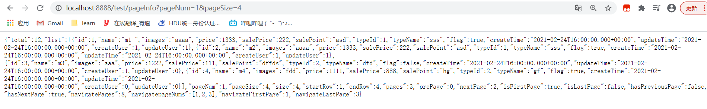
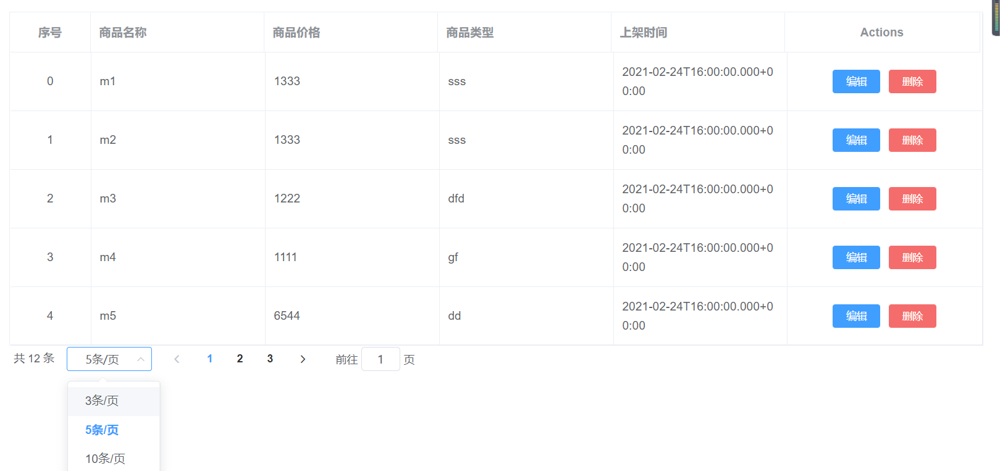

# 一. 简介

Vue (读音 /vjuː/，类似于 **view**) 是一套用于构建用户界面的**渐进式框架**。与其它大型框架不同的是，Vue 被设计为可以**自底向上**逐层应用。Vue 的核心库**只关注视图层**，不仅易于上手，还便于与第三方库或既有项目整合。另一方面，当与现代化的工具链以及各种支持类库结合使用时，Vue 也完全能够为复杂的单页应用提供驱动。


## 1. vue的特性

1. 轻量级的框架
2. 移动优先
3. 双向数据绑定
4. 指令
5. 插件化（组件化）


## 2. MVVM

Vue技术是MVVM开发模式的实现者。

```
『View』：视图层（UI 用户界面）
『ViewModel』：业务逻辑层（一切 js 可视为业务逻辑）
『Model』：数据层（存储数据及对数据的处理如增删改查）。vue.js就是MVVM中VM层的实现者
```

- MVVM 将数据**双向绑定**（data-binding）作为核心思想，View 和 Model 之间没有联系，它们通过 ViewModel 这个桥梁进行交互。

- Model 和 ViewModel 之间的交互是双向的，因此 View 的变化会自动同步到 Model，而 Model 的变化也会立即反映到 View 上显示。

- 当用户操作 View，ViewModel 感知到变化，然后通知 Model 发生相应改变；反之当 Model 发生改变，ViewModel 也能感知到变化，使 View 作出相应更新。


## 3. vue的开发模式

- 通过 script 标签直接引入 vue.js
- 通过 Vue 的脚手架工具 vue-cli 来进行一键项目搭建


## 4. vue的优点

- 简单轻巧，功能强大，拥有非常容易上手的 API；

- 可组件化 和 响应式设计；

- 实现数据与结构分离，高性能，易于浏览器的加载速度；

- MVVM 模式，数据双向绑定，减少了 DOM 操作，将更多精力放在数据和业务逻辑上。


# 二. 快速开始

## 1. hello vue

```html
<!DOCTYPE html>
<html lang="en">
<head>
    <meta charset="UTF-8">
    <title>Title</title>
</head>
<body>

<div id="app">
    <span>{{title}}</span> <!--插值表达式，获取data中的数据-->
    <input type="text" v-model="title" />
</div>

</body>
<script src="https://cdn.bootcdn.net/ajax/libs/vue/2.6.10/vue.js"></script> <!--cdn引入vue.js-->
<script>
    new Vue({
        el:'#app', //用于绑定vue对象与视图
        data:{
            title:'hello vue' //提供数据，将来会通过Ajax从后端获取
        }
    });
</script>
</html>
```

- 引入vue.js的cdn，就可以使用vue了
- ```<div id="app"></div>```用于vue对象的绑定
- 创建Vue对象，el属性用于绑定视图中的元素，data属性提供数据
- 被绑定的视图元素中，就可以用插值表达式取数据了


## 2. 差（插）值表达式

插值表达式用在被vue对象绑定的前端元素中，目的是获取vue对象中的属性和方法。

- 属性由data:{  }提供
- 方法由methods:{ }提供

语法：{{ }}   ，两个大括号

```html
<body>

<div id="app">
    我是一位{{major}}程序员</br> 
    我有一个宠物{{ pets[1] }}，它的名字是{{ dog.name }}</br>
    {{ sayHi() }}
</div>

</body>
<script src="https://cdn.bootcdn.net/ajax/libs/vue/2.6.10/vue.js"></script>
<script>
    new Vue({
        el:'#app',
        data:{
            major:'java',
            pets:['cat','dog','pig'],
            dog:{name:'pp',age:3}
        },
        methods:{
            sayHi:function () {
                alert('hi')
            }
        }
    });
</script>
</html>
```

- 键值对直接取
- 数组用下标取
- 对象用“."属性取
- 方法放在methods{}中，用方法名()取


# 三、vue的指令

这些指令都是作为HTML标签中的属性。

## 1.v-model（数据绑定）

是将**标签中的value值**与vue实例中的**data属性值**进行绑定。

```html
<div id="app">
    <span>{{title}}</span> <!--插值表达式，获取data中的数据-->
    <input type="text" v-model="title" /><!--绑定了input标签的value值与vue实例data中的属性title值-->
</div>

<script>
    new Vue({
        el:'#app', //用于绑定vue对象与视图
        data:{
            title:'hello vue' 
        }
    });
</script>
```


## 2. v-on （绑定事件）

通过具体的事件名，绑定事件与vue实例中定义的函数。

```html
 <input type="text" v-on:input="changeMajor"/><!--一旦有输入事件，就会调用changeMajor函数-->

<script>
    new Vue({
        el:'#app',
        data:{
            major:'java',
            pets:['cat','dog','pig'],
            dog:{name:'pp',age:3}
        },
        methods:{
            sayHi:function () {
                alert('hi');
            },
            changeMajor:function () {
                alert('change');
            }
        }
    });
</script>
```


补充知识：

1. **内置参数对象event**：响应函数里加上内置参数对象event，该对象表示当前事件，可以用event.target.value获取事件作用元素的value值
2. **this的用法**：this表示当前的vue对象，可以通过”this.“调用vue里的属性和方法
3. **v-on可以简写**：v-on:input=""可以简写为@input=""

```html
<body>
<div id="app">
    我是一位{{major}}程序员</br> <!--会随着input标签输入的值变化而变化-->
	 <input type="text" @input="changeMajor"/><!--一旦有输入事件，就会调用changeMajor函数-->
</div>
</body>

<script src="https://cdn.bootcdn.net/ajax/libs/vue/2.6.10/vue.js"></script>
<script>
    new Vue({
        el:'#app',
        data:{
            major:'java'
        },
        methods:{
            sayHi:function () {
                alert('hi');
            },
            changeMajor:function (event) { //event是内置的参数对象，表示当前事件
            this.major=event.target.value; //修改data中的属性值必须加上this
            }
        }
    });
</script>
```


参数传递：

```html
<body>
<div id="app">
    {{count}}
    <button type="button" @click="addbtn">增加</button>
    <button type="button" @click="relsbtn(5)">减少</button>
    <input type="text" v-model="step">
    {{ count>10 ? 'count大于10' : 'count不大于10' }} <!--插值表达式还有这种用法-->
</div>
</body>

<script src="https://cdn.bootcdn.net/ajax/libs/vue/2.6.10/vue.js"></script>
<script>
    new Vue({
        el:'#app',
        data:{
            count:0,
            step:1
        },
        methods:{
            addbtn:function () {
                this.count += this.step*1;
            },
            relsbtn:function (step) { //参数传递
                this.count -= step*1;
            }
        }
    });
</script>
```


### 事件修饰符

```html
<!-- 阻止单击事件继续传播 -->
<a v-on:click.stop="doThis"></a>

<!-- 提交事件不再重载页面 -->
<form v-on:submit.prevent="onSubmit"></form>

<!-- 修饰符可以串联 -->
<a v-on:click.stop.prevent="doThat"></a>

<!-- 只有修饰符 -->
<form v-on:submit.prevent></form>

<!-- 添加事件监听器时使用事件捕获模式 -->
<!-- 即内部元素触发的事件先在此处理，然后才交由内部元素进行处理 -->
<div v-on:click.capture="doThis">...</div>

<!-- 只当在 event.target 是当前元素自身时触发处理函数 -->
<!-- 即事件不是从内部元素触发的 -->
<div v-on:click.self="doThat">...</div>

<!-- 点击事件将只会触发一次 -->
<a v-on:click.once="doThis"></a>

<!-- 只有在 `key` 是 `Enter` 时调用 `vm.submit()` -->
<input v-on:keyup.enter="submit">
```


## 3. v-bind (属性绑定)

插值表达式是不能作用在HTML标签内部的属性中的，如果要用vue中的属性值作为HTML标签属性的值，就可以用v-bind进行属性绑定。

```html
<body>
<div id="app">
 <a v-bind:href="link">百度</a>
</div>
</body>
<script src="https://cdn.bootcdn.net/ajax/libs/vue/2.6.10/vue.js"></script>

<script>
    new Vue({
        el:'#app',
        data:{
            link:'http://www.baidu.com'
        }
    });
</script>
</html>
```

**v-bind可以简写：** v-bind:href=" "可以简写为 **:href=" "**


## 4. v-once

此标签中的插值表达式，只获取一次数据，之后数据的变化不会影响该插值表达式的值。

```html
<body>
<div id="app">
    <p>{{link}}</p> <!--会随着input输入改变而改变-->
    <p v-once>{{link}}</p> <!--不会变-->
    <input type="text" v-model="link">
</div>
</body>
<script src="https://cdn.bootcdn.net/ajax/libs/vue/2.6.10/vue.js"></script>

<script>
    new Vue({
        el:'#app',
        data:{
            link:'http://www.baidu.com'
        }
    });
</script>
```


## 5. v-html和v-text

- v-html会将vue中属性的值作为HTML的元素来使用
- v-text只会将vue中属性的值作为纯文本来使用

```html
<body>
<div id="app">
 <span v-html="link"></span> <br> 
 <span v-text="link"></span>

</div>
</body>
<script src="https://cdn.bootcdn.net/ajax/libs/vue/2.6.10/vue.js"></script>

<script>
    new Vue({
        el:'#app',
        data:{
            link:' <a href="http://www.baidu.com">百度</a> '
        }
    });
</script>
```


## 6. 分支判断语句

- v-if
- v-else-if
- v-else

```html
<body>
<div id="app">
    <p v-if="num == 1">{{num}}</p>
    <p v-if="str=='hh'">{{str}}</p>
    <p v-show="temp">看到我了</p> <!--用法上和v-if相同，但是它是操作display，更高效-->
    <p v-if="temp">看到我了</p><!--temp为true时能显示-->
    <p v-else-if="temp1">!!!!!</p><!--temp为false，temp1为true时显示-->
    <p v-else>看到他了</p> <!--temp为false，temp1为false时显示-->
    <button type="button" @click="temp=!temp">点我</button>
    <button type="button" @click="temp1=!temp1">点我!</button>
</div>
</body>
<script src="https://cdn.bootcdn.net/ajax/libs/vue/2.6.10/vue.js"></script>
<script>
    new Vue({
        el:'#app',
        data:{
            temp:false,
            temp1:true,
            num:1,
            str:'hh'
        }
    });
</script>
```

- **v-show**：用法上和v-if是相同的，布尔值对象是true时，display不为none，元素显示；布尔值对象是false时，display为none，元素不显示。 所以v-show效率上更高。**template模板标签不能与v-show一起使用。**


## 7. 循环语句 v-for 

**要用到关键字 “ in ” ！**

> 普通的for

```html
<body>
<div id="app">
    <ul>
        <li v-for="arg in args">{{arg}}</li>
    </ul>
</div>
</body>
<script src="https://cdn.bootcdn.net/ajax/libs/vue/2.6.10/vue.js"></script>
<script>
    new Vue({
        el:'#app',
        data:{
            args:[1,2,3,4,5,6]
        }
    });
</script>
```

> 含有下标的for

```html
<body>
<div id="app">
    <ul>
        <li v-for="(arg,i) in args" :key="i">{{i}}-----{{arg}}</li> <!--i是下标，:key是为了虚拟dom更高效-->
    </ul>
</div>
</body>
<script src="https://cdn.bootcdn.net/ajax/libs/vue/2.6.10/vue.js"></script>
<script>
    new Vue({
        el:'#app',
        data:{
            args:[1,2,3,4,5,6]
        }
    });
</script>
```

> 遍历对象

```html
<body>
<div id="app">
    <ul>
        <li v-for="value in student">{{value}}</li> <!--遍历对象时，默认遍历出的是对象中的value值-->
    </ul>

    <ul>
        <li v-for="(v,k,i) in student">{{k}}=={{v}}=={{i}}</li> <!--key,value,下标-->
    </ul>

    <ul>
        <li v-for="student in students">
            <span v-for="(v,k,i) in student">{{i}}--{{k}}--{{v}}</span>
        </li>
    </ul>
</div>
</body>

<script src="https://cdn.bootcdn.net/ajax/libs/vue/2.6.10/vue.js"></script>
<script>
    new Vue({
        el:'#app',
        data:{
            student:{
                name: 'xiaoming',
                age:3
            },
            students:[
                {
                    name: 'xiaoming',
                    age:3
                },
                {
                    name: 'jack',
                    age:5
                }
            ]
        }
    });
</script>
```


# 四、计算属性 computed

计算属性的重点突出在**属性**这两个字上（属性是名词），首先它是个属性，其次它有计算能力（计算是动词），这里的计算就是一个函数。简单来说，它是能将计算结果缓存起来的属性，**提高效率**。

```html
<body>
<div id="app">

    <p>currentTime1: {{currentTime1()}}</p>
    <p>currentTime2: {{currentTime2}}</p> <!--属性，不加括号-->

</div>
<script src="https://cdn.bootcdn.net/ajax/libs/vue/2.6.10/vue.js"></script>
<script>
    var vm=new Vue({
        el:"#app",
        data: {
            message: "hello"
        },
        methods: {
            currentTime1: function () {
                return Date.now();
            }
        },
        computed: { //计算属性,会缓存计算结果
            currentTime2: function () {
                 this.message; //函数中变量值改变，结果也会自动更新
                return Date.now();
            }
        }
    });
</script>
</body>
```


# 五、属性监控 watch

- 通过watch监控属性，给属性绑定函数，**属性的值一旦改变，函数就会自动被调用**。
- 函数可以接收两个参数，第一个参数是属性改变后的值（新值），第二个是旧值

```html
<body>
<div id="app">
    {{message}}
    <input type="text" v-model="message">

</div>
<script src="https://cdn.bootcdn.net/ajax/libs/vue/2.6.10/vue.js"></script>
<script>
    var vm=new Vue({
        el:"#app",
        data: {
            message: "hello"
        },
        watch:{
            message:function (newvalue,oldvalue) {
                console.log("newValue: " + newvalue + "\noldValue: " + oldvalue);
            }
        }
    });
</script>
</body>
```


# 六、vue改变样式

## 0.scoped属性

```<style>```标签中带有scoped属性时，样式只能作用于该组件；没有scoped时，样式作用于整个页面。


## 1.样式的动态绑定

通过给HTML元素的class属性绑定一个布尔值，得到样式的动态绑定。

```html
<head>
    <meta charset="UTF-8">
    <title>Title</title>
    <style>
        .mydiv{
            width: 400px;
            height: 220px;
            background-color: gray;
        }
        .red{
            background-color: red;
        }
    </style>
</head>
<body>
<div id="app">
    <div class="mydiv" v-bind:class="{red:temp}"></div><!--传入的是个对象，temp为true时class=red，否则不赋值-->
    <button type="button" @click="temp=!temp">点我</button>
</div>
</body>
<script src="https://cdn.bootcdn.net/ajax/libs/vue/2.6.10/vue.js"></script>
<script>
    new Vue({
        el:'#app',
        data:{
            temp:true
        }
    });
</script>
```

## 2. 加入computed

由于v-bind:class=""需要传入一个对象，所以计算属性返回一个对象即可，对象里可以有多个键值对。

```html
<head>
    <meta charset="UTF-8">
    <title>Title</title>
    <style>
        .mydiv{
            width: 400px;
            height: 220px;
            background-color: gray;
        }
        .red{
            background-color: red;
        }
        .yellow{
            background-color: yellow;
        }
        .width{
            height: 400px;
        }
    </style>
</head>
<body>
<div id="app">
    <div class="mydiv" v-bind:class="{red:temp}"></div><!--传入的是个对象，temp为true时class=red，否则不赋值-->
    <div class="mydiv" :class="mystyle"></div> <!--由于mystyle返回的同样是个对象，所以和上面的也没什么区别-->

    <button type="button" @click="temp=!temp">点我</button>
</div>
</body>
<script src="https://cdn.bootcdn.net/ajax/libs/vue/2.6.10/vue.js"></script>
<script>
    new Vue({
        el:'#app',
        data:{
            temp:true
        },
        computed:{
            mystyle:function () { /*返回的是一个对象*/
                return {
                    yellow:this.temp,
                    width:this.temp
                }
            }
        }
    });
</script>
```

## 3. 数组绑定多个样式

```html
<head>
    <meta charset="UTF-8">
    <title>Title</title>
    <style>
        .mydiv{
            width: 400px;
            height: 220px;
            background-color: gray;
        }
        .width{
            height: 400px;
        }
        .green{
            background-color: green;
        }
    </style>
</head>
<body>
<div id="app">
    <div class="mydiv" :class="[mycolor,mywidth]"></div><!--绑定多个样式时，需要用数组-->
</div>
</body>
<script src="https://cdn.bootcdn.net/ajax/libs/vue/2.6.10/vue.js"></script>
<script>
    new Vue({
        el:'#app',
        data:{
            temp:true,
            mycolor:'green',
            mywidth:'width'
        }
    });
</script>
```

## 4. style属性中绑定样式

- 绑定style后，传入的是个对象，键是style的属性，要用驼峰命名法；值是vue中的属性
- 同样可以用computed

```html
<head>
    <meta charset="UTF-8">
    <title>Title</title>
    <style>
        .mydiv{
            width: 400px;
            height: 220px;
            background-color: gray;
        }
    </style>
</head>
<body>
<div id="app">
    <div class="mydiv" style="background-color: brown"></div>
    <div class="mydiv" :style="{backgroundColor:bcg}"></div> <!--同样是传入对象，键是style的属性，
                                                        要用驼峰命名法；值是vue中的属性-->
</div>
</body>
<script src="https://cdn.bootcdn.net/ajax/libs/vue/2.6.10/vue.js"></script>
<script>
    new Vue({
        el:'#app',
        data:{
            bcg:'red'
        }
    });
</script>
```

## 5. style绑定多个样式

```html
<head>
    <meta charset="UTF-8">
    <title>Title</title>
    <style>
        .mydiv{
            width: 400px;
            height: 220px;
            background-color: gray;
        }
        .red{
            background-color: red;
        }
    </style>
</head>
<body>
<div id="app">
    <!--styleof是计算属性，返回的是个对象；对象的值还可以进行字符串的组合-->
    <div class="mydiv" :style="[styleof,{height:myheight+'px'}]"></div>
</div>
</body>
<script src="https://cdn.bootcdn.net/ajax/libs/vue/2.6.10/vue.js"></script>
<script>
    new Vue({
        el:'#app',
        data:{
            bcg:'red',
            ofwidth: 450,
            myheight:100
        },
        computed:{
            styleof:function () {
                return{
                    backgroundColor:this.bcg,
                    width: this.ofwidth + 'px'
                }
            }
        }
    });
</script>
```


# 七、vue核心：虚拟dom和diff算法


#  八、Vue实例（对象）

## 1. Vue对象之间的操作

页面中可以有多个vue实例，绑定不同的div。Vue实例间可以互相调用**方法**和**属性**。

```html
<body>

<div id="app1">
    {{title}}
    <button type="button" @click="toUpper">点我</button>
</div>

<div id="app2">
    <button type="button" @click="changeV1Title">改变v1属性</button><!--方法中调用了v1的属性-->
    <button type="button" @click="useV1Method">使用 v1方法</button><!--方法中调用了v1的方法-->
</div>

</body>
<script src="https://cdn.bootcdn.net/ajax/libs/vue/2.6.10/vue.js"></script>
<script>
    var v1 = new Vue({
        el:'#app1',
        data:{
            title:'Hello Vue'
        },
        methods:{
            toUpper:function () {
                this.title=this.title.toUpperCase();
            }
        }
    });

    var v2 = new Vue({
        el:'#app2',
        methods:{
            changeV1Title:function () {
                v1.title='Java nb';
            },
            useV1Method:function () {
                v1.toUpper();
            }
        }
    });
</script>
```

## 2. Vue的实例属性

- **属性**：来自于data或computed中的属性，直接通过“ **对象名.** ”的方式调用。
- **实例属性**：vue对象中的el、data等等这些键也称为属性，这就是实例属性，通过“ 对象名.$ ”的方式调用。


> ref的使用

- vue中往往用ref属性代替id的使用。可以通过vue的**实例属性refs**快速找到页面中的某个元素。

```html
<body>

<div id="app">
    {{title}}
    <button type="button" ref="btn1" @click="findMe">点我</button> <!--ref相当于id-->
    <button type="button" ref="btn2" @click="findMe">点我</button>
</div>

</body>
<script src="https://cdn.bootcdn.net/ajax/libs/vue/2.6.10/vue.js"></script>
<script>
    var data = {
        title:'hello vue'
    };

    var v1 = new Vue({
        el:'#app',
        data:data,    /*可以通过对象去赋值*/
        methods:{
            findMe:function () {
                this.$refs.btn1.innerHTML='hello';/*找到ref为btn1的HTML元素*/
            }
        }
    });

</script>
```

## 3. 动态绑定vue实例与页面 

通过实例属性**mount**来实现。

- 之前vue实例与页面元素的绑定是通过el的方式来绑定的。
- 也可以通过实例属性mount来动态绑定。

```html
<body>
<div id="app">

</div>
</body>

<script src="https://cdn.bootcdn.net/ajax/libs/vue/2.6.10/vue.js"></script>
<script>
    var vue = new Vue({
        template:'<h1>你好</h1>'
    });
    vue.$mount('#app'); /*把vue实例动态进行绑定到app上*/
</script>
```


# 九、Vue组件

Vue的一大特性：组件化。可以将**Vue对象作为一个组件**，被反复使用。


## 1. Vue组件的使用（全局注册）

要想实现组件化，需要在页面中注册组件。注册方式有两种：**全局注册**和**本地注册**。

1. 注册组件（全局注册）

   通过**Vue.component("组件名", {vue对象})**进行全局注册

2. 使用组件

   **在被vue实例绑定了的HTML中才能使用组件**。

```html
<body>
    <div id="app">
        <model></model> <!--组件可以被反复使用-->
        <model></model>
        <model></model>
    </div>
</body>
<script src="https://cdn.bootcdn.net/ajax/libs/vue/2.6.10/vue.js"></script>
<script>
    Vue.component("model", {     /*Vue对象的静态方法，参数一是组件名，参数二是vue对象*/
        template:"<div>" + /*template是组件要显示的内容*/
            "{{title}}<button type='button' @click='btn'>点我</button>" +
            "</div>",
        data:function () { /*这里的数据变成了函数，函数返回的是数据（对象）*/
            return {
                title:"hello vue" /*可以用插值表达式，也能直接this.title调用*/
            };
        },
        methods:{
            btn:function () {
                this.title='Java'; /*this表示的是当前的Vue对象（第二个参数）*/
            }
        }
    });

    new Vue({   /* 在被vue绑定了的html中才能使用组件 */
        el:'#app'
    });
</script>
```

## 2. 作为组件的vue对象的注意事项

> 特点1

作为组件的vue对象中，**data实例属性写法**和之前的vue对象中data的写法是不同的。

```js
new Vue({
	data:{  //data中直接放对象
		name:'ct'
	}
});

Vue.component("组件名",{
    data:function(){ //data中放的是方法，返回值是对象
        return {
			name:'ct'
		}
    }
})
```


> 特点2

template是将内容展现在页面上的一个键，值是一个字符串。

作为组件的vue对象中，**template里必须有且只有一个根元素**。

```html
template: "<div>{{title}}<button type='button' @click='btn'>点我</button></div>"  //正确

template: "{{title}}<button type='button' @click='btn'>点我</button>"  //错误
```

## 3. vue组件的本地（局部）注册

- 全局注册：任意一个被vue绑定了的div元素中，都可以使用全局注册的组件。
- 局部注册：只能在当前vue绑定的元素中，使用该局部注册的组件。

```html
<body>
    <div id="app1">
        <model1></model1>
    </div>

    <div id="app2">
        <model2></model2>
    </div>
</body>
<script src="https://cdn.bootcdn.net/ajax/libs/vue/2.6.10/vue.js"></script>
<script>
    var model = {
        template:"<div>" + /*template是组件要显示的内容*/
            "{{title}}<button type='button' @click='btn'>点我</button>" +
            "</div>",
        data:function () { /*这里的数据变成了函数，函数返回的是数据（对象）*/
            return {
                title:"hello vue" /*可以用插值表达式，也能直接this.title调用*/
            };
        },
        methods:{
            btn:function () {
                this.title='Java'; /*this表示的是当前的Vue对象（第二个参数）*/
            }
        }
    };

    new Vue({
        el:'#app1',
        components:{  /*本地注册*/
            model1 : model /*键相当于组件名，值是vue对象*/
        }
    });
    new Vue({
        el:'#app2',
        components:{
            model2 : model
        }
    });
</script>
```


## 4. Vue实例生命周期钩子函数

一个vue对象会经历 创建、绑定、更新、销毁等阶段，不同的阶段都会有相应的生命周期钩子函数被调用。


```html
<body>
    <div id="app">
        <input type="text" v-model="name">
    </div>
</body>
<script src="https://cdn.bootcdn.net/ajax/libs/vue/2.6.10/vue.js"></script>
<script>
    new Vue({
        el:'#app',
        beforeCreate:function () {
            console.log('beforeCreate')
        },
        created:function () {
            console.log('created')
        },
        beforeMount:function () {
            console.log('beforeMount')
        },
        mounted:function () {
            console.log('mounted')
        },
        beforeUpdate:function () {
            console.log('beforeUpdate')
        },
        updated:function () {
            console.log('updated')
        },
        beforeDestroy:function () {
            console.log('beforeDestroy')
        },
        destroyed:function () {
            console.log('destroyed')
        },
        data:{
            name:'hh'
        }
    });
</script>
```


# 十、vue结合bootstrap搭建页面

直接组合起来用就好。

```html
<!DOCTYPE html>
<html lang="zh-CN">
<head>
    <meta charset="utf-8">
    <title>Bootstrap 101 Template</title>

    <!-- Bootstrap -->
    <link href="https://cdn.jsdelivr.net/npm/bootstrap@3.3.7/dist/css/bootstrap.min.css" rel="stylesheet">
</head>
<body>

<div class="container" id="app">
    
</div>


<!-- jQuery (Bootstrap 的所有 JavaScript 插件都依赖 jQuery，所以必须放在前边) -->
<script src="https://cdn.jsdelivr.net/npm/jquery@1.12.4/dist/jquery.min.js"></script>
<!-- 加载 Bootstrap 的所有 JavaScript 插件。你也可以根据需要只加载单个插件。 -->
<script src="https://cdn.jsdelivr.net/npm/bootstrap@3.3.7/dist/js/bootstrap.min.js"></script>

<script src="https://cdn.bootcdn.net/ajax/libs/vue/2.6.10/vue.js"></script>
<script>

</script>
</body>
</html>
```


# 十一、VUE开发模式

##  vue-cli脚手架工具

后端用maven来创建项目，有两个目的：

1. 通过maven的依赖机制，能够方便地管理依赖
2. 来确定maven的项目结构，即有哪些文件，文件夹是怎样的层级关系

vue项目同样有项目结构，vue-cli这种脚手架工具就如同maven一样，vue-cli里存放了很多常用的项目骨架，直接拿来用就可以搭建出一个拥有成熟项目结构的项目。


### 该怎么用？

1. 安装node.s。

   ```
   node.js镜像下载：https://mirrors.huaweicloud.com/nodejs/
   
   node.js安装教程（配置下载和缓存文件夹的路径）：https://www.cnblogs.com/aizai846/p/11441693.html
   ```

   - ```node -v ``` 查看node版本。

   - ```npm -v```  查看npm版本。

2. 安装cnpm

   ```
   npm install -g cnpm --registry=https://registry.npm.taobao.org
   // 如果之前安装过，要先卸载：https://www.jianshu.com/p/c46d1f69a76b
   ```

3. 命令行终端，利用node.js安装vue-cli

   ```bash
   npm install vue-cli -g
   //如果安装太慢，就用cnpm
   ```

   npm：表明是node.js的命令

   -g：全局安装

4. 使用vue-cli下载项目骨架，搭建项目

   用vue-cli下载webpack-simple项目模板，myvuedemo是项目名。

   ```bash
   vue init webpack-simple myvuedemo
   //vue init 骨架名  项目名
   ```

5. 安装项目依赖

   进入项目目录后：

   ```bash
   npm install
   ```

6. 使用开发模式来运行项目

   ```bash
   npm run dev
   ```

   浏览器输入网址：http://localhost:8080/，就能查看项目的首页了。


## webpack-simple项目结构


1、index.html

无论页面多么复杂，index.html都只有11行：

```html
<!DOCTYPE html>
<html lang="en">
  <head>
    <meta charset="utf-8">
    <title>y</title>
  </head>
  <body>
    <div id="app"></div>
    <script src="/dist/build.js"></script>
  </body>
</html>
```

实际的内容在src目录下，被打包进了"/dist/build.js"中。

2、main.js

是整个vue项目的入口js

```js
import Vue from 'vue' /*固定有的*/
import App from './App.vue' /*导入了App.vue组件*/

new Vue({
  el: '#app', /*绑定首页的div（id为app）*/
  render: h => h(App) /*让App.vue的内容展现在该div中*/
})
```

3.App.vue

**这种以“.vue”为扩展名的文件，实际上就是一个vue对象。这种文件，也称为组件。**

idea中需要安装vue.js插件。再进行配置：


# 十二、App.vue

## 1、.vue文件（vue组件）的三大组成部分

```vue
<template> <!--放HTML的部分-->
  <div id="app"> <!--必须有个根标签-->

  </div>
</template>

<script> /*放js的部分*/
export default { /*暴露一个默认的vue对象*/
  name: 'app',
  data () {
    return {
      msg: 'Welcome to Your Vue.js App'
    }
  },
  methods:{},
  computed:{},
  watch:{}
}
</script>

<style> /*放css的部分*/

</style>
```


## 2、在App.vue组件中使用另一个组件

需求：


在src目录下建components目录，components目录下编写Header.vue、Content.vue、Bottom.vue：

>  Header.vue

```vue
<template>
    <div>
      <h1>{{title}}</h1>
    </div>
</template>

<script>
    export default {
        name: "Header",
      data() {
          return {
            title:'宝淘私人用品分享网站'
          }
      }
    }
</script>

<style scoped>

</style>
```

......

### 全局注册

是在main.js中，通过import和Vue.component配合，来将一个.vue组件注册成为一个标签。该标签可以在整个项目（任何其他组件）中使用。

```js
import Vue from 'vue'
import App from './App.vue'

//----------------------------------------------------------------------------
import Header from './components/Header.vue'
import ctContent from './components/Content' /*可以取不同的名字，.vue也可以省略*/
import Bottom from './components/Bottom'

//全局注册三个组件，可以把组件拿来当标签一样使用了
Vue.component('myHeader',Header);
Vue.component('myContent',ctContent);
Vue.component('myBottom',Bottom);
//----------------------------------------------------------------------------

new Vue({
  el: '#app', /*绑定首页的div（id为app）*/
  render: h => h(App) /*让App.vue的内容展现在该div中*/
}) 
```

然后就可以在App.vue中使用```<myHeader>```、```<myContent>```、```<myBottom>```标签来显示组件中的内容了。


### 本地注册

在组件的内部通过import和componts实例属性去注册一个组件，成为一个标签，这个标签只在该组件内部才能使用，而不能在其它组件中使用。

```vue
<template>
  <div id="app">
    <myHeader></myHeader>
    <myContent></myContent>
    <myBottom></myBottom>
  </div>
</template>

<script>
  import Bottom from "./components/Bottom";
  import Content from "./components/Content";
  import Header from "./components/Header";

  export default {
    name: 'app',
    components:{
      "myHeader":Header,
      "myContent":Content,
      "myBottom":Bottom
    }
  }
</script>

<style lang="scss">

</style>
```


# 十三、组件间的参数传递

## 父传子 props

1. 子组件中设参数props，props中的参数也是vue对象的属性，属性值由父组件传入
2. 父组件可以在子组件标签的属性中，直接传入或通过属性绑定传入参数的值
3. 插值表达式获取vue对象的属性值，来自data、computed、props

> 子组件 Content.vue

```vue
<template>
    <div>
      商品列表
      {{myTitle}}
    </div>
</template>

<script>
    export default {
        name: "Content",
        props:['myTitle']  /*设置参数，可以由父组件传参；也是属性，可以通过插值表达式或this.myTitle获取*/
      
    }
</script>

<style scoped>

</style>
```

> 父组件 App.vue

```vue
<template>
  <div id="app">

    <myContent :myTitle="msg"></myContent> 

  </div>
</template>

<script>
export default {
  name: 'app',
  data() {
    return {
      msg: 'hello vue!'
    }
  }

}
</script>

<style>

</style>
```


## props的两种写法

1. 数组

   如：props:['myProp1', 'myProp2', ......]

2. 对象

   可以指定参数的一些其它信息

   - type
   - required
   - default

   如：props:{myProp1:{tpye:String,required:true,default:'XX'},myProp2:{...}, ...}

   ```js
   props:{
       'myTitle':{
           type:String,
           required:true,  /*是否是必须传入的*/
           default:'XX'
       }
   }
   ```

   

## 子传父

实质还是父传子，没什么区别，只不过父组件中的函数传到子组件，由子组件来调用了：

1. 子组件依旧在props中设置参数

2. 父组件同样的方法传值，只不过**传的值是一个函数**：

   该函数中含有参数，参数由子组件传入

3. 子组件就可以调用props中的函数（就是所设的参数），传入子组件的数据，这样父组件中的方法就被执行了

4. 由于是子组件调用父组件的函数，就实现了子组件数据传到父组件了

> 父组件

```vue
<template>
  <div id="app">

    <myContent :myTitle="msg" :btnFunc="faBtnFunc"></myContent> <!--给子组件传入数据和方法-->

  </div>
</template>

<script>
export default {
  name: 'app',
  data() {
    return {
      msg: 'hello vue!'
    }
  },
  methods:{
    faBtnFunc:function (m) {
        this.msg = m;
    }
  }

}
</script>

<style>

</style>
```

> 子组件

```vue
<template>
    <div>
      商品列表
      {{myTitle}} <!--获取父组件传入的数据-->
      <button type="button" @click="btnFunc('java nb')">点我</button> <!--通过调用父组件传入的方法，给父组件传值-->
    </div>
</template>

<script>

    export default {
        name: "Content",
        props:['myTitle','btnFunc']
      /**
        props:{
          'myTitle':{
            type:String,
            required:true,
            default:'XX'
          },
          'btnFunc':{
            type: Function
          }
        }    **/
    }
</script>

<style scoped>

</style>
```


## 事件发射方式的子传父

- 在子组件中，使用**this.$emit**('事件名'，‘事件的值’)，发射一个事件
- 父组件中，在子组件的标签中使用‘ **@事件名** ’就可以监听到事件的发射了，event对象就是事件的值

> 子组件

每次点击按钮，就会发射newTitle这个事件

```js
<button type="button" @click="send">点我</button>

......

methods:{
    send:function () {
        //发射一个事件
        this.$emit("newTitle",'java nb') //参数一事件名，参数二事件的值
    }
}
```

> 父组件

一旦监听到事件的发射，就会将vue对象的msg属性赋值为Java nb

```js
<myContent :myTitle="msg" @newTitle="msg=$event"></myContent>
```


# 十四、axios

## 1. axios是什么

Axios 是一个基于 promise 的 HTTP 库，可以用在浏览器和 node.js 中，基本请求有5种：

- get：多用来获取数据
- post：多用来新增数据
- put：多用来修改数据（需要传递所有字段，相当于全部更新）
- patch：多用来修改数据，是在put的基础上新增改进的，适用于局部更新，比如我只想修改用户名，只传用户名的字段就ok了，而不需要像put一样把所有字段传过去
- delete：多用来删除数据

axios其实和原生ajax，jquery中的$ajax类似，都是用于请求数据的，不过axios是基于promise的，也是vue官方比较推荐的做法。


## 2. axios的使用

> 0、用bootstrap搭建一个注册表单

在*index.html*中加上bootstrap的css、js和jquery的cdn，然后就可以在组件中使用bootstrap中的东西了。

*index.html*

```html
<link href="https://cdn.jsdelivr.net/npm/bootstrap@3.3.7/dist/css/bootstrap.min.css" rel="stylesheet">

<script src="https://cdn.jsdelivr.net/npm/jquery@1.12.4/dist/jquery.min.js"></script>
<script src="https://cdn.jsdelivr.net/npm/bootstrap@3.3.7/dist/js/bootstrap.min.js"></script>
```


*App.vue*

```vue
<template>
  <div id="app">
    <div style="width:50%" class="container">
      <div>
        <h3>Register</h3>
        <h5>Email</h5>
        <input type="text" class="form-control" v-model="mail"/> <br/>
        <h5>Password</h5>
        <input type="password" class="form-control" v-model="password"/> <br/>
        <h5>Gender</h5>
        <input type="radio" name="gender" v-model="gender" value="female"/>男
        <input type="radio" name="gender" v-model="gender" value="male"/>女 <br/>
        <h5>Hobby</h5>
        <input type="checkbox" name="hobby" v-model="hobby" value="music"/>音乐
        <input type="checkbox" name="hobby" v-model="hobby" value="movie"/>电影
        <input type="checkbox" name="hobby" v-model="hobby" value="sport"/>运动
        <br/>
        <button type="button" class="btn btn-success">注册</button>
      </div>
    </div>
  </div>
</template>

<script>
export default {
  name: 'app',
  data () {
    return {
      mail: '',
      password:'',
      gender:'',
      hobby:''
    }
  }
}
</script>

<style lang="scss">

</style>
```


> 1、在项目终端中安装axios

```bash
npm install --save axios vue-axios
```

安装完后，再 npm install 一下。


> 2、在main.js中引入

```js
import axios from "axios"
import VueAxios from "vue-axios"

Vue.use(VueAxios,axios);
```


> 3、使用axios

```js
methods:{
    registfn:function () {
        this.axios({
          method:'get',
          url:'http://localhost:8000/springmvc_04/register?mail='+this.mail+'&password='+this.password
        })
      .then(function (response) {
        console.log(response.data)
      })
}
```


> 4、可行的操作

可以用钩子函数，在vue组件创建时去获取数据

```js
created() {
      this.axios({
        method:'get',
        url:'http://localhost:8000/springmvc_04/register?mail='+this.mail+'&password='+this.password,
        data(){}
      })
        .then(function (response) {
          this.$data=response.data;
        })
    }
```


## 3. 解决post请求无法携带参数的问题

安装qs插件

```bash
npm install qs
```

全局引入

```js
//在需要用到的组件中引入qs
import  qs from 'qs'
```

使用

```js
qs.stringify()
qs.parse()
```


## 4. 跨域问题

### 什么是跨域？

跨域，指的是浏览器不能执行其他网站的脚本。它是由浏览器的同源策略造成的，是浏览器施加的安全限制。

前端调用的后端接口不属于同一个域（域名或端口或协议不同），就会产生跨域问题，也就是说你的应用访问了该应用域名或端口之外的域名或端口。

```
http://www.123.com/index.html 调用 http://www.123.com/server.php （非跨域）

http://www.123.com/index.html 调用 http://www.456.com/server.php （主域名不同:123/456，跨域）

http://abc.123.com/index.html 调用 http://def.123.com/server.php （子域名不同:abc/def，跨域）

http://www.123.com:8080/index.html 调用 http://www.123.com:8081/server.php （端口不同:8080/8081，跨域）

http://www.123.com/index.html 调用 https://www.123.com/server.php （协议不同:http/https，跨域）
```


前后端不分离时，前端和后端都在一个项目里，域名、端口、协议都是相同的，就不会产生跨域问题了。前后端分离后，前端是一个项目，后端又是一个项目，端口、协议和域名中有一个不同，就产生了跨域问题。


### 跨域报什么错？


要同时满足三个条件才会产生跨域问题，这也就是为什么会产生跨域的原因。

- 1、浏览器限制，而不是服务端限制，可以查看Network，请求能够正确响应，response返回的值也是正确的
- 2、请求地址的域名或端口和当前访问的域名或端口不一样（还有协议）
- 3、发送的是XHR（XMLHttpRequest）请求，可以使用 a 标签（模拟xhr请求）和 img 标签（模拟json请求）做对比（控制台只报了一个跨域异常）


### 如何解决跨域问题

> 1、用 CORS（跨资源共享）解决跨域问题

CORS 是一个 W3C 标准，全称是"跨域资源共享"（Cross-origin resource sharing）。它允许浏览器向跨源服务器，发出 XMLHttpRequest 请求，从而克服了 AJAX 只能同源使用的限制。

CORS 需要浏览器和服务器同时支持。目前，所有浏览器都支持该功能，IE 浏览器不能低于 IE10。整个 CORS 通信过程，都是浏览器自动完成，不需要用户参与。对于开发者来说，CORS 通信与同源的 AJAX 通信没有差别，代码完全一样。浏览器一旦发现 AJAX 请求跨源，就会自动添加一些附加的头信息，有时还会多出一次附加的请求，但用户不会有感觉。因此，**实现 CORS 通信的关键是服务器**。只要服务器实现了 CORS 接口，就可以跨源通信（在 `header` 中设置：`Access-Control-Allow-Origin`）


> 2、使用 JSONP 解决跨域问题

JSONP（JSON with Padding）是 JSON 的一种“使用模式”，可用于解决主流浏览器的跨域数据访问的问题。由于同源策略，一般来说位于 `server1.example.com` 的网页无法与 `server2.example.com` 的服务器沟通，而 HTML 的 `<script>` 元素是一个例外。利用 `<script>` 元素的这个开放策略，网页可以得到从其他来源动态产生的 JSON 资料，而这种使用模式就是所谓的 JSONP。用 JSONP 抓到的资料并不是 JSON，而是任意的 JavaScript，用 JavaScript 直译器执行而不是用 JSON 解析器解析（需要目标服务器配合一个 `callback` 函数）。


> CORS与JSONP的比较

CORS 与 JSONP 的使用目的相同，但是比 JSONP 更强大。

JSONP 只支持 GET 请求，CORS 支持所有类型的 HTTP 请求。JSONP 的优势在于支持老式浏览器，以及可以向不支持 CORS 的网站请求数据。


> 3.使用 Nginx 反向代理解决跨域问题

以上跨域问题解决方案都需要服务器支持，当服务器无法设置 `header` 或提供 `callback` 时我们就可以采用 Nginx 反向代理的方式解决跨域问题。

Nginx 配置跨域案例，在 `nginx.conf` 的 `location` 中增加如下配置：

```js
add_header Access-Control-Allow-Origin *或域名;
add_header Access-Control-Allow-Headers X-Requested-With;
add_header Access-Control-Allow-Methods GET,POST,OPTIONS;
```

如：

```c
user  nginx;
worker_processes  1;

events {
    worker_connections  1024;
}

http {
    include       mime.types;
    default_type  application/octet-stream;

    sendfile        on;

    keepalive_timeout  65;

    server {
        listen 80;
        server_name 192.168.75.128;
        location / {
            add_header Access-Control-Allow-Origin *;
            add_header Access-Control-Allow-Headers X-Requested-With;
            add_header Access-Control-Allow-Methods GET,POST,OPTIONS;

            root /usr/share/nginx/wwwroot/cdn;
            index index.jsp index.html index.htm;
        }
    }
}
```


### 具体解决方案

1. @CrossOrigin注解
2. https://blog.csdn.net/itcats_cn/article/details/82318092


# 十五、路由（组件之间的跳转）

- 由于Vue在开发时对路由支持的不足，于是官方补充了vue-router插件。
- vue的单页面应用是基于路由和组件的，路由用于设定访问路径，并将路径和组件映射起来
- 传统的页面应用，是用一些超链接来实现页面切换和跳转的。在vue-router单页面应用中，则是路径之间的切换，实际上就是组件的切换。

也就是说，可以通过**路由模块**，将指定的视图显示在**路由视图**中，实现**路由跳转**。


## 1.安装路由模块

```bash
npm install vue-router -s
```


## 2. 设计路由界面

- Home.vue

  ```vue
  <template>
      <div>
        首页
      </div>
  </template>
  ```

- Products.vue

  ```vue
  <template>
      <div>
        商品列表
      </div>
  </template>
  ```


## 3.创建静态路由表

在src目录下创建routes.js (名字不能变，之后用webpack骨架时会有另一种方式)

```js
import Home from "./views/Home";
import Products from "./views/Products";

export const routes = [
  {
    path:"/Home",
    component:Home
  },
  {
    path: "/Products",
    component:Products
  }
]
```


## 4. main.js中引入路由模块以及注册路由表

```js
import Vue from 'vue'
import App from './App.vue'
import VueRouter from 'vue-router'  //1.引入路由模块
import {routes} from './routes'  // 2. 引入静态路由表

Vue.use(VueRouter); // 3. 使用路由模块

// 4.创建一个VueRouter模块的实例，注册路由表
const router = new VueRouter({
  routes:routes
});


new Vue({
  el: '#app',
  router, // 5. 把router实例放入vue实例中
  render: h => h(App)
})

```


## 5.创建路由视图和路由链接

```vue
<template>
  <div id="app">
      <div>
        <span>
          <router-link to="/Home">首页</router-link>
        </span>
        <span>
          <router-link to="/Products">商品列表</router-link>
        </span>
      </div>
      <router-view></router-view>
  </div>
</template>

<script>
export default {
  name: 'app'
}
</script>

<style>

</style>
```


## 6. 路由参数的传递

### 设参

通过路由表，设置路由参数：

```js
 {
    path: "/Products/:pid",  //id就是设置的参数
    name: Products
    component: Products
  }
```

### 传参

> 方式一

通过访问路径时携带参数，如：

```vue
<router-link to="/Products/1001">手机</router-link> 

this.$router.push('/Products/1001')
```

> 方式二

```html
<router-link :to="{name:'Products',params:{pid:1001}}">商品信息</router-link>

this.$router.push({name:'Products',params:{pid:1001}})
```

- 需要` v-bind:`进行绑定，`name`传入的是路由表中相应路径配置的name，`params`中放的是要传入的参数。
- 这时候，可以不进行设参，params中可以传多个参数


### 接参

在Products组件中，通过vue中的**$route.params.pid**获取，如：

```vue
<script>
    export default {
      name: "Products",
      data() {
          return {
            // pid: this.$route.params.pid
          }
      },
      computed:{
          pid:function () {
              return  this.$route.params.pid
          }
      },
      created() {
          console.log(this.pid)
        //可以在创建时，通过axios像后端请求id为该pid的所有商品，用于显示
      }
    }
</script>
```


## 7.路由跳转的两种方式

### router-link标签方式

```html
<router-link to="/Products/1">手机</router-link> 
```


### js方式（$router.push('路径')）

```html
<script>
var i = 1;
export default {
  name: 'app',
  methods:{
    btnfn:function () {
      this.$router.push('/Products/'+i);
      i = i%3 + 1;
    }
  }
}
</script>
```


## 8. 路由钩子函数

- `beforeRouteEnter`：进入路由前执行
- `beforeRouteLeave`：在离开路由前执行

```js
export default {
    name: "ProductInfo",
    beforeRouteEnter(to,from,next) {
        console.log("准备进入商品信息页");
        next(
            console.log("进入该页面之后要调用的函数")
        );
    },
    beforeRouteLeave(to,from,next) {
        console.log("准备离开商品信息页");
        next(
            console.log("离开该页面之后要调用的函数")
        );
    }
}
```

- `to`：路由将要跳转的页面信息
- `from`：路由跳转前的页面信息
- `next`：路由的控制参数
  - `next()`跳入下一个页面
  - `next('/path')`改变路由的跳转方向，使其跳到另一个路由
  - `next(false)`返回原来的页面
  - `next((vm)=>{})`仅在`beforeRouteEnter`中可用，vm是组件实例


# 十六、静态资源打包

## 开发模式下静态资源产生的问题

```vue
<template>
    <div>
      <div>
         <!--v-for中，不能直接取得静态资源-->
      </div>
      <div>
        
        
        
      </div>
    </div>
</template>

<script>
    export default {
      name: "Home",
      data() {
          return {
            links:[
              "../img/a.png",
              "../img/b.png",
              "../img/c.png"
            ]
          }
      }
    }
</script>

<style scoped>
 img{
   width: 200px;
   height: 200px;
   margin: 30px;
 }
</style>
```


可以看出，在开发环境下（npm run dev），使用v-for就不能访问到具体的静态资源了。原因是静态资源打包成dist文件夹时，文件的文件名被修改了。浏览器抓取如下：


## 解决方法：

```bash
npm run build
```

打包生成一个dist文件夹（webpack-simple）：


将data中的数据改为如下即可：

```js
data() {
    return {
        links:[
            "/dist/a.png",
            "/dist/b.png",
            "/dist/c.png"
        ]
    }
}
```


## 开发vue的步骤

1. 用vue-cli拉取一个项目骨架

2. 安装依赖

3. 使用  ```npm run dev```  进入开发者模式

   此时开发者模式中，各种修改都能看到实时效果，这些内容实质上是由vue-cli进行打包并发布在node.js上。最后开发完以后，这些资源是需要我们手动部署在自己的服务器上的。因此需要  ```npm run build```  来构建资源。

4. 使用  ```npm run build```  来构建资源

   会产生一个dist文件夹，里面包含所需资源。


在开发环境下，要想使用静态资源，首先通过  ```npm run build```  命令来创建dist文件夹，然后将静态资源放入，再在vue的代码中，去该dist文件夹内取资源即可。


# 十七、webpack项目

## 1. 创建工程

```bash
vue init webpack webpackdemo
```


## 2. 安装依赖

需要安装```vue-router```、```element-ui```、```sass-loader```、```node-sass```、```axios```  五个插件。

```bash
#安装vue-router
npm install vue-router --save-dev
#安装element-ui
npm i element-ui -S
#安装sass加载器，这个也可以不装
npm install sass-loader node-sass --save-dev
#安装axios
npm install --save axios vue-axios
```

然后安装依赖：

```bash
npm install
```


## 3. 配置路由模块

webpack项目骨架配置路由模块和上面的webpack-simple配置有些许不同。

### 1）配置路由表

创建```src/router```文件夹放置路由配置的代码，在该目录下创建```index.js```的路由配置文件，该文件中配置的就是路由表：

```js
import Vue from 'vue'
//导入路由插件
import Router from 'vue-router'

//导入需要路由的组件
import Login from "../views/Login"

//安装路由
Vue.use(Router);

//配置路由表
export default new Router({
  routes:[
    {
      path:'/Login',
      name:'Login', //路由名称
      component: Login
    }
  ]
})
```


### 2）main.js配置路由

```js
// The Vue build version to load with the `import` command
// (runtime-only or standalone) has been set in webpack.base.conf with an alias.
import Vue from 'vue'
import App from './App'

import VueRouter from "vue-router" //1.引入路由模块
import router from './router' //2.导入上面创建的路由配置目录（里面有配置了的路由表）

Vue.use(VueRouter); // 3. 使用路由模块

Vue.config.productionTip = false

/* eslint-disable no-new */
new Vue({
  el: '#app',
  router, // 4. 把router实例放入vue实例中
  components: { App },
  template: '<App/>'
})
```

然后就可以通过`<router-view>`、`<router-link>`等去使用了。


## 4. 使用element-ui模块

1、安装element-ui模块

```bash
npm i element-ui -S
```

2、main.js中完成了 Element 的引入

```js
import Vue from 'vue';
import ElementUI from 'element-ui';
import 'element-ui/lib/theme-chalk/index.css';
import App from './App.vue';

Vue.use(ElementUI);

new Vue({
  el: '#app',
  render: h => h(App)
});
```


## 5. 登录页搭建

```vue
<template>
    <div class="login-box">
      <h3 class="login-title">欢迎登录</h3>
      <el-form ref="form" :model="form" :rules="rules" label-width="80px">
        <el-form-item label="用户名" prop="name">
          <el-input v-model="form.name" placeholder="请输入用户名"></el-input>
        </el-form-item>
        <el-form-item label="密码" prop="password">
          <el-input type="password" v-model="form.password" placeholder="请输入密码"></el-input>
        </el-form-item>
        <el-form-item>
          <el-button type="primary" @click="onSubmit('form')" style="width:100%">登录</el-button>
        </el-form-item>
      </el-form>
    </div>
</template>

<script>
    export default {
      name: "Login",
      data() {
        return {
          form: {
            name: '',
            password:''
          },
          rules:{
            name:[
              { required: true, message: '请输入用户名', trigger: 'blur' },
              { min: 5, max: 12, message: '长度在 5 到 12 个字符', trigger: 'blur' }
            ],
            password:[
              { required: true, message: '请输入密码', trigger: 'blur' },
              { min: 5, max: 12, message: '长度在 5 到 12 个字符', trigger: 'blur' }
            ]
          }
        }
      },
      methods: {
        onSubmit(formName) {
          let vm = this;//axios中的this表示当前axios对象，就获取不到vue对象了，所以先获取一个
          this.$refs[formName].validate((valid) => { //这是element提供的js
            if (valid) {  //验证通过
              this.axios({//使用post时，数据在data中传，这时候直接传是不行的，还要另外导入模块
                method:'get',
                url:'http://localhost:8000/springmvc_04/login?name='+this.form.name+'&password='+this.form.password
              })
              .then(function (response) {
                if (response.data == 'success') {
                  //登录成功，跳转到首页
                  vm.$router.push('/Home')
                }else {
                  vm.$message({  // element-ui中的js，消息提示
                    showClose: true,
                    message: '用户名或密码错误',
                    type: 'error'
                  });
                  return false;
                }
              })
            } else {
              this.$message({  // element-ui中的js，消息提示
                showClose: true,
                message: '用户名或密码格式错误',
                type: 'error'
              });
              return false;
            }
          });
        }
      }
    }

</script>

<style scoped>
  .login-box{
    width: 500px;
    height: 300px;
    border: 1px solid #DCDFE6;
    border-radius: 20px;
    box-shadow: 0px 0px 20px #DCDFE6;
    margin: 100px auto;
    padding: 20px 50px 20px 30px;
  }

  .login-title{
    text-align: center;
    margin-bottom: 40px;
  }

</style>
```

- `<el-form>`标签中的属性rules，表示增加了表单验证的功能，需要在`<el-form-item>`中加上prop属性。data中的rules是验证条件，方法中的this.$refs[formName].validate是element-ui提供的验证方法。
- axios中，如果使用post方法，数据就需要在data中提供了，data中无法直接拿到vue对象中data的值，需要安装qs模块后才能获得。
- axios中用this是获取不到vue对象的，所以可以在方法最上面加上`let vm = this;`，就可以用vm代替this了。
- `vm.$router.push('/Home')`能跳转到首页，是因为首页已经配置在路由表中，并且App.vue的template这，只有一个`<router-view></router-view>`标签。当前的登录页也是配置在路由表中的一个组件。


## 6. 嵌套路由（子路由）

在路由显示的组件内部，又嵌套着路由，称为子路由。实现了组件内部的路由。


### 实现

1. 配置路由表

   - 第一步还是导入组件
   -  第二步 在父路由内部加一个children属性，配置子路由

   ```js
   import Vue from 'vue'
   //导入路由插件
   import Router from 'vue-router'
   
   //导入需要路由的组件
   import Login from "../views/Login";
   import Home from "../views/Home";
   
   // 第一步 导入子路由的组件
   import ProductInfo from "../views/ProductInfo";
   import ProductList from "../views/ProductList";
   
   //安装路由
   Vue.use(Router);
   
   //配置路由
   export default new Router({
     routes:[
       {
         path:'/Login',
         name:'Login', //路由名称
         component: Login
       },
       {
         path: '/Home',
         name: 'Home',
         component: Home,
         children:[ // 第二步 配置该组件的子路由，实现组件内部的路由
           {
             path:'/ProductList',
             name:'ProductList',
             component:ProductList
           },
           {
             path:'/ProductInfo',
             name:'ProductInfo',
             component:ProductInfo
           }
         ]
       }
     ]
   })
   ```

2. 在父组件中，使用`<router-view></router-view>`用于显示子路由组件。注意：`<router-link>`或`$router.push`中的子路由路径，不需要加上父路由的路径。

   


## 7. 组件重定向

在路由表中，通过redirect设置路径重定向。

```js
routes:[
    {
      path:'/Login',
      name:'Login',
      component: Login
    },
    {
      path:'/Logout',
      redirect:'/Login'
    }
]
```

之后，通过`<router-link>`或`$router.push`就可以实现路径的重定向了。


# 十八、vue-element-admin

## 概述

vue-element-admin 是一个后台前端解决方案，它基于 vue 和 element-ui 实现。它使用了最新的前端技术栈，内置了 i18n 国际化解决方案，动态路由，权限验证，提炼了典型的业务模型，提供了丰富的功能组件，它可以帮助你快速搭建企业级中后台产品原型。


## 克隆模板到本地

- 克隆vue-element-admin完整模板到本地，方便我们直接拿组件到项目中去使用

  ```bash
  git clone https://github.com/PanJiaChen/vue-element-admin.git
  ```

- 克隆vue-admin-template基础模板到本地，主要作用是创建一个最简单的项目后台，再根据需求慢慢完善功能

  ```bash
  git clone https://github.com/PanJiaChen/vue-admin-template.git
  ```

  

## 安装依赖

```bash
npm install

# 建议不要直接使用 cnpm 安装依赖，会有各种诡异的 bug。可以通过如下操作解决 npm 下载速度慢的问题
npm install --registry=https://registry.npm.taobao.org
```

然后就可以`npm run dev`启动服务了。


## 如何修改？

对应查看官方文档：https://panjiachen.github.io/vue-element-admin-site/zh/guide/


## 路由和侧边栏

整个项目的侧边栏是通过路由表动态生成的，可以通过改变路由表（@/router/index.js）中的内容改变侧边栏.

1. 改变侧边栏的标题

   

2. 修改路由 

   


## 注意点

1.idea在使用vue-element-ui模板时会默认开启ESLink代码质量管理工具。为了开发方便，可以关掉：


## 编辑商品实现

实现功能：在商品列表中，点击编辑按钮，就跳转到商品编辑页。


1. 在views文件夹下建编辑功能的视图（新建editorproduct文件夹，文件夹下建index.vue，由于是编辑功能，是一个表单，所以可以拷贝form文件夹下的index.vue）

   

2. 路由文件（router/index.js）中添加路由对象

   ```js
     {
       path: '/editorproduct',
       hidden: true,
       component: Layout,
       children: [
         {
           path: 'index/:id',
           name: 'editorproduct',
           component: () => import('@/views/editorproduct/index'),
           meta: { title: '编辑商品', icon: 'form' }
         }
       ]
     }
   ```

   - 在路由表中建对象后，侧边栏会自动添加一个菜单，右边的视图就是import的组件显示的内容
   - 为了侧边栏不显示菜单，增加了`hidden: true`属性 

3. 编辑按钮绑定一个点击事件，传入该商品的id，通过`this.router.push('/editorproduct/index'+id)`进行跳转。

4. 编辑页面利用created钩子函数从后端获得商品信息

   ```js
       created() {
           this.fetchData(this.$route.params.id)
       },
       methods: {
           fetchData(pid) {
               let vm=this;
               this.axios({
                   method:'get',
                   url:'http://localhost:8888/test/getProduct?id='+pid
               })
                   .then(function(resp) {
                   vm.form = resp.data
               })
           }
       }
   ```

5. 提交，将修改后的信息提交后端


# 十九、分页

通过element-ui的内置组件Pagination实现分页。


## 分页的五个部分

1. 记录的总条数
2. 每页显示的记录条数
3. 总页数
4. 当前是第几页
5. 当前页的所有记录


## 真假分页的区别


## PageHelper

这是后端mybatis的分页插件。


1. 导入依赖，该依赖已经包括了mybatis所需的jar包

   ```xml
   <dependency>
       <groupId>com.github.pagehelper</groupId>
       <artifactId>pagehelper-spring-boot-starter</artifactId>
       <version>1.3.0</version>
   </dependency>
   ```

2. pagehelper配置

   ```properties
   #pagehelper配置
   pagehelper.helper-dialect=mysql
   #开启优化，如果开启优化，pageNum<=0时会查询第一页，大于总页数时查询最后一页
   pagehelper.reasonable=true
   #是否支持接口参数来传递分页参数，默认false
   pagehelper.support-methods-arguments=true
   #pageSize=0 返回所有
   pagehelper.page-size-zero=false
   pagehelper.params=count=countSql
   ```

3. 使用

   ```java
   /**
        * 分页接口，获得分页对象PageInfo，里面封装了分页所需的所有信息
        * @param pageNum  当前第几页
        * @param pageSize  当前页的记录数
        * @return
        */
   @RequestMapping("pageInfo")
   public PageInfo<TProduct> pageInfo(int pageNum,int pageSize) {
   
       //1、通过PageHelper的静态方法获取此次分页的数据
       // 参数一：当前第几页；参数二：每页显示的记录条数
       PageHelper.startPage(pageNum,pageSize);
   
       //2、获得所有的商品记录
       List<TProduct> list = tProductService.getAllProducts();
   
       //3、获得当前分页对象
       PageInfo<TProduct> pageInfo = new PageInfo<>(list);
   
       return pageInfo;
   }
   ```

   

4. PageInfo对象

   

   格式化后：

   ```json
   {
   	"total": 12,   // 记录总条数
   	"list": [{   //返回的第一页的四条记录（见上面的url）
   		"id": 1,
   		"name": "m1 ",
   		"images": "aaaa",
   		"price": 1333,
   		"salePrice": 222,
   		"salePoint": "asd",
   		"typeId": 1,
   		"typeName": "sss",
   		"flag": true,
   		"createTime": "2021-02-24T16:00:00.000+00:00",
   		"updateTime": "2021-02-24T16:00:00.000+00:00",
   		"createUser": 1,
   		"updateUser": 1
   	}, {
   		"id": 2,
   		"name": "m2",
   		"images": "aaaa",
   		"price": 1333,
   		"salePrice": 222,
   		"salePoint": "asd",
   		"typeId": 1,
   		"typeName": "sss",
   		"flag": true,
   		"createTime": "2021-02-24T16:00:00.000+00:00",
   		"updateTime": "2021-02-24T16:00:00.000+00:00",
   		"createUser": 1,
   		"updateUser": 1
   	}, {
   		"id": 3,
   		"name": "m3",
   		"images": "aaa",
   		"price": 1222,
   		"salePrice": 111,
   		"salePoint": "dffds",
   		"typeId": 2,
   		"typeName": "dfd",
   		"flag": false,
   		"createTime": "2021-02-24T16:00:00.000+00:00",
   		"updateTime": "2021-02-24T16:00:00.000+00:00",
   		"createUser": 1,
   		"updateUser": 0
   	}, {
   		"id": 4,
   		"name": "m4",
   		"images": "fdd",
   		"price": 1111,
   		"salePrice": 888,
   		"salePoint": "hg",
   		"typeId": 2,
   		"typeName": "gf",
   		"flag": true,
   		"createTime": "2021-02-24T16:00:00.000+00:00",
   		"updateTime": "2021-02-24T16:00:00.000+00:00",
   		"createUser": 0,
   		"updateUser": 0
   	}],
   	"pageNum": 1, //当前是第几页
   	"pageSize": 4, // 当前页显示的记录条数
   	"size": 4,  //实际显示的记录条数
   	"startRow": 1, // 开始于第几条记录
   	"endRow": 4,  //结束于第几条记录
   	"pages": 3,  //总页数
   	"prePage": 0, //前一页
   	"nextPage": 2, //后一页
   	"isFirstPage": true, //是否是第一页
   	"isLastPage": false, //是否是最后一页
   	"hasPreviousPage": false, //有没有前一页
   	"hasNextPage": true, //有没有后一页
   	"navigatePages": 8, 
   	"navigatepageNums": [1, 2, 3],
   	"navigateFirstPage": 1,
   	"navigateLastPage": 3
   }
   ```


## 分页插件的使用

1、`<template>`标签中

```html
<el-pagination
        @size-change="handleSizeChange"
        @current-change="handleCurrentChange"
        :current-page="currentPage"
        :page-sizes="[3,5,10]"
        :page-size="pageSize"
        layout="total, sizes, prev, pager, next, jumper"
        :total="total">
</el-pagination>
```


2、`<script>`标签中

```js
data() {
    return {
      list: null,
      listLoading: true,

      currentPage: 1,
      total:0,
      pageSize:5,
    }
  },
 created() {
    this.getData();
  },
 methods: {
    getData() {
      let vm = this;
      this.listLoading = true
      this.axios({
        method:'get',
        url:'http://localhost:8888/test/pageInfo?pageNum='+vm.currentPage+'&pageSize='+vm.pageSize
      })
        .then(function(response) {
            vm.total=response.data.total,
            vm.list=response.data.list;
          vm.listLoading = false
        })
    },

    handleSizeChange(val) {
      this.pageSize=val;
      this.getData();
    },
    handleCurrentChange(val) {
      this.currentPage=val;
      this.getData();
    }
  }
```

3、效果




