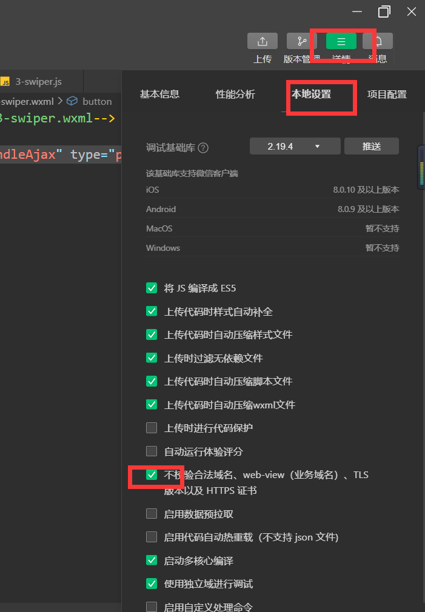
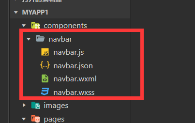

# 小程序开发

https://developers.weixin.qq.com/miniprogram/dev/reference/configuration/page.html

https://www.bilibili.com/video/BV1yf4y1E7MH?from=search&seid=8729997839671086540&spm_id_from=333.337.0.0

## app.json 全局配置

``` js
{
  "pages": [ //用于配置页面，第一行的就是首页。
    "pages/demo/demo",
    "pages/home/home"
  ],
  "window": { //配置窗口，可去开发者工具查看
    "backgroundTextStyle": "light",
    "navigationBarBackgroundColor": "#fff",
    "navigationBarTitleText": "Weixin",
    "navigationBarTextStyle": "black",
    "enablePullDownRefresh": true //下拉刷新
  },
    "tabBar": { //导航栏
    "list": [{  //2~5个
      "pagePath": "pages/demo/demo", //页面路径
      "text": "测试",
      "iconPath": "images/icons/bar/healthy.png", //未点击时的图片
      "selectedIconPath": "images/icons/bar/healthyHL.png" //点击时的图片
    },
    {
      "pagePath": "pages/home/home",
      "text": "首页",
      "iconPath": "images/icons/bar/home.png",
      "selectedIconPath": "images/icons/bar/homeHL.png"
    },
    {
      "pagePath": "pages/center/center",
      "text": "中心",
      "iconPath": "images/icons/bar/map.png",
      "selectedIconPath": "images/icons/bar/mapHL.png"
    }]
  },
      
  "style": "v2",
  "sitemapLocation": "sitemap.json"
}
```


## 页面配置

app.json 中的部分配置，也支持对单个页面进行配置，可以在页面对应的 `.json` 文件来对本页面的表现进行配置。页面中配置项在当前页面会覆盖 `app.json` 中相同的配置项。


## 数据绑定

双大括号里放js代码（可以是变量）

> app.wxml

```js
<!--pages/demo/demo.wxml-->
<text>{{10 + 20}}</text>
<view>{{ 10>20 ? 'aaa':'bbb' }}</view>

<view>{{myname}}</view>

<!-- 遍历数组 list是自定义的数组 定义在js的data中， item是list的数组项 -->
<view wx:for="{{list}}" wx:key="index"> {{item}}===={{index}} </view> 

<view wx:if="{{isCreate}}"> 动态是否显示 </view>
<view wx:else> 动态是否显示else </view>
```


## 事件

> app.wxml

```html
<!-- catch会阻止冒泡 可以用“data-形参名”来传参，函数中用“evt.target.dataset.形参名”取参 -->
<!-- 如果有多层嵌套，可以用evt.currentTarget -->
<button type="primary" bindtap="handleTap" data-myid="chuancan" >click</button>
<button type="primary" catchtap="handleTap" >click</button> 

<input type="text" bindinput="handleInput" value="{{mytext}}" />
```

> app.js

```js
data: {
      myname: 'ct',
      list: ['aa','bb','cc'],
      isCreate: false
  },

  handleTap(){
    // this.data.myname = 'xiaoming' 不会改变页面中myname的值
    this.setData({
      myname:'xiaoming', //会改变页面中myname的值
      isCreate: !this.data.isCreate
    })
    console.log(this.data.myname)
  },

  handleInput(evt){ //evt表示该事件
      console.log(evt.detail.data)
  }
```


## 样式wxss

用rpx为单位，不同设备等比例缩放。


## wxs

WXS（WeiXin Script）是小程序的一套脚本语言，结合 `WXML`，可以构建出页面的结构。

可用于函数中的逻辑计算，js中的函数只能在事件中调用，而exs中定义的函数可以直接使用。

1. WXS 不依赖于运行时的基础库版本，可以在所有版本的小程序中运行。
2. WXS 与 JavaScript 是不同的语言，有自己的语法，并不和 JavaScript 一致。
3. WXS 的运行环境和其他 JavaScript 代码是隔离的，WXS 中不能调用其他 JavaScript 文件中定义的函数，也不能调用小程序提供的API。
4. WXS 函数不能作为组件的事件回调。
5. 由于运行环境的差异，在 iOS 设备上小程序内的 WXS 会比 JavaScript 代码快 2 ~ 20 倍。在 android 设备上二者运行效率无差异。

> .wxs文件

```js
function handleDate(time){
    var date = getDate(time);
    return date.getFullYear() + "-" + date.getMonth() + 
        "-" + date.getDate();
}

module.exports = handleDate    //导出文件
```

> .wxml文件

```html
<wxs src="./date.wxs" module="handleDate" /> //导入文件
<text> {{ handleDate(startTime) }} </text>  //此时函数需要括号 可以传参
```


## 数据请求

```js
  handleAjax(){

    //1.微信小程序不涉及浏览器，没有跨域问题
    //2.需要去https://mp.weixin.qq.com/wxamp/devprofile/get_profile?token=334094222&lang=zh_CN
    //配置服务器request域名，再在详情-项目配置中刷新
    wx.request({
      url: 'https://api.bilibili.com/x/web-show/res/locs?pf=0&ids=2837%2C2836%2C2870%2C2953%2C2954%2C2955%2C2956&from_spm_id=',
      method: 'get',
      data: {

      },
      success:(res)=>{
          console.log(res.data)
      },
      fail: ()=>{

      }
    })
  }
```

若是本地测试，也可以不校验，但是不能上线：




### 封装request

1. 在项目中的util包下新建request.js文件

   ```js
   function request(params){
   
     return new Promise((resolve, reject)=>{
        //显示loading 官方文档的api中找loading
        wx.showLoading({
          title: '正在加载中',
        })
       wx.request({
         ...params,   //传来的对象包括了url、data、method
         url: 'https://api.juooo.com' + params.url, //url的前缀相同所以不用传了
         success:(res)=>{
           resolve(res.data)
         },
         fail:(err)=>{
           reject(err)
         },
         complete:()=>{ //不管成功失败都会执行
           //隐藏loading
           wx.hideLoading({
             success: (res) => {},
           })
         }
       })
   
     })
   }
   
   export default request
   ```

2. 页面.js中使用

   ```js
   import request from "../../unti/request"
   
   page({
       handleAjax(){
       /*
       wx.request({
         url: 'https://api.juooo.com/home/index/getclassifyHome?city_id=0&abbreviation=&version=6.1.40&referer-2',
         success: (res)=>{
           console.log(res.data.data.slide_list)
         }
   
       })   */
       request({
         url:"/home/index/getclassifyHome?city_id=0&abbreviation=&version=6.1.40&referer-2",
         method:"get"
       }).then(res=>{  //成功
         console.log(res)
       }).catch(err=>{ //失败
         console.log(err)
       })
     },
   })
   ```

   


## swiper轮播

轮播组件的 ‘height’设置为里面图片height的两倍rpx


## 自定义组件



在页面的app.json文件中配置后，该页面就可以用该组件：

```js
{
  "usingComponents": {
    "navbar": "../../components/navbar/navbar"
  }
}
```


> 组件传参----父传子 （页面中的<navbar>传值给组件中的<navbar>）

1. component.js中：

   ```js
   properties: {
         list:{ //list是自定义属性名
           type: Array,
           value: ['aa','bb','cc'] //默认值
         }
     }
   ```

1. component.wxml中：

   ```html
   <text wx:for="{{list}}" wx:key="index"> {{item}} </text>  //可以从list中取数据
   ```

2. 页面中：

   ```html
   <navbar list="{{[1,2,3]}}"></navbar>  //可以通过属性list传参
   ```


> 组件传参---子传父 （组件传值给页面中的<navbar>）

1. 子组件受到点击事件后，触发函数 (component.wxml)

   ```html
   <text wx:for="{{list}}" wx:key="index" bindtap="handleEvent" data-index="{{index}}"> {{item}} </text>
   ```

   jihuicomponent.js文件中的handleEvent函数执行this.triggerEvent函数，ParentEvent是父组件中的自定义事件，evt.currentTarget.dataset.index为子组件所要传的数据，triggerEvent会触发ParentEvent事件

   ```js
   methods: {
       handleEvent(evt){
         this.triggerEvent("ParentEvent",evt.currentTarget.dataset.index)
       }
     }
   })
   ```

2. 页面中的父组件绑定ParentEvent事件（名字是自己取的），此时父组件就会执行handleEvent函数

   ```html
   <navbar list="{{[1,2,3]}}" bindParentEvent="handleEvent" ></navbar
   ```

   ```js
   handleEvent(evt){
      console.log(evt.detail) //即可拿到子组件传来的数据
   }
   ```


## 插槽slot

组件中：

```html
<view>
  <text> {{item}} </text>
  <slot name="left"></slot>  
  <slot name="right"></slot>
</view>
```

页面中：

```html
<navbar >
  <button slot="left" >返回</button> //button会放进组件的slot中
   <text>aaaaaaa</text>
  <button slot="right">确认</button>
</navbar> 
```

多个插槽时，需要在组件.js中配置：

```js
options:{
    multipleSlots: true
  }
```


## 组件生命周期、页面生命周期

在特定时间点自动触发。见官网。


## 页面跳转

```js
wx.navigateTo({ //跳转后有返回按钮 不能跳转到底部导航的页面（ 用wx.switchTab() ）
    url: `页面的路径?myid=${id}` //可以传给跳转页面参数，
                           //在跳转页面的onload生命周期函数中的option中取到
})

wx.redirectTO({ //跳转后无返回按钮，当前页面关闭
    url: "页面的路径"
})
```


