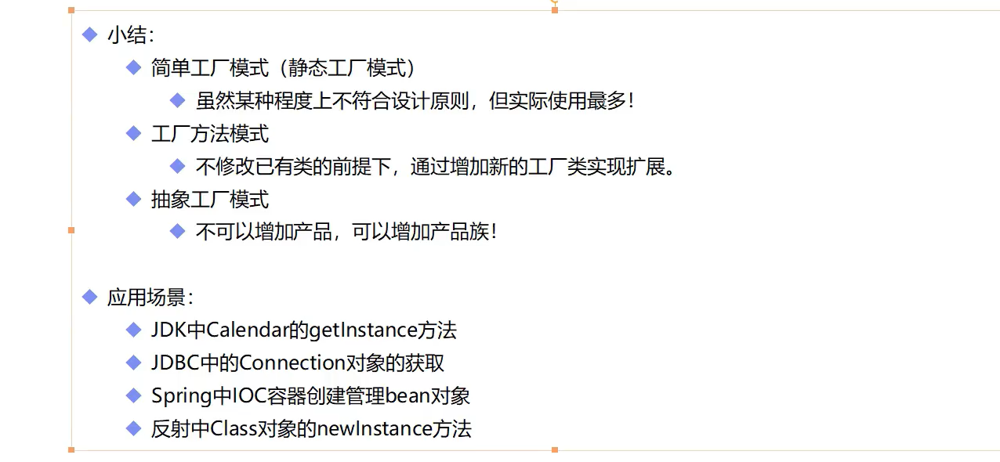
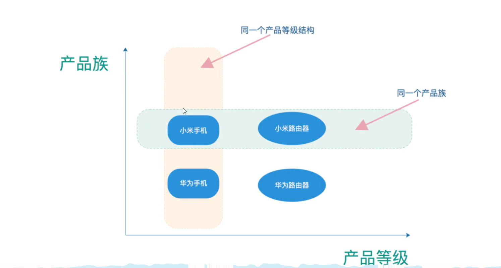
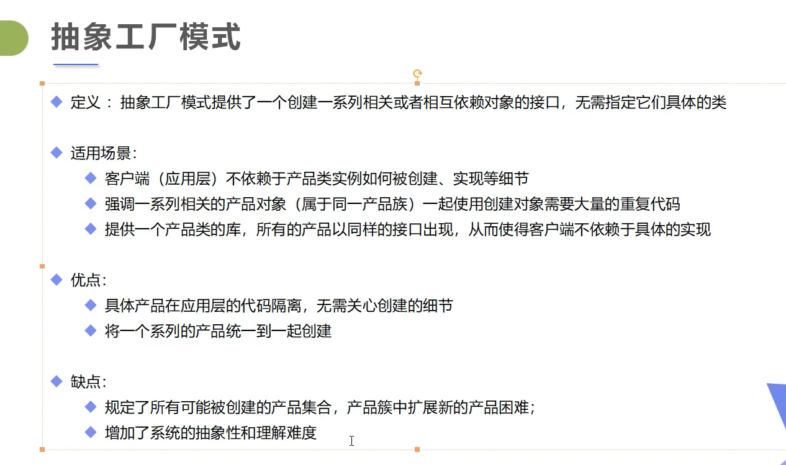

# 设计模式

## 工厂模式

实现创建者和调用者分离。

- 简单工厂模式

- 工厂方法模式

- 抽象工厂模式

  

### 总结



## 抽象工厂模式






## 单例模式

### 饿汉式

```java
public class Single {
	//如果这个类很大，new一个对象要花费很大的内存空间以及运行时间，
	//像这种情况，就适合单例设计模式，只new一个对象
	
	//构造函数私有，则不能用new来创建对象
	private Single(){
		System.out.println("single");
	}
	
	//私有的Single类型类变量；由于在类内，构造函数可以运行
	//由于是静态的，事先会加载
	private static Single single = new Single();
	
	public static Single getInstance() {
		return single;
	}

}
```

### 懒汉式

```java
/**
 * 单例模式
 * 懒汉式
 * 有线程安全问题
 * @author ct
 *
 */
public class Singlelan {
	
	//私有化构造方法
	private Singlelan() {
		System.out.println("singlelan");
	}
	
	private static Singlelan singlelan = null;
	
	public static Singlelan  getInstance() {
		if(singlelan==null)
			singlelan=new Singlelan();
		
		return singlelan;
	}
}
```


